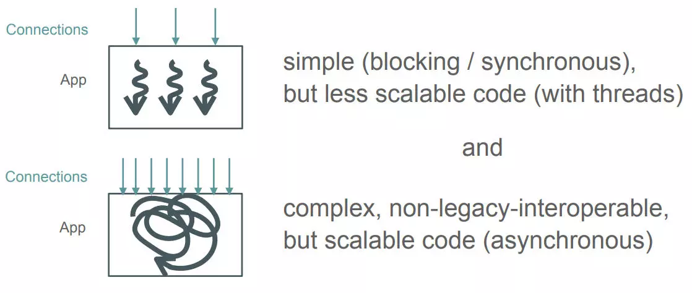

# 反应式
java下反应式现状：


1. [Java 异步编程：从 Future 到 Loom](https://www.jianshu.com/p/5db701a764cb)
    - java异步编程方式总览
        1. Future
        1. Callback
        1. Servlet 3.0
        1. 反应式编程
        1. Kotlin 协程
        1. Project Loom
    - 会阻塞线程的技术，如 
        1. Object.wait
        1. Thread.sleep
        1. Lock
        1. BIO
        1. JDBC
    1. [技术视频观后感之《淘宝应用架构升级——反应式架构的探索与实践》](https://www.jianshu.com/p/f61bad429dd3)
        - [Project Reactor 的阻塞检测技术：BlockHound](https://github.com/reactor/BlockHound)
    1. [淘宝应用架构升级——反应式架构的探索与实践](https://www.infoq.cn/article/P1S7UOYH-pQZWa53zSJL)
    1. [ArchSummit深圳2019大会演讲 PPT 合集](https://ppt.infoq.cn/list/assz2019)
1. [反应式架构(1)：基本概念介绍](https://my.oschina.net/joymufeng/blog/3141289)
    > 淘宝从2018年开始对整体架构进行反应式升级， 取得了非常好的成绩。其中『猜你喜欢』应用上限 QPS 提升了 96%，同时机器数量缩减了一半；另一核心应用『我的淘宝』实际线上响应时间下降了 40% 以上。PayPal凭借其基于Akka构建的反应式平台squbs，仅使用8台2vCPU虚拟机，每天可以处理超过10亿笔交易，与基于Spring实现的老系统相比，代码量降低了80%，而性能却提升了10倍。能够取得如此好的成绩，人们不禁要问反应式到底是什么？ 其实反应式并不是一个新鲜的概念，它的灵感来源最早可以追溯到90年代，但是直到2013年，Roland Kuhn等人发布了《反应式宣言》后才慢慢被人熟知，继而在2014年迎来爆发式增长，比较有意思的是，同时迎来爆发式增长的还有领域驱动设计(DDD)，原因是2014年3月25日，Martin Fowler和James Lewis向大众介绍了微服务架构，而反应式和领域驱动是微服务架构得以落地的有力保障。紧接着各种反应式编程框架相继进入大家视野，如RxJava、Akka、Spring Reactor/WebFlux、Play Framework和未来的Dubbo3等，阿里内部在做反应式改造时也孵化了一些反应式项目，包括AliRxObjC、RxAOP和AliRxUtil等。 从目前的趋势看来，反应式概念将会逐渐深入人心， 并且将引领下一代技术变革。
1. [Golang 和 Elixir(Eralng) 比较](https://www.jianshu.com/p/b59677547b26)  [本地](go_vs_elixir.md)
    - 应该是目前最强的两种并发模型，但环境缺陷严重：
    1. erlang从功能来说相当完美：纯函数+语言级反应式+消息+不可变数据结构，`反应式`这个概念就是从Erlang里面来的，
        [对反应式的执行逻辑能优化到寄存器级](https://blog.csdn.net/mycwq/article/details/45653897)；
        套上k8s系列所谓的云原生，erlang就是反应式原生。
        - 但不是静态类型，小众，社区远不及java/js这类，与这些完美的功能相对应的是高难度的编程技巧。
    1. go是现代化的c，不是现代化语言
1. [Kotlin Coroutine 初探](https://www.jianshu.com/p/2d2e21941461)
    - 里面有结合spring webflux，二者间做了很多适配工作，二者搭配起来，基本上能做到实现比async/await关键字稍弱一档的逻辑，
        但比原生webflux的一排排高阶函数回调要好上太多。
    1. [Kotlin Coroutine 是如何与 Spring WebFlux 整合的](https://www.jianshu.com/p/17d93f1afc50)
    1. [JVM 上的协程，真香](https://www.v2ex.com/t/514615)
1. 异步非阻塞：[响应式流——响应式Spring的道法术器](https://blog.csdn.net/get_set/article/details/79466402)
    - 相关：
        - [附1：多线程并发方案的不足——响应式Spring的道法术器](https://blog.csdn.net/get_set/article/details/79553262)
        - [让 CPU 告诉你硬盘和网络到底有多慢](https://cizixs.com/2017/01/03/how-slow-is-disk-and-network/)
    - 本地：
        - [响应式流——响应式Spring的道法术器](async_not_block.md)
        - [附1：多线程并发方案的不足——响应式Spring的道法术器](the_weakness_of_multithreading.md)
        - [让 CPU 告诉你硬盘和网络到底有多慢](how-slow-is-disk-and-network.md)
1. [Project Loom](http://cr.openjdk.java.net/~rpressler/loom/Loom-Proposal.html)

### 一些web框架
不只是webflux，scala下的非阻塞编程更成熟。
1. [Spring MVC 过时了吗？ - 北南的回答 - 知乎](https://www.zhihu.com/question/294282002/answer/521812475)
1. [Play Framework 官网](https://www.playframework.com/)
    1. [Play Framework 开源中国介绍页](https://www.oschina.net/p/play-framework)
    > Play Framework 在idea有官方的插件支持
1. [finatra](https://twitter.github.io/finatra/)

## 想法
1. 反应式主要是异步非阻塞。
1. 除非像js/ts里那样的`整个运行时事件循环` +` async/await语法糖` 封装，
    只要涉及反应式，都避免不了函数式编程，并且是一级级、一串串的高阶函数的那种。
    这种方式有理解起来的复杂度，webflux、akka等组件一切所谓听起来的好处，是建立在这个复杂度之上的。

## 数据库
数据库连接池应尽可能小。
```
db connections = ((physical_core_count * 2) + effective_spindle_count)
```
1. [HikariCP - About Pool Sizing](https://github.com/brettwooldridge/HikariCP/wiki/About-Pool-Sizing)
1. [play framework 使用 jpa](https://www.playframework.com/documentation/2.8.x/JavaJPA#Using-a-CustomExecutionContext)
1. [数据库链接池终于搞对了，这次直接从100ms优化到3ms！](https://mp.weixin.qq.com/s/ftwjEI_bDJa-Pgzi2n7HhQ)
