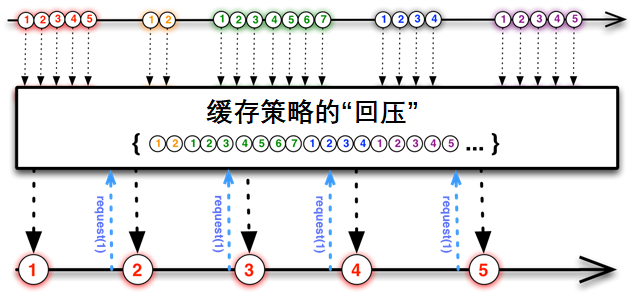

# （2）响应式流——响应式Spring的道法术器

2018年03月07日 09:21:32  更多


 版权声明：本文为博主原创文章，未经博主允许不得转载。 https://blog.csdn.net/get_set/article/details/79466402

> 本系列其他文章见：[《响应式Spring的道法术器》](http://blog.csdn.net/get_set/article/details/79466657)。 
> 前情提要： [什么是响应式编程](http://blog.csdn.net/get_set/article/details/79455258)

## 1.2 响应式流

上一节留了一个坑——为啥不用Java Stream来进行数据流的操作？ 原因在于，若将其用于响应式编程中，是有局限性的。比如如下两个需要面对的问题：

1. Web 应用具有I/O密集的特点，I/O阻塞会带来比较大的性能损失或资源浪费，我们需要一种**异步非阻塞**的响应式的库，而Java Stream是一种同步API。
2. 假设我们要搭建从数据层到前端的一个变化传递管道，可能会遇到数据层每秒上千次的数据更新，而显然不需要向前端传递每一次更新，这时候就需要一种**流量控制**能力，就像我们家里的水龙头，可以控制开关流速，而Java Stream不具备完善的对数据流的流量控制的能力。

**具备“异步非阻塞”特性和“流量控制”能力的数据流，我们称之为响应式流（Reactive Stream）。**

> 目前有几个实现了响应式流规范的Java库，这里简单介绍两个：**RxJava**和**Reactor**。
>
> 要介绍RxJava，就不得不提ReactiveX（Reactive Extensions,Rx），它最初是LINQ的一个扩展，由微软的架构师Erik Meijer领导的团队开发，在2012年11月开源，Rx是一个编程模型，目标是提供一致的编程接口，帮助开发者更方便的处理异步数据流，Rx库支持.NET、JavaScript和C++，Rx近几年越来越流行了，现在已经支持几乎全部的流行编程语言了，包括RxJS、RxJava等。
>
> 后来，Java社区的一些大牛凑到一起制定了一个[响应式流规范](https://github.com/reactive-streams/reactive-streams-jvm/blob/v1.0.2/README.md)。RxJava团队随后对1版本进行了重构，形成了兼容该响应流规范的RxJava 2。
>
> Reactor是Pivotal旗下的项目，与大名鼎鼎的Spring是兄弟关系，因此是Spring近期推出的响应式模块WebFlux的“御用”响应式流。Reactor支持响应式流规范，与RxJava相比，它没有任何历史包袱，专注于Server端的响应式开发，而RxJava更多倾向于Android端的响应式开发。
>
> 在Java 9版本中，响应式流的规范被[纳入到了JDK中](http://www.reactive-streams.org/)，相应的API接口是[java.util.concurrent.Flow](https://docs.oracle.com/javase/9/docs/api/java/util/concurrent/Flow.html)。
>
> Spring WebFlux也是本系列文章后边的重点内容。由于WebFlux首选Reactor作为其响应式技术栈的一部分，我们下边也主要以Reactor为主，目前的版本是Reactor3。

我们继续回到主线，讨论“异步非阻塞”和“流量控制”。注意，本节请不必关注Reactor的代码细节，仅体会使用响应式流的“感觉”就好。

### 1.2.1 异步非阻塞

在如今互联网时代的大背景下，Web应用通常要面对高并发、海量数据的挑战，性能从来都是必须要考量的核心因素。

**阻塞**便是性能杀手之一。

> 从调用者和服务提供者的角度来看，阻塞、非阻塞以及同步、异步可以这么理解：
>
> - 阻塞和非阻塞反映的是调用者的状态，当调用者调用了服务提供者的方法后，如果一直在等待结果返回，否则无法执行后续的操作，那就是阻塞状态；如果调用之后直接返回，从而可以继续执行后续的操作，那可以理解为非阻塞的。
> - 同步和异步反映的是服务提供者的能力，当调用者调用了服务提供者的方法后，如果服务提供者能够立马返回，并在处理完成后通过某种方式通知到调用者，那可以理解为异步的；否则，如果只是在处理完成后才返回，或者需要调用者再去主动查询处理是否完成，就可以理解为是同步的。
>
> 举个例子，老刘买了个洗衣机，当他启动了洗衣机后如果一直在等待洗衣机工作结束好晾衣服，那他就是阻塞的；如果他启动洗衣机之后就去看电视了，估摸快洗完了就时不时来看看，那他就是非阻塞的，因为老刘可以去做另一件事。但老刘不能知道这洗衣机啥时候洗完/是否洗完，那么这台洗衣机就是同步方式工作的；老刘后来换了一台可以在洗完衣服播放音乐的洗衣机，这样就不用时不时来看了，虽然启动之后洗衣机不能立刻返回给老刘干净的衣服，但是可以在工作完成之后通知在看电视的老刘，所以新的洗衣机就是异步工作的。

Http服务本质上是对资源的操作，尤其是RESTful兴起之后，更是如此。所谓的资源，对应在服务器端就是文件和数据。

- 文件方面，随着互联网基础设施的提升，Web 应用正在接纳、处理和传递越来越多的包括图片和音视频等形式在内的文件。文件的存取可能造成阻塞。
- 数据方面，随着大数据技术的推进，互联网公司越来越热衷于收集来自用户的操作、位置、社会关系等等各种各样的信息。数据越来越具有流动性，数据量也显著增长。数据的存取也可能造成阻塞。
- 此外，随着微服务架构的日趋火热，各个微服务之间的通信不再像“巨石型”应用中通过对象的引用和方法的调用，而是经由网络传输序列化的数据来实现，网络的延迟也可能造成阻塞。
- 除了I/O方面的阻塞之外，一些复杂的业务逻辑由于处理时间比较长，也会造成调用者的阻塞。

多数人不认为阻塞是一个比较大的问题，至少觉得除了网络I/O之外，读写文件和数据库还是很快的，许多的开发者也一直在写阻塞的代码。那么我们就先来关注一下I/O的阻塞问题，对其严重性有一个直观感性的认识。

#### 1.2.1.1 I/O到底有多慢？

很多情况下，在大的空间和时间维度上，数量级经常会大到超出我们的认知范畴，我们的直觉总是不可靠的。


一、举两个空间维度的例子：

在大的尺度上，印象中，银河系的中心位置群星闪耀，就像赶集一样：


但实际上，如果把恒星们缩小到沙粒的大小，那么密度也就相当于一个体育场有一两粒沙子。曾经看科幻片，总是担心光速飞行的飞船来不及拐弯或刹车撞到星球上，实际上，想要撞上才是相当不容易的。

而在小的尺度上，原子核具有原子绝大部分的质量，印象中，应该是这样的吧：


但实际上，如果把一个原子也放大到体育场那么大，原子核才仅仅相当于一个乒乓球那么大，空旷的很！

二、从时间维度上：

往大了说，如果地球45亿年历史缩短为一年，那么人类有记录的浩瀚文明史不过相当于几秒钟而已。

往小了说，“一瞬间”与“一瞬间”可能会差好几个数量级。我们就从微观时间维度来了解一下“CPU眼中的时间”，你会发现，发生在计算机中的阻塞也许比你直觉印象中夸张的多。

**CPU眼中的时间——**

CPU绝对称得上是“闪电侠”，因为它们做事都有自己的一套时钟。我们故事的主人公是一个主频为2.5GHz的CPU，如果它的世界也有“秒”的概念，并且它的时钟跳一下为一秒，那么在CPU（CPU的一个核心）眼中的时间概念是啥样的呢？

CPU先生所在的组是硬件部计算组。对它来说，与其一起紧密合作的几个小伙伴还能跟的上它的节奏：

- CPU先生很利索，只需要**一秒**就可以完成一个指令，复杂的动作可能需要多个指令。
- 好在“贴身秘书”一级缓存反应比较快，能够**秒懂**CPU先生的意思。
- 来自“秘书组”的二级缓存虽然要**十几秒**才能“get”到CPU先生的点，但也不算太迟钝。
- 和内存组的合作已经习以为常了，跟内存请求的数据通常要**4-5分钟**才能找到（内存寻址），不过也还好啦，毕竟一级缓存那里能拿到80%想要的数据，其余的二级缓存也能搞定一大部分，不怎么耽误事儿。

CPU先生是典型的工作狂，任务多的时候，通宵达旦也毫无怨言，但是有什么事情让它等，那简直要他命了。恰恰一起共事的其他组（尤其是I/O组的磁盘和网卡）相对来说那效率是低的离谱啊：

- 关于I/O组的同事，CPU先生已经抱怨很久了，每次找SSD要东西，都要花费**4-5天**才能找到（寻址），等到数据传送过来，几周都过去了。机械磁盘更是过分地离谱，跟他要个数据，竟然要平均花费**10个月**才能找到，如果要读取1M的数据，竟然要**20个月**！这种员工怎么还不下岗？！
- 关于网卡，CPU先生知道它们也尽力了，毕竟万兆网络成本颇高。与机房内的其他小伙伴们用千兆网络互相沟通也算顺畅，给另一台机器的CPU朋友发送1K的书信，最快**七八个小时**就可以送过去了。但是1K的书信经过层层包裹，实际也写不了多少话。更要命的是，网卡们的沟通手续繁杂，每次网络沟通前的 “你好能听到我吗？——我能听到，你那边能听到我吗？——我也能听到你，那我们开始吧！” 这样的握手确认都要花掉很长的时间，不过不能当面沟通，也只能这样了。这还好，最恐怖的是与其他城市的小伙伴沟通，有时候传递消息要花费好**几年**呢！

由此可见，对于CPU先生来说，想要让工作充实起来实在不容易，不过多亏了内存组的小伙伴帮忙分批缓存往返于I/O组的数据，矛盾才有所缓解。


这个图只能明显看出涉及I/O的时间条，我们转换成对数刻度的图看一下：


这个图并不是直观的比例，横轴上每个刻度是一个数量级，可见I/O的速度与CPU和内存相比是要差几个数量级的。由此可见，对于大型高并发场景下的Web应用，缓存有多重要，更高的缓存命中率就意味着性能。

> （以上时间数据来自http://cizixs.com/2017/01/03/how-slow-is-disk-and-network）

对于阻塞造成的性能损失，我们通常有两种思路来解决：

1. 并行化：使用更多的线程和硬件资源；
2. 异步化：基于现有的资源来提高执行效率。

#### 1.2.1.2 解决方案之一：多线程

由于I/O组的同事实在太墨迹，有时候CPU先生眯上一觉再回来工作都不耽误事儿。


如上图，蓝色的是CPU执行指令的时间，灰色的是等待I/O反馈结果的时间。请不要纠结这张图中时间的比例，这么画已经是给了I/O组面子的了。

操作系统部大牛很多，为了让CPU先生的工作饱和起来，设计了多线程的工作方式。


但“多线程并非银弹”，存在一些固有的弊端，并且有时候难以驾驭（具体见“**附1**”）：

- 高并发环境下，多线程的切换会消耗CPU资源（上图中CPU的时间条中深褐色的为上下文切换的时间，可以想见，高并发情况下，线程数会非常多，那么上下文切换对资源的消耗也会变得明显起来。况且在切换过程中，CPU并未执行任何业务上的或有意义的计算逻辑）；
- 应对高并发环境的多线程开发相对比较难（需要掌握线程同步的原理与工具、ExecutorService、Fork/Join框架、并发集合和原子类等的使用），并且有些问题难以发现或重现（比如指令重排）；
- 高并发环境下，更多的线程意味着更多的内存占用（JVM默认为每个线程分配1M的线程栈空间）。

这里并非是否定多线程的功劳，相反，多线程在高并发方面发挥了重要作用。况且，多线程仍然是目前主流的高并发方案，在Servlet 3.1以前，Servlet 容器会为每一个接收到的请求分配一个单独的线程来进行处理和响应。

随着Java版本的迭代，其对并发编程的支持越来越给力。大家仿佛觉得多线程就是最自然而然地处理高并发的方式，况且Http协议是无状态的，在把session单独放到分布式缓存中之后，Web服务器的横向扩展易如反掌，当用户数迅速攀升的时候，横向增加服务器数量即可。尤其是随着云计算技术和DevOps的普及，扩容与缩容已经可以自动化解决。

一切都还过得去，直到Node.js的出现，为Java Web开发带来了新的启示。因为毕竟在大家的印象中，JavaScript是一门只活跃在浏览器端的解释型的性能并不高的语言，跟“服务器端、高并发”这两个词仿佛八竿子打不着啊。更令人惊奇的是，Node.js只需要单线程（引擎内部多线程）就可以应对高并发的请求，这是何等的骨骼惊奇！

Java可不可以这么搞呢？答案是可以！秘诀同Node.js一样——“异步非阻塞”。

#### 1.2.1.3 解决方案之二：非阻塞

就像Node.js，使用“异步非阻塞”的代码可以在不改变执行线程的情况下切换要执行的任务，基于现在Java语言的特性和SDK，我们通常有两种方案：

1. 回调。
2. `CompletableFuture`。

**1）非阻塞的回调**

我们知道，前端JavaScript代码运行在浏览器上的时候被限制为单线程的，所以JavaScript早早就练就了非阻塞的能力，对于需要较长时间才能返回结果的调用通常采用异步方式，要不怎么说“穷人的孩子早当家”呢。

我们最常见的异步调用的例子就是Ajax，如基于Jquery的Ajax调用的代码：

```js
$.ajax({
   type: "POST",
   url: "/url/path",
   data: "name=John&location=Boston",
   success: function(msg){
     alert( "Data Saved: " + msg );
   }
});
... // 后边的代码
123456789
```

这里我们发出了一个`POST`请求出去，然后注册了一个回调方法给`success`响应事件，然后就可以继续执行后边的代码了，响应成功返回的话会回调注册的方法。OK，完美，没有阻塞。

在Java开发过程中，我们也会时不时用到回调，但是对于复杂的逻辑，会导致“callback hell”。什么是callback hell呢，如图：


图里这个还算比较好阅读的，再比如下边这个（本示例来自[Reactor 3 Reference Guide](http://projectreactor.io/docs/core/release/reference/docs/index.html#_asynchronicity_to_the_rescue)）。需求是找到针对某个用户的TOP5的Favorite，如果没有返回针对该用户的任何Favorite，就默认给出5个建议。

```java
userService.getFavorites(userId, new Callback<List<String>>() { // <1>
  public void onSuccess(List<String> list) { // <2>
    if (list.isEmpty()) { // <3>
      suggestionService.getSuggestions(new Callback<List<Favorite>>() {
        public void onSuccess(List<Favorite> list) { // <4>
          UiUtils.submitOnUiThread(() -> { // <5>
            list.stream()
                .limit(5)
                .forEach(uiList::show); // <6>
            });
        }

        public void onError(Throwable error) { // <7>
          UiUtils.errorPopup(error);
        }
      });
    } else {
      list.stream() // <8>
          .limit(5)
          .forEach(favId -> favoriteService.getDetails(favId, // <9>
            new Callback<Favorite>() {
              public void onSuccess(Favorite details) {
                UiUtils.submitOnUiThread(() -> uiList.show(details));
              }

              public void onError(Throwable error) {
                UiUtils.errorPopup(error);
              }
            }
          ));
    }
  }

  public void onError(Throwable error) {
    UiUtils.errorPopup(error);
  }
});

```

这确实是一段比较复杂的逻辑，有多处回调，难以阅读。即使使用了lambda，代码行数仍然不少。

1. 基于回调的服务使用一个匿名 `Callback` 作为参数。后者的两个方法分别在异步执行成功 
   或异常时被调用。
2. 获取到Favorite ID的list后调用第一个服务的回调方法 `onSuccess`。
3. 如果 list 为空， 调用 `suggestionService`。
4. 服务 `suggestionService` 传递 `List<Favorite>` 给第二个回调。
5. 既然是处理 UI，我们需要确保消费代码运行在 UI 线程。
6. 使用 Java 8 `Stream` 来限制建议数量为5，然后在 UI 中显示。
7. 在每一层，我们都以同样的方式处理错误：在一个 popup 中显示错误信息。
8. 回到Favorite ID这一层，如果返回 list，我们需要使用 `favoriteService` 来获取 `Favorite` 
   对象。由于只想要5个，因此使用 stream 。
9. 再一次回调。这次对每个ID，获取 `Favorite` 对象在 UI 线程中推送到前端显示。

如果用响应式流怎么编写呢？下边用Reactor3的库来表达：

```java
userService.getFavorites(userId) // <1>
       .flatMap(favoriteService::getDetails) // <2>
       .switchIfEmpty(suggestionService.getSuggestions()) // <3>
       .take(5) // <4>
       .publishOn(UiUtils.uiThreadScheduler()) // <5>
       .subscribe(uiList::show, UiUtils::errorPopup); // <6>

```

1. 我们获取到Favorite ID的流。
2. 我们 *异步地转换* 它们（ID） 为 `Favorite` 对象（使用 `flatMap`），现在我们有了 
   `Favorite`流。
3. 一旦 `Favorite` 为空，切换到 `suggestionService`。
4. 我们只关注流中的最多5个元素。
5. 最后，我们希望在 UI 线程中进行处理。
6. 通过描述对数据的最终处理（在 UI 中显示）和对错误的处理（显示在 popup 中）来触发（`subscribe`）。

如果你想确保“Favorite ID”的数据在800ms内获得（如果超时，从缓存中获取）呢？在基于回调的代码中， 
想想就觉得复杂。但 Reactor3 中就很简单，在处理链中增加一个 `timeout` 的操作符即可。

Reactor3 中增加超时控制的例子

```java
userService.getFavorites(userId)
       .timeout(Duration.ofMillis(800)) // <1>
       .onErrorResume(cacheService.cachedFavoritesFor(userId)) // <2>
       .flatMap(favoriteService::getDetails) // <3>
       .switchIfEmpty(suggestionService.getSuggestions())
       .take(5)
       .publishOn(UiUtils.uiThreadScheduler())
       .subscribe(uiList::show, UiUtils::errorPopup);

```

1. 如果流在超时时限没有发出（emit）任何值，则发出错误（error）信号。
2. 一旦收到错误信号，交由 `cacheService` 处理。
3. 处理链后边的内容与上例类似。

可见，响应式流的编程方式，不仅有效减少了代码量，还大大提高了代码的可阅读性。

**2）异步的CompletableFuture**

`CompletableFuture`也是在Java 8中新增的，相对于原来的`Future`，它有两方面的亮点：

1. 异步回调，它提供了五十多种方法，可以异步的调用而不会导致阻塞；
2. 声明式，对于`CompletableFuture`的非静态方法方法，多多少少可以看到类似上边Reactor代码的“声明式编程”的感觉，比如`completableFuture.thenApplyAsync(...).thenApplyAsync(...).thenAcceptAsync(...)`。

比如我们在咖啡店买咖啡，点餐之后我们首先会拿到一张小票，这个小票就是`Future`，代表你凭此票在咖啡做好之后就可以去拿了。但是`Future.get()`方法仍然是同步和阻塞的，意味着你拿着票可以去找朋友聊会天，但是并不知道自己的咖啡什么时候做好，可能去柜台拿的时候还是要等一会儿。而提供`CompletableFuture`服务的咖啡厅，不仅有小票，还有一个号牌，我们点餐之后找个桌坐下就好，这个订单的咖啡一旦做好就会送到我们手中。

相对于回调和`Future`来说，`CompletableFuture`的功能强大了不少，我们来尝试使用它来实现这样一个需求（本示例来自[Reactor 3 Reference Guide](http://projectreactor.io/docs/core/release/reference/docs/index.html#_asynchronicity_to_the_rescue)）：我们首先得到 ID 的列表，然后对每一个ID进一步获取到“ID对应的name和statistics”这样一对属性的组合为元素的列表，整个过程用异步方式来实现。

```java
CompletableFuture<List<String>> ids = ifhIds(); // <1>

CompletableFuture<List<String>> result = ids.thenComposeAsync(l -> { // <2>
    Stream<CompletableFuture<String>> zip =
        l.stream().map(i -> { // <3>
                     CompletableFuture<String> nameTask = ifhName(i); // <4>
                     CompletableFuture<Integer> statTask = ifhStat(i); // <5>

                     return nameTask.thenCombineAsync(statTask, (name, stat) -> "Name " + name + " has stats " + stat); // <6>
                 });
    List<CompletableFuture<String>> combinationList = zip.collect(Collectors.toList()); // <7>
    CompletableFuture<String>[] combinationArray = combinationList.toArray(new CompletableFuture[combinationList.size()]);

    CompletableFuture<Void> allDone = CompletableFuture.allOf(combinationArray); // <8>
    return allDone.thenApply(v -> combinationList.stream()
                                                 .map(CompletableFuture::join) // <9>
                                                 .collect(Collectors.toList()));
});

List<String> results = result.join(); // <10>
assertThat(results).contains(
            "Name NameJoe has stats 103",
            "Name NameBart has stats 104",
            "Name NameHenry has stats 105",
            "Name NameNicole has stats 106",
            "Name NameABSLAJNFOAJNFOANFANSF has stats 121");

```

1. 以一个 Future 开始，其中封装了后续将获取和处理的 ID 的 list。
2. 获取到 list 后边进一步对其启动异步处理任务。
3. 对于 list 中的每一个元素：
4. 异步地得到相应的 name。
5. 异步地得到相应的 statistics。
6. 将两个结果一一组合。
7. 我们现在有了一个 list，元素是 Future（表示组合的任务，类型是 `CompletableFuture`），为了执行这些任务， 
   我们需要将这个 list（元素构成的流） 转换为数组（`List`）。
8. 将这个数组传递给 `CompletableFuture.allOf`，返回一个 `Future` ，当所以任务都完成了，那么这个 `Future` 
   也就完成了。
9. 有点麻烦的地方在于 `allOf` 返回的是 `CompletableFuture<Void>`，所以我们遍历这个 Future 的`List`， 
   ，然后使用 `join()` 来手机它们的结果（不会导致阻塞，因为 `AllOf` 确保这些 Future 全部完成）
10. 一旦整个异步流水线被触发，我们等它完成处理，然后返回结果列表。

可以看到`CompletableFuture`也尽力了，虽然使出浑身解数，但对于集合的操作还略显吃力。由于 Reactor 内置许多组合操作，因此以上例子可以简单地实现为：

```java
Flux<String> ids = ifhrIds(); // <1>

Flux<String> combinations =
    ids.flatMap(id -> { // <2>
        Mono<String> nameTask = ifhrName(id); // <3>
        Mono<Integer> statTask = ifhrStat(id); // <4>

        return nameTask.zipWith(statTask, // <5>
                (name, stat) -> "Name " + name + " has stats " + stat);
    });

Mono<List<String>> result = combinations.collectList(); // <6>

List<String> results = result.block(); // <7>
assertThat(results).containsExactly( // <8>
    "Name NameJoe has stats 103",
    "Name NameBart has stats 104",
    "Name NameHenry has stats 105",
    "Name NameNicole has stats 106",
    "Name NameABSLAJNFOAJNFOANFANSF has stats 121"
);

```

1. 这一次，我们从一个异步方式提供的 `ids` 序列（`Flux<String>`）开始。
2. 对于序列中的每一个元素，我们异步地处理它（`flatMap` 方法内）两次。
3. 获取相应的 name。
4. 获取相应的 statistic.
5. 异步地组合两个值。
6. 随着序列中的元素值“到位”，它们收集一个 `List` 中。
7. 在生成流的环节，我们可以继续异步地操作 `Flux` 流，对其进行组合和订阅（subscribe）。 
   最终我们很可能得到一个 `Mono` 。由于是测试，我们阻塞住（`block()`），等待流处理过程结束， 
   然后直接返回集合。
8. Assert 结果。

> 这种非阻塞数据流的感觉，让我想起来了《让子弹飞》里边最经典的一段：姜文饰演的张麻子朝新来县长那“马拉的火车啪啪啪连续打了N枪，旁边兄弟问“打中没有”，张麻子说“让子弹飞一会儿~”，稍后就见拉火车的马缰绳全都被子弹打断，马匹四散，非常6+1！如果张麻子每打一枪都看看前一枪有没有射中的话，还怎么装X呢？

通过上边的例子可见，回调或 CompletableFuture在处理复杂逻辑时会遇到的相似的窘境，反观Reactor3提供的API，却可以显著减少代码量，提高代码可阅读性，尤其是还可以提供一些不错的功能。

### 1.2.2 流量控制——回压

在响应式流中，数据流的发出者叫做`Publisher`，监听者叫做`Subscriber`。我们后续就统一直译叫做“发布者”和“订阅者”吧。


问题来了，假如发布者发出数据的速度和订阅者处理数据的速度不同的时候，怎么办呢？订阅者处理速度快的话，那还好说，但是如果处理速度跟不上数据发出的速度，就像这样：


如果没有流量控制，那么订阅者会被发布者快速产生的数据流淹没。就像在一个流水线上，如果某个工位处理比较慢，而上游下料比较快的话，这个工位的工人师傅就吃不消了，这个时候他需要一种途径来告诉上游下料慢一些。

同样的，订阅者也需要有一种能够向上游反馈流量需求的机制：


这种能够向上游反馈流量请求的机制就叫做回压（backpressure，也有翻译为“背压”的）。

在具体的使用过程中，回压的处理会涉及不同的策略。举两个例子以便于理解：

**举例：缓存的策略**



如图，订阅者处理完一个元素的时候通过`request(1)`跟发布者再请求一个元素。由于发布者的数据不能很快被订阅者处理掉，那么发布者会将未处理的数据元素缓存起来。

这种处理方式与消息队列有些相似之处，发布者需要维护一个队列用来缓存还没有被处理的元素。通常用于对数据准确性要求比较高的场景，比如发布者这儿是突然到来的数据高峰，都是要保存到数据库的，作为订阅者的数据持久层没有那么快的处理速度，那么发布者就需要将数据暂时缓存起来。

**举例：丢弃的策略**


如图，发布者不需要缓存来不及处理的数据，而是直接丢弃，当订阅者请求数据的时候，会拿到发布者那里最近的一个数据元素。比如我们在做一个监控系统，后台的监控数据以每秒10个的速度产生，而前端界面只需要每秒钟更新一下监控数据即可，那作为发布者的后台就不用缓存数据了，因为这种时效性强的场景，用不到的数据直接丢掉即可。

> 在后续的实战阶段，我们还会再深入了解回压的作用原理。

### 1.2.3 总结

以上就是响应式流的两个核心特点：异步非阻塞，以及基于“回压”机制的流量控制。

这样我们有了基于响应式流的“升级版”的响应式编程：


Reactor3和RxJava2都是具有以上特点的响应式流的具体实现库。

响应式编程通常作为面向对象编程中的“观察者模式”（Observer design pattern）的一种扩展。 响应式流（reactive streams）与“迭代子模式”（Iterator design pattern）也有相通之处， 因为其中也有 Iterable-Iterator 这样的对应关系。主要的区别在于，Iterator 是基于 “拉取”（pull）方式的，而响应式流是基于“推送”（push）方式的。

使用 iterator 是一种“命令式”（imperative）编程范式，因为什么时候获取下一个元素取决于开发者。在响应式流中，相对应的角色是“发布者 - 订阅者”（Publisher-Subscriber），当有新的值到来的时候，反过来由发布者（Publisher） 通知订阅者（Subscriber），这种“推送”模式是响应式的关键。此外，对推送来的数据的操作 是通过一种声明式（declaratively）而不是命令式（imperatively）的方式表达的：开发者通过 描述“处理流程”来定义对数据流的处理逻辑。

非常抱歉，前两节罗里吧嗦了这么多却没有实战，想必你也早就看烦了，那么我们就一起来coding一下热热身吧。
