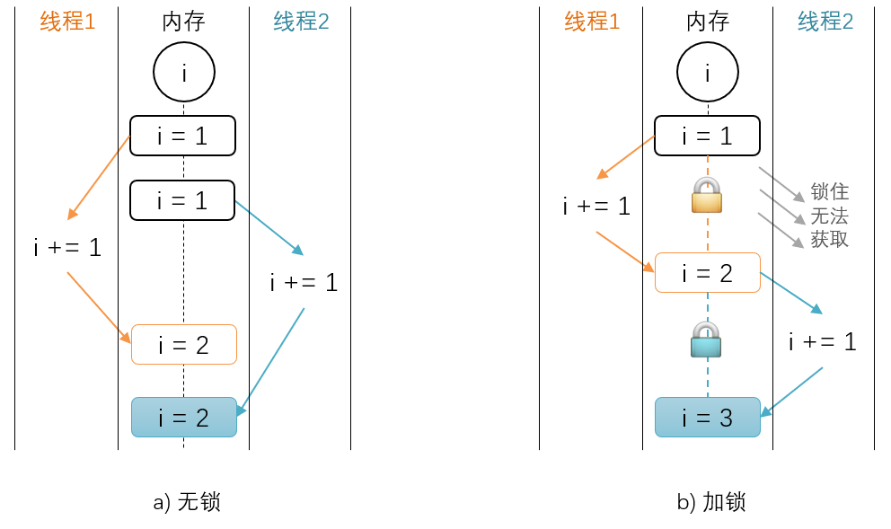
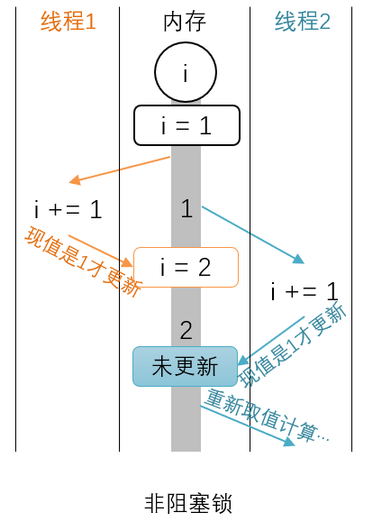

# 附1：多线程并发方案的不足——响应式Spring的道法术器

2018年03月14日 13:18:14  更多


 版权声明：本文为博主原创文章，未经博主允许不得转载。 https://blog.csdn.net/get_set/article/details/79553262

> 本系列其他文章见：[《响应式Spring的道法术器》](http://blog.csdn.net/get_set/article/details/79466657)。 
> 本篇内容是[响应式流](http://blog.csdn.net/get_set/article/details/79466402)的附录。

（以下接[响应式流](http://blog.csdn.net/get_set/article/details/79466402)的1.2.1.1节，关于“CPU眼中的时间”的内容。请不要单独看这一篇内容，否则有些内容可能让你摸不着头脑 0..0）

多线程的方式有其不完美之处，而且有些难以驾驭——

**一、耗时的上下文切换**

CPU先生不太乐意切换进程，每次换进程的时候都需要**一个小时**，因为每次切换进程的时候，办公桌上所有的资料（进程上下文）都要重新换掉。但是每个进程都必须雨露均沾地照顾到，要不客户就不满意了。

操作系统部很贴心，进程任务里边又可以分成一批线程子任务，如果某个线程子任务在等待I/O和网络的数据，就先放一边换另一个线程子任务去做，而不是切换整个进程。切换线程任务是一种相对轻量级的操作，因为不同的线程任务的许多数据都是共享的，所以只需要更新线程相关的数据，不用完全重新整理办公桌。即便如此也需要将近**半小时**的切换时间，以便能够“熟悉”任务内容。

不过毕竟，CPU先生的工作逐渐充实起来了。如图：


注意到图中CPU的时间条中深褐色的为上下文切换的时间，可以想见，高并发情况下，线程数会非常多，那么上下文切换对资源的消耗也会变得明显起来。况且在切换过程中，CPU并未执行任何业务上的或有意义的计算逻辑。

> 这里我们没有关注线程的创建时间，因为应用通常会维护一个线程池。需要新的线程执行任务的时候，就从线程池里取，用完之后返还线程池。类似的，数据库连接池也是同样的道理。

通过这个图，我们可以得到估算线程池的大小的方法。为了让CPU能够恰好跑满，Java Web服务器的最佳工作线程数符合以下公式：


(1+IO阻塞时间CPU处理时间)×CPU个数(1+IO阻塞时间CPU处理时间)×CPU个数


**二、烦人的互斥锁**

由于讨生活不易，CPU先生练就了“左右互搏术”，对外就说“超线程”，特有逼格。对于有些任务，工作效率几乎可以翻倍了，不过计算题多的时候，就不太行了，毕竟虽有两只手却只有一个脑子啊。而且今时不同往日，现在的CPU早就不再单打独斗了，比如CPU先生的办公室就还有3个CPU同事，4个CPU核心组成一个团队提供计算服务。

也正因为如此，涉及到线程间共享的数据方面，互相之间合作时不时出现冲突。

作为“贴身秘书”的一级缓存，每个CPU核心都会配置一个。CPU先生的秘书特别有眼力价，能随时准备好80%的数据给CPU先生使用，这些数据资料都是找内存组的同事要的。要的时候会让内存组的同事复印一份数据资料，拿来交给CPU先生。CPU先生算好之后的结果，它会再拿给内存组的同事。

有时候两个执行不同线程任务的CPU几乎同时让秘书来内存组要复印的数据资料，各自算好之后，再返回给内存组的同事更新，于是就会有一个结果会覆盖另一个结果，也就是说先算完的结果等于白算了。如下图“a)无锁”所示，线程1中的值已更新，但尚未通知到内存，也就是说线程2拿到的是过时的值，结果显然就不对了。所以，对于多线程频繁变化的共享数据，CPU先生会额外留个心眼，让秘书拿数据资料的时候，顺便告诉内存把这个数据先锁起来。直到算完的数据再拿回给内存的时候，才让它把锁解开。上锁期间，别人不能拿这个数据。其实不光是防别的CPU，CPU先生自己处理的多个线程之间都有可能出现这种冲突的情况，毕竟CPU先生虽然算题快，记性却非常差。

如此，下图“b)加锁”（怎么读起来感觉这么顺嘴0_0）这种方式就能够保证数据的一致性了。



这种方式叫做互斥锁。CPU先生粗略算了一下，每次加锁或解锁，大概会花费它**1分钟左右**的时间，但是可能被加锁的数据就是为了花几秒算个自增。这锁能起到作用还好，更糟心的是，许多时候，线程可能没有很多，撞到同一份数据资料的概率其实很低，但是以防万一，还不得不加锁，白白增加工作时间。

数据被加锁的时候让CPU先生很烦躁，谁知道它啥时候才会解锁，只能让“贴身秘书”时不时去看看了，锁解开之前这个线程就被阻塞住了。

更过分的是CPU先生遇到的一次死锁事件，至今令它心有余悸。那天它让“贴身秘书”找内存要数据，并让内存把数据锁起来。拿到手才发现数据有A、B两部分，它们只拿到了A。CPU先生让秘书去要B，问了好多次，一直都被锁着。后来才知道，另外一个CPU的秘书几乎同时拿到并锁了B，也一直在等A。WTF！

**三、乐观不起来的乐观锁**

CPU先生与其他众CPU一合计，不是频繁改动的数据就不加锁了，大家在往回更新数据的时候先看看有没有被人动过不就得了。如下图，



执行线程2的时候取走的是`i==1`，算完回来要更新的时候，发现`i==2`了，那刚才算的不作数，从新取值再算一遍。这种“比较并交换（Compare-and-Swap,CAS）”的指令是原子的，“现场检查现场更新”，不会给其他线程以可乘之机。

乐观情况下，如果线程不多，互相冲突的几率不大的话，很少导致阻塞情况的出现，既确保了数据一致性，又保证了性能。

但乐观锁也有其局限性，在高并发环境下，如果乐观锁所保护的计算逻辑执行时间稍微长一些，可能会陷入一直被别人更新的状态，往往性能还不如悲观锁。所以高并发且数据竞争激烈的情况下，乐观锁出场率并不高。

如果在高并发且某些变量容易被频繁改动的情况下，CAS比较失败并重新计算的概率就高了。我们不妨做个实验，扩展一个具有CAS算法的`AtomicInteger`：

[MyAtomicInteger.java](https://github.com/get-set/get-reactive/blob/master/snacks/src/main/java/com/getset/MyAtomicInteger.java)

```java
public class MyAtomicInteger extends AtomicInteger {
    private AtomicLong failureCount = new AtomicLong(0);

    public long getFailureCount() {
        return failureCount.get();
    }

    /**
     * 从以下两个方法 inc 和 dec 可以看出 Atomic* 的原子性的实现原理：
     * 这是一种乐观锁，每次修改值都会【先比较再赋值】，这个操作在CPU层面是原子的，从而保证了其原子性。
     * 如果比较发现值已经被其他线程变了，那么就返回 false，然后重新尝试。
     */
    public void inc() {
        Integer value = get();  
        while (!compareAndSet(value, value + 1)) {  
            failureCount.getAndIncrement();  
            value = get();  
            // try {  
            //     TimeUnit.MICROSECONDS.sleep(2);  
            // } catch (InterruptedException e) {  
            //     e.printStackTrace();  
            // }  
        }  
    }

    public void dec() {
        Integer value = get();  
        while (!compareAndSet(value, value - 1)) {  
            failureCount.getAndIncrement();  
            value = get();  
            // try {  
            //     TimeUnit.MICROSECONDS.sleep(2);  
            // } catch (InterruptedException e) {  
            //     e.printStackTrace();  
            // }  
        }  
}

```

[测试](https://github.com/get-set/get-reactive/blob/master/snacks/src/test/java/com/getset/Test_1_2.java)：

```java
@Test
public void testCustomizeAtomic() throws InterruptedException {
    final MyAtomicInteger myAtomicInteger = new MyAtomicInteger();
    // 执行自增和自减操作的线程各10个，每个线程操作10000次
    Thread[] incs = new Thread[10];
    Thread[] decs = new Thread[10];
    for (int i = 0; i < incs.length; i++) {
        incs[i] = new Thread(() -> {
            for (int j = 0; j < 10000; j++) {
                myAtomicInteger.inc();
            }
        });
        incs[i].start();
        decs[i] = new Thread(() -> {
            for (int j = 0; j < 10000; j++) {
                myAtomicInteger.dec();
            }
        });
        decs[i].start();
    }

    for (int i = 0; i < 10; i++) {
        incs[i].join();
        decs[i].join();
    }

    System.out.println(myAtomicInteger.get() + " with " + myAtomicInteger.getFailureCount() + " failed tries.");
}

```

我电脑上跑出的结果是：

```log
0 with 223501 failed tries.

```

总共20万次操作，失败了22万多次。

高并发情况下，如果计算时间比较长，那么就容易陷入总是被别人更新的状态，而导致性能急剧下降。比如上例，如果把MyAtomicInteger.java中`sleep`的注释打开，再次跑测试，就会出现久久都无法执行结束的情况。

**四、莫名躺枪的指令重排**

对于CPU先生来说，没有多线程的日子挺美好的。有了多线程之后，总是会莫名踩坑，比如一次接到的任务是有两个线程子任务：

```python
// 一个线程执行：
a = 1;
x = b;

// 另一个线程执行：
b = 1;
y = a;

```

a, b, x, y 的初始值都是0。

CPU先生的注意力只在当前线程，而从来记不住切换过来之前的线程做了什么，做到哪了。客户也知道CPU先生记性不好，而且执行到半截可能会切到另一个线程去，对于可能出现的结果也有心理准备：

1. x==0 && y==1：可能的执行顺序比如：`a = 1; x = b; b = 1; y = a`；
2. x==1 && y==0：可能的执行顺序比如：`b = 1; y = a; a = 1; x = b`；
3. x==1 && y==1：可能的执行顺序比如：`a = 1; b = 1; x = b; y = a`；

无外乎这三种结果嘛。结果CPU先生给算出了 `x==0 && y==0`！出现这种结果的原因只能是 `x = b; y = a;` 是在 `a = 1; b = 1;`这两句之前执行的。Buy why？

事实上CPU和编译器对于程序语句的执行顺序还有会做一些优化的。比如第一个线程的两句程序，相互之间并无任何依赖关系，对于当前线程来说，调整执行顺序并不会影响逻辑结果。比如执行第一句的时候`a`的结果CPU先生和“秘书”一级缓存都没有，这时候会跟二级缓存甚至内存要，但是CPU先生闲着难受，等待`a`的值的工夫就先把`x = b`执行了。第二个线程也有可能出现同样的情况，从而导致了第四种结果的出现。

对于没有依赖关系的执行语句，编译期和CPU会酌情进行指令重排，以便优化执行效率。这种优化在单线程下是没问题的，但是多线程下就需要在开发程序的时候采取一些措施来避免这种情况了。

CPU先生： 

**五、委屈的内存**

多线程的处理方式对于解决客户的高并发需求确实很给力，虽然许多线程是处于等待数据状态，但总有一些线程能让CPU先生的工作饱和起来。客户对计算组CPU们吃苦耐劳的工作态度赞赏有加。

内存组则有些委屈了，多线程也有它们的很大功劳，CPU的“贴身秘书”只是保管一小部分临时数据，绝大多数的数据还是堆在内存组。多一个线程就得需要为这个线程准备一块儿“工作内存”，虽然划拨给内存组的空间越来越大，但是如果动不动就开成百上千个线程的话，面对堆积如山的数据还总是不太够。

**六、多线程并非银弹**

搞IT的如果不套用一句“XXX并非银弹”总是显得逼格不够，所以我也郑重其事地说一句“多线程并非银弹”。以上归纳下来：

- 高并发环境下，多线程的切换会消耗CPU资源；
- 应对高并发环境的多线程开发相对比较难，并且有些问题难以在测试环境发现或重现；
- 高并发环境下，更多的线程意味着更多的内存占用。
