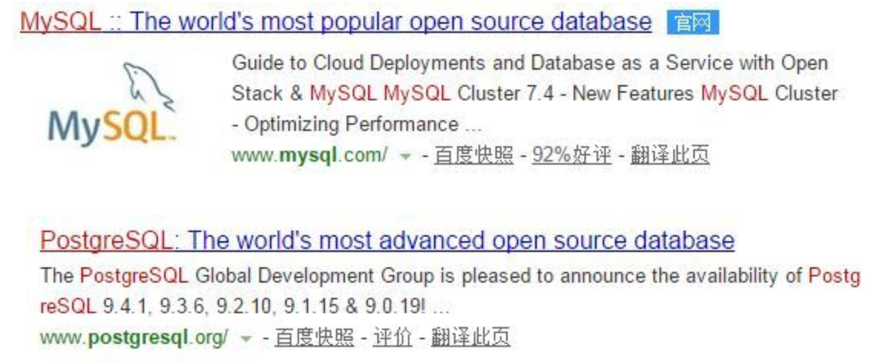
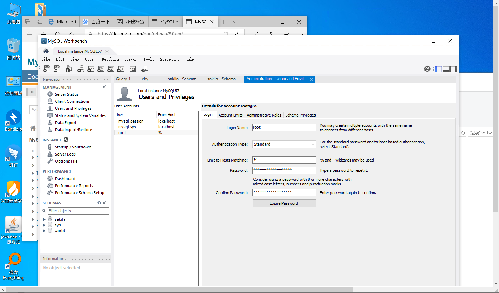
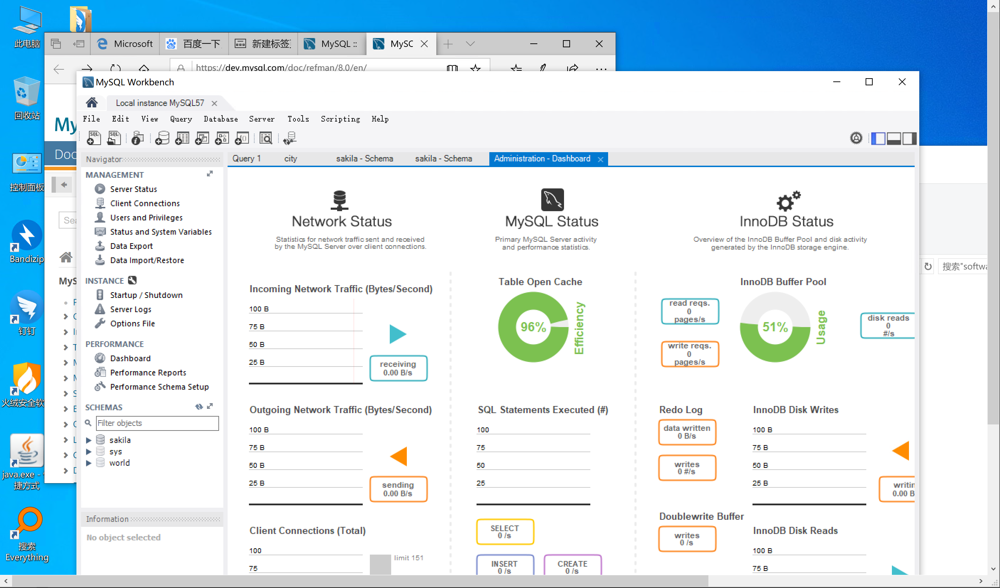

# MySQL


## 链接
1. [MySQL社区版官网](https://dev.mysql.com/)
1. [MySQL 5.7 官方文档](https://dev.mysql.com/doc/refman/5.7/en/)
    1. [linux 通用版安装文档](https://dev.mysql.com/doc/refman/5.7/en/binary-installation.html)
    1. [新装数据库初始化](https://dev.mysql.com/doc/refman/5.7/en/data-directory-initialization.html)
    1. [时区支持](https://dev.mysql.com/doc/refman/5.7/en/time-zone-support.html)
    1. [my.cnf使用说明](https://dev.mysql.com/doc/refman/5.7/en/option-files.html)
    1. [mysqld说明](https://dev.mysql.com/doc/refman/5.7/en/mysqld.html)
1. [tfp项目 - mysql改造指南](http://saas.gitlab.fingard.cn/document/mysql/)
1. [tfp项目 - Mysql部署信息](http://saas.gitlab.fingard.cn/document/deployment/mysql.html)
### 博客、帖子
1. [mysql非交互执行sql](https://blog.csdn.net/Michael_lcf/article/details/103019734)
1. [在MySQL 5.7日志时间与本地时间不一致的问题](https://www.cnblogs.com/if-then/p/7236686.html)
1. [如何在MySQL中分配innodb_buffer_pool_size](https://www.cnblogs.com/wanbin/p/9530833.html)

## faq
### bin-log过大
状况：skywalking指向的mysql数据库，写入非常频繁，10g的数据库，能产生240g的bin-log，从而消耗大量硬盘空间。

[mysql 日志文件mysql-bin文件清除方法，和mysql-bin相关文件的配置](https://www.cnblogs.com/pansidong/p/11881801.html)
- 如果永远不再需要这个，可以：`reset master;`
- 在生产环境，需要保留bin-log的情况下，可用：`purge master logs to 'mysql-bin.000215'`

### 字符集
在mysql中字符集编码要选utf8mb4，utf8这个选项支持不完全
> [(译)用MySQL的朋友们请不要使用"utf8"，请使用"utf8mb4"](https://www.jianshu.com/p/ab9aa8d4df7d)

### 连接数
```
show variables like "max_connections"; 
set GLOBAL max_connections=1000; 
```
> [too many connections 解决方法](https://blog.csdn.net/qq_36057860/article/details/80139985)

### mysqld命令行参数
```bash
mysqld --verbose --help

```
> [4.3.1 mysqld — The MySQL Server](https://dev.mysql.com/doc/refman/5.7/en/mysqld.html)

## workbench

workbench可以很方便的设置和监控

设置远程连接的主机匹配符



监控mysql的各种状态


