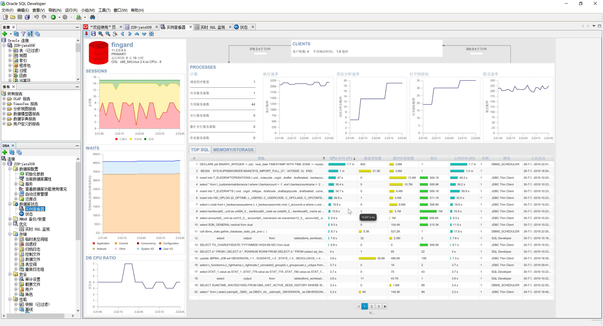
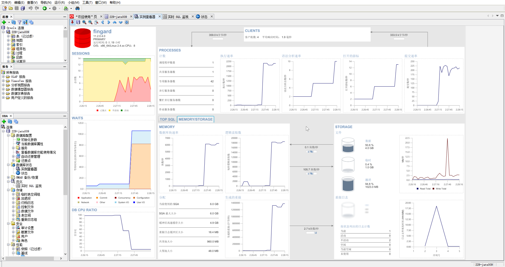

# Oracle

## Oracle SQL Developer

1. [下载地址](https://www.oracle.com/technetwork/developer-tools/sql-developer/downloads/index.html)
2. 设置jdk

进入Sql Developer安装目录下： 
D:\app\SUNLEI\product\11.2.0\dbhome_1\sqldeveloper\sqldeveloper\bin，找到sqldeveloper.conf文件，修改最后一行的SetJavaHome参数值，指定Jdk版本即可。

[图形化界面打开awr](https://blog.csdn.net/wangyiyungw/article/details/81100767)

效果图：

