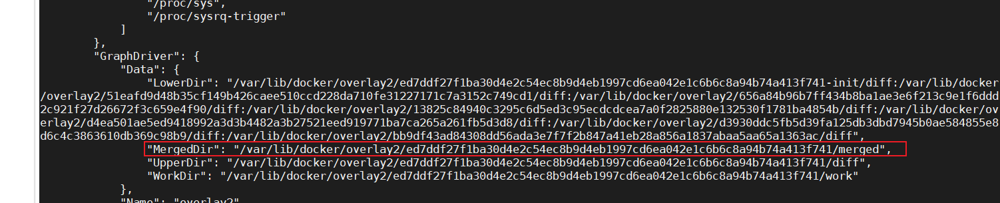

## docker 配置

### Docker网络network详解
[Docker网络network详解](https://blog.csdn.net/qq_44749491/article/details/128682105)

###  进入容器内部

### docker原理
[Linux Namespace](https://www.cnblogs.com/sally-zhou/p/13398260.html)
Namespace 实现资源隔离的目的  

cgroup是一种层次化的组织结构，类似于文件系统的目录树结构。每个cgroup都可以包含一组进程，
并且可以对这些进程施加资源限制和管理策略
[linux的cgroup](https://blog.csdn.net/liulanba/article/details/131525683)
