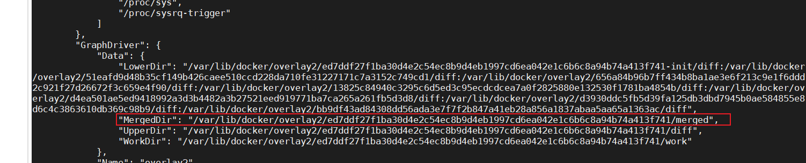
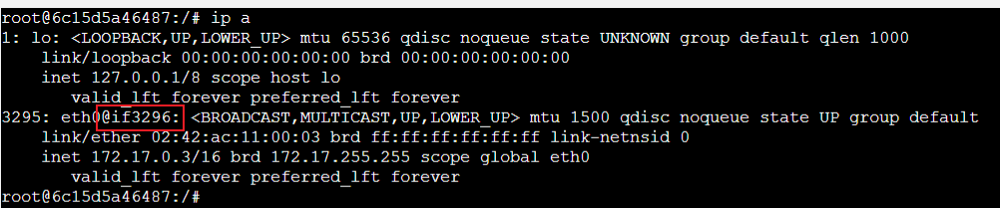
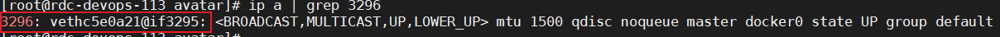
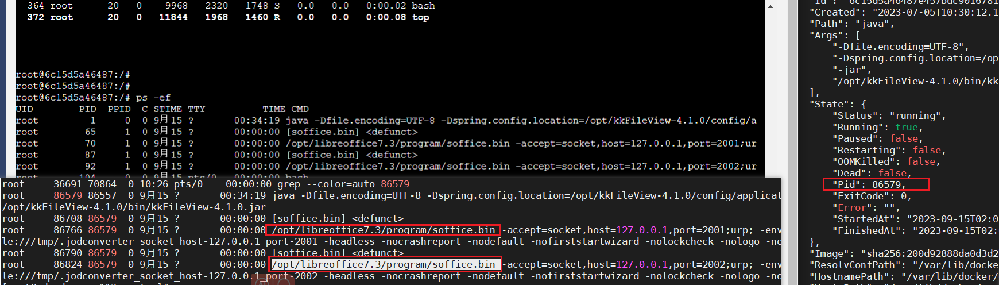
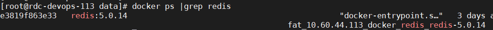

## docker 配置
### Docker 组件作用
1. docker组件
   1. docker: docker的客户端，负责发送docker操作请求
   2. dockerd: docker服务器入口，负责接收客户端请求并返回请求结果
   3. docker-init: 当业务父进程没有对子线程进程回收能力时，docker-init可以做为容器的1号进程，负责管理容器内子进程
      1. 僵尸进程： 当一个进程退出时，它并不是完全消失，而是等到它的父进程通过调用wait(）系统调用来回收该子进程的退出状态和资源，在这个等待的过程中进程处于僵尸进程
      2. 孤儿进程： 父进程退出了，并没有回收子进程的资源和状态，那么该子进程会变成孤儿进程，最终会被1号进程，也就是init进程收养。其次init会定期来调用wait()来完成僵尸进程的回收
   4. docker-proxy: 通过设置iptables 规则使得访问到主机的流量可以被顺利转 发到容器中
2. containerd组件 
   1. containerd： 负责管理容器的生命周期，通过接收 dockerd 的请求，执行启动或者销毁容器操作。镜像的管理、管理存储、网络 相关资源
   2. containerd-shim： 将containerd和真正的容器进程解耦，使用containerd-shim作为容器进程的父进程，可以实现重启containerd不影响已经启动的容器进程
   3. ctr：containerd的客户端，可以直接向 containerd发送容器操作请求，主要用来开发和调试
3. 容器运行时相关组件 runc：通过调用 namespace、cgroups等系统接口，实现容器的创建和启动
[https://blog.51cto.com/u_14035463/5585053](https://blog.51cto.com/u_14035463/5585053)


### Docker网络network详解  
四种网络模式：  
host: 容器和宿主机共享 network namepsace。容器将不会虚拟出自己的网卡。配置自己的ip等,而是使用宿主机的ip和端口  
container: 新创建的容器不会创建自己的网卡和配置自己的ip，而是和一个指定的容器共享ip、端口范围,第一个以bridge方式启动的容器服务挂掉，后面依赖它的容器，都暂停服务
brigde: 为每一个容器分配、设置 ip ，并将容器连接到 docker0 虚拟网桥上，这也是默认网络模式
none: 容器有独立的Network namespace，但并没有对其进行任何网络设置
[Docker网络network详解](https://blog.csdn.net/qq_44749491/article/details/128682105)    
[docker网络](https://blog.csdn.net/weixin_42322206/article/details/126564020)  
[Docker中网络的使用和配置用法详解](https://blog.csdn.net/weixin_44799217/article/details/128167248)  
[Docker四大网络&自定义网络](https://blog.csdn.net/sinat_34104446/article/details/125057941)

### 自定义网络
[Docker—自定义网络](https://zhuanlan.zhihu.com/p/603791701)  
当两个容器相互调用的时候，如果直接通过ip来通信，由于容器内的ip地址可能会发生变化，此时会导致相互调用的服务不可用  
可通过自定义网络 ，通过 ping 其他容器名进行访问  
[用户定义的 bridge 跟默认 bridge 的区别](https://blog.csdn.net/weixin_42445065/article/details/130827936)  
用户定义的 bridge 跟默认 bridge 的区别：  
用户定义的 bridge 提供容器之间的自动 DNS 解析  
在默认 bridge 下的容器只能通过 IP 地址访问彼此，除非使用 --link 选项，此选项已经标记为遗弃状态。  
而在用户定义的 bridge 网络，容器间可以通过主机名或者别名来解析彼此的地址。
### 一个主机下容器之间的访问
link 其实就是在接收容器的 /etc/hosts会添加 源容器的ip：服务名   
[容器link](https://blog.csdn.net/qq_28903377/article/details/124042044)

### Docker跨主机网络通信
容器网络发展到现在，形成了两大阵营：  
Docker的CNM  
Google、Coreos、Kuberenetes主导的CNI  
[Docker跨主机网络通信](https://blog.csdn.net/qq_36733838/article/details/130533447)

###  进入容器内部


### docker原理
[Linux Namespace](https://www.cnblogs.com/sally-zhou/p/13398260.html)  
[一文彻底搞懂Docker中的namespace](https://blog.csdn.net/songguangfan/article/details/121727435)
Namespace是在内核级别以一种抽象的形式来封装系统资源，通过将系统资源放在不同的Namespace中，来实现资源隔离的目的  
Namespace 是 Linux 内核的一个特性，该特性可以实现在同一主机系统中，对进程 ID、主机名、用户 ID、文件名、网络和进程间通信等资源的隔离。


cgroup是一种层次化的组织结构，类似于文件系统的目录树结构。每个cgroup都可以包含一组进程，
并且可以对这些进程施加资源限制和管理策略，资源限制包括CPU配额、内存限制、磁盘I/O访问速度限制等
[linux的cgroup](https://blog.csdn.net/liulanba/article/details/131525683)  

### docker 存储
镜像变成容器 其实就是多了两个文件夹  -init的目录是只读的；没有init的容器目录才是容器的读写目录   
[docker Overlay2 文件系统原理](http://static.kancloud.cn/chunyu/php_basic_knowledge/3083133)  
[lowerdir、upperdir、merged](https://blog.51cto.com/u_16099350/6687189)  


[docker学习](https://haicoder.net/docker/docker-virtualmachine-copmare.html)
Docker 从 17.03 版本之后分为 CE（Community Edition: 社区版） 和 EE（Enterprise Edition: 企业版）  
一般使用社区版、企业版要收费没必要  

docker 实现是基于 LXC[Linux Container容器是一种内核虚拟化技术，可以提供轻量级的虚拟化，以便隔离进程和资源]，从 0.7 版本以后开始去除 LXC，
转而使用自行开发的 libcontainer，从 1.11 开始，则进一步演进为使用 runC 和 containerd

### Docker应用场景
Docker 有意思的一个使用场景是在多租户的应用中，它可以避免关键应用的重写。如果你将应用程序服务公开给多个租户（租户指一组用户，例如组织），
使用单租户方案设计的应用程序如果用上了 子域名 + docker 可以快速获得提供多租户的服务。
得益于 Docker 环境的启动速度和其高效的 diff 命令


### docker 架构
需要容器镜像时，则从 Docker Registry 中下载镜像，并通过镜像管理驱动 graphdriver 将下载镜像以 Graph 的形式存储

rootfs: 完整包含根目录的拷贝  
rootfs只是一个操作系统所包含的文件、配置和目录，并不包括操作系统内核，因此在容器中运行的内核与宿主机一致，与内核相关的模块是无法隔离的  
chroot的过程是将/bin/bash进程的Home目录切换成了/var/lib/docker/aufs/mnt/[id]
[docker rootfs](https://www.cnblogs.com/WJQ2017/p/17180077.html)  
[docker实战](https://www.wenjiangs.com/doc/docker-rootfs)    
说白了，chroot  宿主机 自定义个路径位置 充当容器的根路径    

docker内部:  
  

docker外部:  


### 如何从docker镜像里提取dockerfile
1.  docker history xx     [无法查询详情]
2.  dfimages          [基础镜像无法看到]
3.  portainer   
[如何从docker镜像里提取dockerfile](https://liucy.blog.csdn.net/article/details/123203549)

### docker -v 映射
```shell
"""docker run -d --network host --name ${containerName()} \\
    --restart=always \\
    --privileged=true \\
    -e TZ=Asia/Shanghai \\
    -v ${installPath}redis.conf:/etc/redis/redis.conf \\
    -v ${installPath}data:/data \\
    ${imageNameTag()}  redis-server /etc/redis/redis.conf --appendonly yes """
```
容器内部没有 /etc/redis/redis.conf ,可以通过外部配置文件映射到内部  

```shell
docker run -d --network host --name ${containerName()} \\
    --restart=always \\
    --privileged=true \\
    -e TZ=Asia/Shanghai \\
    -v ${installPath}rabbitmq-env.conf:/etc/rabbitmq/rabbitmq-env.conf \\
    -v ${installPath}rabbitmq.conf:/etc/rabbitmq/rabbitmq.conf    \\
    -v ${installPath}data:/var/lib/rabbitmq/mnesia/rabbit\\@rabbit38 \\
```
宿主机里的 rabbitmq.conf 优先覆盖掉容器内部的 /etc/rabbitmq/rabbitmq.conf   

宿主机里目录为空，通过 -v 映射 可以把容器里的文件映射到外面的配置文件里  
```shell
docker run -d --network host --name fat_10.60.44.16_docker_RabbitmqNode-3_rabbitmq38-5672 \
    --restart=always \
    --privileged=true \
    -e TZ=Asia/Shanghai \
    -e RABBITMQ_DIST_PORT=25675 \
    -e RABBITMQ_ERLANG_COOKIE='rabbitcookie' \
    -v /home/avatar/fg-deploy/software/docker_RabbitmqNode-3/test:/etc/rabbitmq  \
    -v /home/avatar/fg-deploy/software/docker_RabbitmqNode-3/data:/var/lib/rabbitmq/mnesia/rabbit\@rabbit38 \
    rabbit:3.8.23-fg1-delay
```
-v /home/avatar/fg-deploy/software/docker_RabbitmqNode-3/test:/etc/rabbitmq

[查看容器详细信息](https://zhuanlan.zhihu.com/p/553264831?utm_id=0)
### docker pid 映射  
"Pid": 86579  是当前jar包在主机的pid,他对应docker内部 pid 1  
如果我在docker内部启动一个新的进程，那边在主机里面，会有个新的pid 充当 "Pid": 86579 的子进程  
  

### docker inspect xxx 详情

```shell
[
    {
        "Id": "e3819f863e334d2bb98a73e454196cc90ddbebc465962b06128cd1e13284478d",
        "Created": "2023-08-25T07:31:37.436301971Z",  ##创建时间 要加8个小时代表真正的创建时间
        "Path": "docker-entrypoint.sh",
        "Args": [
            "--requirepass",
            "xyyweb@1"
        ],
        "State": {
            "Status": "running",
            "Running": true,
            "Paused": false,        ## 容器进程正在运行，但 Docker 暂停了容器,可以通过docker unpause命令恢复
            "Restarting": false,
            "OOMKilled": false,
            "Dead": false,
            "Pid": 34542,   ## 外部主机 docker对应的进程
            "ExitCode": 0,
            "Error": "",
            "StartedAt": "2023-08-28T09:56:07.443970457Z", ## 查看容器最后一次启动时间，要加8个小时
            "FinishedAt": "2023-08-28T03:52:22.664107629Z"
        },
        "Image": "sha256:c5da061a611a09b0a09cbb60dde89dfdb0a3e995e60cfc195a098fab3ba97aaf",  ## 用的哪个镜像
        "ResolvConfPath": "/var/lib/docker/containers/e3819f863e334d2bb98a73e454196cc90ddbebc465962b06128cd1e13284478d/resolv.conf",  ## 容器里dns
        "HostnamePath": "/var/lib/docker/containers/e3819f863e334d2bb98a73e454196cc90ddbebc465962b06128cd1e13284478d/hostname",  ## 容器里 hostname
        "HostsPath": "/var/lib/docker/containers/e3819f863e334d2bb98a73e454196cc90ddbebc465962b06128cd1e13284478d/hosts",         ## 容器里 hosts
        "LogPath": "/var/lib/docker/containers/e3819f863e334d2bb98a73e454196cc90ddbebc465962b06128cd1e13284478d/e3819f863e334d2bb98a73e454196cc90ddbebc465962b06128cd1e13284478d-json.log", ## 日志
        "Name": "/fat_10.60.44.113_docker_redis_redis-5.0.14",
        "RestartCount": 0,
        "Driver": "overlay2",
        "Platform": "linux",
        "MountLabel": "",
        "ProcessLabel": "",
        "AppArmorProfile": "",
        "ExecIDs": null,
        "HostConfig": {
            "Binds": [
                "/home/avatar/fg-deploy/software/docker-redis/data:/data"
            ],     # -v 形式
            "ContainerIDFile": "",
            "LogConfig": {
                "Type": "json-file",
                "Config": {
                    "max-file": "3",
                    "max-size": "500m"
                }
            },
            "NetworkMode": "default",    #网络模式
            "PortBindings": {
                "6379/tcp": [               #容器端口
                    {
                        "HostIp": "",
                        "HostPort": "6389"   #主机端口
                    }
                ]
            },
            "RestartPolicy": {
                "Name": "always",
                "MaximumRetryCount": 0
            },
            "AutoRemove": false,
            "VolumeDriver": "",
            "VolumesFrom": null,
            "ConsoleSize": [
                0,
                0
            ],
            "CapAdd": null,
            "CapDrop": null,
            "CgroupnsMode": "host",
            "Dns": [],
            "DnsOptions": [],
            "DnsSearch": [],
            "ExtraHosts": null,
            "GroupAdd": null,
            "IpcMode": "private",
            "Cgroup": "",
            "Links": null,
            "OomScoreAdj": 0,
            "PidMode": "",
            "Privileged": true,
            "PublishAllPorts": false,
            "ReadonlyRootfs": false,
            "SecurityOpt": [
                "label=disable"
            ],
            "UTSMode": "",
            "UsernsMode": "",
            "ShmSize": 67108864,
            "Runtime": "runc",
            "Isolation": "",
            "CpuShares": 0,
            "Memory": 0,
            "NanoCpus": 0,
            "CgroupParent": "",
            "BlkioWeight": 0,
            "BlkioWeightDevice": [],
            "BlkioDeviceReadBps": [],
            "BlkioDeviceWriteBps": [],
            "BlkioDeviceReadIOps": [],
            "BlkioDeviceWriteIOps": [],
            "CpuPeriod": 0,
            "CpuQuota": 0,
            "CpuRealtimePeriod": 0,
            "CpuRealtimeRuntime": 0,
            "CpusetCpus": "",
            "CpusetMems": "",
            "Devices": [],
            "DeviceCgroupRules": null,
            "DeviceRequests": null,
            "MemoryReservation": 0,
            "MemorySwap": 0,
            "MemorySwappiness": null,
            "OomKillDisable": false,
            "PidsLimit": null,
            "Ulimits": null,
            "CpuCount": 0,
            "CpuPercent": 0,
            "IOMaximumIOps": 0,
            "IOMaximumBandwidth": 0,
            "MaskedPaths": null,
            "ReadonlyPaths": null
        },
        "GraphDriver": {
             ## lowerdir是镜像层，目录或者文件是只读的
             ## upperdir是容器层，可读可写；
             ## merged是表现层，向使用隐藏了技术细节，提供了一个统一的文件系统的使用视角
            "Data": {
                "LowerDir": "/var/lib/docker/overlay2/f8576b33173a3e67acd692060788bc7beb646a81dc25bb7eb8673635eba3f431-init/diff:/var/lib/docker/overlay2/0ed5602b9cf11ecde86e8e09c1f08603af0803fc7683358048d7ce0eca857955/diff:/var/lib/docker/overlay2/4fb2e65f6746d64e889127fc72daaec5dee5eefe394cfdab0fdba03974fd2a94/diff:/var/lib/docker/overlay2/47f09659ee9eca13eace0f533436432ee2d5e8a0ebf0d3c37cd5242d77fa6ea4/diff:/var/lib/docker/overlay2/4a99b5c0f1ed540f17614a607f21edc7cd3571b93c690260642caa2cf65fe1f7/diff:/var/lib/docker/overlay2/aa3a0528917fc41fcbbbd924a37c2fd92bce86003bd0a126d8c1bd4ab9b98be1/diff:/var/lib/docker/overlay2/f9a1bd19185fcb93510a81735f37add3baa920b936596d7aedaa77eed8f539c9/diff",
                "MergedDir": "/var/lib/docker/overlay2/f8576b33173a3e67acd692060788bc7beb646a81dc25bb7eb8673635eba3f431/merged",
                "UpperDir": "/var/lib/docker/overlay2/f8576b33173a3e67acd692060788bc7beb646a81dc25bb7eb8673635eba3f431/diff",
                "WorkDir": "/var/lib/docker/overlay2/f8576b33173a3e67acd692060788bc7beb646a81dc25bb7eb8673635eba3f431/work"
            },
            "Name": "overlay2"
        },
        "Mounts": [
            {
                "Type": "volume",  #数据存储的类型，其主要有：bind,volume,tmpfs, 在这里我们主要研究的bind类型，也就所谓的文件挂载
                "Name": "79357d8534095f8c88f3f3ed44bdaaa5fa5f776fd5ce11beb29f479e9525ccfd",
                "Source": "/var/lib/docker/volumes/79357d8534095f8c88f3f3ed44bdaaa5fa5f776fd5ce11beb29f479e9525ccfd/_data", #外部主机
                "Destination": "/data", #容器內
                "Driver": "local",
                "Mode": "",
                "RW": true,
                "Propagation": ""  #文件挂载的传播级别，主要有：rprivate, private,rshard,shard,rslave,slave
            }
        ],
        "Config": {
            "Hostname": "e3819f863e33", #容器里 主机名
            "Domainname": "",
            "User": "",
            "AttachStdin": false,
            "AttachStdout": false,
            "AttachStderr": false,
            "ExposedPorts": {
                "6379/tcp": {}
            },
            "Tty": false,
            "OpenStdin": false,
            "StdinOnce": false,
            "Env": [
                "TZ=Asia/Shanghai",
                "PATH=/usr/local/sbin:/usr/local/bin:/usr/sbin:/usr/bin:/sbin:/bin",
                "GOSU_VERSION=1.12",
                "REDIS_VERSION=5.0.14",
                "REDIS_DOWNLOAD_URL=http://download.redis.io/releases/redis-5.0.14.tar.gz",
                "REDIS_DOWNLOAD_SHA=3ea5024766d983249e80d4aa9457c897a9f079957d0fb1f35682df233f997f32"
            ],
            "Cmd": [
                "--requirepass",
                "xyyweb@1"
            ],
            "Image": "redis:5.0.14",
            "Volumes": {
                "/data": {}
            },
            "WorkingDir": "/data",
            "Entrypoint": [
                "docker-entrypoint.sh"
            ],
            "OnBuild": null,
            "Labels": {}
        },
        "NetworkSettings": {
            "Bridge": "",
            "SandboxID": "8f8c6f5ea1384cb6c16ab2e7e081473f0f60989907baa7449f635ae143698e24",
            "HairpinMode": false,
            "LinkLocalIPv6Address": "",
            "LinkLocalIPv6PrefixLen": 0,
            "Ports": {
                "6379/tcp": [
                    {
                        "HostIp": "0.0.0.0",
                        "HostPort": "6389"
                    },
                    {
                        "HostIp": "::",
                        "HostPort": "6389"
                    }
                ]
            },
            "SandboxKey": "/var/run/docker/netns/8f8c6f5ea138", #沙盒密钥路径
            "SecondaryIPAddresses": null,
            "SecondaryIPv6Addresses": null,
            "EndpointID": "14c0ba98e9a03995b9359ec4d47440e6ecf101830b7ef332829696689b1cc7e3",
            "Gateway": "172.17.0.1",
            "GlobalIPv6Address": "",
            "GlobalIPv6PrefixLen": 0,
            "IPAddress": "172.17.0.6",
            "IPPrefixLen": 16,
            "IPv6Gateway": "",
            "MacAddress": "02:42:ac:11:00:06",
            "Networks": {
                "bridge": {
                    "IPAMConfig": null,
                    "Links": null,
                    "Aliases": null,
                    "NetworkID": "ab2490a2a634882ae59da0c14ece28c229dedce0f293e8d34f237c2cee8c0eda",
                    "EndpointID": "14c0ba98e9a03995b9359ec4d47440e6ecf101830b7ef332829696689b1cc7e3",
                    "Gateway": "172.17.0.1",
                    "IPAddress": "172.17.0.6",
                    "IPPrefixLen": 16,
                    "IPv6Gateway": "",
                    "GlobalIPv6Address": "",
                    "GlobalIPv6PrefixLen": 0,
                    "MacAddress": "02:42:ac:11:00:06",
                    "DriverOpts": null
                }
            }
        }
    }
]
```
