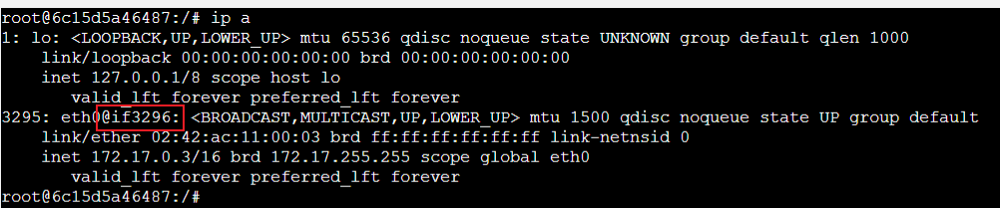
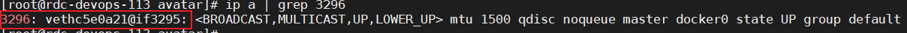

## docker
[docker学习](https://haicoder.net/docker/docker-virtualmachine-copmare.html)
Docker 从 17.03 版本之后分为 CE（Community Edition: 社区版） 和 EE（Enterprise Edition: 企业版）  
一般使用社区版、企业版要收费没必要  

docker 实现是基于 LXC[Linux Container容器是一种内核虚拟化技术，可以提供轻量级的虚拟化，以便隔离进程和资源]，从 0.7 版本以后开始去除 LXC，
转而使用自行开发的 libcontainer，从 1.11 开始，则进一步演进为使用 runC 和 containerd

### Docker应用场景
Docker 有意思的一个使用场景是在多租户的应用中，它可以避免关键应用的重写。如果你将应用程序服务公开给多个租户（租户指一组用户，例如组织），
使用单租户方案设计的应用程序如果用上了 sub-domain + docker 可以快速获得提供多租户的服务。
得益于 Docker 环境的启动速度和其高效的 diff 命令

### docker 架构
需要容器镜像时，则从 Docker Registry 中下载镜像，并通过镜像管理驱动 graphdriver 将下载镜像以 Graph 的形式存储

chroot的过程是将/bin/bash进程的Home目录切换成了/var/lib/docker/aufs/mnt/[id]
[Docker原理之rootfs](https://www.cnblogs.com/lioa/p/12666514.html)
[docker rootfs](https://www.cnblogs.com/WJQ2017/p/17180077.html)

docker内部:

docker外部:

