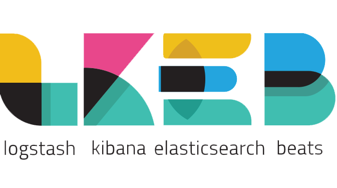
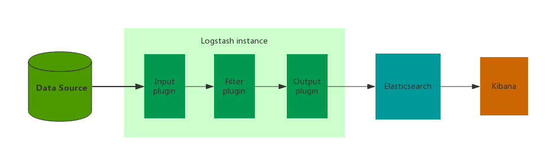

# ELK


> 备注
> - E -> Elasticsearch
> - L -> Logstash
> - K -> Kibana
> - F -> Filebeat

## 目录及链接

### 目录
1. [ELK简要安装文档](install.md)
1. [Filebeat——读取json行文件的方式收集日志](filebeat_install.md)
1. [截图及功能说明](manual.md)
1. [问题汇总](faq.md)

### 置顶链接
1. [Elastic Stack官方文档翻译](https://www.bookstack.cn/books/hjt353)

### 官网
1. [官网链接](https://www.elastic.co/)
1. [文档列表](https://www.elastic.co/guide/index.html)

#### es
1. [es 6.4官方文档](https://www.elastic.co/guide/en/elasticsearch/reference/6.4/index.html)
1. [《Elasticsearch: 权威指南》es 2.x中文文档，基本上大部分高版本也能用](https://www.elastic.co/guide/cn/elasticsearch/guide/current/index.html)
1. [es网络配置](https://www.elastic.co/guide/en/elasticsearch/reference/6.4/modules-network.html)
1. [elastic系列软件官方docker镜像（这里的也能在docker hub官方找到）](https://www.docker.elastic.co/)
    1. [docker hub的es](https://hub.docker.com/_/elasticsearch)
1. [es 7.5 docker下安装教程](https://www.elastic.co/guide/en/elasticsearch/reference/7.5/docker.html)
1. [Elasticsearch Reference：Number of threads](https://www.elastic.co/guide/en/elasticsearch/reference/current/max-number-of-threads.html)

#### kibana
1. [kibana 6.4官方文档](https://www.elastic.co/guide/en/kibana/6.4/index.html)
1. [kibana页面搜索框查询便捷语法](https://www.elastic.co/guide/en/kibana/6.4/kuery-query.html)
    1. [kibana页面搜索框查询语法](https://www.elastic.co/guide/en/elasticsearch/reference/6.4/query-dsl-query-string-query.html#query-string-syntax)    
1. [kibana 6.x中文文档 (这个除了上面那个新增查询语法外，基本都有翻译)](https://www.elastic.co/guide/cn/kibana/current/index.html)
1. [kibana 7.x官方支持中文界面](https://www.elastic.co/guide/en/kibana/current/i18n-settings-kb.html)
    1. [kibana 7.x搭建的样例地址](http://efk7.k8s.xyyweb.cn/)
    1. [同时skywalking 6.6也支持es 7了](http://skywalking.apache.org/downloads/)
1. [kibana 7在docker下启动](https://www.elastic.co/guide/en/kibana/7.x/docker.html)
#### filebeat
1. [filebeat 6.4官方文档](https://www.elastic.co/guide/en/beats/filebeat/6.4/index.html)

在控制台打印启动日志
```bash
filebeat -v -e -c filebeat.yml
```

### 博客、帖子
1. [filebeat采集原理剖析](https://www.jianshu.com/p/62fbde3f0a11)
1. [filebeat实践-内存占用-最大内存占用【filebeat的内存占用可能非常大】](https://yq.aliyun.com/articles/241161)
1. [ELK elasticsearch kibana 日志排序 之 日志二级排序](https://blog.csdn.net/u011181610/article/details/82756049)

### 其他具体问题链接
1. [es分页解决方案——（from+size）分页和深分页](https://blog.csdn.net/Fenggms/article/details/83066542)

### 安全、认证
#### 官方的x-pack
优先用这个，配置相对第三方插件Search Guard简单，免费版就自带图形配置界面，而Search Guard的gui收费，导致配置复杂、难懂。
1. [Elasticsearch 安全功能现免费提供](https://www.elastic.co/cn/blog/security-for-elasticsearch-is-now-free)
    1. [Elasticsearch 安全功能入门：免费版x-pack官方教程](https://www.elastic.co/cn/blog/getting-started-with-elasticsearch-security)
    > 从 6.8.0 和 7.1.0 版本开始，安全功能免费提供
1. [<十三>ELK-学习笔记–elasticsearch-7.x使用xpack进行安全认证](http://www.eryajf.net/3500.html)
    - 实际操作教程，包括单机、集群
1. [干货 | Elasticsearch 7.1免费安全功能全景认知](https://blog.csdn.net/laoyang360/article/details/90554761)
    - x-pack已经免费了的各功能详情的介绍，包括用户登录、索引级的rbac
    > - 关于费用：中小企业客户基本是没有也不可能付费买商业版的（坊间传闻：x-pack黄金版40000+每年；白金版60000+每年）。基础安全免费给大家带来非常利好的消息。
    > - 关于选型：Elastic7.1的基础安全免费，基本解决了中小企业的安全问题，在后续7.X版本的选型中，7.1 较7.0更有鲜明的安全特点，应该优先选择。


## 简介
参考（copy自）博文：[从ELK到EFK演进](https://www.cnblogs.com/tylercao/p/7803520.html)

### 为什么做日志系统

> 首先，什么是日志？ **日志就是程序产生的，遵循一定格式（通常包含时间戳）的文本数据**

通常日志由服务器生成，输出到不同的文件中，一般会有系统日志、 应用日志、安全日志。这些日志分散地存储在不同的机器上。

通常当系统发生故障时，工程师需要登录到各个服务器上，使用 grep / sed / awk 等 Linux  脚本工具去日志里查找故障原因。在没有日志系统的情况下，首先需要定位处理请求的服务器，如果这台服务器部署了多个实例，则需要去每个应用实例的日志目录下去找日志文件。每个应用实例还会设置日志滚动策略（如：每天生成一个文件），还有日志压缩归档策略等。

这样一系列流程下来，对于我们排查故障以及及时找到故障原因，造成了比较大的麻烦。因此，如果我们能把这些日志集中管理，并提供集中检索功能，不仅可以提高诊断的效率，同时对系统情况有个全面的理解，避免事后救火的被动。

我认为，日志数据在以下几方面具有非常重要的作用：

- **数据查找**：通过检索日志信息，定位相应的 bug ，找出解决方案
- **服务诊断**：通过对日志信息进行统计、分析，了解服务器的负荷和服务运行状态

针对这些问题，为了提供分布式的实时日志搜集和分析的监控系统，我们采用了业界通用的日志数据管理解决方案 - 它主要包括  Elasticsearch 、 Logstash（Filebeat） 和 Kibana  三个系统。通常，业界把这套方案简称为ELK，取三个系统的首字母，但是我们实践之后将其进一步优化为EFK，F代表Filebeat，用以解决Logstash导致的问题。下面，我们展开详细介绍。

文中涉及的 ELK stack 版本是：

```
Elasticsearch 6.4.2
Logstash 6.4.2
Kibana 6.4.2
Filebeat 6.4.2
```

**Logstash** ：数据收集处理引擎。支持动态的从各种数据源搜集数据，并对数据进行过滤、分析、丰富、统一格式等操作，然后存储以供后续使用。

**Kibana** ：可视化化平台。它能够搜索、展示存储在 Elasticsearch 中索引数据。使用它可以很方便的用图表、表格、地图展示和分析数据。

**Elasticsearch**  ：分布式搜索引擎。具有高可伸缩、高可靠、易管理等特点。可以用于全文检索、结构化检索和分析，并能将这三者结合起来。Elasticsearch 基于  Lucene 开发，现在使用最广的开源搜索引擎之一，Wikipedia 、StackOverflow、Github  等都基于它来构建自己的搜索引擎。

**Filebeat** ：轻量级数据收集引擎。基于原先 Logstash-fowarder 的源码改造出来。换句话说：Filebeat就是新版的 Logstash-fowarder，也会是 ELK Stack 在 shipper 端的第一选择。

既然要谈 ELK 在沪江系统中的应用，那么 ELK 架构就不得不谈。本次分享主要列举我们曾经用过的 ELK 架构，并讨论各种架构所适合的场景和优劣供大家参考

### 简单版架构



这种架构下我们把 Logstash 实例与 Elasticsearch 实例直接相连。Logstash 实例直接通过 Input  插件读取数据源数据(比如 Java 日志， Nginx 日志等)，经过 Filter 插件进行过滤日志，最后通过 Output 插件将数据写入到  ElasticSearch 实例中。

这个阶段，日志的收集、过滤、输出等功能，主要由这三个核心组件组成 Input 、Filter、Output

**Input**：输入，输入数据可以是 File 、 Stdin（直接从控制台输入） 、TCP、Syslog 、Redis 、Collectd 等

**Filter**：过滤，将日志输出成我们想要的格式。Logstash 存在丰富的过滤插件：Grok 正则捕获、时间处理、JSON 编解码、数据修改 Mutate 。Grok 是 Logstash 中最重要的插件，强烈建议每个人都要使用 [Grok Debugger](https://grokdebug.herokuapp.com/) 来调试自己的 Grok 表达式

```
grok {
      match => ["message", "(?m)\[%{LOGLEVEL:level}\] \[%{TIMESTAMP_ISO8601:timestamp}\] \[%{DATA:logger}\] \[%{DATA:threadId}\] \[%{DATA:requestId}\] %{GREEDYDATA:msgRawData}"]
    }
```

**Output**：输出，输出目标可以是 Stdout （直接从控制台输出）、Elasticsearch 、Redis 、TCP 、File 等

这是最简单的一种ELK架构方式，Logstash 实例直接与 Elasticsearch 实例连接。优点是搭建简单，易于上手。建议供初学者学习与参考，不能用于线上的环境。
