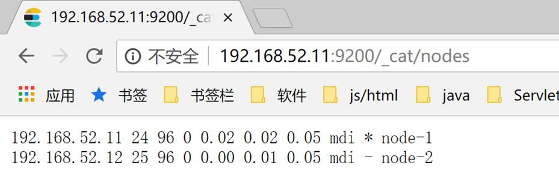
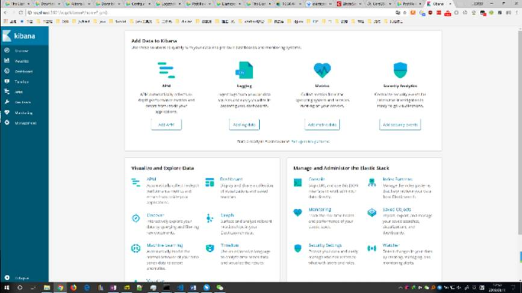
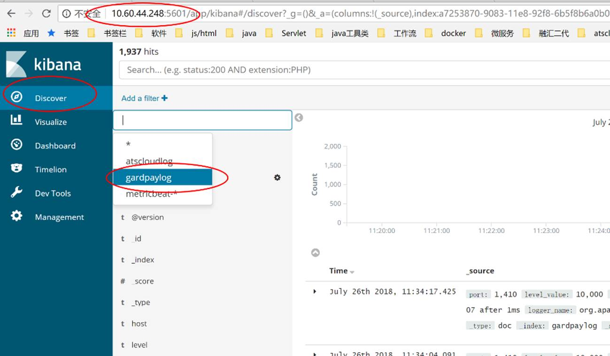

# ELK简要安装文档

## 1.     安装前需注意

主机需要已经有java8环境 。

ELK，即Elasticsearch、Logstash、Kibana三个软件的**版本必须一致**！

> 备注：
>
> java使用oracle java、openjdk都行
>
> 现在公司内大部分用的是`6.4.2`版

## 2.     Elasticsearch安装

### 2.1.    下载安装

下载、解压安装包：

下载地址：<https://www.elastic.co/downloads/elasticsearch>

​       Windows下载[ZIP](https://artifacts.elastic.co/downloads/elasticsearch/elasticsearch-6.4.2.zip)包

​       Linux下载[TAR](https://artifacts.elastic.co/downloads/elasticsearch/elasticsearch-6.4.2.tar.gz)包

这个页面下点击[past releases](https://www.elastic.co/downloads/past-releases)可下载历史版本（该页面只提供最新版）。

【注意】ELK，即Elasticsearch、Logstash、Kibana三个软件的**版本必须一致**！

### 2.2.    运行

进入软件目录下，运行

##### Windows 下：

```cmd
bin\elasticsearch.bat
```

​       或者双击这个bat文件

##### Linux 下：

```bash
bin/elasticsearch
```

Linux后台运行：

```bash
bin/elasticsearch -d
```

> 备注：Linux下让软件在后台运行，即关掉当前的命令行窗口软件也不退出
>
> 也可以：`nohup {{你的命令}} &`

### 2.3.    Linux下运行Elasticsearch的几个坑
参考链接：[elasticsearch启动常见错误](https://www.cnblogs.com/zhi-leaf/p/8484337.html)

#### 2.3.1.  不能用root用户运行

创建elasticsearch组，创建elasticsearch用户，切换到elasticsearch下操作

 ```bash
[root@curly elasticsearch]# groupadd elasticsearch   
[root@curly elasticsearch]# useradd elasticsearch -g elasticsearch -p elasticsearch   
[root@curly elasticsearch]# chown -R elasticsearch:elasticsearch elasticsearch-6.4.2   
[root@curly elasticsearch]# su elasticsearch
[elasticsearch@curly elasticsearch]$ cd elasticsearch-6.4.2  
 ```


#### 2.3.2.  文件操作数量受限

对应报错：

 ```bash
[1]: max file descriptors [4096] for   elasticsearch process is too low, increase to at least [65536]   
 ```

##### 解决：

切换root，编辑文件：

```bash
vi /etc/security/limits.conf
```

加入以下两行：

 ```bash
* hard nofile 655360
* soft nofile 655360
 ```

#### 2.3.3.  内存受限

对应报错：

 ```bash
[2]: max virtual memory areas   vm.max_map_count [65530] is too low, increase to at least [262144]
 ```

切换root，编辑文件：

 ```bash
 vi /etc/sysctl.conf
 ```

加入以下内容：

 ```bash
vm.max_map_count=655360
 ```

切回命令行，执行：

```bash
sysctl -p
```

#### 2.3.4.  Centos6不支持SecComp
对应报错：
```bash
system call filters failed to install; check the logs and fix your configuration or disable system call filters at your own risk
```
原因：
这是在因为Centos6不支持SecComp，而ES5.2.0默认bootstrap.system_call_filter为true进行检测，所以导致检测失败，失败后直接导致ES不能启动。
解决：
在elasticsearch.yml中配置bootstrap.system_call_filter为false，注意要在Memory下面:
```yaml
bootstrap.memory_lock: false
bootstrap.system_call_filter: false
```

### 2.4.    检验

用浏览器访问：<http://[ip]:9200>，其中[ip]是安装Elasticsearch的主机ip。显示像下面的json说明安装运行成功：

```json
{
  "name" : "node-0",
  "cluster_name" : "atscloud",
  "cluster_uuid" : "65agQRXqRHWX-i_G3jQ2Vw",
  "version" : {
    "number" : "6.2.2",
    "build_hash" : "10b1edd",
    "build_date" : "2018-02-16T19:01:30.685723Z",
    "build_snapshot" : false,
    "lucene_version" : "7.2.1",
    "minimum_wire_compatibility_version" : "5.6.0",
    "minimum_index_compatibility_version" : "5.0.0"
  },
  "tagline" : "You Know, for Search"
}
```


### 2.5.    一些配置项（可选）

若无其他状况，Elasticsearch按默认的配置即可完好运行，这是一些其他额外的配置

#### 2.5.1.  改端口

将ip设置为0.0.0.0可应对大部分情况。若外部还是无法访问，设置成本机的ip地址。（设置成本机ip可一步到位，解决问题，推荐）

```yaml
network.host: 0.0.0.0
```

外部访问的端口，默认9200。

```yaml
http.port: 9200
```

#### 2.5.2.  设置文件路径

Elasticsearch的默认存放数据（data）及日志（log）的位置在软件自身的目录下，可修改。比如：

##### Linux下：

```yaml
path.data: /data/es-data
path.logs: /var/log/elasticsearch
```

##### Windows下：

```yaml
path.logs: D:\elasticsearch\log
path.data: D:\elasticsearch\data
```

#### 2.5.3.  集群配置

Elasticsearch集群名字，同一个集群配成同一个名字

 ```yaml
cluster.name: elasticsearch-cluster
 ```

集群节点名，一般为本节点主机名。在一个集群中需唯一。

 ```yaml
node.name: es-node-02
 ```

安装了Elasticsearch的主机的地址

 ```yaml
discovery.zen.ping.unicast.hosts: ["192.168.10.44", "192.168.10.45", "192.168.10.46"]
 ```

集群搭建成功，访问<http://[ip:port]/_cat/nodes>，显示如下：



详细操作可参考：<https://www.cnblogs.com/kevingrace/p/7693422.html>

## 3.     Logstash安装

Logstash不再使用，参考[Filebeat安装](./filebeat_install.md)

## 4.     Kibana安装

### 4.1.    下载安装

下载、解压安装包：

下载地址：<https://www.elastic.co/downloads/logstash>

​       Windows下载[WINDOWS](https://artifacts.elastic.co/downloads/kibana/kibana-6.4.2-windows-x86_64.zip)包

​       Linux下载[LINUX 64-BIT](https://artifacts.elastic.co/downloads/kibana/kibana-6.4.2-linux-x86_64.tar.gz)包

这个页面下点击[past releases](https://www.elastic.co/downloads/past-releases)可下载历史版本（该页面只提供最新版）。

【注意】ELK，即Elasticsearch、Logstash、Kibana三个软件的**版本必须一致**！

### 4.2.    配置

配置文件位置：安装目录/config/kibana.yml

服务绑定端口，默认5601：

```yaml
server.port: 5601
```

将ip设置为`0.0.0.0`可应对大部分情况。若外部还是无法访问，设置成本机的ip地址。

```yaml
server.host: 0.0.0.0
```

配置Elasticsearch地址

```yaml
elasticsearch.url: "http://localhost:9200"
```

### 4.3.    运行

进入软件目录下，运行

Windows 下：

```powershell
bin\kibana.bat
```

​       或者双击这个bat文件

Linux 下：          

```bash
bin/kibana
```

Linux后台运行： 

```bash
nohup bin/kibana >> kibana.out 2>&1 &
```

### 4.4.    验证

在浏览器，打开<http://[ip]:5601>，其中[ip]指kibana部署所在的主机地址，出现以下界面，说明安装成功。




 

## 5.     结束 - ELK简要使用指南

至此，整个ELK服务环境搭建完成。

可以在java程序中把logback的logstash插件指向logstash中input的地址和端口，运行程序，输出log。

在浏览器kibana的界面，选择索引gardpaylog（刚才在logstash中配置的），即可看到日志：



