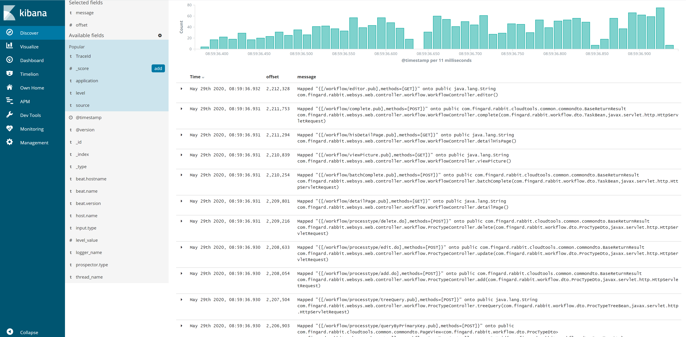

# 日志顺序精确到毫秒级以下
## 参考链接
1. [ELK elasticsearch kibana 日志排序 之 日志二级排序](https://blog.csdn.net/u011181610/article/details/82756049)
    1. [filebeat收集日志在kibana中展示时存在毫秒级排序问题](https://elasticsearch.cn/question/5035)
1. [filebeat自带一个`offset`字段，记录这条日志在文件的位置](https://www.elastic.co/guide/en/beats/filebeat/current/exported-fields-log.html)
    - 可以用这个offset做二级排序
1. [Kibana plugin: Own Home](https://github.com/wtakase/kibana-own-home)
    1. [Kibana plugin: Own Home 6.4.2版](https://github.com/wtakase/kibana-own-home/tree/v6.4.2)

## 实际操作步骤

在kibana的安装文件夹下操作

1. 安装插件，直接从github下载，或先下载，再用本地url
```bash
# 连外网
bin\kibana-plugin.bat install https://github.com/wtakase/kibana-own-home/releases/download/v6.4.2/own_home-6.4.2.zip
# windows本地
bin\kibana-plugin.bat install file:///E:/kibana-ownhome/own_home-6.4.2.zip
# linux本地
bin/kibana-plugin install file:///data/efk/own_home-6.4.2.zip
```
2. 改配置，`config/kibana.yml`里面，原`elasticsearch.url`地址改为`http://localhost:19200`，`own_home.elasticsearch.url`设置成真实的es地址。
```yaml
# Own Home代理的es地址
elasticsearch.url: "http://localhost:19200"
# es真实地址
own_home.elasticsearch.url: "http://10.60.44.58:9200"
```
3. 在文件夹`plugins/own_home/server/proxy`里面，复制替换文件[modify_payload.js【右键另存为】](./modify_payload.js)。
4. 启动kibana，看效果
## 大概原理
使用own_home插件，在kibana的进程起了一个es的代理端口，通过kibana这个代理端口访问es，而在代理里面就能对kibana的请求做些处理，比如说：
在安装默认的时间戳`@timestamp`排序的基础上，排序添加一个叫`offset`的字段。

## 效果图



```
	May 29th 2020, 08:59:36.932	2,212,328	Mapped "{[/workflow/editor.pub],methods=[GET]}" onto public java.lang.String com.xyyweb.rabbit.websys.web.controller.workflow.WorkflowController.editor()
	May 29th 2020, 08:59:36.931	2,211,753	Mapped "{[/workflow/complete.pub],methods=[POST]}" onto public com.xyyweb.rabbit.cloudtools.common.commondto.BaseReturnResult com.xyyweb.rabbit.websys.web.controller.workflow.WorkflowController.complete(com.xyyweb.rabbit.workflow.dto.TaskBean,javax.servlet.http.HttpServletRequest)
	May 29th 2020, 08:59:36.931	2,211,294	Mapped "{[/workflow/hisDetailPage.pub],methods=[GET]}" onto public java.lang.String com.xyyweb.rabbit.websys.web.controller.workflow.WorkflowController.detailHisPage()
	May 29th 2020, 08:59:36.931	2,210,839	Mapped "{[/workflow/viewPicture.pub],methods=[GET]}" onto public java.lang.String com.xyyweb.rabbit.websys.web.controller.workflow.WorkflowController.viewPicture()
	May 29th 2020, 08:59:36.931	2,210,254	Mapped "{[/workflow/batchComplete.pub],methods=[POST]}" onto public com.xyyweb.rabbit.cloudtools.common.commondto.BaseReturnResult com.xyyweb.rabbit.websys.web.controller.workflow.WorkflowController.batchComplete(com.xyyweb.rabbit.workflow.dto.TaskBean,javax.servlet.http.HttpServletRequest)
	May 29th 2020, 08:59:36.931	2,209,801	Mapped "{[/workflow/detailPage.pub],methods=[GET]}" onto public java.lang.String com.xyyweb.rabbit.websys.web.controller.workflow.WorkflowController.detailPage()
	May 29th 2020, 08:59:36.931	2,209,216	Mapped "{[/workflow/processtype/delete.do],methods=[POST]}" onto public com.xyyweb.rabbit.cloudtools.common.commondto.BaseReturnResult com.xyyweb.rabbit.websys.web.controller.workflow.ProcTypeController.delete(com.xyyweb.rabbit.workflow.dto.ProcTypeDto,javax.servlet.http.HttpServletRequest)
	May 29th 2020, 08:59:36.930	2,208,633	Mapped "{[/workflow/processtype/edit.do],methods=[POST]}" onto public com.xyyweb.rabbit.cloudtools.common.commondto.BaseReturnResult com.xyyweb.rabbit.websys.web.controller.workflow.ProcTypeController.update(com.xyyweb.rabbit.workflow.dto.ProcTypeDto,javax.servlet.http.HttpServletRequest)
	May 29th 2020, 08:59:36.930	2,208,054	Mapped "{[/workflow/processtype/add.do],methods=[POST]}" onto public com.xyyweb.rabbit.cloudtools.common.commondto.BaseReturnResult com.xyyweb.rabbit.websys.web.controller.workflow.ProcTypeController.add(com.xyyweb.rabbit.workflow.dto.ProcTypeDto,javax.servlet.http.HttpServletRequest)
	May 29th 2020, 08:59:36.930	2,207,504	Mapped "{[/workflow/processtype/treeQuery.pub],methods=[POST]}" onto public java.lang.String com.xyyweb.rabbit.websys.web.controller.workflow.ProcTypeController.treeQuery(com.xyyweb.rabbit.workflow.dto.ProcTypeTreeBean,javax.servlet.http.HttpServletRequest)
	May 29th 2020, 08:59:36.930	2,206,903	Mapped "{[/workflow/processtype/queryByPrimaryKey.pub],methods=[POST]}" onto public com.xyyweb.rabbit.cloudtools.common.commondto.PageView<com.xyyweb.rabbit.workflow.dto.ProcTypeDto> com.xyyweb.rabbit.websys.web.controller.workflow.ProcTypeController.queryByUrid(com.xyyweb.rabbit.workflow.dto.ProcTypeDto)
	May 29th 2020, 08:59:36.930	2,206,442	Mapped "{[/workflow/processtype/editPage.pub],methods=[GET]}" onto public java.lang.String com.xyyweb.rabbit.websys.web.controller.workflow.ProcTypeController.editPage()
	May 29th 2020, 08:59:36.929	2,205,825	Mapped "{[/workflow/instance/query.do],methods=[POST]}" onto public com.xyyweb.rabbit.cloudtools.common.commondto.PageView<com.xyyweb.rabbit.workflow.dto.ProcInstDto> com.xyyweb.rabbit.websys.web.controller.workflow.ProcInstController.query(com.xyyweb.rabbit.workflow.dto.ProcInstDto,javax.servlet.http.HttpServletRequest)
	May 29th 2020, 08:59:36.929	2,205,236	Mapped "{[/workflow/instance/resume.do],methods=[POST]}" onto public com.xyyweb.rabbit.cloudtools.common.commondto.BaseReturnResult com.xyyweb.rabbit.websys.web.controller.workflow.ProcInstController.resume(com.xyyweb.rabbit.workflow.dto.ProcInstOperateDto,javax.servlet.http.HttpServletRequest)
	May 29th 2020, 08:59:36.929	2,204,645	Mapped "{[/workflow/instance/suspend.do],methods=[POST]}" onto public com.xyyweb.rabbit.cloudtools.common.commondto.BaseReturnResult com.xyyweb.rabbit.websys.web.controller.workflow.ProcInstController.suspend(com.xyyweb.rabbit.workflow.dto.ProcInstOperateDto,javax.servlet.http.HttpServletRequest)
	May 29th 2020, 08:59:36.929	2,204,050	Mapped "{[/workflow/instance/terminate.do],methods=[POST]}" onto public com.xyyweb.rabbit.cloudtools.common.commondto.BaseReturnResult com.xyyweb.rabbit.websys.web.controller.workflow.ProcInstController.terminate(com.xyyweb.rabbit.workflow.dto.ProcInstOperateDto,javax.servlet.http.HttpServletRequest)
	May 29th 2020, 08:59:36.929	2,203,578	Mapped "{[/workflow/instance/diagramViewPage.pub],methods=[GET]}" onto public java.lang.String com.xyyweb.rabbit.websys.web.controller.workflow.ProcInstController.diagramViewPage()
	May 29th 2020, 08:59:36.929	2,203,110	Mapped "{[/workflow/instance/traceViewPage.pub],methods=[GET]}" onto public java.lang.String com.xyyweb.rabbit.websys.web.controller.workflow.ProcInstController.traceViewPage()
	May 29th 2020, 08:59:36.929	2,202,639	Mapped "{[/workflow/instance/operateViewPage.pub],methods=[GET]}" onto public java.lang.String com.xyyweb.rabbit.websys.web.controller.workflow.ProcInstController.statusViewPage()
	May 29th 2020, 08:59:36.929	2,202,179	Mapped "{[/workflow/instance/indexPage.pub],methods=[GET]}" onto public java.lang.String com.xyyweb.rabbit.websys.web.controller.workflow.ProcInstController.indexPage()
	May 29th 2020, 08:59:36.929	2,201,715	Mapped "{[/workflow/instance/editPage.pub],methods=[GET]}" onto public java.lang.String com.xyyweb.rabbit.websys.web.controller.workflow.ProcInstController.statusEditPage()
	May 29th 2020, 08:59:36.929	2,201,113	Mapped "{[/workflow/instance/getProcessTrace.pub],methods=[GET]}" onto public java.util.List<java.util.Map<java.lang.String, java.lang.Object>> com.xyyweb.rabbit.websys.web.controller.workflow.ProcInstController.getProcessTrace(com.xyyweb.rabbit.workflow.dto.ProcInstDto,javax.servlet.http.HttpServletRequest)
	May 29th 2020, 08:59:36.928	2,200,579	Mapped "{[/workflow/instance/viewDiagram.pub],methods=[GET]}" onto public void com.xyyweb.rabbit.websys.web.controller.workflow.ProcInstController.viewDiagram(com.xyyweb.rabbit.workflow.dto.ProcInstDto,javax.servlet.http.HttpServletResponse)
	May 29th 2020, 08:59:36.928	2,199,944	Mapped "{[/workflow/instance/viewChange.pub],methods=[POST]}" onto public com.xyyweb.rabbit.cloudtools.common.commondto.PageView<com.xyyweb.rabbit.workflow.dto.ProcInstOperateDto> com.xyyweb.rabbit.websys.web.controller.workflow.ProcInstController.viewChange(com.xyyweb.rabbit.workflow.dto.ProcInstDto,javax.servlet.http.HttpServletRequest)
	May 29th 2020, 08:59:36.928	2,199,319	Mapped "{[/workflow/instance/viewTrace.pub],methods=[POST]}" onto public com.xyyweb.rabbit.cloudtools.common.commondto.PageView<com.xyyweb.rabbit.workflow.dto.ActInstDto> com.xyyweb.rabbit.websys.web.controller.workflow.ProcInstController.viewTrace(com.xyyweb.rabbit.workflow.dto.ProcInstDto,javax.servlet.http.HttpServletRequest)
	May 29th 2020, 08:59:36.928	2,198,857	Mapped "{[/workflow/instance/detailPage.pub],methods=[GET]}" onto public java.lang.String com.xyyweb.rabbit.websys.web.controller.workflow.ProcInstController.detailPage()
	May 29th 2020, 08:59:36.928	2,198,400	Mapped "{[/workflow/instance/listPage.do],methods=[GET]}" onto public java.lang.String com.xyyweb.rabbit.websys.web.controller.workflow.ProcInstController.listPage()
	May 29th 2020, 08:59:36.928	2,197,776	Mapped "{[/workflow/instance/pubQuery.pub],methods=[POST]}" onto public com.xyyweb.rabbit.cloudtools.common.commondto.PageView<com.xyyweb.rabbit.workflow.dto.ProcInstDto> com.xyyweb.rabbit.websys.web.controller.workflow.ProcInstController.pubQuery(javax.servlet.http.HttpServletRequest,com.xyyweb.rabbit.workflow.dto.ProcInstDto)
	May 29th 2020, 08:59:36.927	2,197,148	Mapped "{[/workflow/processdesign/query.do],methods=[POST]}" onto public com.xyyweb.rabbit.cloudtools.common.commondto.PageView<com.xyyweb.rabbit.workflow.dto.ProcDesignDto> com.xyyweb.rabbit.websys.web.controller.workflow.ProcDesignController.query(javax.servlet.http.HttpServletRequest,com.xyyweb.rabbit.workflow.dto.ProcDesignDto)
	May 29th 2020, 08:59:36.927	2,196,560	Mapped "{[/workflow/processdesign/save.pub],methods=[POST]}" onto public com.xyyweb.rabbit.cloudtools.common.commondto.BaseReturnResult com.xyyweb.rabbit.websys.web.controller.workflow.ProcDesignController.save(javax.servlet.http.HttpServletRequest,com.xyyweb.rabbit.workflow.dto.ProcDesignDto)
	May 29th 2020, 08:59:36.927	2,195,969	Mapped "{[/workflow/processdesign/delete.do],methods=[POST]}" onto public com.xyyweb.rabbit.cloudtools.common.commondto.BaseReturnResult com.xyyweb.rabbit.websys.web.controller.workflow.ProcDesignController.delete(com.xyyweb.rabbit.workflow.dto.ProcDesignDto,javax.servlet.http.HttpServletRequest)
	May 29th 2020, 08:59:36.926	2,195,380	Mapped "{[/workflow/processdesign/edit.do],methods=[POST]}" onto public com.xyyweb.rabbit.cloudtools.common.commondto.BaseReturnResult com.xyyweb.rabbit.websys.web.controller.workflow.ProcDesignController.update(javax.servlet.http.HttpServletRequest,com.xyyweb.rabbit.workflow.dto.ProcDesignDto)
	May 29th 2020, 08:59:36.926	2,194,795	Mapped "{[/workflow/processdesign/add.do],methods=[POST]}" onto public com.xyyweb.rabbit.cloudtools.common.commondto.BaseReturnResult com.xyyweb.rabbit.websys.web.controller.workflow.ProcDesignController.add(javax.servlet.http.HttpServletRequest,com.xyyweb.rabbit.workflow.dto.ProcDesignDto)
	May 29th 2020, 08:59:36.926	2,194,223	Mapped "{[/workflow/processdesign/export.do],methods=[GET]}" onto public byte[] com.xyyweb.rabbit.websys.web.controller.workflow.ProcDesignController.export(javax.servlet.http.HttpServletRequest,javax.servlet.http.HttpServletResponse,com.xyyweb.rabbit.workflow.dto.ProcDesignDto)
	May 29th 2020, 08:59:36.926	2,193,630	Mapped "{[/workflow/processdesign/publish.do],methods=[POST]}" onto public com.xyyweb.rabbit.cloudtools.common.commondto.BaseReturnResult com.xyyweb.rabbit.websys.web.controller.workflow.ProcDesignController.publish(javax.servlet.http.HttpServletRequest,com.xyyweb.rabbit.workflow.dto.ProcDesignDto)
	May 29th 2020, 08:59:36.926	2,192,962	Mapped "{[/workflow/processdesign/import.do],methods=[POST],produces=[application/json;charset=UTF-8 || text/plain;charset=UTF-8]}" onto public com.xyyweb.rabbit.cloudtools.common.commondto.BaseReturnResult com.xyyweb.rabbit.websys.web.controller.workflow.ProcDesignController.processImport(javax.servlet.http.HttpServletRequest,com.xyyweb.rabbit.workflow.dto.ProcDesignDto)
	May 29th 2020, 08:59:36.926	2,192,459	Mapped "{[/workflow/processdesign/getStencilSet.pub],produces=[application/json;charset=UTF-8]}" onto public java.lang.String com.xyyweb.rabbit.websys.web.controller.workflow.ProcDesignController.getStencilSet()
	May 29th 2020, 08:59:36.926	2,191,942	Mapped "{[/workflow/processdesign/getEditorJson.pub],methods=[GET]}" onto public java.util.Map com.xyyweb.rabbit.websys.web.controller.workflow.ProcDesignController.getEditorJson(com.xyyweb.rabbit.workflow.dto.ProcDesignDto)
	May 29th 2020, 08:59:36.926	2,191,473	Mapped "{[/workflow/processdesign/importPage.pub],methods=[GET]}" onto public java.lang.String com.xyyweb.rabbit.websys.web.controller.workflow.ProcDesignController.importPage()
	May 29th 2020, 08:59:36.926	2,191,004	Mapped "{[/workflow/processdesign/designPage.pub],methods=[GET]}" onto public java.lang.String com.xyyweb.rabbit.websys.web.controller.workflow.ProcDesignController.designPage()
	May 29th 2020, 08:59:36.926	2,190,535	Mapped "{[/workflow/processdesign/detailPage.pub],methods=[GET]}" onto public java.lang.String com.xyyweb.rabbit.websys.web.controller.workflow.ProcDesignController.detailPage()
	May 29th 2020, 08:59:36.925	2,190,070	Mapped "{[/workflow/processdesign/editPage.pub],methods=[GET]}" onto public java.lang.String com.xyyweb.rabbit.websys.web.controller.workflow.ProcDesignController.editPage()
	May 29th 2020, 08:59:36.925	2,189,606	Mapped "{[/workflow/processdesign/listPage.do],methods=[GET]}" onto public java.lang.String com.xyyweb.rabbit.websys.web.controller.workflow.ProcDesignController.listPage()
	May 29th 2020, 08:59:36.925	2,188,971	Mapped "{[/workflow/processdesign/pubQuery.pub],methods=[POST]}" onto public com.xyyweb.rabbit.cloudtools.common.commondto.PageView<com.xyyweb.rabbit.workflow.dto.ProcDesignDto> com.xyyweb.rabbit.websys.web.controller.workflow.ProcDesignController.pubQuery(javax.servlet.http.HttpServletRequest,com.xyyweb.rabbit.workflow.dto.ProcDesignDto)
	May 29th 2020, 08:59:36.924	2,188,427	Mapped "{[/workflow/formtype/delete.do],methods=[POST]}" onto public com.xyyweb.rabbit.cloudtools.common.commondto.BaseReturnResult com.xyyweb.rabbit.websys.web.controller.workflow.FormTypeController.delete(com.xyyweb.rabbit.workflow.dto.FormTypeDto)
	May 29th 2020, 08:59:36.924	2,187,885	Mapped "{[/workflow/formtype/edit.do],methods=[POST]}" onto public com.xyyweb.rabbit.cloudtools.common.commondto.BaseReturnResult com.xyyweb.rabbit.websys.web.controller.workflow.FormTypeController.update(com.xyyweb.rabbit.workflow.dto.FormTypeDto)
	May 29th 2020, 08:59:36.924	2,187,347	Mapped "{[/workflow/formtype/add.do],methods=[POST]}" onto public com.xyyweb.rabbit.cloudtools.common.commondto.BaseReturnResult com.xyyweb.rabbit.websys.web.controller.workflow.FormTypeController.add(com.xyyweb.rabbit.workflow.dto.FormTypeDto)
	May 29th 2020, 08:59:36.924	2,186,886	Mapped "{[/workflow/formtype/treeQuery.pub],methods=[POST]}" onto public java.lang.String com.xyyweb.rabbit.websys.web.controller.workflow.FormTypeController.treeQuery()
	May 29th 2020, 08:59:36.923	2,186,294	Mapped "{[/workflow/formtype/queryByUuid.pub],methods=[POST]}" onto public com.xyyweb.rabbit.cloudtools.common.commondto.PageView<com.xyyweb.rabbit.workflow.dto.FormTypeDto> com.xyyweb.rabbit.websys.web.controller.workflow.FormTypeController.queryByUrid(com.xyyweb.rabbit.workflow.dto.FormTypeDto)
	May 29th 2020, 08:59:36.923	2,185,836	Mapped "{[/workflow/formtype/editPage.pub],methods=[GET]}" onto public java.lang.String com.xyyweb.rabbit.websys.web.controller.workflow.FormTypeController.editPage()
	May 29th 2020, 08:59:36.923	2,185,270	Mapped "{[/workflow/formreg/query.do],methods=[POST]}" onto public com.xyyweb.rabbit.cloudtools.common.commondto.PageView<com.xyyweb.rabbit.workflow.dto.FormDto> com.xyyweb.rabbit.websys.web.controller.workflow.FormController.query(com.xyyweb.rabbit.workflow.dto.FormDto)
	May 29th 2020, 08:59:36.923	2,184,737	Mapped "{[/workflow/formreg/edit.do],methods=[POST]}" onto public com.xyyweb.rabbit.cloudtools.common.commondto.BaseReturnResult com.xyyweb.rabbit.websys.web.controller.workflow.FormController.update(com.xyyweb.rabbit.workflow.dto.FormDto)
	May 29th 2020, 08:59:36.923	2,184,192	Mapped "{[/workflow/formreg/add.do],methods=[POST]}" onto public com.xyyweb.rabbit.cloudtools.common.commondto.BaseReturnResult<java.lang.Void> com.xyyweb.rabbit.websys.web.controller.workflow.FormController.add(com.xyyweb.rabbit.workflow.dto.FormDto)
	May 29th 2020, 08:59:36.922	2,183,735	Mapped "{[/workflow/formreg/detailPage.pub],methods=[GET]}" onto public java.lang.String com.xyyweb.rabbit.websys.web.controller.workflow.FormController.detailPage()
	May 29th 2020, 08:59:36.922	2,183,282	Mapped "{[/workflow/formreg/editPage.pub],methods=[GET]}" onto public java.lang.String com.xyyweb.rabbit.websys.web.controller.workflow.FormController.editPage()
	May 29th 2020, 08:59:36.922	2,182,709	Mapped "{[/workflow/formreg/pubQuery.pub],methods=[POST]}" onto public com.xyyweb.rabbit.cloudtools.common.commondto.PageView<com.xyyweb.rabbit.workflow.dto.FormDto> com.xyyweb.rabbit.websys.web.controller.workflow.FormController.pubQuery(com.xyyweb.rabbit.workflow.dto.FormDto)
	May 29th 2020, 08:59:36.922	2,182,261	Mapped "{[/workflow/formreg/listPage.do],methods=[GET]}" onto public java.lang.String com.xyyweb.rabbit.websys.web.controller.workflow.FormController.page()
```
