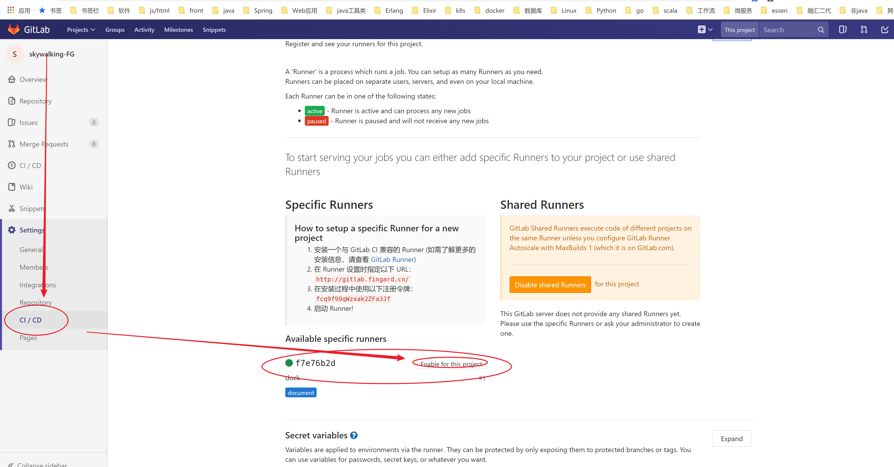
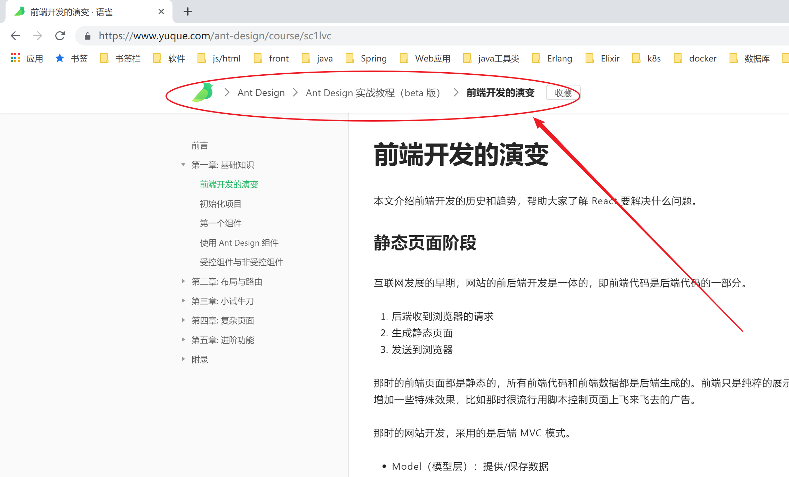

# VuePress使用faq

## 链接

- [VuePress官网](https://vuepress.vuejs.org/zh/)
- [与Gitlab整合 GitLab Pages and GitLab CI](https://vuepress.vuejs.org/zh/guide/deploy.html#gitlab-pages-and-gitlab-ci)

## 问题

### 快速从已有文档复制
如果是从其他地方如`word`、`网页`拷过来的话，推荐使用[Typora](https://www.typora.io/)，直接ctrl c/v就能转成md格式，然后微调就好。

注意设置下图片路径为相对路径，在 文件 -> 偏好设置 -> 图像 -> 下拉框选择 复制图像到./${filename}.assert -> 下面4个全勾上


### gitlab的构建一直处于pending

- ci di开启runner

  

- 更改`package.json`，在`devDependencies`**里面加入引用`webpack-dev-middleware`

  ```json{10}
  {
    "name": "docs",
    "version": "1.0.0",
    "scripts": {
      "docs:dev": "vuepress dev docs",
      "docs:build": "vuepress build docs"
    },
    "devDependencies": {
      "vuepress": "^0.14.11",
      "webpack-dev-middleware": "^3.6.0"
    },
    "repository": {
      "type": "git",
      "url": "http://gitlab.fingard.cn/devops/docs.git"
    }
  }
  ```

### 图片出不来

图片的地址必须加`./`，否则图片出不来，比如：

```markdown

这样写不行的：

```

### 普通文件找不到

`Fix_VPN_Error_809_Allow_IPsec_Reboot_Required.reg`，像这样的文件放到正常目录，vue不会拷贝，放到public下对应的目录里面即可。

### 图片的后缀名必须小写

`./images/activiti.async.example.async.PNG`这样的就不行

### 图片名不能为中文
图片名不能为中文，否则编译报错

## 希望有的功能

- 面包屑导航

  

- 图片可放大
  
  [官方在1.x版本有实现](https://v1.vuepress.vuejs.org/zh/plugin/official/plugin-medium-zoom.html)

