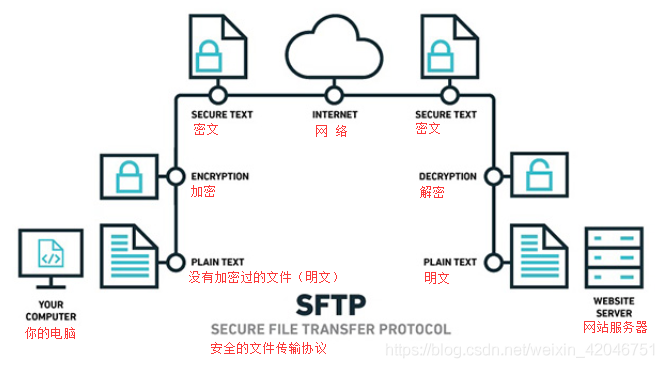
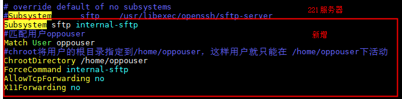

## sftp
### 什么是SFTP ？  
SFTP（SSH File Transfer Protocol，也称 Secret File Transfer Protocol）  
是一种安全的文件传输协议，一种通过网络传输文件的安全方法；它确保使用私有和安全的数据流来安全地传输数据。  
SFTP传输文件的过程，如下图：

SFTP要求客户端用户必须由服务器进行身份验证，  
并且数据传输必须通过安全通道（SSH）进行，即不传输明文密码或文件数据。  
它允许对远程文件执行各种操作，有点像远程文件系统协议。  
SFTP允许从暂停传输，目录列表和远程文件删除等操作中恢复。  
### SFTP和FTP之间的区别 ？
SFTP 和 FTP非常相似，都支持批量传输（一次传输多个文件）， 文件夹/目录导航，文件移动，文件夹/目录创建，文件删除等。    
但还是存在着差异：  
1、安全通道  
FTP 不提供任何安全通道来在主机之间传输文件； 而SFTP协议提供了一个安全通道，用于在网络上的主机之间传输文件。  
2、使用的协议  
FTP使用 TCP/IP协议。而SFTP是SSH协议的一部分，它是一种远程登录信息。  
3、链接方式  
FTP使用TCP端口21上的控制连接建立连接。 而SFTP是在客户端和服务器之间通过SSH协议（TCP端口22）建立的安全连接来传输文件。  
4、安全性  
FTP密码和数据以纯文本格式发送，大多数情况下是不加密的，安全性不高。而SFTP会在发送之前加密数据，二进制的形式传递，是无法 "按原样" 阅读的，安全性较高。  

### sftp部署
默认ssh自带sftp，但搭建sftp会做一些限制
1. [Linux 创建sftp用户并限制目录权限搭建](https://blog.csdn.net/Tastill/article/details/78864179)    
2. [ssh和sftp服务分离 复制一个ssh服务修改自定义个sftp服务](https://blog.csdn.net/hahawangzi520/article/details/128204467)
3. 创建用户，通过SFTP只允许访问指定目录
```shell
#创建用户
useradd oppouser
passwd oppouser
账户密码：oppouser/oppo@!321#

#删除用户
注：确认/home/oppouser目录所属于oppouser，才能删除
userdel -r oppouser

#查看所有用户
vim /etc/passwd

#备份
cd /etc/ssh/
cp sshd_config sshd_config.back

#修改配置文件

vim /etc/ssh/sshd_config

注释
#Subsystem      sftp    /usr/libexec/openssh/sftp-server
Subsystem sftp internal-sftp
#匹配用户oppouser
Match User oppouser
#chroot将用户的根目录指定到/home/oppouser，这样用户就只能在 /home/oppouser下活动
ChrootDirectory /home/oppouser
ForceCommand internal-sftp
AllowTcpForwarding no
X11Forwarding no
```

```shell
#重启ssh
service sshd restart

#用户登录后显示一片空白，执行
chown root:root /home/oppouser
chmod 755 /home/oppouser
```


