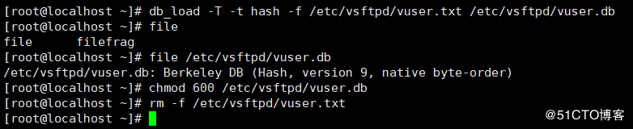
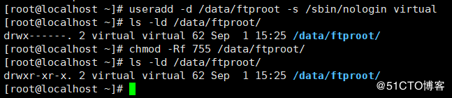
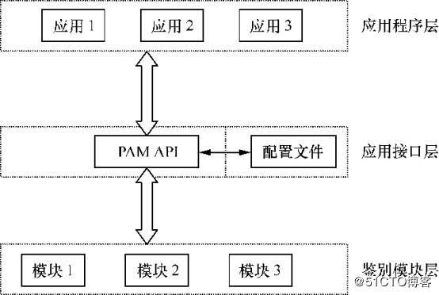
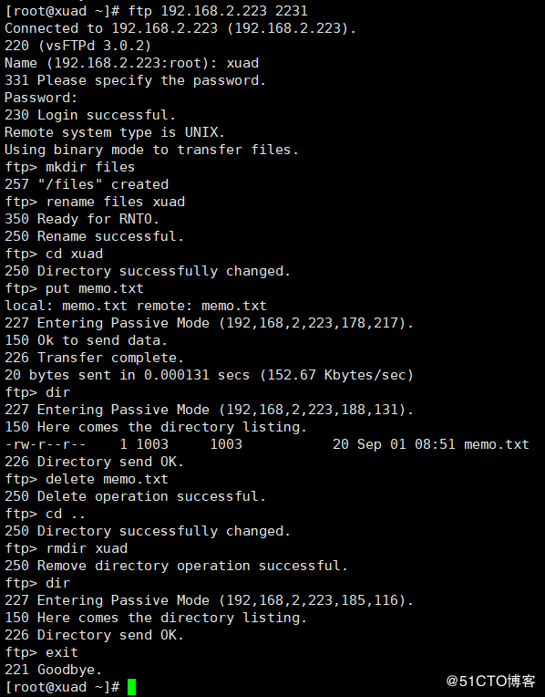
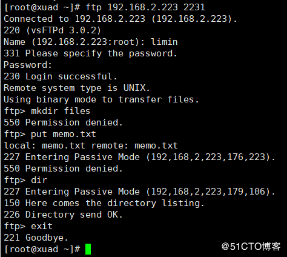

# vsftpd安装文档

> 参考链接：[Centos 7使用vsftpd搭建FTP服务器](https://blog.51cto.com/andyxu/2168875)

这里只提供使用虚拟用户的安装方式，与linux用户管理解耦，避免莫名其妙的失败。

这里大部分命令、配置文件可以直接复制粘贴，至于注意更改以下几个地方即可：

1. listen_port，即端口号
2. ftp的路径，即新建的用户`virtual`的home文件夹
3. ftp访问的用户名、密码

## 一、全局操作

1. 安装vsftpd服务
   `yum -y install vsftpd`

2. 配置firewalld防火墙开放2231和45000-49000端口

   > 关了防火墙的忽略这步

```bash
firewall-cmd --permanent --add-port=2231/tcp
firewall-cmd --permanent --add-port=45000-49000/tcp
firewall-cmd --reload
```

3. 配置selinux允许FTP服务

   > 关了selinux的忽略这步

   *注：没有selinux相关命令的话，需要安装policycoreutils-python包*

```bash
yum -y install policycoreutils-python.x86_64
setsebool -P ftpd_full_access=on
```

## 二、虚拟用户模式

**1、创建用于FTP认证的用户数据库文件**
`vim /etc/vsftpd/vuser.txt`
*注：第一行用户名，第二行密码，依此类推*

```
xuad
123456
limin
123456
```

明文信息不安全，需要使用db_load命令用哈希（hash）算法将明文信息转换成数据文件，然后将明文信息文件删除。

```bash
db_load -T -t hash -f /etc/vsftpd/vuser.txt /etc/vsftpd/vuser.db
chmod 600 /etc/vsftpd/vuser.db
rm -f /etc/vsftpd/vuser.txt
```


**2、创建虚拟用户映射的系统本地用户和FTP根目录**

```bash
useradd -d /data/ftproot -s /sbin/nologin virtual
chmod -Rf 755 /data/ftproot/
```


**3、建立用于支持虚拟用户的PAM文件**
PAM（可插拔认证模块）是一种认证机制，通过一些动态链接库和统一的API把系统提供的服务与认证方式分开，使得系统管理员可以根据需求灵活调整服务程序的不同认证方式。PAM采用了分层设计（应用程序层、应用接口层、鉴别模块层）的思想，其结构如下图所示。

新建一个用于虚拟用户认证的PAM文件vsftpd.vu，其中PAM文件内的“db=”参数为使用db_load命令生成的账户密码数据文件的路径，但不用写数据文件的后缀。
`vim /etc/pam.d/vsftpd.vu`

```
auth     required     pam_userdb.so  db=/etc/vsftpd/vuser
account  required     pam_userdb.so  db=/etc/vsftpd/vuser
```

**4、为两个虚拟用户设置不同的权限，xuad拥有所有权限，而limin只有读取权限。**

```bash
mkdir /etc/vsftpd/vusers_dir
touch /etc/vsftpd/vusers_dir/limin
vim /etc/vsftpd/vusers_dir/xuad
anon_upload_enable=YES
anon_mkdir_write_enable=YES
anon_other_write_enable=YES
```

**5、修改配置文件，删除之前的匿名模式配置内容，带注释的是需要修改和新增的配置**
`vim /etc/vsftpd/vsftpd.conf`

```bash
anonymous_enable=NO
anon_umask=022
local_enable=YES
guest_enable=YES   #开启虚拟用户模式
guest_username=virtual   #指定虚拟用户对应的系统用户
allow_writeable_chroot=YES   #允许对FTP根目录执行写入操作
write_enable=YES
local_umask=022
local_root=/data/ftproot
dirmessage_enable=YES
xferlog_enable=YES
connect_from_port_20=YES
xferlog_std_format=YES
listen_port=21
listen=YES
listen_ipv6=NO
pam_service_name=vsftpd.vu   #指定PAM文件
userlist_enable=YES
tcp_wrappers=YES
user_config_dir=/etc/vsftpd/vusers_dir   #指定虚拟用户配置文件目录
pasv_min_port=45000
pasv_max_port=49000
```

**6、重启vsftpd服务**
`systemctl restart vsftpd`
**7、测试**


