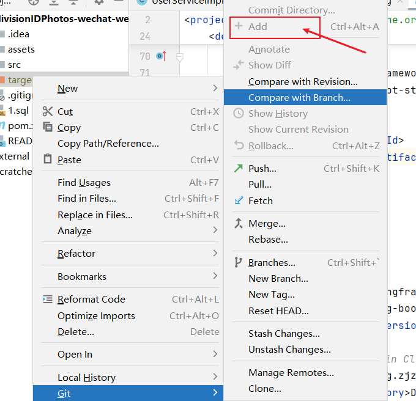

# IDEA

1. idea右边的数据库栏，可以直接绘制数据库表关系ER图。

## 插件开发
- [官方文档 IntelliJ Platform SDK DevGuide - Plugins](https://www.jetbrains.org/intellij/sdk/docs/basics/basics.html)
- [IDEA 插件开发入门教程](https://www.jianshu.com/p/91d0bdbbe79f)

## faq

[解决idea中【Ctrl+/】注释不自动缩进问题](https://blog.csdn.net/VariatioZbw/article/details/105626147)

## JRebel
代码热加载。JRebel是一款JVM插件，它使得Java代码修改后不用重启系统，立即生效。

idea自带的代码监视重启体验远比不上这个。

java、groovy下有效，其他未测试。
1. [使用教程](https://www.cnblogs.com/flyrock/archive/2019/09/23/11574617.html)

## .gitignore  
让本地文件无法添加 git里面
/folderName是忽略根路径folderName目录，folderName/是忽略所有目录
  
[开发必备 .gitignore 详解](https://blog.csdn.net/nyist_zxp/article/details/119887324)  