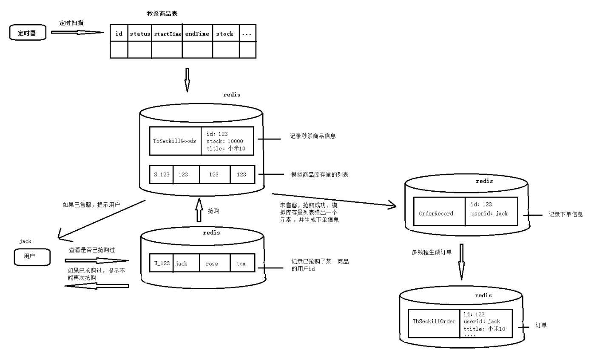

## 秒杀

### 需求分析

所谓“秒杀”，就是网络卖家发布一些超低价格的商品，所有买家在同一时间网上抢购的一种销售方式。通俗一点讲就是网络商家为促销等目的组织的网上限时抢购活动。
由于商品价格低廉，往往一上架就被抢购一空，有时只用一秒钟。秒杀商品通常有两种限制：库存限制、时间限制。  
需求：  
1. 商家（pyg_shop_web）提交秒杀商品申请，录入秒杀商品数据，主要包括：商品标题、原价、秒杀价、商品图片、介绍等信息
2. 运营商（pyg_manager_web）审核秒杀申请
3. 秒杀频道首页（pyg_seckill_web）列出秒杀商品（进行中的）点击秒杀商品图片跳转到秒杀商品详细页
4. 商品详细页（pyg_seckill_web）显示秒杀商品信息，点击立即抢购实现秒杀下单，下单时扣减库存。当库存为0或不在活动期范围内时无法秒杀
5. 秒杀下单成功（pyg_seckill_web/pyg_seckill_service），直接跳转到支付页面（微信扫码），支付成功，跳转到成功页，填写收货地址、电话、收件人等信息，完成订单
6. 当用户秒杀下单5分钟内未支付，取消预订单，调用微信支付的关闭订单接口，恢复库存。

  
从这个图可以看到  
1.秒杀首页列表展示   从redis获取的  
2.秒杀信息详情      从redis获取  
3.秒杀下单后      会更新redis和mysql  
4.会有定时任务每天 redis更新到mysql中

###秒杀商品导入缓存
秒杀查询压力是非常大的，我们可以在秒杀之前把秒杀商品存入到Redis缓存中，页面每次列表查询的时候直接从Redis缓存中取，
这样会大大减轻MySQL数据库的压力。我们可以创建一个定时任务工程，每天秒杀的前一天运行并加载MySQL数据库数据到Redis缓存　　　　　　　

Tb_seckill_goods 秒杀商品表
Tb_seckill_order 秒杀订单表

这里使用Quartz做定时任务
```java
 @Scheduled(cron = "0/30 * * * * ?")
    public void importToRedis(){
        //1.查询合法的秒杀商品数据：状态为有效（status=1），库存量>0（stockCount> 0），秒杀开始时间<=当前时间<秒杀结束时间
        TbSeckillGoodsExample example = new TbSeckillGoodsExample();
        TbSeckillGoodsExample.Criteria criteria = example.createCriteria();
        Date date = new Date();
        criteria.andStatusEqualTo("1")
                .andStockCountGreaterThan(0)
                .andStartTimeLessThanOrEqualTo(date)
                .andEndTimeGreaterThan(date);
        List<TbSeckillGoods> tbSeckillGoods = seckillGoodsMapper.selectByExample(example);
        //2.将数据存入redis
        for(TbSeckillGoods good : tbSeckillGoods){
            
            redisTemplate.boundHashOps(TbSeckillGoods.class.getSimpleName()).put(good.getId(), good);
            
            //为每一个商品创建一个队列，队列中放和库存量相同数据量的商品id
            createQueue(good.getId(), good.getStockCount());

        }
    }

    private void createQueue(Long id, Integer stockCount){
        if(stockCount > 0){
            for(int i=0; i<stockCount; i++){
                redisTemplate.boundListOps(SystemConst.CONST_SECKILLGOODS_ID_PREFIX+id).leftPush(id);
            }
        }
    }

```
redis展示： 
hash  
商品1   商品1对象[1库存]  
商品2   商品2对象[2库存]  
商品3   商品3对象[3库存]

good商品1  list  
商品1

good商品2  list  
商品2  
商品2

good商品3  list
商品3  
商品3  
商品3


### 秒杀下单
商品详细页点击立即抢购实现秒杀下单，下单时扣减库存。当库存为0或不在活动期范围内时无法秒杀

秒杀下单业务流程：  
1. 从redis服务器中获取入库的秒杀商品
2. 判断商品是否存在，或是是商品库存是否小于等于0
3. 如果秒杀商品存在，创建秒杀订单
4. 把新增订单存储在redis服务器中
5. 把存储在redis中入库的商品库存减一
6. 判断库存是否小于0,卖完需要同步数据库
7. 否则同步redis购物车数量

 

```shell
// 0. 从用户的set集合中判断用户是否已下单
Boolean member = redisTemplate.boundSetOps(SystemConst.CONST_USER_ID_PREFIX+id).isMember(userId);
if(member){
  return new Result(false,"对不起，您正在排队等待支付，请尽快支付！");
}

// 1. 从队列中获取秒杀商品id
id=(Long)redisTemplate.boundListOps(SystemConst.CONST_SECKILLGOODS_ID_PREFIX+id).rightPop();

//2. 判断商品是否存在
if(null==id){
     //3. 商品不存在，或库存<=0,返回失败,提示已售罄
     return new Result(false,"对不起，商品已售罄，请您选择其他商品！");
}
// 4. 将用户放入用户集合
redisTemplate.boundListOps(SystemConst.CONST_USER_ID_PREFIX+id).add(userId);

// 5. 创建OrderRecord对象记录用户下单信息：用户id,商品id,放到 OrderRecord 队列中
OrderRecord  orderRecord =  new OrderRecord(id,userId);
redisTemplate.boudListOps(OrderRecord.class.getSimpleName()).leftPush(orderRecord);
// 6.通过线程池启动线程处理OrderRecord中的数据，返回成功
executer.execute(orderCreateThread);
    return new Result(true, "秒杀成功，请您尽快支付！");
}
```  
user1用户 set    
用户1

order1订单 list  
order1


```shell
public void run() {
        // 获取某商品1 一件
        OrderRecord orderRecord = (OrderRecord) redisTemplate.boundListOps(OrderRecord.class.getSimpleName()).rightPop();
        }
        if(null != orderRecord){
        // 获取 某商品
            TbSeckillGoods seckillGoods = (TbSeckillGoods) redisTemplate
                    .boundHashOps(TbSeckillGoods.class.getSimpleName()).get(orderRecord.getId());
                    
                    
                    
            //4.生成秒杀订单，将订单保存到redis缓存
            TbSeckillOrder seckillOrder = new TbSeckillOrder();
            seckillOrder.setUserId(orderRecord.getUserId());
            seckillOrder.setSellerId(seckillGoods.getSellerId());
            seckillOrder.setSeckillId(idWorker.nextId());
            seckillOrder.setMoney(seckillGoods.getCostPrice());
            seckillOrder.setCreateTime(new Date());
            seckillOrder.setStatus("0");//0-未支付
            
            // 生成订单存入以map形式存入 
            redisTemplate.boundHashOps(TbSeckillOrder.class.getSimpleName()).put(orderRecord.getUserId(), seckillOrder);
            
            
            synchronized (OrderCreateThread.class){
                

}                seckillGoods = (TbSeckillGoods) redisTemplate
                        .boundHashOps(TbSeckillGoods.class.getSimpleName()).get(orderRecord.getId());
                //5.秒杀商品库存量-1
                seckillGoods.setStockCount(seckillGoods.getStockCount() - 1);
                //6.判断库存量是否<=0
                if(seckillGoods.getStockCount() <= 0){
                    //7.是，将秒杀商品更新到数据库，删除秒杀商品缓存
                    seckillGoodsMapper.updateByPrimaryKey(seckillGoods);
                    redisTemplate.boundHashOps(TbSeckillGoods.class.getSimpleName()).delete(orderRecord.getId());
                } else {
                    //8.否，将秒杀商品更新到缓存，返回成功
                    redisTemplate.boundHashOps(TbSeckillGoods.class.getSimpleName()).put(orderRecord.getId(), seckillGoods);
                }
            }

        }
    }
```
 


