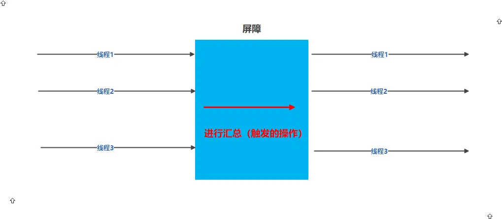

## 并发总结
基础知识 线程部分总结  
ThreadPoolExecutor  
[地址](G:\【51优质资源 www.51data.org】突破JAVA万人面试，懂多线程者得天下\【51优质资源 www.51data.org】突破JAVA万人面试，懂多线程者得天下\资料\资料\day2)
ThreadPoolExecutor的全参构造函数参数介绍


调用 Executor 的 shutdown() 方法会等待线程都执行完毕之后再关闭，但是如果调用的是 shutdownNow() 方法，
则相当于调用每个线程的 interrupt() 方法。 

shutdownNow() ===shutdown() + interrupt()  
一次性中断 全部线程池线程
```java
public class InterruptExample {
    private static class MyThread1 extends Thread{
        @Override
        public void run() {
            while (!interrupted()){
                System.out.println(Thread.currentThread().getName());
            }
        }
    }

    public static void main(String[] args) {
        ExecutorService executorService = Executors.newCachedThreadPool();
        
        executorService.execute(new MyThread1());
        executorService.execute(new MyThread1());
        
        try {
            Thread.sleep(2000);
        } catch (InterruptedException e) {
            e.printStackTrace();
        }
        executorService.shutdownNow();
        System.out.println("Main run");
    }
}
```

```yaml
如果只想中断 Executor 中的一个线程，可以通过使用 submit() 方法来提交一个线程，它会返回一个 Future<?> 对
象，通过调用该对象的 cancel(true) 方法就可以中断线程。
```
选择性中断线程池里某一线程
```java
public class InterruptExample {
    private static class MyThread1 extends Thread{
        @Override
        public void run() {
            while (!interrupted()){
                System.out.println(Thread.currentThread().getName());
            }
        }
    }

    public static void main(String[] args) {
        ExecutorService executorService = Executors.newCachedThreadPool();

        Future<?> future1 = executorService.submit(new MyThread1());
        Future<?> future2 = executorService.submit(new MyThread1());
        try {
            Thread.sleep(2000);
        } catch (InterruptedException e) {
            e.printStackTrace();
        }
        future2.cancel(true);
        System.out.println("Main run");
    }
}
```

### AQS原理


CountDownLatch: 使一个线程在等待另外一些线程完成各自工作之后，再继续执行。类似主线程需要等待其他服务线程全执行完毕，才能执行后面主线程的方法  

https://www.cnblogs.com/Lee_xy_z/p/10470181.html   
```java
package com.example.demo.CountDownLatchDemo;

import java.util.concurrent.CountDownLatch;
import java.util.concurrent.ExecutorService;
import java.util.concurrent.Executors;

/**
 * 主线程等待子线程执行完成再执行
 */
public class CountdownLatchTest1 {
    public static void main(String[] args) {
        ExecutorService service = Executors.newFixedThreadPool(3);
        final CountDownLatch latch = new CountDownLatch(3);
        for (int i = 0; i < 3; i++) {
            Runnable runnable = new Runnable() {
                @Override
                public void run() {
                    try {
                        System.out.println("子线程" + Thread.currentThread().getName() + "开始执行");
                        Thread.sleep((long) (Math.random() * 10000));
                        System.out.println("子线程"+Thread.currentThread().getName()+"执行完成");
                        latch.countDown();//当前线程调用此方法，则计数减一
                    } catch (InterruptedException e) {
                        e.printStackTrace();
                    }
                }
            };
            service.execute(runnable);
        }

        try {
            System.out.println("主线程"+Thread.currentThread().getName()+"等待子线程执行完成...");
            latch.await();//阻塞当前线程，直到计数器的值为0
            System.out.println("主线程"+Thread.currentThread().getName()+"开始执行...");
        } catch (InterruptedException e) {
            e.printStackTrace();
        }
    }
}
```
```shell
## 运行结果为：
主线程main等待子线程执行完成...
子线程pool-1-thread-3开始执行
子线程pool-1-thread-2开始执行
子线程pool-1-thread-1开始执行
子线程pool-1-thread-3执行完成
子线程pool-1-thread-1执行完成
子线程pool-1-thread-2执行完成
主线程main开始执行...
```

CyclicBarrier    
用来控制多个线程互相等待，只有当多个线程都到达时，这些线程才会继续执行。  
和 CountdownLatch 相似，都是通过维护计数器来实现的。线程执行 await() 方法之后计数器会减 1，并进行等待，  
直到计数器为 0，所有调用 await() 方法而在等待的线程才能继续执行。  

区别:
CountDownLatch：主线程等待要求的几个子线程运行完毕在执行主线程  
CyclicBarrier： 要求的几个子线程先执行 await()方法的部分代码，保证都执行后，调用触发汇总的方法，后执行剩下代码


[CyclicBarrier](https://www.jianshu.com/p/043ac5689002)
```java
package com.concurrency2;

import java.util.Random;
import java.util.concurrent.CyclicBarrier;

public class MyTest1 {
    public static void main(String[] args) {
        CyclicBarrier cyclicBarrier = new CyclicBarrier(3, () -> {
            System.out.println("汇总1 ...");

            try {
                Thread.sleep(3000);
            } catch (InterruptedException e) {
                e.printStackTrace();
            }
            
            System.out.println("汇总2 ...");
        });
       //for(int u = 0, u < 2;u ++)//开两次屏障使用
        for(int i = 0;i < 3;i ++) {
            new Thread(() -> {
                try {
                    Thread.sleep((long)(Math.random() * 2000));

                    int randomInt = new Random().nextInt(500);
                    System.out.println("hello " + randomInt);

                    cyclicBarrier.await();

                    System.out.println("world " + randomInt);

                } catch (Exception e) {
                    e.printStackTrace();
                }
            }).start();
        }
    }
}
```
```shell
## 结果输出：

hello 4
hello 229
hello 73
汇总1 ...
汇总2 ...
world 73
world 229
world 4

```



```shell
    //可以理解为初始化时 需要阻塞的任务个数
    private final int parties;
    / /剩余需要等待的任务个数，初始值为parties，直到为0时依次唤醒所有被阻塞的任务线程。
    private int count;
 
    / /在所有线程被唤醒前，需要执行的一个Runable对应的run方法
    private final Runnable barrierCommand;
```


Semaphore
限制一定数量的线程能够去执行
```java
public class SemaphoreExample {
    public static void main(String[] args) {
        final int clientCount = 3;
        final int totalRequestCount = 10;
        Semaphore semaphore = new Semaphore(clientCount);
        ExecutorService executorService = Executors.newCachedThreadPool();
        for (int i = 0; i < totalRequestCount; i++) {
            executorService.execute(()->{
                try {
                    semaphore.acquire();
                    System.out.print(semaphore.availablePermits() + " ");
                } catch (InterruptedException e) {
                    e.printStackTrace();
                } finally {
                    semaphore.release();
                }
            });
        }
        executorService.shutdown();
    }
}
// 代码执行结果为
// 2 1 2 2 2 2 2 1 2 2
```

[Semaphore详解](https://blog.csdn.net/admans/article/details/125957120)


FutureTask  
FutureTask 可用于异步获取执行结果或取消执行任务的场景。当一个计算任务需要执行很长时间，那么就可以用  
FutureTask 来封装这个任务，主线程在完成自己的任务之后再去获取结果。


BlockingQueue  
java.util.concurrent.BlockingQueue 接口有以下阻塞队列的实现:   
  *  FIFO 队列 ：LinkedBlockingQueue、ArrayBlockingQueue（固定长度）  
  *  优先级队列 ：PriorityBlockingQueue  
内部是用 lock 进行 锁的 提供了阻塞的 take() 和 put() 方法：如果队列为空 take() 将阻塞，直到队列中有内容；如果队列为满 put() 将阻塞，  
直到队列有空闲位置
     不用自己创建列表，在手写 wait()  和 notify() 来控制
     
```java
public class Demo5 {
    
    private static BlockingQueue<String> queue = new ArrayBlockingQueue<>(5);
    private static LinkedBlockingQueue linkedBlockingQueue = new LinkedBlockingQueue<>();
    private static PriorityBlockingQueue priorityBlockingQueue = new PriorityBlockingQueue<String>();
    
    private static class Producer extends Thread {
        @Override
        public void run() {
            try {
                queue.put("product");
            } catch (InterruptedException e) {
                e.printStackTrace();
            }
            System.out.println("produce....");
        }
    }
    private static class Consumer extends Thread {
        @Override
        public void run() {
            try {
                String product = queue.take();
            } catch (InterruptedException e) {
                e.printStackTrace();
            }
            System.out.println("consume...");
        }
    }
    
    public static void main(String[] args) {
        for (int i = 0; i < 2; i++) {
            Producer producer = new Producer();
            producer.start();
        }
        for (int i = 0; i < 5; i++) {
            Consumer consumer = new Consumer();
            consumer.start();
        }
        for (int i = 0; i < 3; i++) {
            Producer producer = new Producer();
            producer.start();
        }
    }
}
// 运行结果为： produce..produce..consume..consume..produce..consume..produce..consume..produce..consume..
```

### 非阻塞同步  
cas  
```java
public class AtomicClass {
     static AtomicInteger n;
     public static void main(String[] args) throws InterruptedException {
          int j = 0;
          while (j < 10) {
               n = new AtomicInteger(0);
               Thread t1 = new Thread() {
                    @Override
                    public void run() {
                         for (int i = 0; i < 1000; i++) {
                              n.getAndIncrement();
                         }
                    }
               };

               Thread t2 = new Thread() {
                    @Override
                    public void run() {
                         for (int i = 0; i < 1000; i++) {
                              n.getAndIncrement();
                         }
                    }
               };
               t1.start();
               t2.start();
               t1.join();
               t2.join();
               System.out.println("n的最终值是：" + n);
               j++;
          }
     }
}
```
```shell
   public final int getAndIncrement() {
        return unsafe.getAndAddInt(this, valueOffset, 1);
    }
    
    /**
    *  var1   指示对象内存地址
    *  var2   指示该字段相对对象内存地址的偏移
    *  通过 getIntVolatile(var1, var2) 得到 v5 (旧的预期值)
    *  var4    指示操作需要加的数值，这里为 1
    *  通过调用 compareAndSwapInt() 来进行 CAS 比较，如果该字段内存地址中的值等于 var5，那么就更新内存地址为 var1+var2 的变量为 var5+var4。
    *
    * 整个流程为：
    * 通过 var1对象【AtomicInteger】的内存地址+var2 字段相对对象内存地址的偏移,找到此字段的 地址和值,如果该字段内存地址中的值等于 var5(旧的预期值) 那么 那么就更新内存地址为 var1+var2 的变量为 var5+ 1
    / 
   public final int getAndAddInt(Object var1, long var2, int var4) {
        
        int var5;
        
        do {
            var5 = this.getIntVolatile(var1, var2);
        } while(!this.compareAndSwapInt(var1, var2, var5, var5 + var4));
        
        return var5;
   }
    
    
```


