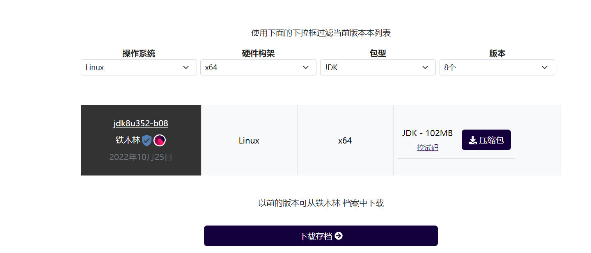

## jdk

区别：  

  
 

### oraclejdk
[Java 归档下载 - Java SE 8 (oracle.com)](https://www.oracle.com/java/technologies/javase/javase8-archive-downloads.html)  

###  openjdk  默认win安装的jdk
官方：https://openjdk.org/install/  
红帽：https://developers.redhat.com/products/openjdk/download  
https://adoptium.net/zh-CN/temurin/releases/?version=8   

