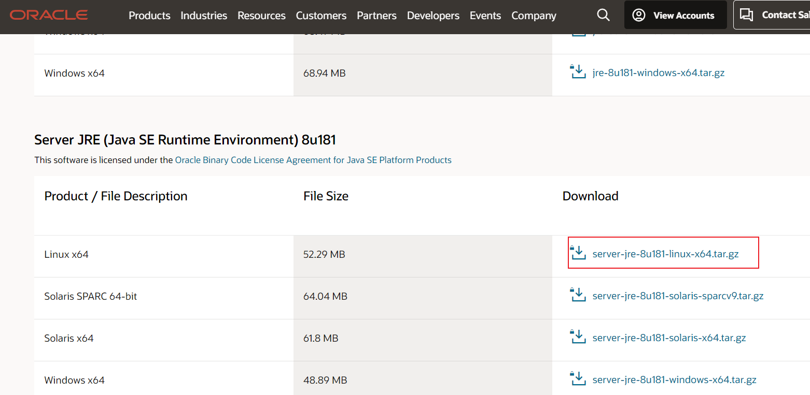
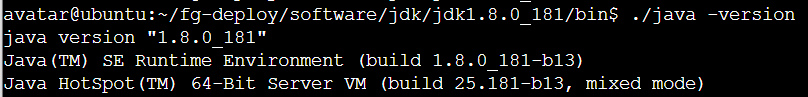
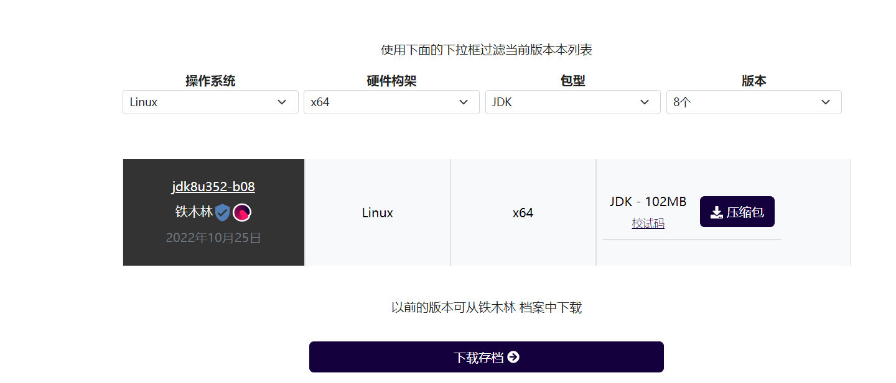
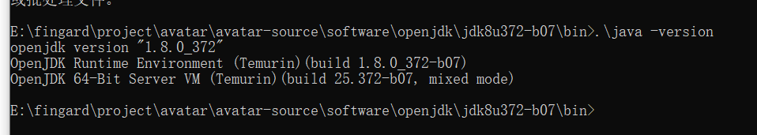

# jdk
## 官网
1. [OpenJDK](https://jdk.java.net/)
    - openjdk官网不再维护java 8、11这样的旧版本，新版由redhat维护，并且OpenJDK官方提供的编译包不多，只提供源码包，推荐到[AdoptOpenJDK](https://adoptopenjdk.net/)下载
    1. [AdoptOpenJDK](https://adoptopenjdk.net/) [清华镜像](https://mirrors.tuna.tsinghua.edu.cn/AdoptOpenJDK/)
        - openjdk纯源码无商标构建，持续维护，各系统、各大版本的最新版可运行的openjdk程序，甚至包含nightly构建
        - 下载openjdk可以到这里下载，docker官方jdk镜像默认的源就是在这里
        - [从oracle jdk迁移到openjdk指南、及功能对比：Migrating from Oracle JDK](https://adoptopenjdk.net/migration.html#migration-oracle)
    1. [redhat的各版本openjdk下载](https://developers.redhat.com/products/openjdk/download)
    1. [红帽接手维护 OpenJDK 8 和 OpenJDK 11](https://www.oschina.net/news/106051/leadership-openjdk-8-and-openjdk-11-transitions-red-hat)
    1. [openjdk 各版本docker镜像](https://hub.docker.com/_/openjdk)
1. [oracle java](https://www.oracle.com/java/)
    1. [oracle java 各版本下载](https://www.oracle.com/java/technologies/oracle-java-archive-downloads.html)
    1. [oracle java 协议，新版商用要付费](https://www.oracle.com/technetwork/java/javase/overview/oracle-jdk-faqs.html)
    1. [Oracle如何对JDK收费](https://zhuanlan.zhihu.com/p/64731331)
    1. [oracle和google的官司](https://www.baidu.com/s?ie=UTF-8&wd=oracle%20google)    

区别：   
[Oracle JDK 和 OpenJDK 的对比](https://blog.csdn.net/m0_55849631/article/details/124927181)  
[比较一下 Oracle JDK与openJDK的区别](https://tonels.blog.csdn.net/article/details/105282823?spm=1001.2101.3001.6650.2&utm_medium=distribute.pc_relevant.none-task-blog-2%7Edefault%7EESLANDING%7Edefault-2-105282823-blog-124927181.pc_relevant_landingrelevant&depth_1-utm_source=distribute.pc_relevant.none-task-blog-2%7Edefault%7EESLANDING%7Edefault-2-105282823-blog-124927181.pc_relevant_landingrelevant&utm_relevant_index=5)  
[Oracle与OpenJDK之间的区别](https://blog.csdn.net/weixin_33939843/article/details/91387455?spm=1001.2101.3001.6650.3&utm_medium=distribute.pc_relevant.none-task-blog-2%7Edefault%7EESLANDING%7Edefault-3-91387455-blog-124927181.pc_relevant_landingrelevant&depth_1-utm_source=distribute.pc_relevant.none-task-blog-2%7Edefault%7EESLANDING%7Edefault-3-91387455-blog-124927181.pc_relevant_landingrelevant&utm_relevant_index=6)

## oraclejdk  
[Java 归档下载 - Java SE 8 (oracle.com)](https://www.oracle.com/java/technologies/javase/javase8-archive-downloads.html)  

## openjdk
官方：https://openjdk.org/install/  
红帽：https://developers.redhat.com/products/openjdk/download   

快速下载地址：https://adoptium.net/zh-CN/temurin/releases/?version=8

## 环境配置
jdk安装路径
echo 'PATH=$PATH:$JAVA_HOME/bin >>/etc/profile

