# [【测试设计】使用jenkins 插件Allure生成漂亮的自动化测试报告](https://www.cnblogs.com/Detector/p/9058497.html)

 转载出处 ：https://www.cnblogs.com/Detector/p/9058497.html   


## 前言

以前做自动化测试的时候一直用的HTMLTestRunner来生成测试报告，后来也尝试过用Python的PyH模块自己构建测试报告，在后来看到了RobotFramework的测试报告，感觉之前用的测试报告都太简陋，它才是测试报告应该有的样子。也就是在那段时间疯狂研究RF的测试报告生成方法，接触到了很多好用的库，比如json2xml进行测试结果的转换，虽然用起来不太方便，但也能正常的生成标准的RF测试报告。

直到最近一次偶然的机会接触到了我们今天的主角Allure，我才真正感受到什么叫 **专业的事要交给专业的人做**。


## Allure介绍

Allure是一款非常轻量级并且非常灵活的开源测试报告生成框架。它简单易用，易于集成，并且支持绝大多数测试框架， 例如TestNG、Pytest、JUint等。

本文主要用Jenkins下面就Pytest如何与Allure集成做详细介绍。


## 环境搭建

Jenkins 是基于Java开发的一种持续集成工具，所以，Jenkins需要Java环境。而Allure同样的依赖Java环境，所以首先搭建java的环境，这个这里不做介绍。

#### Jenkins安装

搭建好java的环境后，配置安装好Tomcat，在https://jenkins.io/上下载jenkins，把下载的jenkins.war放在tomcat的webapps的目录下，切换到在tomcat的bin目录下，执行Tomcat的start脚本启动tomcat，启动后，在浏览器中访问你的Tomcat配置监听的IP端口，如：http://localhost:8080/jenkins。

博主是在windows环境下使用的是XAMPP集成的Tomcat，XAMPP相关的搭建安装使用可以参考这篇问题。

Jenkins首次使用会看到需要输入密码，Windows下的密码是在C:\Users\Administrator.jenkins\secrets目录下的initialAdminPassword文件中，复制其中的内容，把它copy到jenkins的密码输入框，点击下一步，配置账户密码，选择安装推荐插件或者手动选择都可以，关于插件这里就不详细的说明了，完成Jenkins的配置。

#### Allure Jenkins插件安装配置

- 首先打开jenkins的插件管理界面
  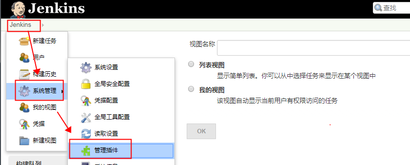
- 直接搜索allure可以搜索到，然后选择安装就可以了。安装成功后，可以在已安装列表里查看到该插件的信息。
  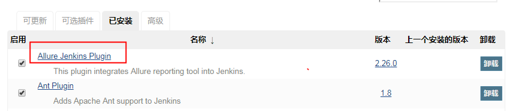
- 然后我们回到系统管理界面，点击全局工具设置（Global Tool Configuration），在Global Tool Configuration的界面安装allure，选择下载的插件版本
  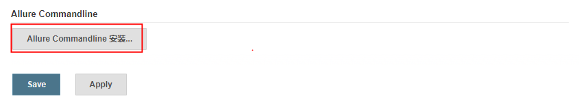

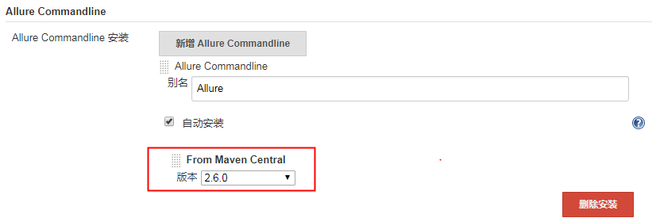

- 选择好后，点击save保存。

至此，环境就基本上安装完了。


## 测试脚本准备

#### 安装Python依赖包

下来我们需要安装pytest，安装的命令为：

```
pip install pytest

pip install pytest-allure-adaptor
```

在线安装成功后，在cmd的命令中输入pytest，如果显示信息如下，表示安装OK，见截图：
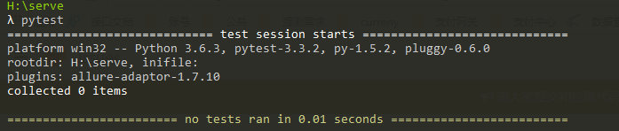

#### 测试脚本

下面我们来编写代码，来进行测试，比如编写如下的测试代码，见编写后的源码：

```
#! /usr/bin/python
# coding:utf-8 
""" 
@author:Bingo.he 
@file: test_allure.py 
@time: 2018/07/12 
"""  
import unittest
class DivTest(unittest.TestCase):

    def test_div_001(self):
        self.assertEqual(1, 1)

    def test_div_002(self):
        self.assertEqual(2, 2)

    def test_div_003(self):
        self.assertEqual(3, 3)
        
    def test_div_004(self):
        self.assertEqual(4, 4)
        
    def test_div_005(self):
        self.assertEqual(5, 3)
```


## 构建Jenkins任务

#### 新建任务（Job）

- 新建一个构建任务，选择 自由风格的任务，取名如AllureDemo，点击确定
  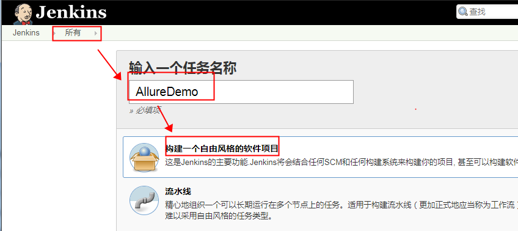
- 在配置界面，选择构建，在构建步骤中选择 Windows 批处理命令（windows batch command），填写执行的命令，见截图：
  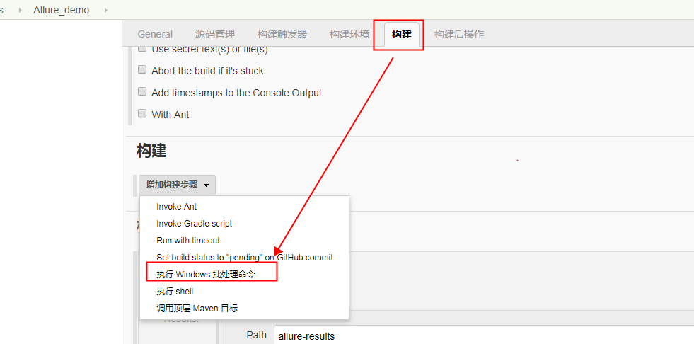
- 在构建后操作选择Allure Report，见截图：
  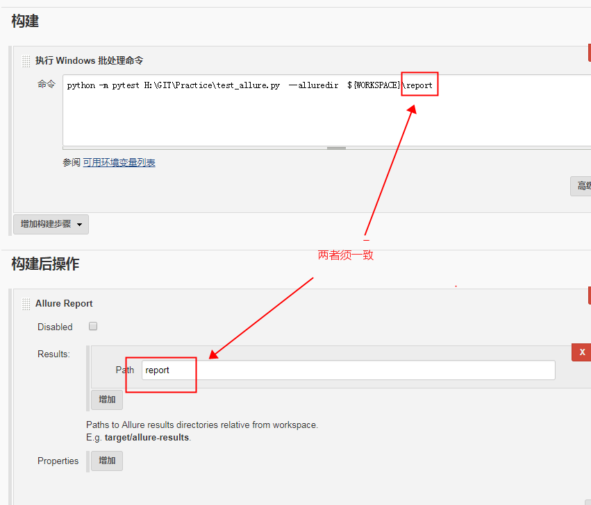
- 点击保存会返回项目详情页面，可以看到显示allure测试报告的图标
  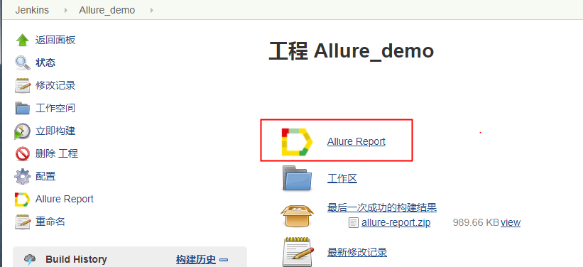
- 我们立即构建后，我们可以看到构建成功的信息，点击allure测试报告即可以看到allure测试报告
  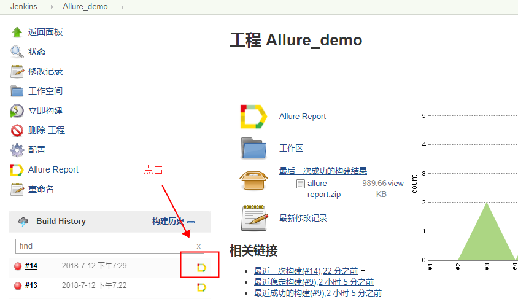


## Allure Report 测试报告

#### 概览

概览 中展示了本次测试的测试用例数量，成功用例、失败用例、跳过用例的比例，测试环境信息，SUITES，FEATURES BY STORIES等基本信息，当与Jenkins做了持续置成后，TREND区域还将显示，历次测试的通过情况。
概览 的左边栏，还从不同的维度展示测试报告的其他信息，我们可以自己点进去看看。

我们可以在下面选择展示语言
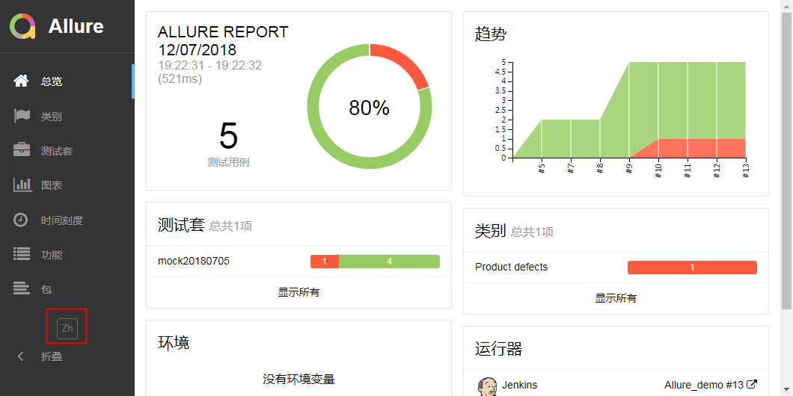

#### Behaviors

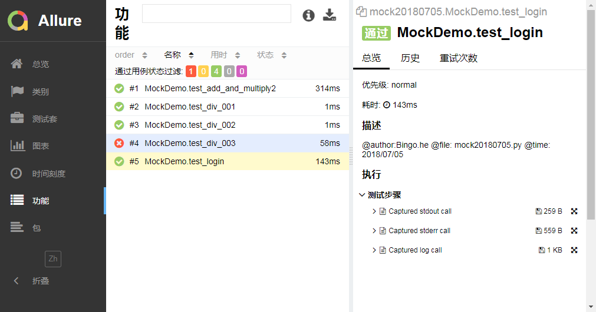

#### Suites

将脚本的目录结果展示本次所有的测试用例执行情况。
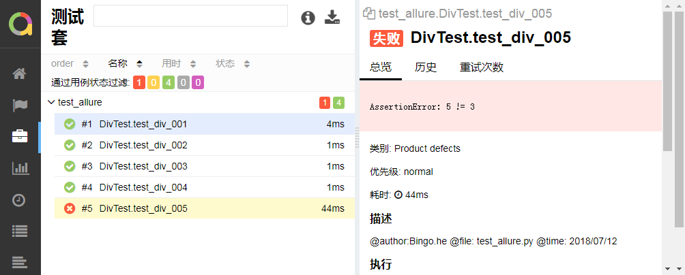

#### Graphs

展示详细的数据信息，还包含以往的构建信息。
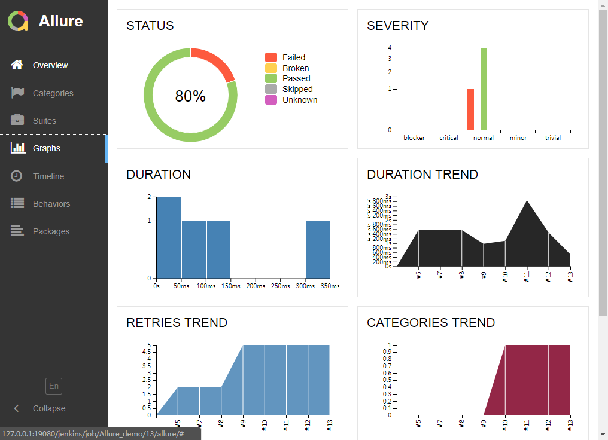
