# 截图及功能说明

## 登录界面

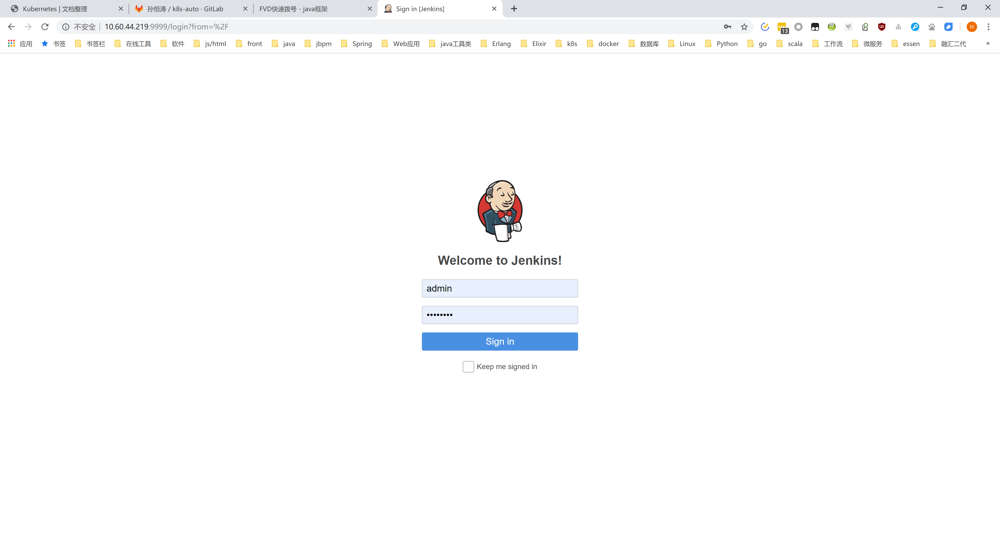

## 主界面

点击左边的new任务，进入新建任务界面

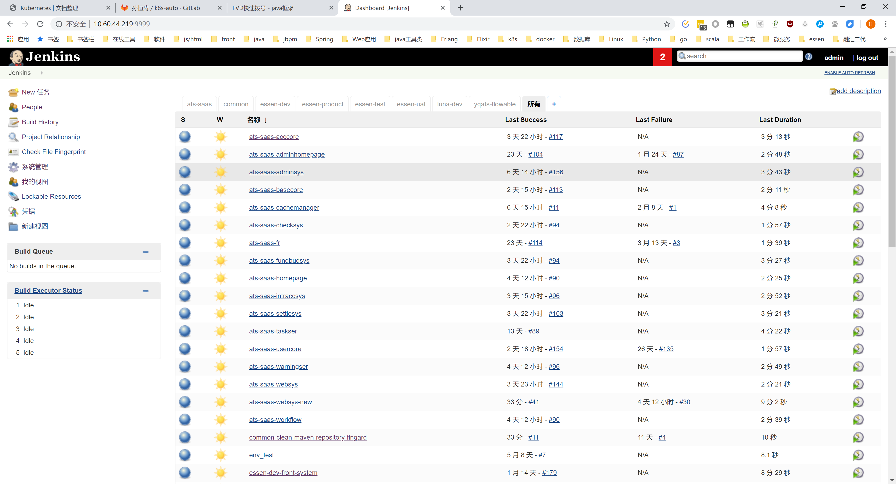

### 界面可以添加不同的视图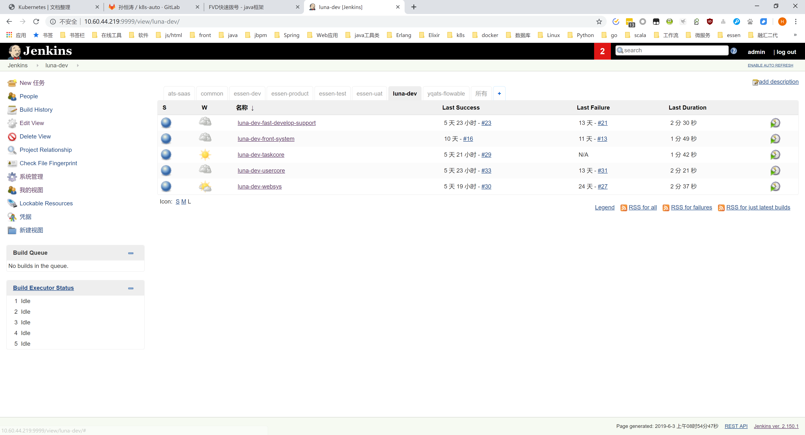

## 正在构建的任务监控

左下角有一个正在进行构建的任务进度条监控面板

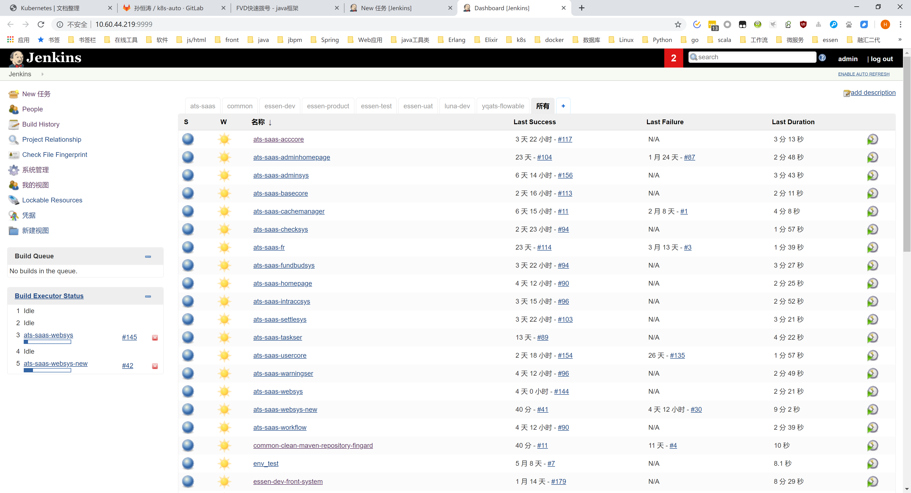

## 新建任务界面

可以选择不同的任务构建模板；一个毕竟重要的是，可以通过下面的`copy from`框，来复制一个之前建过的任务，对于大量的，两个很相似的任务，这个很有用。

比如现有的几十个构建，大部分是maven构建、生成docker镜像、部署到k8s集群，好像这样的构建我只写过一次，之后的每个都是复制过来的。

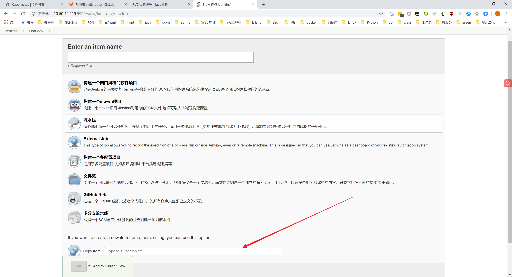

### 一般流程

1. 填一个代码地址，git或svn，用于拉取代码

   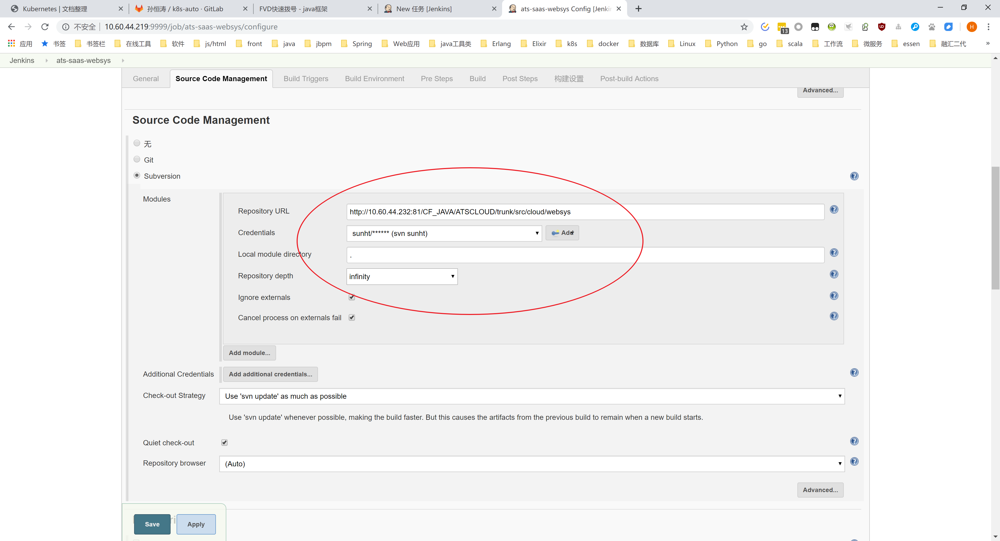

2. 填写构建的maven命令，编译项目

   需要设置maven的settings.xml，默认的不行，没有公司私服仓库的信息。

   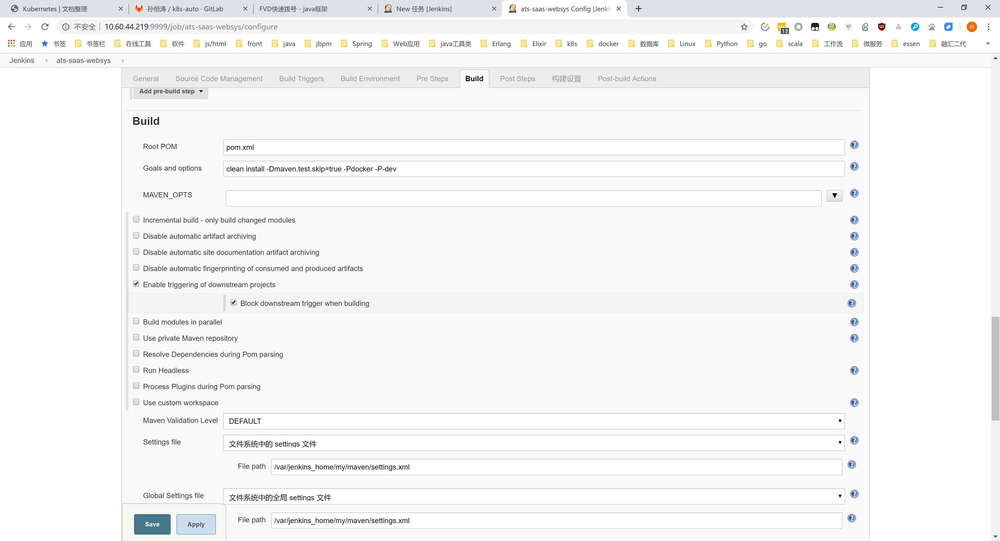

3. 编译完成的后续步骤

   这里是使用maven的jib插件，打包docker镜像，使用`$BUILD_TAG`给这个镜像打上唯一的标签，然后上传到docker私服，接下来使用命令行执行k8s的更新docker镜像的命令。

   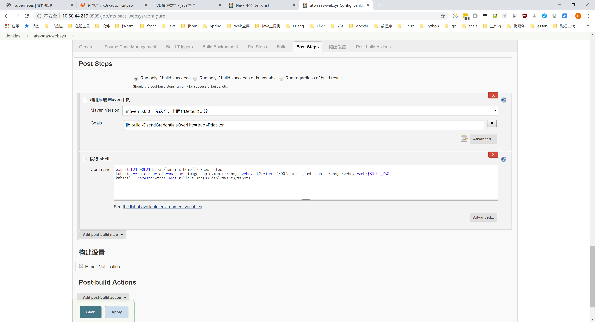

## 点开一个任务

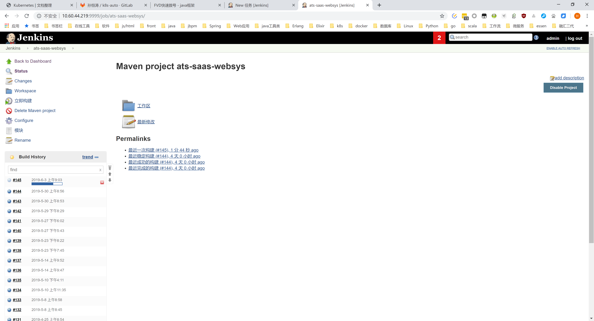

### 点开一个任务最后执行的构建

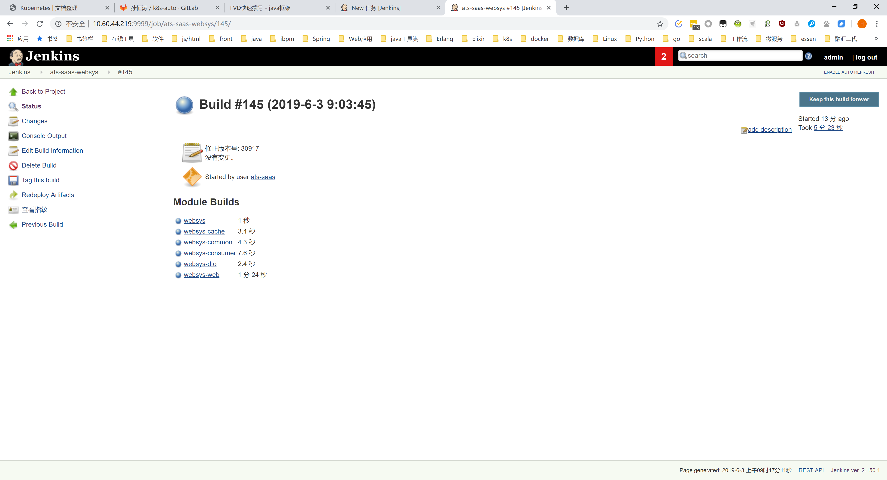

`Console Output`可以看这次构建的日志，里面包括maven的编译日志等

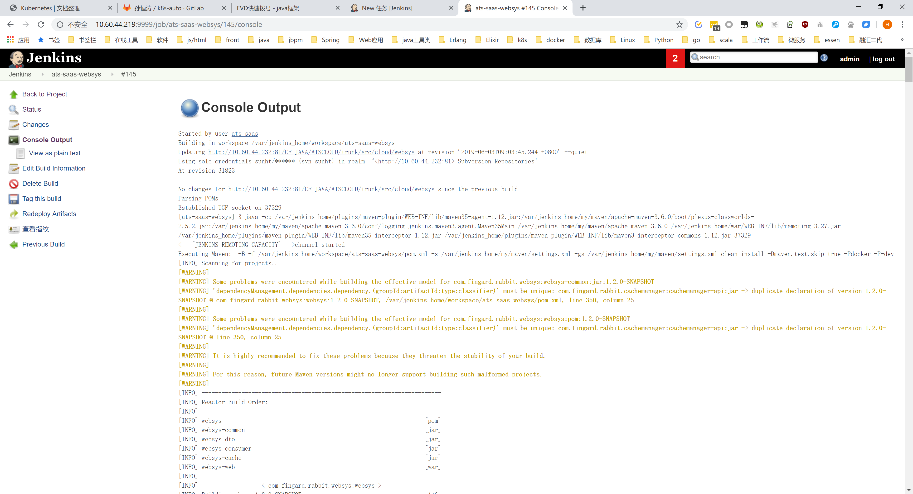

## Jenkins自身的管理

系统管理界面

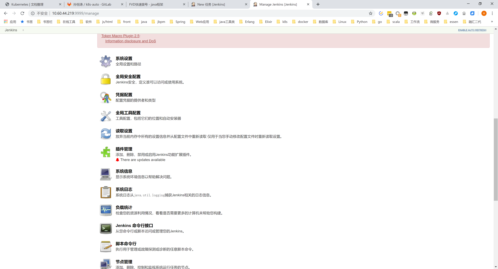

### 系统设置

这里可以甚至一些全局的参数

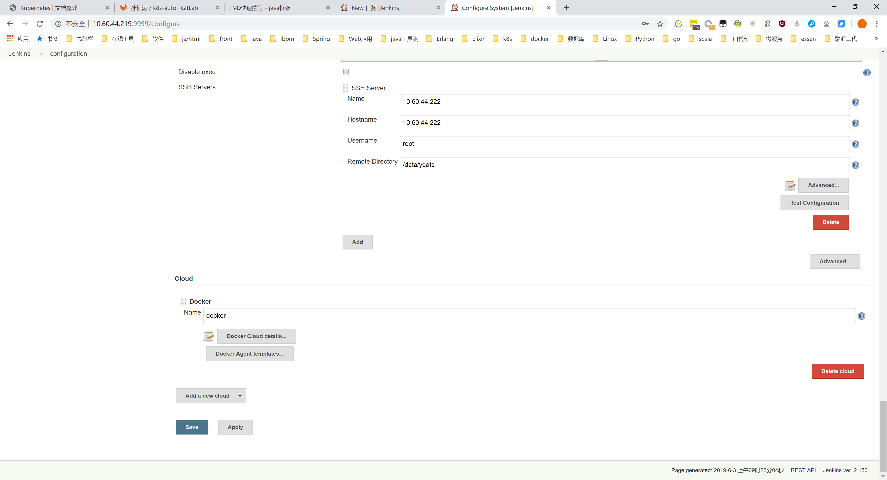

另一个叫`全局工具配置`的作用类似，一些系统参数的配置可以在这两个里面都找找看，要么百度一下在哪里。

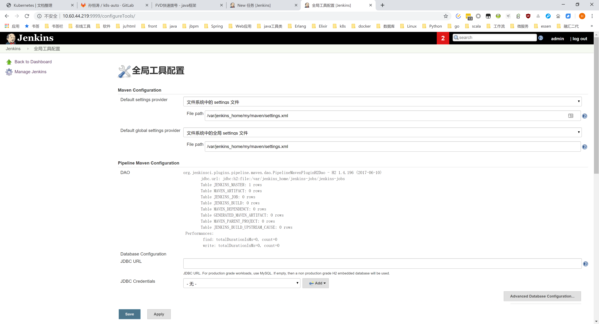

### 插件管理

比较重要的是这个插件管理。

jenkins默认是基本不带可以用起来的功能的，其功能完全靠各种插件的组装。

新安装jenkins的时候，最好在推荐页面就把所有推荐的插件都安装了，里面基本上是些常用插件，一个个找起来还是挺麻烦的。

一些常用的插件看：[插件介绍](./plugins.md)

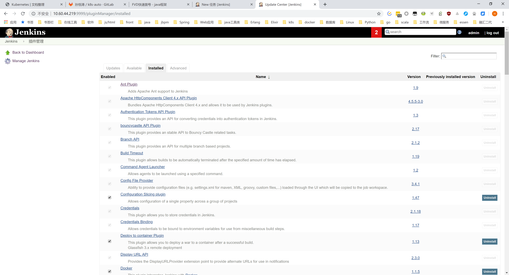

