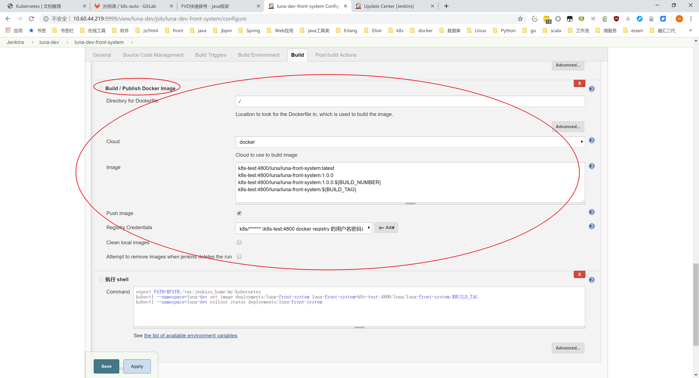
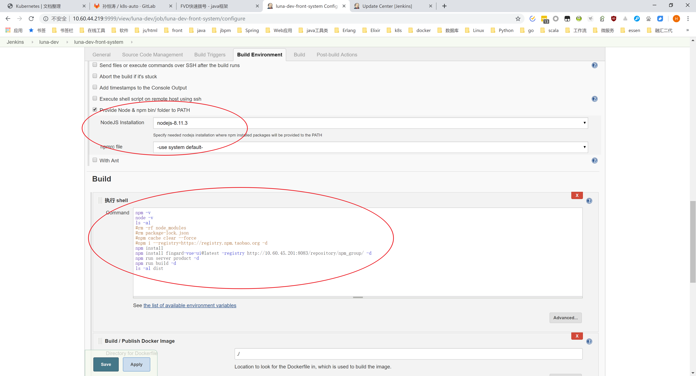
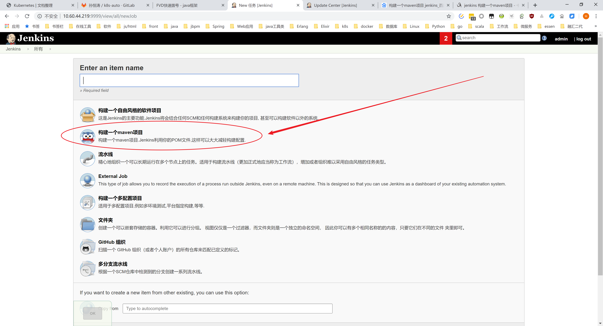
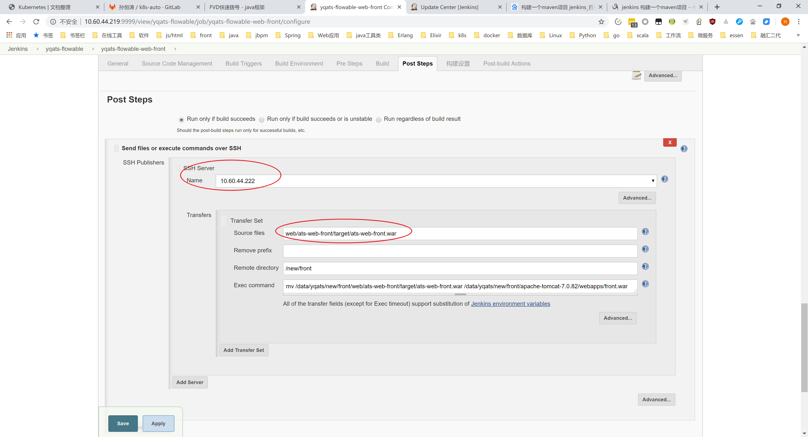
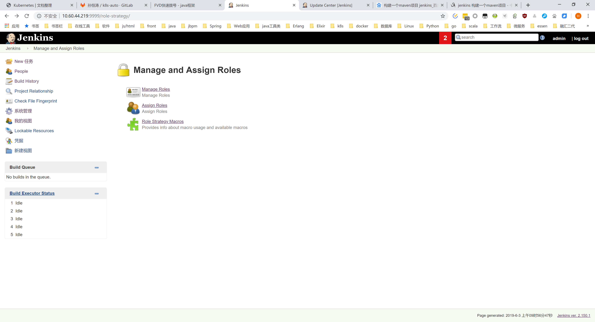
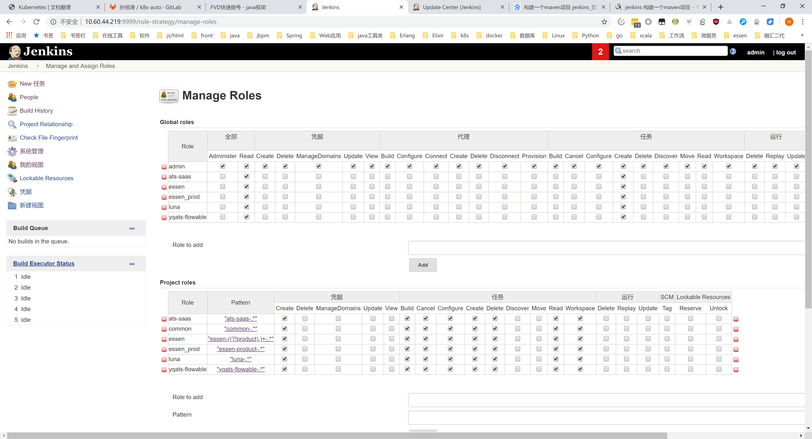
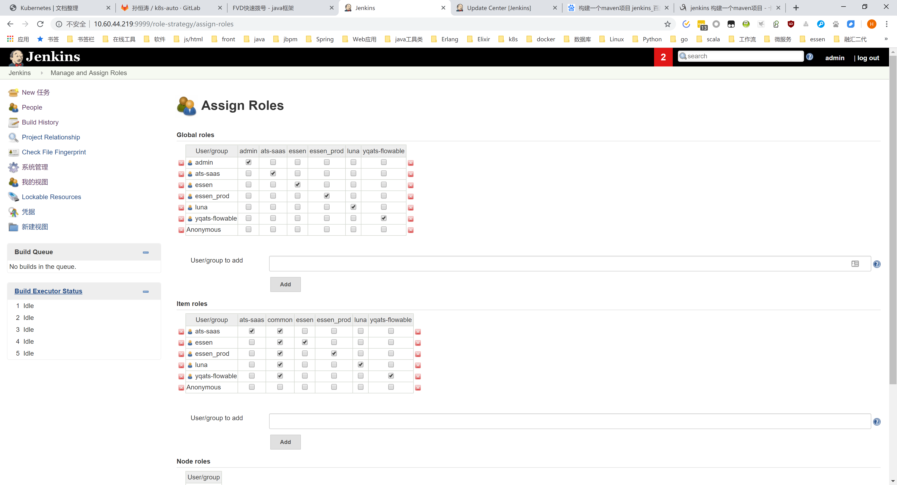
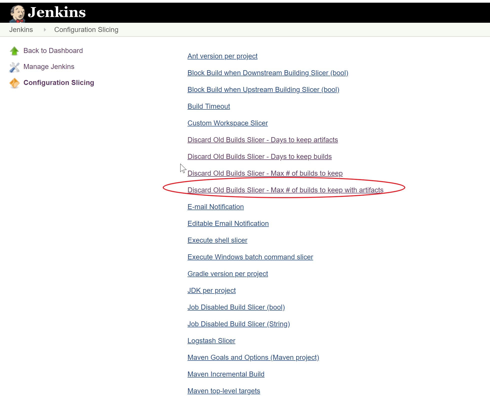
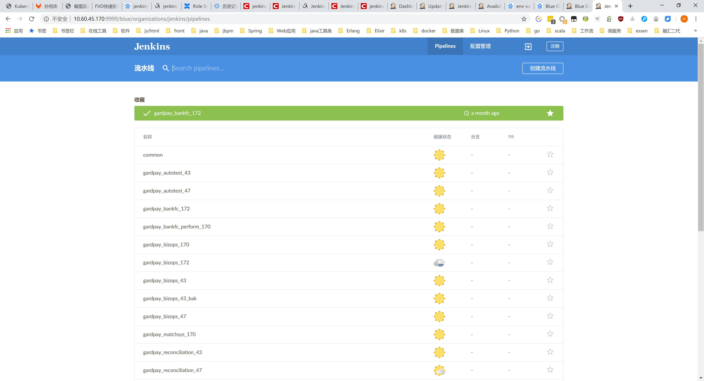

# 插件介绍

一些我这边安装的插件的介绍。（遇到什么功能没有的话，主要靠百度了）

## [Docker](http://wiki.jenkins-ci.org/display/JENKINS/Docker+Plugin)

提供docker命令环境的支持，可以打包、发布docker镜像。

## [NodeJS](http://wiki.jenkins-ci.org/display/JENKINS/NodeJS+Plugin)

提供nodejs、npm的命令支持，可以构建前端项目。

## [Maven Integration plugin](https://wiki.jenkins.io/display/JENKINS/Maven+Project+Plugin)

提供maven项目构建的支持，我们的大部分项目是maven项目。

## [Publish Over SSH](http://wiki.jenkins-ci.org/display/JENKINS/Publish+Over+SSH+Plugin)

把打好的包发布到远程机器上去运行，比如把一个编译好的war包，放到另一台机器的tomcat目录下。

## [Role-based Authorization Strategy](https://wiki.jenkins.io/display/JENKINS/Role+Strategy+Plugin)

当不同项目使用了同一个jenkins时候，为了防止点串了之类的事情，需要做下用户、权限的隔离了。jenkins自带的用户管理没有细粒度的资源权限管理，比如，某个构建，只能由某个用户来访问，其他用户没权限。这个插件的管理粒度还是比较细的。

1. 插件界面

2. 角色的权限管理

3. 为用户分配角色

###  [Configuration Slicing plugin](http://wiki.jenkins-ci.org/display/JENKINS/Configuration+Slicing+Plugin) - jenkins批量配置

[Jenkins插件之批量修改配置](https://blog.csdn.net/eryajf/article/details/82904474)

比如这个可以批量更改每个任务保留的构建次数，自动删除历史构建，节省空间

## [Blue Ocean](https://jenkins.io/projects/blueocean/)

为jenkins提供一个更漂亮的界面，对pipeline提供了很好的支持。

我这边因为一大堆插件要升级，安装失败了，截的融汇那边的图。

## [Publish Over CIFS Plugin](http://wiki.jenkins-ci.org/display/JENKINS/Publish+Over+CIFS+Plugin)
向windows共享文件夹发送文件

## [Localization: Chinese (Simplified)](https://github.com/jenkinsci/localization-zh-cn-plugin)
jenkins中文界面
