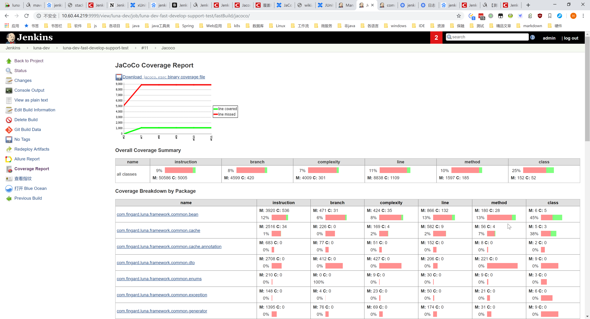

# 单元测试相关

## Junit测试报告

使用[Allure](http://allure.qatools.ru/)生成Junit测试结果的报告；

参考链接：

- [【测试设计】使用jenkins 插件Allure生成漂亮的自动化测试报告](https://www.cnblogs.com/Detector/p/9058497.html)
  - [防失效，本地备份](./allure-jenkins.md)

配置步骤基本上与这个链接的内容相同，链接的内容已经很详细了。不过我们一般是maven编译的java项目，而不是python项目，报告生成的位置有点不同，一般是在`target/surefire-reports/`下。

一个`mvn test`报告的位置示例：`luna-core/target/surefire-reports/`


界面示例：


## 测试代码覆盖率报告

### 项目配置

使用`jococo`统计代码覆盖率。

项目配置：
`luna-fast-develop-support/pom.xml`：

```xml
<project>
    <properties>
        <!-- 新增两个版本号 -->
        <gmavenplus-plugin.version>1.7.1</gmavenplus-plugin.version>
        <jacoco.version>0.8.4</jacoco.version>
    </properties>
    
    
    <dependencies>
    
        <!-- 配置scope为test的agent依赖 -->
        <dependency>
            <groupId>org.jacoco</groupId>
            <artifactId>org.jacoco.agent</artifactId>
            <version>${jacoco.version}</version>
            <scope>test</scope>
        </dependency>
    </dependencies>
    
    <build>
        <!-- 在声明版本号的pom里面，配置两个plugin -->
        <pluginManagement>
            <plugins>
                <plugin>
                    <!-- The gmavenplus plugin is used to compile Groovy code. To learn more about this plugin,
                    visit https://github.com/groovy/GMavenPlus/wiki -->
                    <groupId>org.codehaus.gmavenplus</groupId>
                    <artifactId>gmavenplus-plugin</artifactId>
                    <version>${gmavenplus-plugin.version}</version>
                    <executions>
                        <execution>
                            <goals>
                                <goal>compile</goal>
                                <goal>compileTests</goal>
                            </goals>
                        </execution>
                    </executions>
                </plugin>
                <plugin>
                    <groupId>org.jacoco</groupId>
                    <artifactId>jacoco-maven-plugin</artifactId>
                    <version>${jacoco.version}</version>
                    <executions>
                        <execution>
                            <id>pre-test</id>
                            <goals>
                                <goal>prepare-agent</goal>
                            </goals>
                        </execution>
                        <execution>
                            <id>post-test</id>
                            <phase>test</phase>
                            <goals>
                                <goal>report</goal>
                            </goals>
                        </execution>
                    </executions>
                </plugin>
            </plugins>
        </pluginManagement>
    </build>
</project>
```

`luna-fast-develop-support/luna-core/pom.xml`：
在实际用到的maven子模块里面，配置上述声明过的plugin。


```xml
<build>
    <plugins>
        <!-- 编译groovy代码需要用到这个插件 -->
        <plugin>
            <groupId>org.codehaus.gmavenplus</groupId>
            <artifactId>gmavenplus-plugin</artifactId>
        </plugin>

        <!-- jacoco覆盖率统计实际执行插件 -->
        <plugin>
            <groupId>org.jacoco</groupId>
            <artifactId>jacoco-maven-plugin</artifactId>
        </plugin>

        <plugin>
            <groupId>org.apache.maven.plugins</groupId>
            <artifactId>maven-surefire-plugin</artifactId>
            <configuration>
                <!-- 解决问题：Error: Could not find or load main class org.apache.maven.surefire.booter.ForkedBooter -->
                <useSystemClassLoader>false</useSystemClassLoader>
            </configuration>
        </plugin>

    </plugins>
</build>
```

实际运行命令：

```bash
mvn clean test jacoco:prepare-agent -Dmaven.test.failure.ignore=true
```

注意：

- 需要带上`jacoco:prepare-agent`，否则测试报错
- `-Dmaven.test.failure.ignore=true`是为了继续jenkins的执行，否则jenkins遇到单元测试错误将中断，不输出测试报告

### jenkins配置

安装插件[JaCoCo plugin](https://wiki.jenkins-ci.org/display/JENKINS/JaCoCo+Plugin)

在项目构建配置的后面，点`Add post-build action`，添加`Record JaCoCo coverage report`


一般来讲，默认配置就行了。

但如果不想添加其他包的代码，可以配置下路径。


运行结果示例：



