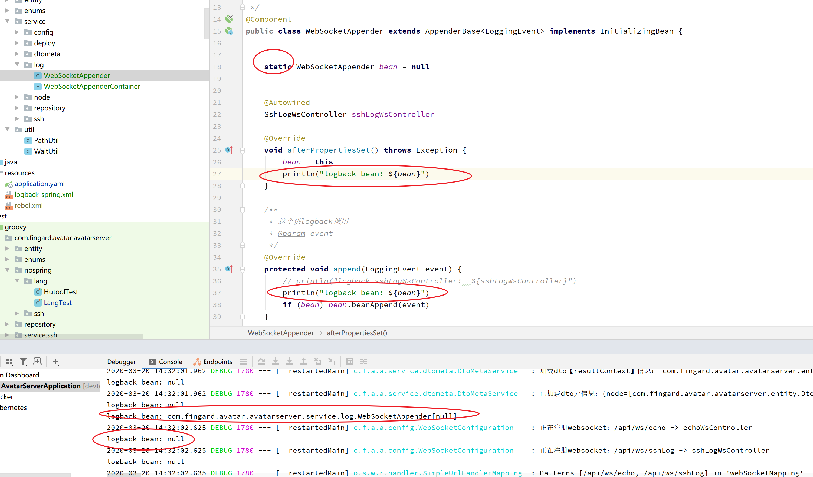
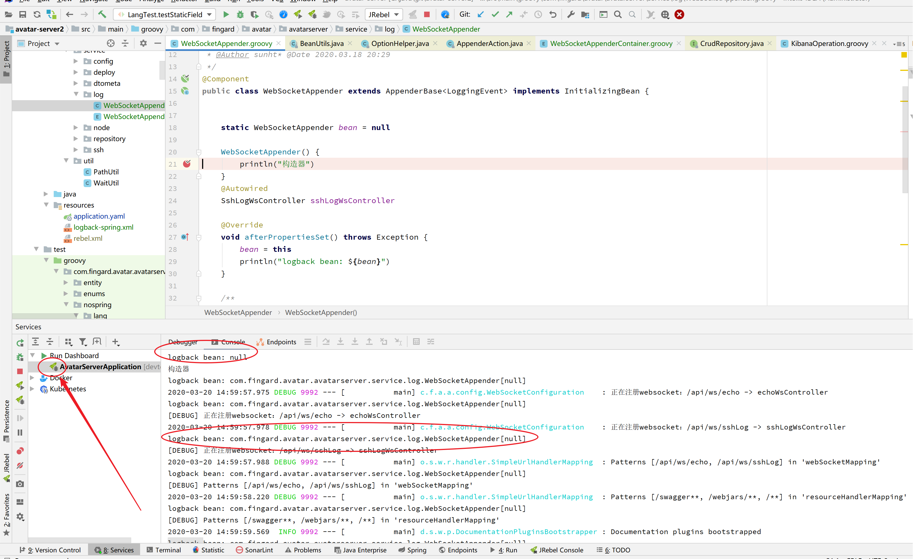

# Spring
1. [spring官网](https://spring.io/)
1. [spring 主框架文档](https://docs.spring.io/spring/docs/current/spring-framework-reference/index.html)
1. [Spring5参考指南](https://docs.flydean.com/spring-framework-documentation5/)
1. [spring 多例](https://blog.csdn.net/limingcai168/article/details/81214441)

## faq

### devtool导致静态字段设置失败

知道groovy里面这个是怎么回事吗？一个类的静态字段，一个对象赋值，但另一个对象取不到；另外，代码换成java也一样



用jrebel启动就很神奇的没问题



#### 解决

把`spring-boot-devtools`的引用注释掉，这个问题就解决了。应该是这个引发的

```xml
<dependency>
    <groupId>org.springframework.boot</groupId>
    <artifactId>spring-boot-devtools</artifactId>
    <scope>runtime</scope>
    <optional>true</optional>
</dependency>
```

## spring bean
prototype的多例bean，会在gc的时候回收掉，如果没地方引用的话，无需担心多例bean导致的内存泄漏问题。
已在avatar项目实测，用jprofile监控，页面点击产生一堆bean，手动点gc，明显看到对象消失掉。

## Spring Data
- [Spring Data 所有组件官方示例项目](https://github.com/spring-projects/spring-data-examples)
    - 支持的组件包括以下：
    1. JDBC
    1. JPA
    1. R2DBC
    1. Redis
    1. Elasticsearch
    1. MongoDB
    1. Neo4j
    1. Cassandra
    1. 其他如：Apache Solr、Apache Geode、LDAP

### Spring Data JPA
1. [官网](https://spring.io/projects/spring-data-jpa)
1. [官方教程](https://spring.io/guides/gs/accessing-data-jpa/)
1. [官方文档](https://docs.spring.io/spring-data/jpa/docs/2.2.5.RELEASE/reference/html/#reference)
1. [jpa 暴露 rest 接口](https://spring.io/guides/gs/accessing-data-rest/)
1. [Spring Data JPA 之 一对一，一对多，多对多 关系映射](https://blog.csdn.net/johnf_nash/article/details/80642581)
1. [jpa通过方法名创建查询接口方法](https://docs.spring.io/spring-data/jpa/docs/2.2.5.RELEASE/reference/html/#repositories.query-methods.query-creation)
    1. [jpa方法名命名规则](https://blog.csdn.net/liyang_nash/article/details/80704089)
1. [报错：Jpa Multiple representations of the same entity are being merged](https://blog.csdn.net/qq_26531719/article/details/102515085)
1. [只更新某些字段](https://www.cnblogs.com/quickcodes/p/hibernate-update-zhi-geng-xin-bu-fen-zi-duan-de3zh.html)
1. [JPA中的could not initialize proxy - no Session异常分析与解决](https://blog.csdn.net/qq_35974759/article/details/86480308)
    - Open-EntityManager-in-view 相关，也就是hibernate的session在controller层就打开，解决出了Transaction的实体类懒加载失败问题
    1. [Spring Boot中建议关闭Open-EntityManager-in-view](http://www.kailing.pub/article/index/arcid/266.html)
    1. [WebFlux 延迟加载问题](https://blog.csdn.net/woxinqidai/article/details/82812420)
    1. [JPA的cannot simultaneously fetch multiple bags异常的解决](https://blog.csdn.net/sinat_33201781/article/details/90371989)


## ioc
1. [What is dependency injection and inversion of control?](http://python-dependency-injector.ets-labs.org/introduction/what_is_di.html)
    

## spring web
[Jackson JSON](https://docs.spring.io/spring/docs/5.2.8.RELEASE/spring-framework-reference/web-reactive.html#webflux-codecs-jackson)
自定义jackson的类型转换等，实现`Jackson2ObjectMapperBuilderCustomizer`，已一个bean放在spring容器中即可。


### spring mvc
1. [SpringMvc中获取Request的几种方式](https://www.cnblogs.com/wade-luffy/p/8867144.html)

## spring boot
1. [Spring Boot Maven Plugin 官方文档](https://docs.spring.io/spring-boot/docs/current/maven-plugin/)
1. [将Springboot的“fat jar” 变成 “thin jar”](https://blog.csdn.net/timedifier2/article/details/53925825)
    - 使用外部依赖包的方式启动，比如：
    ```bash
    java -Dloader.path=E:/tmp/test/lib -jar gps-server-1.0-SNAPSHOT.jar
    ```

可配置是否跳过打肥jar包。当spring boot项目仅需要里面的类给别人引用时，并不需要肥jar包，而只需要那个*.jar.origin里面的类。
```xml
<plugin>
    <groupId>org.springframework.boot</groupId>
    <artifactId>spring-boot-maven-plugin</artifactId>
    <configuration>
        <skip>true</skip>
    </configuration>
</plugin>
```

1. [springBoot指定application.yml文件](https://blog.csdn.net/qq_38567039/article/details/93893724)

### spring boot properties配置提示
无提示时，这三个答案组合可解决问题。
1. [I ended up creating a plugin section in the pom.xml file that explicitly sets the annotation processors that are used for the project. The advantage of this is that you don't need to rely on any IDE settings.](https://stackoverflow.com/a/48028193)
1. [Re-run Spring Boot Configuration Annotation Processor to update generated metadata](https://blog.csdn.net/qq_40233736/article/details/85070300)
1. [Spring Boot Configuration Annotation Processor not configured 问题解决](https://blog.csdn.net/liangjiabao5555/article/details/104062932)


## spring cloud
1. [Spring Cloud中文网](https://www.springcloud.cc/)
    1. [一份比较全面的D的文档翻译](https://www.springcloud.cc/spring-cloud-dalston.html)
1. [史上最简单的 SpringCloud 教程 | 终章 - 方志朋](https://blog.csdn.net/forezp/article/details/70148833)
    1. [个人博客](https://www.fangzhipeng.com/spring-cloud.html)
1. [《Spring Cloud与Docker微服务架构实战 第二版》1-11章配套代码](https://gitee.com/itmuch/spring-cloud-docker-microservice-book-code)
    1. [博客](http://www.itmuch.com/)
    1. [Zuul相关文章](http://www.itmuch.com/tags/Zuul/)
1. [consul和zuul使用的demo - sunht](http://gitlab.xyyweb.cn/sunht/spring-cloud-h-demo.git)
1. [spring cloud starter：可以到这里看spring cloud与boot对应的版本](https://mvnrepository.com/artifact/org.springframework.cloud/spring-cloud-starter)
1. [spring cloud与dubbo网络传输性能对比](https://www.cnblogs.com/chen110xi/p/6349580.html)

### consul
1. [consul官网](https://www.consul.io/discovery.html)
1. [使用Consul做服务发现的若干姿势](http://blog.bossma.cn/consul/consul-service-register-and-discovery-style/)
    - 这里有consul工作方式的介绍，不仅仅是像zk、eureka那样仅仅存下ip、端口的注册中心（当然也可以这么用），正确的用法是用sidecar模式组service mesh
1. [Consul 使用手册](http://www.liangxiansen.cn/2017/04/06/consul/) 比较详细的参考手册
1. [Spring Cloud Consul 中文文档](https://www.springcloud.cc/spring-cloud-consul.html)
1. [《Spring Cloud与Docker微服务架构实战 第二版》Consul相关文章](http://www.itmuch.com/tags/Consul/)
    1. [安装单机版Consul](http://www.itmuch.com/spring-cloud/consul-single/)
    1. [安装Consul集群](http://www.itmuch.com/spring-cloud/consul-cluster/)
    1. [使用Consul实现服务发现：instance-id自定义](http://www.itmuch.com/spring-cloud/consul-discovery-instance-id-customize/)
1. [consul docker镜像](https://hub.docker.com/_/consul)
    - docker pull consul:1.7.2

#### 灰度发布
- 对应的eureka那边是由标签实现的
    - 大概就是存在一定时长的新旧服务共存，新、旧服务不能相互调用
- consul也可以用标签实现
    - spring.cloud.consul.discovery.tags
    - spring.cloud.consul.discovery.default-query-tag

#### 集群的两种方式
1. [Consul集群部署](https://blog.51cto.com/zjhrunnnnggo/2332938)
    1. [Consul Service Mesh实战【转】](https://www.jianshu.com/p/ad970554403d)
    > consul的一个特性：可以作为sidecar，像filebeat那样，每台应用节点部署一个consul client做sidecar，整个集群选或者单独部署1-5个server，
    > sidecar join到server，应用通过localhost:8500连接到sidecar，这样整个集群就是由consul实现的service mesh；consul client和应用就
    > 是同生共死的关系，不通过k8s集群就能手动组的简陋版service mesh。
1. [spring-cloud-consul](https://github.com/penggle/spring-cloud-consul)
    > 【注意！】这是不正规、不推荐的使用方式！关于这点git项目有说明，并且里面强烈推荐了官方的sidecar模式，实在是用不了sidecar了，再考虑这个。
    > 这个项目出现的原因是不论spring cloud官方没对这种不推荐的做法做支持。
    1. [Spring Cloud Consul 高可用：集群版ConsulClient - ClusterConsulClient实现](https://segmentfault.com/a/1190000020155983)

集群启动命令备忘，按sidecar的方法，-client=127.0.0.1更合适。
```bash
consul agent -data-dir ./data -node=node0 -bind=10.60.46.210 -datacenter=dc1 -ui -client=0.0.0.0 -server -bootstrap-expect=1
./consul agent -data-dir ./data -node=node1 -bind=10.60.44.243 -datacenter=dc1 -ui -client=0.0.0.0 -join=10.60.46.210
./consul agent -data-dir ./data -node=node2 -bind=10.60.44.251 -datacenter=dc1 -ui -client=0.0.0.0 -join=10.60.46.210
```

单机试验版启动命令：
```cmd
consul.exe agent -dev -ui -client 0.0.0.0
```

### zuul
1. [路由器和过滤器：Zuul](https://www.springcloud.cc/spring-cloud-dalston.html#_router_and_filter_zuul)
1. [最全面的改造Zuul网关为Spring Cloud Gateway（包含Zuul核心实现和Spring Cloud Gateway核心实现）](https://www.cnblogs.com/KuJo/p/11306361.html)
1. [springboot+spring session+redis+zuul实现网关session共享以及zuul的动态配置](https://blog.csdn.net/niemingming/article/details/80905656)
1. [spring-cloud-zuul动态路由的实现](https://my.oschina.net/dengfuwei/blog/1621627)
    1. [对应代码地址](https://gitee.com/itopener/springboot)
        - 动态路由跑成功了，走的是mysql数据库，有管理页面，启动以下项目。
            > 需要先把`com/itopener/tools/zuul/route/admin/mapper/ZuulRouteEntityMapper.xml`等两个mybatis xml移到resources文件夹，
              mysql初始化数据库sql在`itopener-parent\spring-boot-starters-parent\zuul-route-spring-boot-starter-parent\zuul-route-db-spring-boot-starter-parent\zuul-route-db-spring-boot-autoconfigure\src\main\resources\META-INF\schema\zuul_router.sql`。
            - demo-zuul-server2 :8082/
            - demo-zuul-client-db :8080/
            - demo-zuul-server1 :8081/
            - demo-zuul-eureka :8090/
            - tools-zuul-route-admin :8085/
    1. 这个方法扩展了更细的匹配规则，使用的是js规则解析
        > com.itopener.zuul.route.spring.boot.common.ZuulRouteLocator#getMatchingRoute
    
#### 关于websocket
1. 一个想法是把websocket的连接直接放在zuul网关所在的tomcat，不做转发路由处理。
    - 已测试，可行
    1. [SpringBoot2.0集成WebSocket，实现后台向前端推送信息](https://blog.csdn.net/moshowgame/article/details/80275084)
    1. [WebSocket在线测试工具](http://ws.douqq.com/)
    1. 另外spring还有一个专门针对发送消息的封装：EnableWebSocketMessageBroker，用的基于ws的STOMP协议，类似后台的amqp协议，属于spring message系列
        1. [springboot+websocket+sockjs进行消息推送【基于STOMP协议】](https://blog.csdn.net/liyongzhi1992/article/details/81221103)
            1. [STOMP协议详解](https://blog.csdn.net/chszs/article/details/46592777)
1. 前端轮询，不用websocket。
- 上面两种是靠谱的、可用的解决方案，下面这个带些试验性质，功能支持不全、不稳定。
1. [spring cloud整合 websocket 的那些事](https://www.cnblogs.com/FlyAway2013/p/9325517.html)
    1. [spring-cloud-netflix-zuul-websocket](https://github.com/mthizo247/spring-cloud-netflix-zuul-websocket)
        - 添加zuul对websocket的支持。
    
### Spring Cloud Gateway
1. [Spring Cloud Gateway 官网](https://spring.io/projects/spring-cloud-gateway)

### spring session
1. [feign调用session丢失解决方案](https://blog.csdn.net/Crystalqy/article/details/79083857)

#### spring session使用json序列化
默认是jdk序列化，不易识别和跨应用。
注意，名字`springSessionDefaultRedisSerializer`是`org.springframework.session.data.redis.config.annotation.web.server.RedisWebSessionConfiguration#setDefaultRedisSerializer`
方法Autowire上去的，名字不能变，只有这种方式或手动设置能生效，网上其他教程创建`RedisTemplate`之类的无效，因为`RedisTemplate`是在这里`org.springframework.session.data.redis.config.annotation.web.server.RedisWebSessionConfiguration#sessionRepository`
创建的，不在spring bean的管理范围内。
```java
@Configuration
@EnableRedisHttpSession(flushMode = FlushMode.IMMEDIATE)
public class RedisConfig {
    @Bean
    RedisSerializer<Object> springSessionDefaultRedisSerializer(){
        return new Jackson2JsonRedisSerializer<>(Object.class);
    }
}

```
代码里面有注解`@EnableRedisHttpSession`时，配置文件的配置会被覆盖，不生效
```properties
# spring session 设置调整
# 超时设置
spring.session.timeout=1800
# 代码里面没这个注解@EnableRedisHttpSession时，这个配置才生效
# 这个设置好像没生效
spring.session.redis.flush-mode=immediate
```

### Sentinel
和其他限流库相比：
功能丰富：Sentinel有自带的Dashboard控制台，已经实现了图形化页面的动态调整与监控。
使用简单：像eureka那样配置文件添加几个配置项就能用起来全功能版，而不用到处写代码。

1. [Sentinel github](https://github.com/alibaba/Sentinel)
1. [Sentinel官方文档](https://github.com/alibaba/Sentinel/wiki/介绍)
1. [Sentinel与spring cloud集成文档](https://github.com/alibaba/spring-cloud-alibaba/wiki/Sentinel)
1. [主流框架的适配](https://github.com/alibaba/Sentinel/wiki/主流框架的适配)
    1. [web适配](https://github.com/alibaba/Sentinel/wiki/主流框架的适配#web-适配)
1. [@SentinelResource 注解支持](https://github.com/alibaba/Sentinel/wiki/注解支持)
1. [zuul 网关限流](https://github.com/alibaba/Sentinel/wiki/网关限流)
1. [在生产环境中使用 Sentinel：push模式](https://github.com/alibaba/Sentinel/wiki/在生产环境中使用-Sentinel#push模式)
    - zuul动态路由的实现可以参考这个，有zookeeper之类的组件确保配置的一致性
1. [Awesome Sentinel](https://github.com/sentinel-group/sentinel-awesome)
1. [常用限流降级组件对比](https://github.com/alibaba/Sentinel/wiki/常用限流降级组件对比)

#### 配置示例
- 普通应用配置
```properties
# 必须设置的：
# 这个一定要设成/**，默认的/*不能匹配下级路径
spring.cloud.sentinel.filter.url-patterns=/**
# 这个一定要设成true，不能懒加载，不然会造成以下情况：
# sentinel client没初始化，dashboard健康不正常，导致consul里面应用监控不正常，导致其他服务调不到这个服务，而sentinel client需要初次调用才完成初始化懒加载
spring.cloud.sentinel.eager=true
spring.cloud.sentinel.transport.dashboard=localhost:8040
spring.cloud.sentinel.transport.port=8012
feign.sentinel.enabled=true
# 默认值，可不必设置的
#spring.cloud.sentinel.enabled=true
#spring.cloud.sentinel.filter.enabled=true
#这个多网卡需要指定下，一般情况能自动找到正确的ip
#spring.cloud.sentinel.transport.client-ip=127.0.0.1
```

- zuul网关配置
```properties
spring.cloud.sentinel.transport.dashboard=localhost:8040
spring.cloud.sentinel.transport.port=8031
# 没这个配置项会报错，空指针
spring.cloud.sentinel.zuul.order.error=-1
spring.cloud.sentinel.filter.enabled=false
spring.cloud.sentinel.eager=true
```
- 依赖引入
版本号。这个cloud-alibaba版本对应springcloud的，引用别的版本需要解决依赖冲突问题。比如feign。
```xml
<spring-cloud.version>Hoxton.RELEASE</spring-cloud.version>
<spring-cloud-alibaba.version>2.2.0.RELEASE</spring-cloud-alibaba.version>
```
bom定义。
```xml
<dependencyManagement>
    <dependencies>
        <dependency>
            <groupId>com.alibaba.cloud</groupId>
            <artifactId>spring-cloud-alibaba-dependencies</artifactId>
            <version>${spring-cloud-alibaba.version}</version>
            <type>pom</type>
            <scope>import</scope>
        </dependency>
    </dependencies>
</dependencyManagement>
```
普通应用依赖项。
```xml
<dependency>
    <groupId>com.alibaba.cloud</groupId>
    <artifactId>spring-cloud-starter-alibaba-sentinel</artifactId>
</dependency>
```
zuul网关依赖项。
```xml
<dependency>
    <groupId>com.alibaba.cloud</groupId>
    <artifactId>spring-cloud-alibaba-sentinel-gateway</artifactId>
</dependency>
```

#### faq
**Q: feign报AbstractMethodError异常**

A: [spring-cloud-alibaba-sentinel和feign配合使用，启动报Caused by: java.lang.AbstractMethodError](https://www.e-learn.cn/topic/3483514)

**Q: Sentinel 默认统计的 RT 上限是 4900 ms**

A: 注意 Sentinel 默认统计的 RT 上限是 4900 ms，超出此阈值的都会算作 4900 ms，若需要变更此上限可以通过启动配置项 -Dcsp.sentinel.statistic.max.rt=xxx 来配置。

**Q: 我在客户端处配置了动态规则数据源（如基于 ZooKeeper / Nacos / Apollo 的数据源），然后在控制台处向客户端推送了规则，但是规则并没有写入到对应的数据源中？** 

A: push 模式的数据源（如配置中心）都是只读的。对于配置中心类型的数据源（如 ZooKeeper），我们推荐在推送规则时直接推送至配置中心，然后配置中心再自动推送至所有的客户端（即 Dashboard -> Config Center -> Sentinel DataSource -> Sentinel），目前需要自行改造控制台。可以参见：在生产环境中使用 Sentinel 控制台。

由于redis不支持集群，持久化选zookeeper。

**Q: 加了sentinel后，应用启动后consul的健康检查是DOWN**

A: 这个配置值一定要设成true，不能懒加载，不然会造成以下情况：

sentinel client没初始化，dashboard健康不正常，导致consul里面应用监控不正常，导致其他服务调不到这个服务，而sentinel client需要初次调用才完成初始化懒加载，几乎形成一个完美的闭环死循环。

```properties
spring.cloud.sentinel.eager=true
```

**Q: spring cloud sentinel配置好了，filter也开启了，但就是监控不到controller的方法**

A: 这个配置项一定要设成`/**`.默认的`/*`不能匹配下级路径
```properties
spring.cloud.sentinel.filter.url-patterns=/**
```

### Resilience4J
1. [spring cloud断路器文档，默认resilience4j](https://cloud.spring.io/spring-cloud-circuitbreaker/reference/html/spring-cloud-circuitbreaker.html)
1. [Resilience4J官网](https://resilience4j.readme.io/)
1. [Spring Cloud Circuit Breaker 中文简介](https://my.oschina.net/u/2486137/blog/3130359)
1. [07-spring-boot-resilience4j-circuitbreaker demo代码参考这个](https://www.java-success.com/07-spring-boot-resilience4j-circuitbreaker/)

类似这样情况的实现：
大概1min的响应时长，但有一个请求有2分钟都没响应，就熔断掉这个接口。

这样的效果是基于业务代码跑在断路器的线程里面的。
```
2020-04-09 14:48:27.299 INFO 12740 --- [nio-8000-exec-4] c.e.user.controller.UserController : 看下线程：进入断路器前
2020-04-09 14:48:27.323 INFO 12740 --- [pool-1-thread-1] c.e.user.controller.UserController : 看下线程：断路器里面，实际执行的逻辑
```
#### 和sentinel对比
这个Resilience4J的轻量级还真是轻量，只相当于提供了一个类库，所有实现全靠手动。

Resilience4J和sentinel相比，大概相当于`hutool一个工具包`与`spring boot/cloud一整个系列`的区别。
sentinel是像eureka那样在application.yaml加上几个配置就能用了，细节的微调完全可以在图形化界面进行。

## 数据库
### 数据库迁移库（database migration library）
> Spring Boot为两款流行的数据库迁移库提供了自动配置支持。
> - [Flyway](http://flywaydb.org)
> - [Liquibase](http://www.liquibase.org)
>
> ——《Spring Boot 实战》8.2.3 开启数据库迁移
