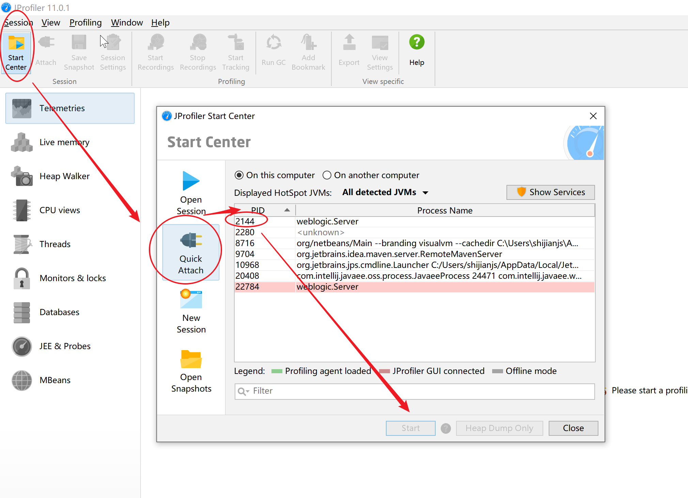
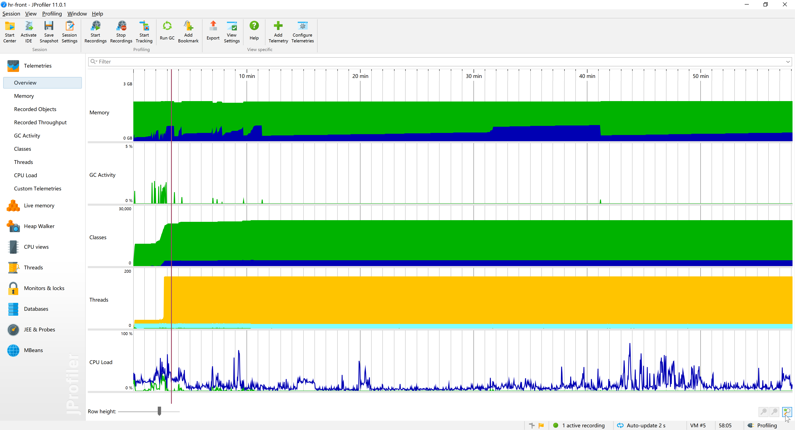
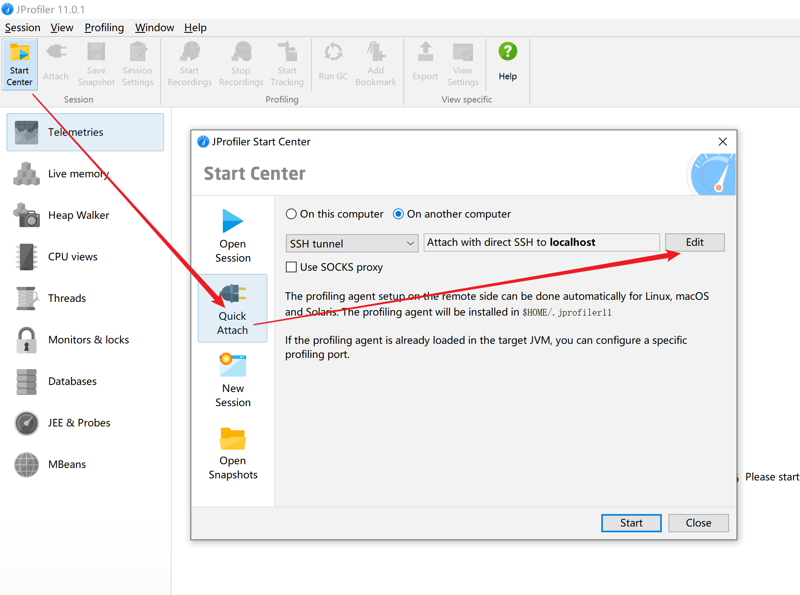
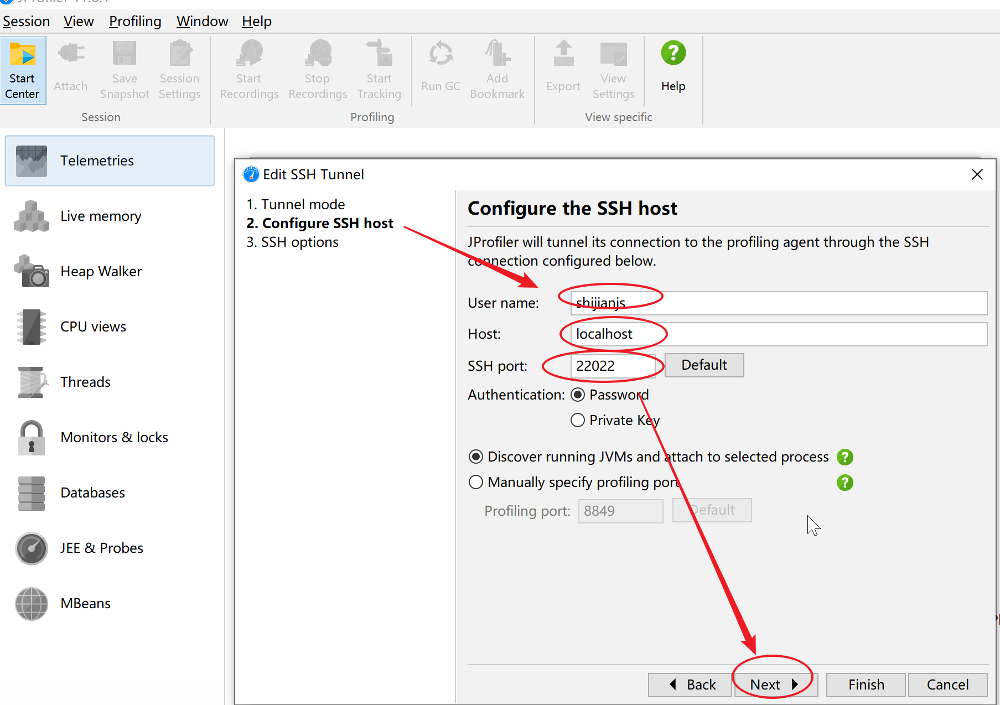
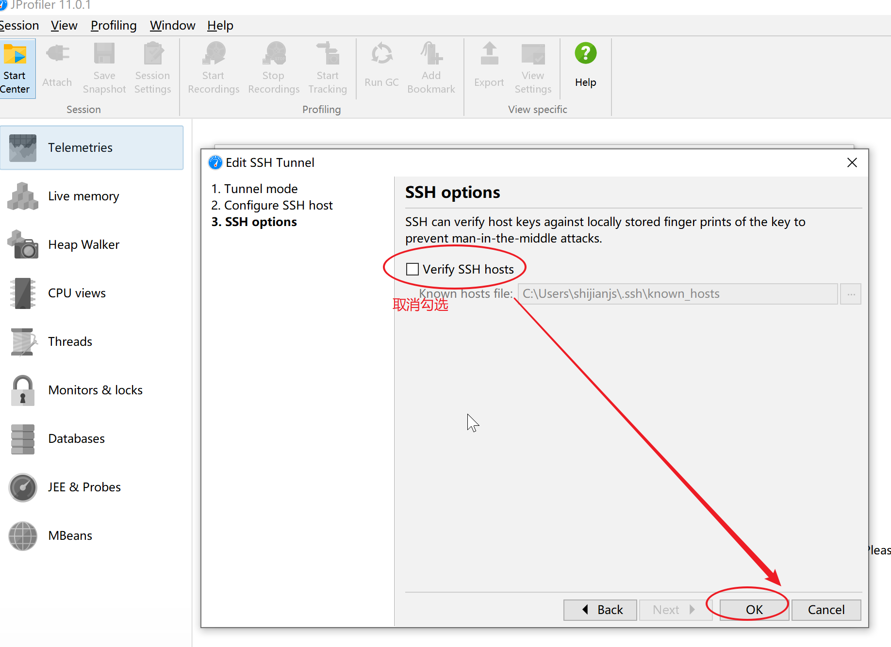
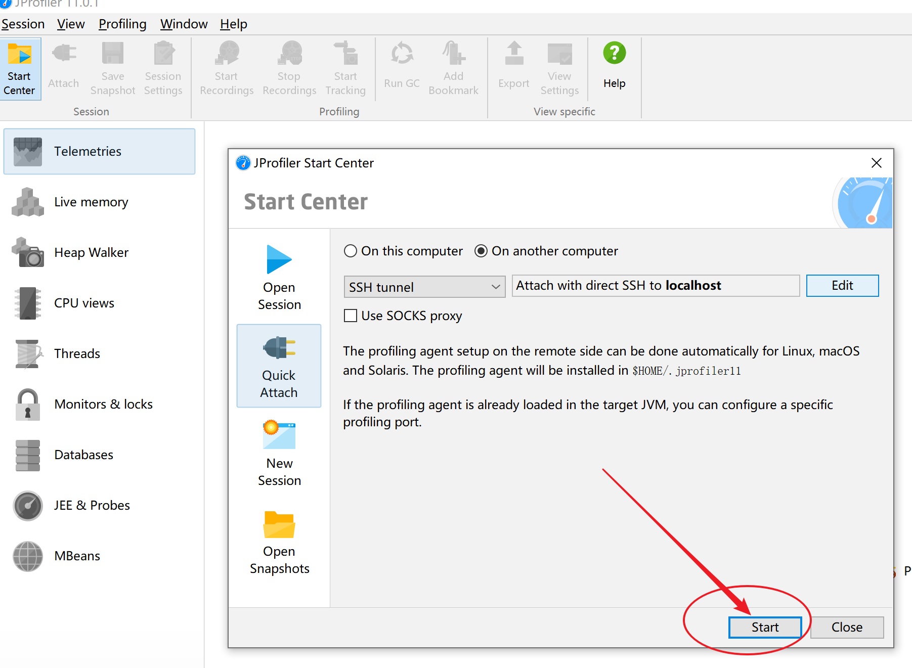
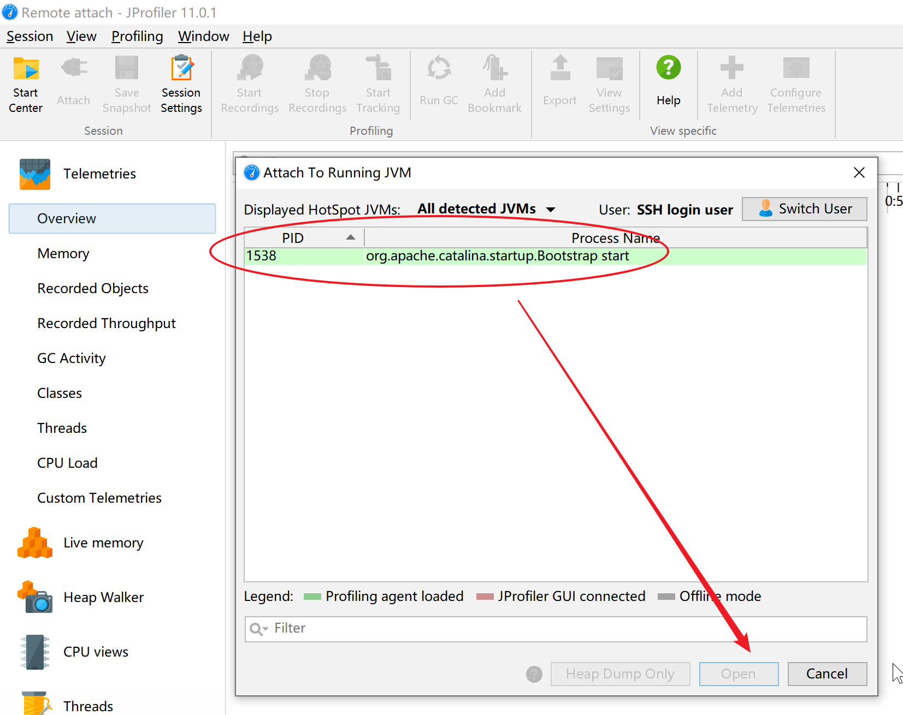
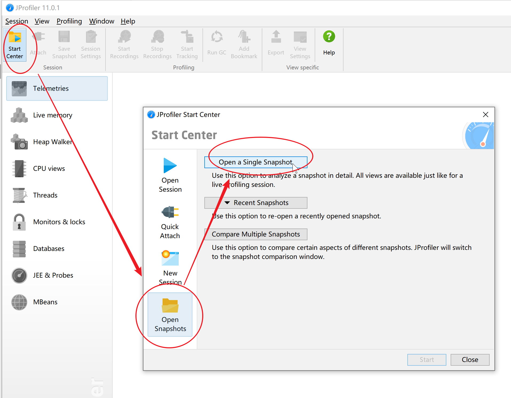
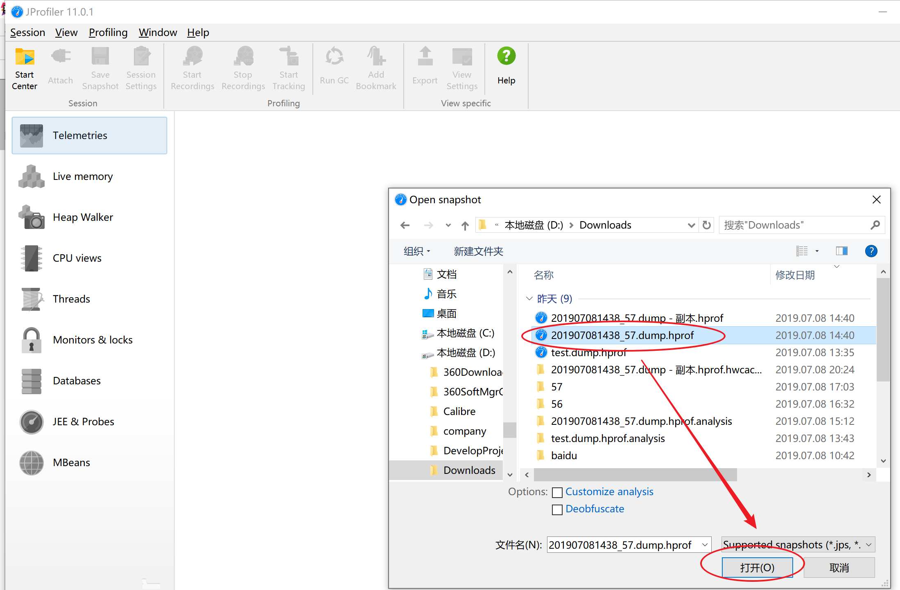
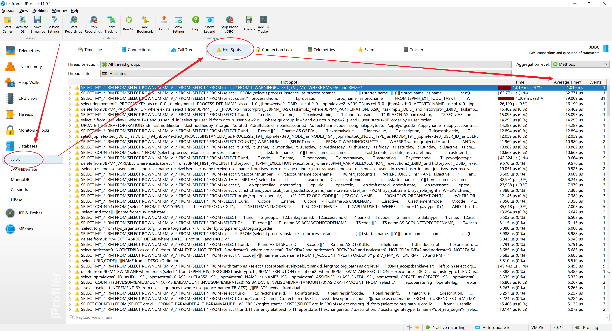

# JProfiler

## 链接

- [官网文档](https://www.ej-technologies.com/resources/jprofiler/help/doc/)
- [官网](https://www.ej-technologies.com/products/jprofiler/overview.html)
- [下载地址](http://10.60.44.54:8000/minio/public/software/jprofiler/)

## 使用

### 连接本地jvm



效果图



### 连接远程jvm

如部署在linux的tomcat、java应用等












### 导入堆dump

1. 使用jps查看进程
    ```bash
    jps -v
    ```
    结果示例：
    ```bash
    22216 Jps -Dapplication.home=/apps/jdk1.8.0_201 -Xms8m
    31868 Server -Xms4096m -Xmx4096m -XX:CompileThreshold=8000 -XX:PermSize=256m -XX:MaxPermSize=512m -Dweblogic.Name=jttss_server01 -Djava.security.policy=/apps/Oracle/Middleware/wlserver_10.3/server/lib/weblogic.policy -Dweblogic.security.SSL.trustedCAKeyStore=/apps/Oracle/Middleware/wlserver_10.3/server/lib/cacerts -Xverify:none -da -Dplatform.home=/apps/Oracle/Middleware/wlserver_10.3 -Dwls.home=/apps/Oracle/Middleware/wlserver_10.3/server -Dweblogic.home=/apps/Oracle/Middleware/wlserver_10.3/server -Dweblogic.management.discover=false -Dweblogic.management.server=http://jttmsvura04.crhd0a.crc.hk:7080 -Dwlw.iterativeDev=false -Dwlw.testConsole=false -Dwlw.logErrorsToConsole=false -Djava.security.egd=file:/dev/./urandom -Dweblogic.ext.dirs=/apps/Oracle/Middleware/patch_wls1036/profiles/default/sysext_manifest_classpath:/apps/Oracle/Middleware/patch_ocp371/profiles/default/sysext_manifest_classpath
    15502 Server -Xms4096m -Xmx4096m -XX:CompileThreshold=8000 -XX:PermSize=256m -XX:MaxPermSize=512m -Dweblogic.Name=AdminServer -Djava.security.policy=/apps/Oracle/Middleware/wlserver_10.3/server/lib/weblogic.policy -Xverify:none -da -Dplatform.home=/apps/Oracle/Middleware/wlserver_10.3 -Dwls.home=/apps/Oracle/Middleware/wlserver_10.3/server -Dweblogic.home=/apps/Oracle/Middleware/wlserver_10.3/server -Dweblogic.management.discover=true -Dwlw.iterativeDev= -Dwlw.testConsole= -Dwlw.logErrorsToConsole= -Dweblogic.ext.dirs=/apps/Oracle/Middleware/patch_wls1036/profiles/default/sysext_manifest_classpath:/apps/Oracle/Middleware/patch_ocp371/profiles/default/sysext_manifest_classpath
    ```

2. 使用`jmap`把堆dump下来，例如：
    ```bash
    jmap -dump:format=b,file=/xxx/xxx.hprof 31868
    ```
    其中：
    - 31868是进程号，上步用jps得到的；
    - file=/xxx/xxx.hprof 是要储存的文件的路径

3. 把dump文件压缩下，可节省约80%的大小，下载到本地，解压。
    ```bash
    zip /xxx/xxx.hprof.zip /xxx/xxx.hprof
    ```
    结果示例：
    ```bash
    -rw------- 1 appuser appgrp 1.6G Jul  8 15:59 jmap_20190708.bin
    -rw-r----- 1 appuser appgrp 224M Jul  8 16:03 jmap_20190708.bin.zip
    ```

4. 打开dump
    
    

### 慢sql

sql语句执行时长监控


