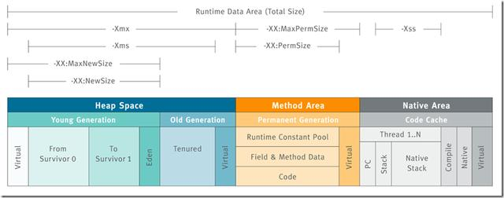

# jvm 启动参数
## 常用参数
### 内存参数设置

* -Xms设置堆的最小空间大小  
* -Xmx设置堆的最大空间大小  
* -Xmn:设置年轻代大小  
* -XX:NewSize设置新生代最小空间大小。  
* -XX:MaxNewSize设置新生代最大空间大小。  
* -XX:PermSize设置永久代最小空间大小。  
* -XX:MaxPermSize设置永久代最大空间大小。  
* -Xss设置每个线程的堆栈大小  
* -XX:+UseParallelGC:选择垃圾收集器为并行收集器。此配置仅对年轻代有效。即上述配置下,年轻代使用并发收集,而年老代仍旧使用串行收集。  
* -XX:ParallelGCThreads=20:配置并行收集器的线程数,即:同时多少个线程一起进行垃圾回收。此值最好配置与处理器数目相等  

### 方法区（Method Area）
方法区也称"永久代"，它用于存储虚拟机加载的类信息、常量、静态变量、是各个线程共享的内存区域 

方法区或永久代相关设置  
-XX:PermSize=64MB 最小尺寸，初始分配  
-XX:MaxPermSize=256MB 最大允许分配尺寸，按需分配   
XX:+CMSClassUnloadingEnabled -XX:+CMSPermGenSweepingEnabled 设置垃圾不回收
-server选项下默认MaxPermSize为64m
-client选项下默认MaxPermSize为32m
  
典型JVM参数配置参考:  
```shell
java -Xmx3550m -Xms3550m -Xmn2g -Xss128k
-XX:ParallelGCThreads=20
-XX:+UseConcMarkSweepGC-XX:+UseParNewGC
```
-Xmx3550m:设置JVM最大可用内存为3550M。

-Xms3550m:设置JVM促使内存为3550m。此值可以设置与-Xmx相同,以避免每次垃圾回收完成后JVM重新分配内存。

-Xmn2g:设置年轻代大小为2G。整个堆大小=年轻代大小+年老代大小+持久代大小。持久代一般固定大小为64m,所以增大年轻代后,将会减小年老代大小。此值对系统性能影响较大,官方推荐配置为整个堆的3/8。

-Xss128k:设置每个线程的堆栈大小。JDK5.0以后每个线程堆栈大小为1M,以前每个线程堆栈大小为256K。更具应用的线程所需内存大 小进行调整。在相同物理内存下,减小这个值能生成更多的线程。但是操作系统对一个进程内的线程数还是有限制的,不能无限生成,经验值在3000~5000 左右


-client  设置jvm使用client模式，特点是启动速度比较快，但运行时性能和内存管理效率不高，通常用于客户端应用程序或者PC应用开发和调试。
-server  设置jvm使server模式，特点是启动速度比较慢，但运行时性能和内存管理效率很高， 适用于生产环境。在具有64位能力的jdk环境下将默认启用该模式，而忽略-client参数

[JVM（Java虚拟机）优化大全和案例实战](https://blog.csdn.net/kthq/article/details/8618052)


## jstack  
进入jdk bin目录下  jstack -l pid > xxx.log  
[jstack命令解析](https://blog.csdn.net/weixin_44588186/article/details/124680586)  
使用jstack需要注意以下几点：  
1. 需要有对Java进程的读取权限，否则会出现“Unable to attach to 1010: Access Denied”错误。         
2. jstack会暂停Java进程中的所有线程，直到打印出所有线程的堆栈信息为止。因此，在生产环境中，需要谨慎使用，避免影响正常业务。      
3. jstack可以将堆栈信息输出到控制台或文件中，可以通过命令行参数指定输出文件路径。       
4. jstack打印的堆栈信息中，会包含大量的Java库、JVM内部方法的调用链，需要结合具体业务代码进行分析，才能发现问题所在。      
5. 总之，jstack是一款非常实用的Java性能分析工具，掌握它的使用方法和技巧，对于定位Java应用程序的性能问题具有很重要的作用。  


## tomcat中间件

在部署tomcat的时候，会修改bin/catalina.sh 脚本

```shell
sed -i '1 a export JAVA_OPTS="-server  -Xms4096m -Xmx4096m -XX:MetaspaceSize=1024M -XX:MaxMetaspaceSize=1024M  -Dfile.encoding=UTF-8"' ${PathUtil.join(installPath, appVersionEnum.getInstallDir(), "bin/catalina.sh")}  """)
```

Xms：是JVM启动申请的初始Heap([堆内存](https://so.csdn.net/so/search?q=%E5%A0%86%E5%86%85%E5%AD%98&spm=1001.2101.3001.7020))值，最小尺寸，初始分配空间。默认当空余堆内存大于70%时，JVM会减小heap的大小到-Xms指定的大小。也就是程序启动时占有内存大小。  

Xmx：是JVM的最大允许的尺寸。也就是是指设定程序运行期间最大可占用的内存大小。。如果程序运行需要占用更多的内存，超出了这个设置值，就会抛出OutOfMemory异常。  


s%-Xms512m -Xmx512m -Xmn256m%-Xmx300m%g"  xms xmx xmn 三个作用
xms   内存的初始大小
xmx   内存的最大大小
Xmn  堆内新生代的大小。通过这个值也可以得到老生代的大小：-Xmx减去-Xmn

-Xms:初始堆大小
-Xmx:最大堆大小
-Xmn:新生代大小


MetaspaceSize：元空间的初始值。  

MaxMetaspaceSize：元空间的最大可占用大小。  

Java8以后，永久代被元空间取代，同时元空间不像永久代一样受制于堆内存，元空间是基于操作系统内存的，理论上讲，可以一直扩展内存直到操作系统的极限，所以设置元空间大小时，建议加上-XX:MaxMetaspaceSize参数，给个范围限制，和-XX:MetaspaceSize参数值一样，一般设置成256M即可，避免元空间占用的内存一直增长。不指定大小的话，随着更多类的创建，虚拟机会耗尽所有可用的系统内存

[元空间（Metaspace）](https://blog.csdn.net/Andrew_Lgx/article/details/130021581)

[JVM 方法区和元空间什么关系？为什么要将永久代替换为元空间？](https://blog.csdn.net/weixin_46228112/article/details/123962019?spm=1001.2101.3001.6650.1&utm_medium=distribute.pc_relevant.none-task-blog-2%7Edefault%7ECTRLIST%7ERate-1-123962019-blog-130021581.235%5Ev38%5Epc_relevant_sort_base1&depth_1-utm_source=distribute.pc_relevant.none-task-blog-2%7Edefault%7ECTRLIST%7ERate-1-123962019-blog-130021581.235%5Ev38%5Epc_relevant_sort_base1&utm_relevant_index=2)


## zookeeper 中间件

```shell
  nohup "$JAVA" $ZOO_DATADIR_AUTOCREATE "-Dzookeeper.log.dir=${ZOO_LOG_DIR}" \
    "-Dzookeeper.log.file=${ZOO_LOG_FILE}" "-Dzookeeper.root.logger=${ZOO_LOG4J_PROP}" \
    -XX:+HeapDumpOnOutOfMemoryError -XX:OnOutOfMemoryError='kill -9 %p' \
    -cp "$CLASSPATH" $JVMFLAGS $ZOOMAIN "$ZOOCFG" > "$_ZOO_DAEMON_OUT" 2>&1 < /dev/null &
```

 -XX:+HeapDumpOnOutOfMemoryError -XX:OnOutOfMemoryError='kill -9 %p'

通过jvm参数-XX:+HeapDumpOnOutOfMemoryError可以让JVM在出现内存溢出时候[Dump](https://so.csdn.net/so/search?q=Dump&spm=1001.2101.3001.7020)出当前的内存转储快照。快照格式为java_pid2821.hprof（2821为Java进程号）


-XX:+HeapDumpOnOutOfMemoryError ：当内存溢出时触发java.lang.OutOfMemo: Java heap space
-XX:HeapDumpPath=/opt/heap·： 内存溢出时，保存内存快照文件

[HeapDumpOnOutOfMemoryError](https://blog.csdn.net/cx1110162/article/details/90403938)


-XX:OnOutOfMemoryError='kill -9 %p'

可以将JVM配置为在抛出OutOfMemoryError时调用任何脚本。大多数情况下，OutOfMemoryError不会使应用程序崩溃。但是，一旦发生OutOfMemoryError，最好重新启动应用程序。因为OutOfMemoryError可能会使应用程序处于不稳定状态。来自不稳定应用程序实例的请求可能导致错误的结果。

例子：

``````shell
-XX:OnOutOfMemoryError=/scripts/restart-myapp.sh
``````

当您传递此参数时，JVM将调用“/scripts/restart-myapp.sh“，每当抛出OutOfMemoryError时编写脚本。在这个脚本中，您可以编写代码来优雅地重新启动应用程序。


## nacos中间件

```shell
if [[ "${MODE}" == "standalone" ]]; then
    JAVA_OPT="${JAVA_OPT} -Xms512m -Xmx512m -Xmn256m"
    JAVA_OPT="${JAVA_OPT} -Dnacos.standalone=true"
else
    if [[ "${EMBEDDED_STORAGE}" == "embedded" ]]; then
        JAVA_OPT="${JAVA_OPT} -DembeddedStorage=true"
    fi
    JAVA_OPT="${JAVA_OPT} -server -Xms2g -Xmx2g -Xmn1g -XX:MetaspaceSize=128m -XX:MaxMetaspaceSize=320m"
    JAVA_OPT="${JAVA_OPT} -XX:-OmitStackTraceInFastThrow -XX:+HeapDumpOnOutOfMemoryError -XX:HeapDumpPath=${BASE_DIR}/logs/java_heapdump.hprof"
    JAVA_OPT="${JAVA_OPT} -XX:-UseLargePages"
fi
```

```shell
# jdk > 9 版本

JAVA_MAJOR_VERSION=$($JAVA -version 2>&1 | sed -E -n 's/.* version "([0-9]*).*$/\1/p')
if [[ "$JAVA_MAJOR_VERSION" -ge "9" ]] ; then
  JAVA_OPT="${JAVA_OPT} -Xlog:gc*:file=${BASE_DIR}/logs/nacos_gc.log:time,tags:filecount=10,filesize=100m"
else
  JAVA_OPT_EXT_FIX="-Djava.ext.dirs=${JAVA_HOME}/jre/lib/ext:${JAVA_HOME}/lib/ext"
  JAVA_OPT="${JAVA_OPT} -Xloggc:${BASE_DIR}/logs/nacos_gc.log -verbose:gc -XX:+PrintGCDetails -XX:+PrintGCDateStamps -XX:+PrintGCTimeStamps -XX:+UseGCLogFileRotation -XX:NumberOfGCLogFiles=10 -XX:GCLogFileSize=100M"
fi
```

-Xms:初始堆大小
-Xmx:最大堆大小
-Xmn:新生代大小

-client  设置jvm使用client模式，特点是启动速度比较快，但运行时性能和内存管理效率不高，通常用于客户端应用程序或者PC应用开发和调试。

-server  设置jvm使server模式，特点是启动速度比较慢，但运行时性能和内存管理效率很高， 适用于生产环境。在具有64位能力的jdk环境下将默认启用该模式，而忽略-client参数。

MetaspaceSize：元空间的初始值。  

MaxMetaspaceSize：元空间的最大可占用大小。 

JVM对一些特定的异常类型做了Fast Throw优化，如果检测到在代码里某个位置连续多次抛出同一类型异常的话，C2会决定用FastThrow方式来抛出异常，而异常Trace即详细的异常栈信息会被清空。这种异常抛出速度非常快，因为不需要在堆里分配内存，也不需要构造完整的异常栈信息。

如果禁用则使用下面的命令

```shell
 -XX:-OmitStackTraceInFastThrow
```

默认不配置  -XX:-OmitStackTraceInFastThrow  能有效缓解日志爆炸占满磁盘，但是降低问题排查效率 


```
-XX:+UseLargePages -XX:LargePageSizeInBytes=2m
```

-XX:+UseLargePages是一种JVM参数，启用此参数后，JVM将会用大页来分配堆空间，从而提高内存访问的效率。大页是指比标准4KB页面大的页面，大页的大小通常为2MB或4MB。使用大页能够有效地减少页表的大小，避免缓存失效，提高内存访问的效率


| -XX:+HeapDumpOnOutOfMemoryError -XX:HeapDumpPath=/opt/tmp/heapdump.txt | 在OOM时自动dump文件, 目录/文件名可自定义                |
| ---------------------------------------- | ---------------------------------------- |
| -Xloggc:/home/log/gc.log -XX:+PrintGCDetails -XX:+PrintGCDateStamps | 打印gc详情, 方便问题排查, 目录/文件名可自定义               |
| -XX:+DisableExplicitGC                   | 禁止显示gc. 不添加可能会导致频繁fgc, 触发stw, 从而导致业务代码运行很慢, 参考[处理报告](http://jira.fingard.com:6002/pages/viewpage.action?pageId=64160024) |


### 常有参数

#### 1.内存相关调整参数

```shell
-Xms3072M 
-Xmx3072M 
-XX:NewRatio=2
-XX:SurvivorRatio=8
```


####2. 收集器

```shell
-XX:+UseParNewGC
-XX:+UseConcMarkSweepGC
```


####3.开启gc日志

```shell
-verbose:gc \
-XX:+PrintGCDetails \
-XX:+PrintGCTimeStamps \
-XX:+PrintGCDateStamps \
-XX:+PrintTenuringDistribution \
-XX:+PrintGCApplicationStoppedTime \
-XX:+PrintGCApplicationConcurrentTime \
-XX:+PrintHeapAtGC \
-Xloggc:$USER_HOME/gc.log \
```


####4. 开启jmx

```shell
-Djava.rmi.server.hostname=IP地址 \
-Dcom.sun.management.jmxremote.port=开启端口 \
-Dcom.sun.management.jmxremote.authenticate=false \
-Dcom.sun.management.jmxremote.ssl=false \
```


<https://mp.weixin.qq.com/s/CPrY2oFQ-_LqBvBt9N2ijw>


### 一键升级配置

```shell
-server 
## -xx：NewRatio：年轻代和老年代相对的比值大小大小，如果设置-XX：NewRatio=4，指标是Young Generation：Old Generation = 1:4，即年轻代为老年代的1/4；
-XX:NewRatio=2 
##收集器
-XX:+UseParNewGC 
-XX:+UseConcMarkSweepGC
##元空间的初始值
-XX:MetaspaceSize=256M 

## 可以用于追踪JVM的内部内存使用，一般在压测调参的时候使用，生产环境不要引入
-XX:NativeMemoryTracking=detail 

-XX:+HeapDumpOnOutOfMemoryError -XX:HeapDumpPath=/tmp/base-authcore.hprof 
-Xmx1024m -Xms1024m 
-Dfile.encoding=UTF-8
```


## 内存设置和查看GC日志

[jvm调优](https://www.cnblogs.com/chiangchou/p/jvm-2.html#_label3)

**1）JVM内存分配有如下一些参数：**

- -Xms：堆内存大小
- -Xmx：堆内存最大大小
- -Xmn：新生代大小，扣除新生代剩下的就是老年代大小
- -Xss：线程栈大小
- -XX:NewSize：初始新生代大小
- -XX:MaxNewSize：最大新生代大小
- -XX:InitialHeapSize：初始堆大小
- -XX:MaxHeapSize：最大堆大小
- -XX:MetaspaceSize：元空间（永久代）大小，jdk1.8 之前用 -XX:PermSize 设置
- -XX:MaxMetaspaceSize：元空间（永久代）最大大小，jdk8 之前用 -XX:MaxPermSize 设置
- -XX:SurvivorRatio：新生代 Eden 区和 Survivor 区的比例，默认为 8，即 8**:**1**:**1

一般 -Xms 和 -Xmx 设置一样的大小，-XX:MetaspaceSize 和 -XX:MaxMetaspaceSize 设置一样的大小。-Xms 等价于 -XX:InitialHeapSize，-Xmx等价于-XX:MaxHeapSize；-Xmn等价于-XX:MaxNewSize

```shell
java -jar -Xms1G -Xmx1G -Xmn512M -Xss1M -XX:MetaspaceSize=128M -XX:MaxMetaspaceSize=128M app.jar
```


**设置GC参数：**

可以在启动时加上如下参数来查看GC日志：

- -XX:+PrintGC：打印GC日志
- -XX:+PrintGCDetails：打印详细的GC日志
- -XX:+PrintGCTimeStamps：打印每次GC发生的时间
- -Xloggc:./gc.log：设置GC日志文件的路径


