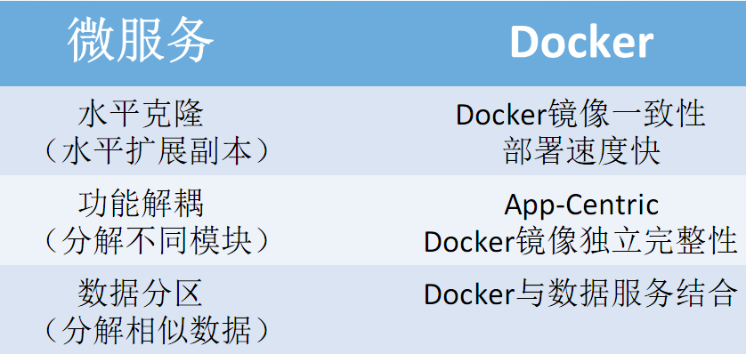
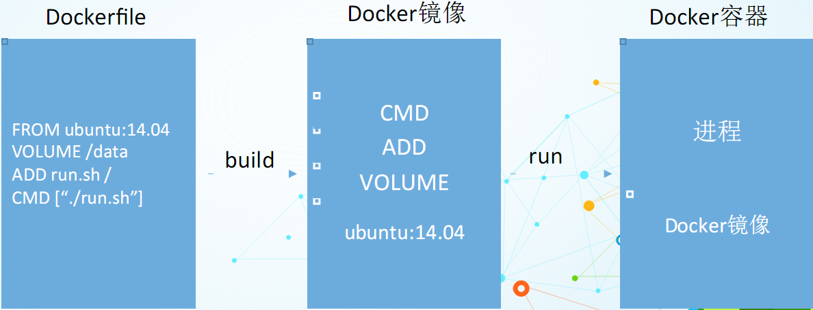

# Docker

1. [Docker 镜像制作教程](make_image.md)
1. [微服务与Docker介绍](https://www.cnblogs.com/wintersun/p/5136385.html)
1. [技术选型之Docker容器引擎](https://segmentfault.com/a/1190000019462392)


1. [作为k8s容器运行时，containerd跟docker的对比](https://cloud.tencent.com/developer/article/1450788)
1. [K8S Runtime CRI OCI contained dockershim 理解](https://blog.csdn.net/u011563903/article/details/90743853)


## Docker Compose

1. [Docker Compose 官网文档](https://docs.docker.com/compose/)
1. [命令行自动补全](https://docs.docker.com/compose/completion/)
1. [命令参考文档](https://docs.docker.com/compose/reference/)
1. [配置文件参考文档](https://docs.docker.com/compose/compose-file/)

```bash
# 新增、更新都用这个；注意加-d，不然log在前台打印，退不出来
docker-compose up -d
# 重启这个compose下所有docker节点
docker-compose restart
# 重启名字是front的节点
docker-compose restart front
# 其他操作
docker-compose ps
docker-compose logs
```

## faq
### 裸docker容器内部获取自身ip
> [如何获取 docker 容器(container)的 ip 地址](https://blog.csdn.net/sannerlittle/article/details/77063800)
```bash
myip=$(cat /etc/hosts | grep `hostname` | awk '{print $1}')
echo myip=$myip
```

```
/ # cat /etc/hosts
127.0.0.1       localhost
::1     localhost ip6-localhost ip6-loopback
fe00::0 ip6-localnet
ff00::0 ip6-mcastprefix
ff02::1 ip6-allnodes
ff02::2 ip6-allrouters
172.17.0.4      92711df8fc90
/ # hostname
92711df8fc90
/ # cat /etc/hosts | grep `hostname`
172.17.0.4      92711df8fc90
/ # cat /etc/hosts | grep `hostname` | awk '{print $1}'
172.17.0.4
/ # a=$(cat /etc/hosts | grep `hostname` | awk '{print $1}')
/ # echo $a
172.17.0.4
```


## 简介

> 参考（copy自）[微服务与Docker介绍](https://www.cnblogs.com/wintersun/p/5136385.html)

## Docker是什么

Docker  是一个开源的应用容器引擎，让开发者可以打包他们的应用以及依赖包到一个可移植的容器中，然后发布到任何流行的 Linux  机器上，也可以实现虚拟化。容器是完全使用沙箱机制，相互之间不会有任何接口（类似 iPhone 的  app）。几乎没有性能开销,可以很容易地在机器和数据中心中运行。最重要的是,他们不依赖于任何语言、框架包括系统。

[image](./images/15172-20160116210746413-1972864801.png)

## Docker包含两方面技术

- 镜像技术
  打破“代码即应用”的观念
  从系统环境开始，自底至上打包应用 


## 微服务和Docker 

- Dev
  - 开发简单有效的模块 
  - 配置是一个运行时的限制
  - 不再是异常复杂的应用

- Ops
  - 管理硬件设施
  - 监控&反馈 
  - 不是应用的执行细节     


结合扩展立方（Scale   Cube）



## Docker化实践 

本质：进程隔离，资源管理

- App-Centric的体现
- Single-Process的真实含义 


### Docker化实践——进程隔离


### Dockerfile、Docker镜像与Docker容器



容器内技术栈：

1. 单进程理念  

2. 不存在传统的init进程（全局PID＝1） 
    - dockerinit与init进程的区别
3. 缺少基本的服务进程
    - cron 
    - rsyslogd等
4. 与内核进程通信能力薄弱（ipc命名空间隔离）
