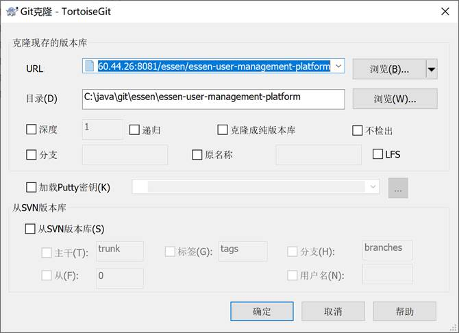
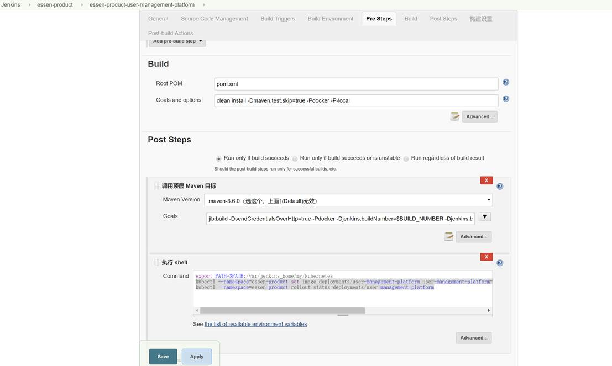
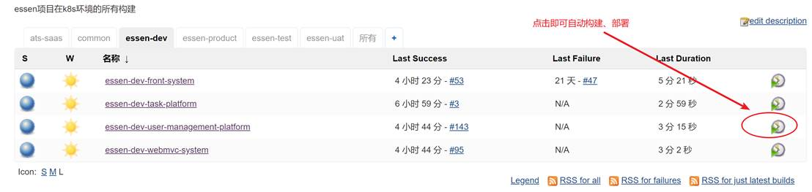
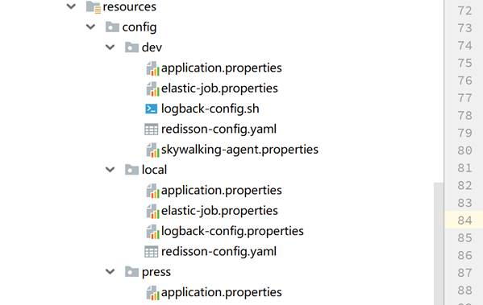
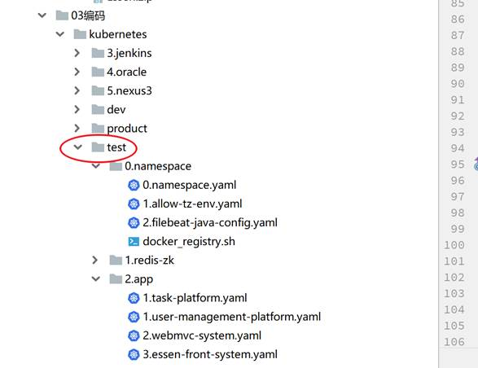
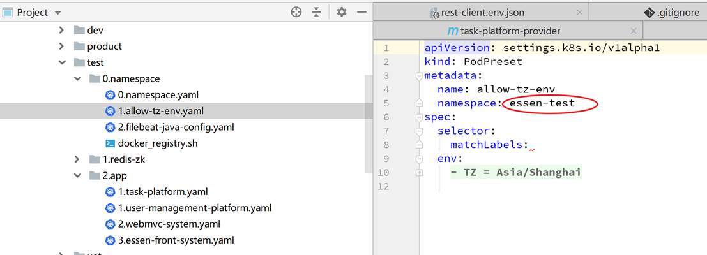
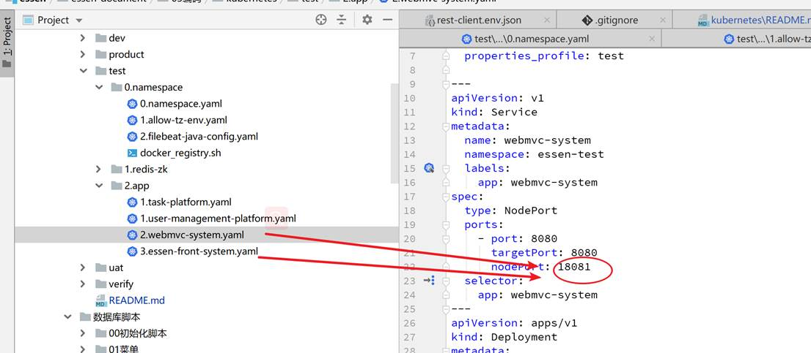

# essen项目部署文档

部署环境：docker、kubernetes集群

项目运行环境：jdk8，tomcat 8.5

## 1    环境信息

### 1.1   硬件

#### 1.1.1  Kubernetes Master节点

| 型号 | Dell PowerEdge R430                              |
| ---- | ------------------------------------------------ |
| 数量 | 2台                                              |
| CPU  | Intel(R) Xeon(R) CPU E5-2620 v4 @ 2.10GHz   16核 |
| 内存 | 64GB                                             |
| 硬盘 | 机械硬盘1TB                                      |
| 作用 | kubernetes master集群管理节点                    |

#### 1.1.2  Kubernetes Worker节点

| 型号 | 盒子机                                      |
| ---- | ------------------------------------------- |
| 数量 | 3台                                         |
| CPU  | Intel(R) Core(TM) i3-3240 CPU @ 3.40GHz 4核 |
| 内存 | 8GB（其中一台4GB）                          |
| 硬盘 | 机械硬盘15GB                                |
| 作用 | 部署项目                                    |

#### 1.1.3  数据库

| 型号 | Dell PowerEdge R430                              |
| ---- | ------------------------------------------------ |
| 数量 | 1台                                              |
| CPU  | Intel(R) Xeon(R) CPU E5-2620 v4 @ 2.10GHz   16核 |
| 内存 | 64GB                                             |
| 硬盘 | 机械硬盘1TB                                      |
| 作用 | 部署oracle数据库                                 |

### 1.2   软件环境

| **软件**                      | **版本号/作用**         |
| ----------------------------- | ----------------------- |
| centos                        | 6.4                     |
| kubernetes                    | 1.13.2                  |
| docker-ce                     | 18.06.1.ce-3.el7        |
| haproxy + keepalived          | kubernetes master高可用 |
| Elasticsearch/Kibana/Filebeat | 6.4.2                   |
| skywalking                    | 5.0.0-GA-FG-SNAPSHOT    |
| nexus3                        | docker registry镜像私服 |
| jenkins                       | 2.150.x                 |
| openjdk                       | 8                       |
| tomcat                        | 8.5                     |
| redis                         | 4                       |
| zookeeper                     | 3.4                     |

 

## 2    部署流程

### 2.1   项目部署的基本流程

（以user-manager为例）

#### 2.1.1  从gitlab拉取项目：



#### 2.1.2  maven编译：

```bash
mvn clean install -Dmaven.test.skip=true -P-local
```

#### 2.1.3  maven jib插件制作镜像并推送到私服

```bash
mvn jib:build -DsendCredentialsOverHttp=true -Pdocker -Djenkins.buildNumber=$BUILD_NUMBER -Djenkins.buildTag=$BUILD_TAG
```

#### 2.1.4  执行kuberentes配置文件

新建环境时需要参考原有的配置文件，新建kubernetes相应的配置。然后运行

 ```bash
kubectl apply -f 1.user-management-platform.yaml
 ```

如果是更新项目的话，直接更新已部署的deployment即可

```bash
kubectl --namespace=essen-product set image deployments/user-management-platform user-management-platform=k8s-test:4800/com.xyyweb.essen/user-management-platform-provider:$BUILD_TAG
kubectl --namespace=essen-product rollout status deployments/user-management-platform
```

### 2.2   jenkins自动部署

以上步骤中，除了新建一个新环境需要运行kubernetes配置文件外，其他步骤均已实现自动化：



 

执行新环境的更新时，直接在jenkins里面点击一个按钮即可。



 

### 2.3   新建一个环境

#### 2.3.1  各子项目复制修改相应的配置文件



或者不在项目源码里面改，直接通过挂载配置文件的方式。

#### 2.3.2  复制一份kubernetes配置文件



 

#### 2.3.3  替换掉原来所有的命令空间



包括filebeat的索引

#### 2.3.4  替换掉webmvc与front项目对外的端口号



至于其他参数，看具体情况修改。

#### 2.3.5  依次执行以下命令

 ```bash
kubectl apply -f 0.namespace
bash 0.namespace/docker_registry.sh
kubectl apply -f 1.redis-zk
kubectl apply -f 2.app
 ```


