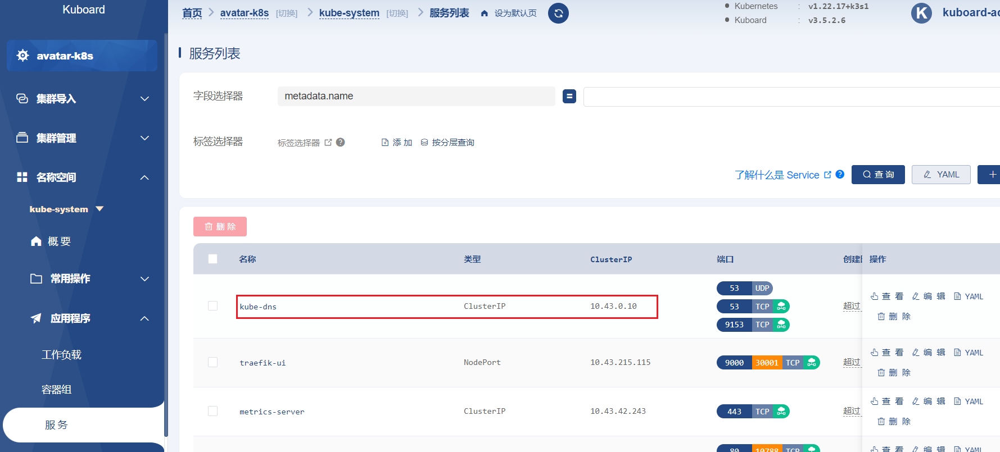
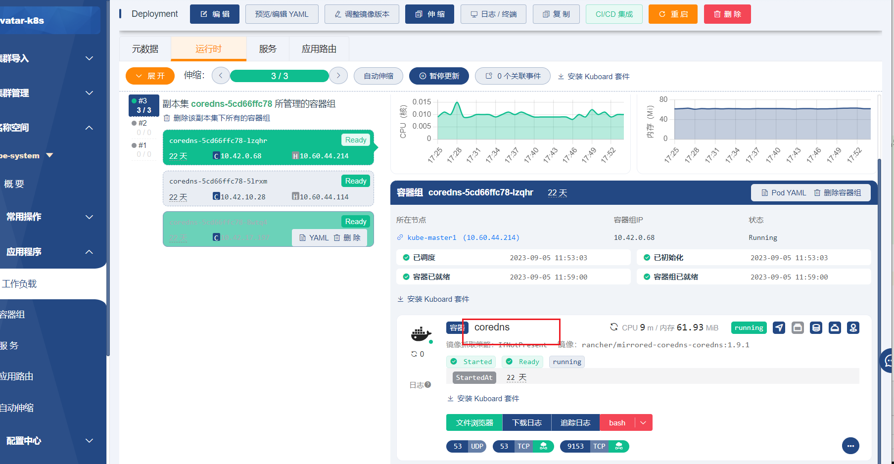
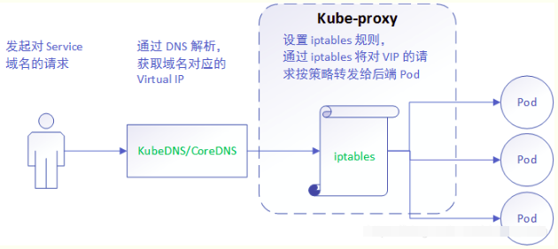

## kubernetes 概述
### kubernetes 基本介绍
> kubernetes，简称 K8s，是用 8 代替 8 个字符“ubernete”而成的缩写。是一个开源的，用于管理云平台中多个主机上的容器化的应用,Kubernetes 提供了应用部署，规划，更新，维护的一种机制。
>
> 1. 传统的应用部署 ： 通过插件或脚本来安装应用，不利于应用的升级更新/回滚等操作，当然也可以通过创建虚拟机的方式来实现某些功能，但是虚拟机非常重，并不利于可移植性
> 2. 容器方式：容器之间互相隔离，可移植性强，Kubernetes 是 Google 开源的一个容器编排引擎，它支持自动化部署、大规模可伸缩、应用容器化管理。

## Pod 
> 一个 Pod 里的多个容器可以共享存储和网络，可以看作一个逻辑的主机。共享的如
> namespace,cgroups 或者其他的隔离资源。  
> 一个 Pod 内的多个容器之间可以通过 localhost 来进行通信  【启动一个容器, 然后将新的容器加入到已有容器的网络中】
> 不同 Pod 内的多个容器之前通信，通常情况下使用 Pod的 IP 进行通信  
> metadata.labels 字段,来为对象添加Label ,  通过 spec.selector来引用对象

### 共享网络  
[k8s 中 pod 是如何做到网络共享的](https://blog.csdn.net/qq_31725391/article/details/130827819)
根容器采用none模式，  其他要加入的容器采用 docker的container模式

### 共享存储
Volumes被定义在pod上，挂载在pod的pause容器上。当业务容器加入时，可以将Volumes挂载到具体的文件目录下，  
进而进行访问和操作。kubernetes通过Volume实现同一个Pod中不同容器之间的数据共享以及数据的持久化存储  
[pod中持久化是挂载在哪里](https://zhuanlan.zhihu.com/p/570130935)


## service
  
服务发现:  
pod与pod 之间是可以通过pod的ip 进行访问的，但pod的重启ip会发生变化，导致 pod对应的ip 不固定，service 解决 ip不固定的问题

域名访问:     
service可以实现“pod的发现和副本间负载均衡”，但访问service也需要ip和端口号，因此又引出了service的发现的问题。      
得益于kube-dns插件，通过修改容器的/etc/resolv.conf配置，使service以域名来访问。  
service 的ip  通过这个 clusterIP: 10.43.135.181 进行配置    
service 生成的 域名 与 service 的 ip 进行 映射    
nacos pod  通过mysql的服务名 找到mysql的service 对应的clusterIP ，后mysql的service会分发给自己的pod  
[Kubernetes（k8s）DNS（CoreDNS）介绍](https://blog.csdn.net/qq_35745940/article/details/120639888)
CoreDNS 是存储 service 生成的 域名 与 service 的 clusterIP 进行 映射


### Ingress
ingress 解决问题：nodeport不能代理https（客户端的角度）；
nodeport需要暴露service所属每个node节点上端口，当需求越来越多，端口数量越多，导致维护成本过高  
ingress yaml 会关联到对应service的服务名
[Ingress的概念和原理](https://blog.csdn.net/m0_46172263/article/details/121079156)
ingress对象 yaml 运行后,内部会调用 ingress-controller负责具体转发的组件，  
ingress-controller并不是k8s自带的组件，实际上ingress-controller只是一个统称，用户可以选择不同的ingress-controller实现  
ingress组件: 公司默认用这个 Traefik  当然还有其他 比如 nginx ingress 


### CoreDNS
```shell
Kubernetes Kube-DNS是Kubernetes集群中用于服务发现和DNS解析的核心组件之一。它负责将服务名称解析为相应的IP地址，并确保服务之间可以通过名称进行通信。

Kube-DNS的工作原理如下：  
1. Kube-DNS部署为一个集群中的Pod，通常在kube-system命名空间中。    
2. 它监听Kubernetes API服务器上的Service和Endpoint对象的变化。  
3. 当Service或Endpoint对象发生变化时，Kube-DNS会更新内部的DNS记录。  
4. Kube-DNS使用CoreDNS作为DNS服务器，它将DNS查询转发给其他Pod和服务。  
5. 当容器内的应用程序尝试通过服务名称访问其他服务时，它会向Kube-DNS发起DNS查询请求。  
6. Kube-DNS将查询转发给CoreDNS，并返回相应的IP地址给应用程序。  
```


[CoreDNS简介（非常详细）](http://c.biancheng.net/view/9842.html)


### cni iptables ivps
Kube-proxy：service 的clusterip，通过kube-proxy（内部iptables NAT来完成转发或ivps映射）负载策略，转发到后端的Pod
[kubernetes 组件之 kube-proxy](https://blog.csdn.net/qq_43762191/article/details/125126090)  
[kube-proxy 详解](https://blog.csdn.net/m0_57223716/article/details/125167416)  
[k8s中iptables与ipvs详解](https://blog.csdn.net/weixin_64124795/article/details/130952239)  
    
[k8s 中的 service 如何找到绑定的 Pod](https://www.cnblogs.com/ricklz/p/16796385.html)  
```shell
k8s 中的负载均衡主要借助于 endpoint 和 kube-proxy 来实现；

endpoint 是 k8s 集群中的一个资源对象，存储在 etcd 中，用来记录一个 service 对应的所有 pod 的访问地址，当一个 service 关联的 pod 被删除，更新，新增，对应的 endpoint 资源都会更新；

kube-proxy 是 Kubernetes 的核心组件，部署在每个 Node 节点上，它是实现 Kubernetes Service 的通信与负载均衡机制的重要组件; kube-proxy 负责为 Pod 创建代理服务，从 apiserver 获取所有 server 信息，并根据 server 信息创建代理服务，实现server到Pod的请求路由和转发，从而实现K8s层级的虚拟转发网络；

kube-proxy 的路由转发规则是通过其后端的代理模块实现的，其中 kube-proxy 的代理模块目前有四种实现方案，userspace、iptables、ipvs、kernelspace ；

service 的 endpoints 和 kube-proxy 解决了容器的发现和负载均衡的问题，但是 service 服务如何被内部的服务找到呢，Kubernetes 支持两种基本的服务发现模式 —— 环境变量和 DNS；
```

跨主机通信：    
CNI 只关心 Pod IP   让 pod之间跨主机访问  
[部署 CNI网络组件](https://blog.csdn.net/qzzqzzqzz111/article/details/131472495)  


##Replication Controller

1.ReplicaSet 支持集合式的 selector（ReplicationController 仅支持等式）


> Horizontal Pod Autoscal(Pod 横向扩容 简称 HPA)与 RC、Deployment 一样，也属于一种Kubernetes 资源对象。


>  自动模式则需要用户根据某个性能指标或者自定义业务指标，并指定 **Pod 副本数量的范围**，系统将自动在这个范围内根据性能指标的变化进行调整。


自动扩容和缩容

>  HPA 控制器基本 Master 的 kube-controller-manager 服务启动参数  --horizontal-pod-autoscaler-sync-period 定义的时长(默认值为 30s), 周期性地监测 Pod 的 CPU 使用率，并在满足条件时对 RC 或 Deployment 中的 Pod 副本数量进行调整，以符合用户定义的平均Pod  CPU使用率

``````yaml
apiVersion: autoscaling/v1
kind: HorizontalPodAutoscaler
metadata:
  name: :nginx-hpa
spec:
  maxReplicas: 10
  minReplicas: 1
  scaleTargetRef:
    apiVersion: app/v1betal
    kind: Deployment
    name: nginx-deplyment
  targetCPUUtilizationPercentage: 50
``````

## Volume

1. emptyDir 类型的 volume创建于pod被调度到某个宿主机上的时候，而同一个 pod 内的容器都能读写 emptyDir 中的同一个文件。一旦这个 pod 离开了这个宿主机，EmptyDir 中的数据就会被永久删除。所以目前 EmptyDir 类型的 volume 主要用作临时空间，比如 Web 服务器写日志或者 tmp 文件需要的临时目录。

```yaml
apiVersion: v1
kind: Pod
metadata:
  name: test-pd
spec:
  containers:
    - name: test-container
      image: docker.io/nazarpc/webserver
      volumeMounts:
        - mountPath: /cache
          name: cache-volume
  volumes:
    - name: cache-volume
      emptyDir:
        { }
```

2. hostPath  使得对应的容器能够访问当前宿主机上的指定目录

```yaml
   apiVersion: v1
   kind: Pod
   metadata:
     name: test-pd
   spec:
     containers:
       - name: test-container
         image: docker.io/nazarpc/webserver
         volumeMounts:
           - mountPath: /test-pd
             name: test-volume
     volumes:
       - name: test-volume
         hostPath:
           path: /data
```

  

## PVC 和 PV

PersistentVolume（PV）是集群中由管理员配置的一段网络存储,PV 是容量插件，如 Volumes，但其生命周期独立于使用 PV 的任何单个 pod。 此 API 对象捕获存储实现的详细信息，包括 NFS，iSCSI 或特定于云提供程
序的存储系统。  

> 通过这个 API可以查看集群中存储是怎么存储的，以什么方式存储
>
> PV 就是一个集群的网络存储  类似硬盘

PersistentVolumeClaim（PVC）是由用户进行存储的请求。 它类似于 pod。Pod 消耗节点
资源，PVC 消耗 PV 资源，Pod 可以请求特定级别的资源（CPU 和内存）。声明可以请求特
定的大小和访问模式（例如，可以一次读/写或多次只读）

PV 是群集中的资源。PVC 是对这些资源的请求，并且还充当对资源的检查。PV 和 PVC 之间
的相互作用遵循以下生命周期：

Provisioning ——>  Binding ——– >Using —— >Releasing ——>Recycling

Provisioning: 集群外的存储系统或者云平台来提供存储持久化


## 节点调度亲和性

节点亲和性规则：硬亲和性 required 、软亲和性 preferred

硬亲和性规则不满足时，Pod 会置于 Pending 状态，

软亲和性规则不满足时，会选择一个不匹配的节点。当节点标签改变而不再符合此节点亲和性规则时，不会将 Pod 从该节点移出，仅对新建的 Pod 对象生效

### 节点硬亲和性

```requiredDuringSchedulingIgnoredDuringExecution```

方式一：Pod 使用 spec.nodeSelector (基于等值关系)

方式二：Pod 使用 spec.affinity 支持 matchExpressions 属性 (复杂标签选择机制)

```yaml
kubectllabelnodeskube-nodelzone=foo

apiVersion: v1
kind: Pod
metadata:
  name: with-required-nodeaffinity
spec:
  affinity:
    nodeAffinity:
      requiredDuringSchedulingIgnoredDuringExecution:
        nodeSelectorTerms:
          - matchExpressions:
              - key: zone
                operator: In
                values:
                  - foo
  containers:
    - name: myapp
      image: ikubernetes/myapp:v1
```

###  节点软亲和性

```preferredDuringSchedulingIgnoredDuringExecution```

柔性控制逻辑，当条件不满足时，能接受被编排于其他不符合条件的节点之上
权重 weight 定义优先级，1-100 值越大优先级越高

```yaml
apiVersion: apps/v1
kind: Deployment
metadata:
  name: myapp-deploy-with-node-affinity
spec:
  replicas: 2
  selector:
    matchLabels:
      app: myapp
  template:
    metadata:
      name: myapp-pod
      labels:
        app: myapp
    spec:
      affinity:
        nodeAffinity:
          preferredDuringSchedulingIgnoredDuringExecution:
            - weight: 60
              preference:
                matchExpressions:
                  - key: zone
                    operator: In
                    values:
                      - foo
            - weight: 30
              preference:
                matchExpressions:
                  - key: ssd
                    operator: Exists
                    values: [ ]
      containers:
        - name: myapp
          image: ikubernetes/myapp:v1
```

##  Pod 资源亲和调度

pod 对象间亲和性，将一些 Pod 对象组织在相近的位置(同一节点、机架、区域、地区)
Pod 对象间反亲和性，将一些 Pod 在运行位置上隔开
### pod 硬亲和调度

```requiredDuringSchedulingIgnoredDuringExecution```

Pod 亲和性描述一个 Pod 与具有某特征的现存 Pod 运行位置的依赖关系；即需要事先存在
被依赖的 Pod 对象

```yaml
apiVersion: v1
kind: Pod
metadata:
  name: with-pod-affinity
spec:
  affinity:
    podAffinity:
      requiredDuringSchedulingIgnoredDuringExecution:  #硬亲和调度
        - labelSelector:
            matchExpressions:   # 集合选择器
              - key: app
                operator: In
                values:
                  - tomcat       # 上面意思是，当前 pod 要跟标签为 app 值为tomcat的pod在一起
          topologyKey: kubernetes.io/hostname   #根据挑选出的Pod所有节点的 hostname作为同一位置的判定
  containers:
    - name: myapp
      image: ikubbernetes/myapp:v1
```

### Pod 软亲和调度

```yaml
apiVersion: apps/v1
kind: Deployment
metadata:
  name: myapp-with-preferred-pod-affinity
spec:
  replicas: 3
  selector:
    matchLabels:
      app: myapp
  template:
    metadata:
      name: myapp
      labels:
        app: myapp
    spec:
      affinity:
        podAffinity:
          preferredDuringSchedulingIgnoredDuringExecution:   # 80% 可能让 pod 要跟标签为 app 值为cache的pod在一起
            - weight: 80
              podAffinityTerm:
                labelSelector:
                  matchExpressions:
                    - key: app
                      operator: In
                      values:
                        - cache
                topologyKey: zone
            - weight: 20
              podAffinityTerm:
                labelSelector:
                  matchExpressions:
                    - key: app
                      operator: In
                      values:
                        - db
                topologyKey: zone
      containers:
        - name: myapp
          image: ikubernetes/myapp:v1
```

### pod 反亲和调度

Pod 反亲和调度用于分散同一类应用，调度至不同的区域、机架或节点等将 spec.affinity.podAffinity 替换为 spec.affinity.podAntiAffinity

反亲和调度也分为柔性约束和强制约束

```yaml
apiVersion: v1
kind: Pod
metadata:
  name: pod-second
  labels:
    app: backend
    tier: db
spec:
  affinity:
    podAntiAffinity:   #反
      requiredDuringSchedulingIgnoredDuringExecution:    #硬亲和调度
        - topologyKey: zone    #根据挑选出的 Pod 所有节点的 hostname作为同一位置的判定
          labelSelector:
            matchExpressions:   #意思就是这个pod强制与myapp 不在一个区域，避免之间冲突
              - key: app
                operator: In
                values:
                  - myapp
```

### 什么是topology key ？

pod亲和性调度需要各个相关的pod对象运行于"同一位置"， 而反亲和性调度则要求他们不能运行于"同一位置"，

这里指定“同一位置” 是通过 topologyKey 来定义的，topologyKey 对应的值是 node 上的一个标签名称，比如各别节点zone=A标签，各别节点有zone=B标签，pod affinity topologyKey定义为zone，那么调度pod的时候就会围绕着A拓扑，B拓扑来调度，而相同拓扑下的node就为“同一位置”。

如果基于各个节点kubernetes.io/hostname标签作为评判标准，那么很明显“同一位置”意味着同一节点，不同节点既为不同位置，
一般用于：

```
1. 我启动一个pod，希望（亲和性）或不希望（反亲和性）调度一台node上，并且这台node上有service=nginx标签的pod
2. 我启动一个2个副本控制器，pod标签为service=tomcat，可以调度到任意node上，不希望两个pod调度到同一个node上
```

需求：当前有两个机房（ beijing，shanghai），需要部署一个nginx产品，副本为两个，为了保证机房容灾高可用场景，需要在两个机房分别部署一个副本

```yaml
apiVersion: apps/v1
kind: StatefulSet
metadata:
  name: nginx-affinity-test
spec:
  serviceName: nginx-service
  replicas: 2
  selector:
    matchLabels:
      service: nginx
  template:
    metadata:
      name: nginx
      labels:
        service: nginx
    spec:
      affinity:
        podAntiAffinity:
          requiredDuringSchedulingIgnoredDuringExecution:
          - labelSelector:
              matchExpressions:
              - key: service
                operator: In
                values:
                - nginx
            topologyKey: zone
      containers:
      - name: nginx
        image: contos7:latest
        command:
        - sleep
        - "360000000"
```

##污点和容忍度

污点 taints 是定义在节点上的键值型属性数据，用于**让节点拒绝将 Pod 调度运行于其上**
除非 Pod 有接纳节点污点的容忍度容忍度 
tolerations 是定义在 Pod 上的键值属性数据，用于配置可容忍的污点
调度器将 Pod 调度至其能容忍该节点污点的节点上或没有污点的节点上

使用 PodToleratesNodeTaints 预选策略和  TaintTolerationPriority 优选函数完成该机
制

节点亲和性使得 Pod 对象被吸引到一类特定的节点 (nodeSelector 和 affinity)

污点提供让节点排斥特定 Pod 对象的能力

1.  定义污点和容忍度

   污点定义于 nodes.spec.taints    容忍度定义于 pods.spec.tolerations
   语法： key=value : effect

2. effect 定义排斥等级

   NoSchedule，不能容忍，但仅影响调度过程，已调度上去的 pod 不受影响，仅对新增加的
   pod 生效。

   PreferNoSchedule，柔性约束，节点现存 Pod 不受影响，如果实在是没有符合的节点，也
   可以调度上来。

   NoExecute，不能容忍，当污点变动时，Pod 对象会被驱逐

3. 在 Pod 上定义容忍度时
   等值比较 容忍度与污点在 key、value、effect 三者完全匹配
   存在性判断 key、effect 完全匹配，value 使用空值
   一个节点可配置多个污点，一个 Pod 也可有多个容忍度

4.   管理节点的污点

给节点添加污点
```yaml
kubectl taint node <node-name><key>=<value>:<effect>
kubectl taint node node2 node-type=production:NoShedule #举例
```

查看节点污点

```yaml
kubectl get nodes <nodename> -o go-template={{.spec.taints}}
```

删除节点污点

```yaml
kubectl taint node <node-name><key>[:<effect>]-
# 删除 key 为 node-type，effect 为 NoSchedule 的污点
kubectl taint node kube-node1 node-type:NoSchedule-
# 删除 key 为 node-type 的所有污点
kubectl taint node kube-node1 node-type-
# 删除所有污点 
kubectl patch nodes <node-name> -p '{"spec":{"taints":[]}}
kubectl patch nodes kube-node1 -p '{"spec":{"taints":[]}}
```

给 Pod 对象容忍度
```yaml
spec.tolerations   字段添加
tolerationSeconds   用于定义延迟驱逐 Pod 的时长
```

等值判断

```yaml
tolerations:
- key:"key1"
operator:"Equal" #判断条件为 Equal
value:"value1"
effect:"NoExecute"
tolerationSeconds:3600
```

存在性判断

```yaml
tolerations:
- key:"key1"
operator:"Exists" #存在性判断，只要污点键存在，就可以匹配
effect:"NoExecute"
tolerationSeconds:3600
```


## helm

微服务应用，组成应用的服务可能多达十个，几十个。如果有更新或回滚应用的需求，可能要修改和维护所涉及的大量对应yaml部署文件，而这种组织和管理应用的方式就显得力不从心了。且由于缺少对发布过的应用版本管理和控制，使Kubernetes 上的应用维护和更新等面临诸多的挑战。

helm 有3个重要概念
1.helm: 一个命令行客户端工具，主要用于kubernetes应用chart的创建、打包、发布和管理
2.Chart: 应用描述,一系列用于描述k8s资源相关文件的集合
3.Release：基于 Chart 的部署实体，一个 chart 被 Helm 运行后将会生成对应的一个release；将在 k8s 中创建出真实运行的资源对象。

helm常有命令
| 命令         | 描述                                       |
| ---------- | ---------------------------------------- |
| create     | 创建一个 chart 并指定名字                         |
| dependency | 管理 chart 依赖                              |
| get        | 下载一个 release。可用子命令：all、hooks、manifest、notes、values |
| history    | 获取 release 历史                            |
| install    | 安装一个 chart                               |
| list       | 列出 release                               |
| package    | 将 chart 目录打包到 chart 存档文件中                |
| pull       | 从远程仓库中下载 chart 并解压到本地  # helm pull stable/mysql -- |
| repo       | 添加，列出，移除，更新和索引 chart 仓库。可用子命令：add、index、 |
| rollback   | 从之前版本回滚                                  |
| search     | 根据关键字搜索 chart。可用子命令：hub、repo             |
| show       | 查看 chart 详细信息。可用子命令：all、chart、readme、values |
| status     | 显示已命名版本的状态                               |
| template   | 本地呈现模板                                   |
| uninstall  | 卸载一个 release                             |
| upgrade    | 更新一个 release                             |
| version    | 查看 helm 客户端版本                            |
|            |                                          |
|            |                                          |


