# 连接k8s内网vpn教程

由于项目向zookeeper等注册中心注册的ip是k8s虚拟内网ip，比如`10.244.x.x`，开发主机识别不了这个ip地址， 
连接不到通过注册中心注册的服务，所以采用vpn的方式将特定ip地址的解析映射进k8s内网。 

## Windows连接vpn

### 点到设置vpn的地方
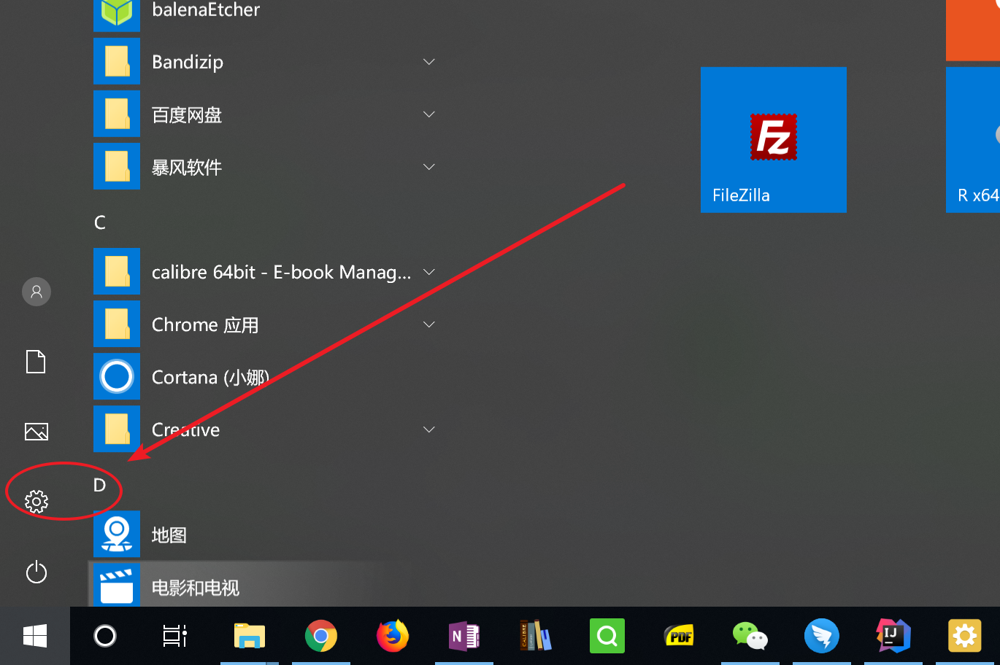

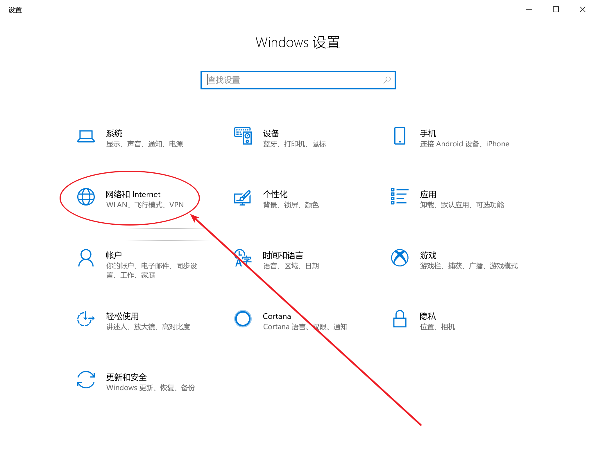

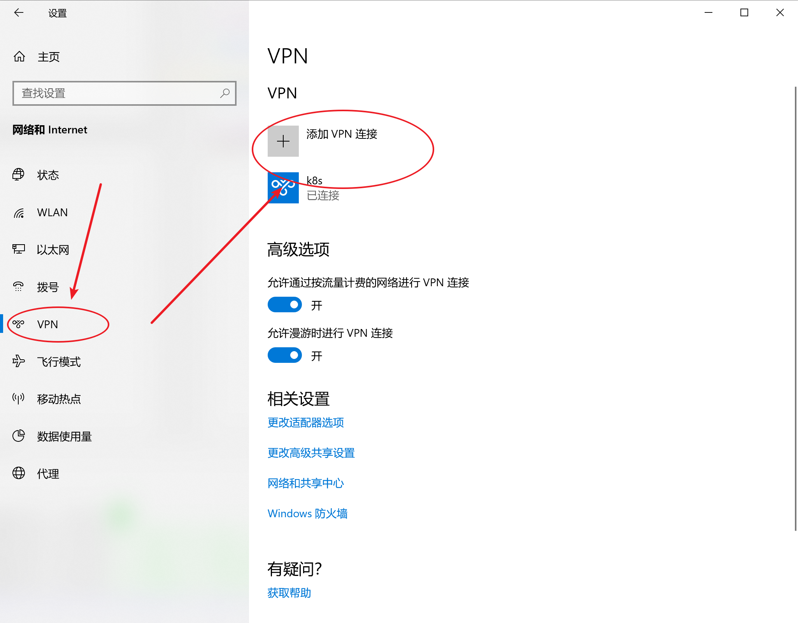


### 添加vpn填写信息
1. 服务器名称或地址：`10.60.44.216`
1. 连接名称：`k8s`
1. VPN类型：`[使用预共享秘钥的L2TP/IPSec PSK]`
1. 预共享密码：`abcdefg`
1. 登录信息类型：`用户名和密码`
1. 用户名：`user1`
1. 密码：`123456`
1. 勾选中记住我的登录信息
1. 点保存

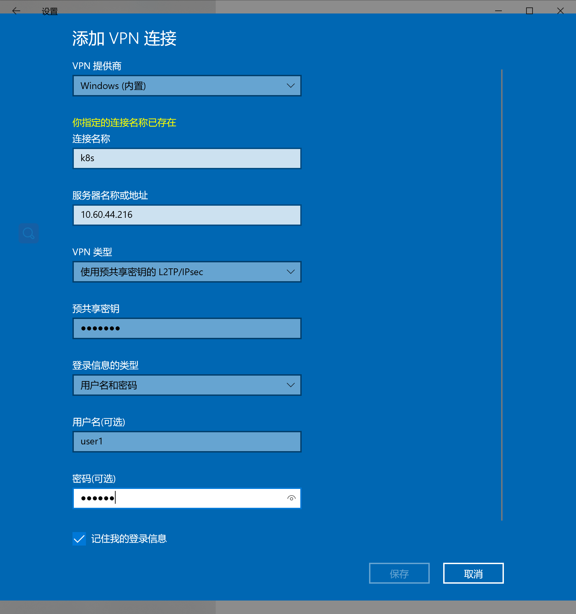


### 解决windows连接不上的问题
一般来讲，通过上述步骤，就可以连接上vpn了，但windows的系统设置有点坑，还需要改一波配置。
1. 配置几个注册表：
    - 一个个双击reg文件夹下面的注册表文件，这四个注册表文件手动点一遍
        - 注册表文件下载：[Fix_VPN_Error_809_Allow_IPsec_Reboot_Required.reg](./reg/Fix_VPN_Error_809_Allow_IPsec_Reboot_Required.reg)
        - 注册表文件下载：[Fix_VPN_Error_809_Windows_Vista_7_8_10_Reboot_Required.reg](./reg/Fix_VPN_Error_809_Windows_Vista_7_8_10_Reboot_Required.reg)
        - 注册表文件下载：[Fix_VPN_Error_AllowL2TPWeakCrypto.reg](./reg/Fix_VPN_Error_AllowL2TPWeakCrypto.reg)
        - 注册表文件下载：[Fix_VPN_Error_AllowPPTPWeakCrypto.reg](./reg/Fix_VPN_Error_AllowPPTPWeakCrypto.reg)
    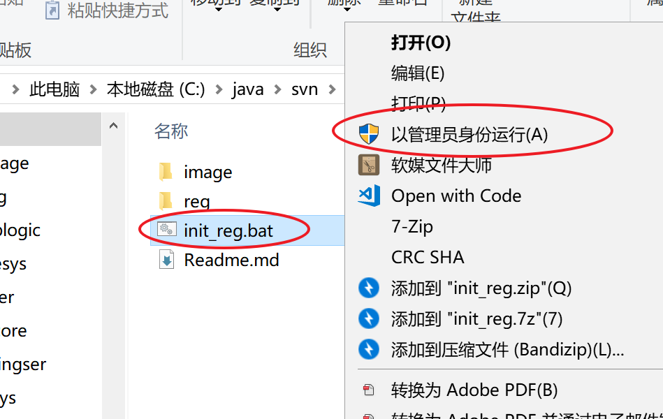
2. 双击打开网络连接的快捷方式： `网络连接 - 快捷方式.lnk`
3. 去掉两个网卡的`ipv6`，一个是物理网卡，一个是刚才新建的vpn网卡

    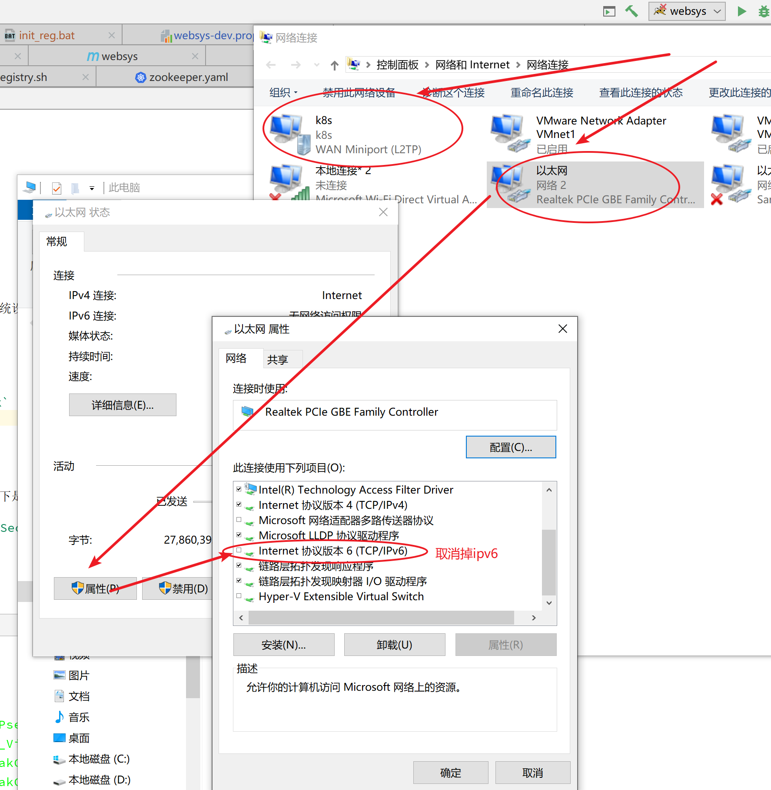
4. 设置vpn网卡的安全选项，把3个复选框都勾上

    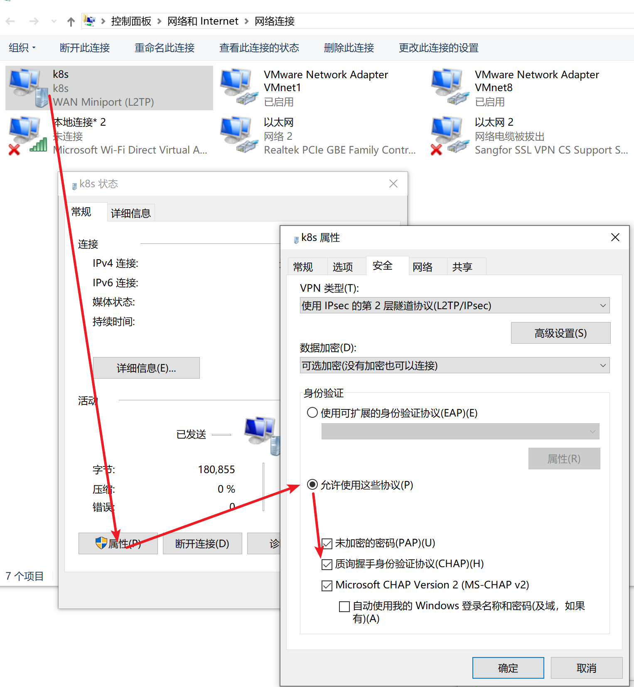
    
5. 等之后能够连接上vpn后，随意固定一个大点的ip
    两个dns地址：
    
    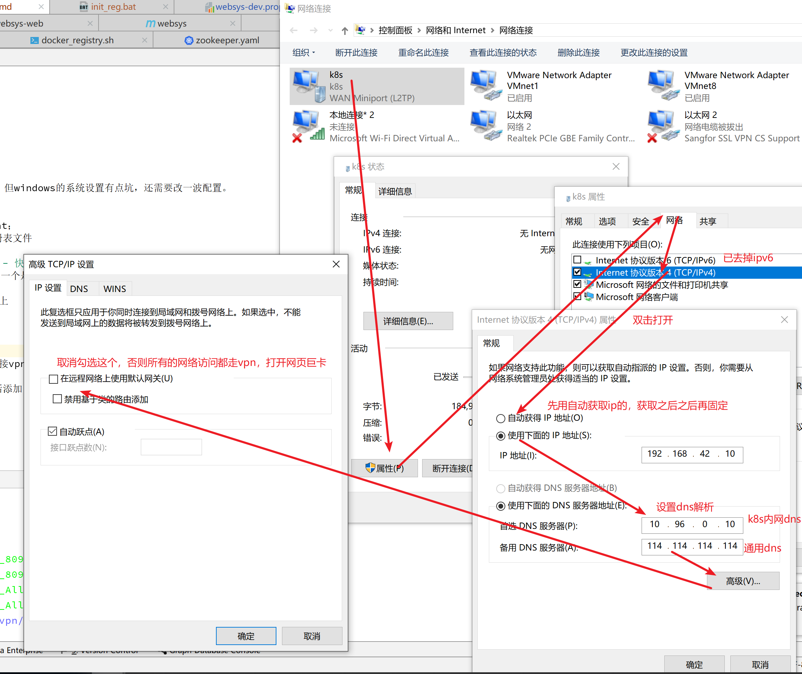
6. 关掉防火墙，关掉360（最好禁用掉360开机自启）
7. 设置完保存后，重启电脑
8. 连接vpn
    
    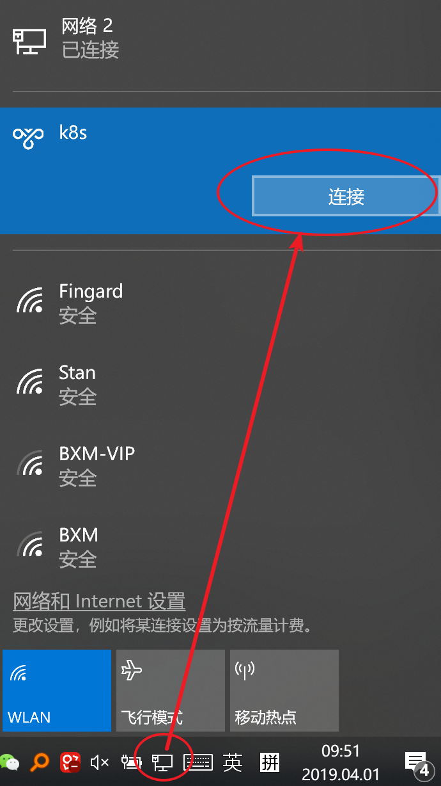
9. 还是无法连接vpn？

    无论此时是否报的是"不能建立到远程计算机的连接,你可能需要更改此连接的网络设置"或其他各种各样的奇怪问题，可以尝试一下重置网卡驱动。

    网卡的驱动可能配置不当。公司有人两台电脑都连不上vpn，一台通过重装系统，另一台通过重置网卡驱动，两种方式都解决了问题。
    
    操作前请确保这台电脑上至少有无线网卡和有线网卡两个网络适配器的驱动程序文件备份，以便可以方便还原。可以通过360驱动大师等驱动管理程序备份还原。
    
    操作步骤：打开windows设备管理器>找到网络适配器>右键卸载节点下所有设备>还原驱动>再次尝试是否可以连接vpn

    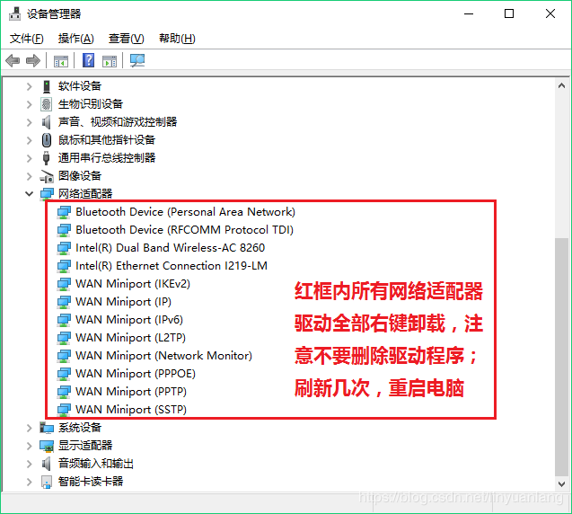
   
10. 此时vpn已经连上，再命令行运行`ipconfig`，获取vpn网卡的ip地址，在第5步的地方固定下ip。
    随便使用一个`192.168.42.*`网段的ip即可，尽量选一个大点的ip，避免冲突。
    使用dns地址：`10.96.0.10`，`114.114.114.114`。
    
    如果实在是连不上，在物理网卡上面也添加这个DNS：`10.96.0.10`
    
    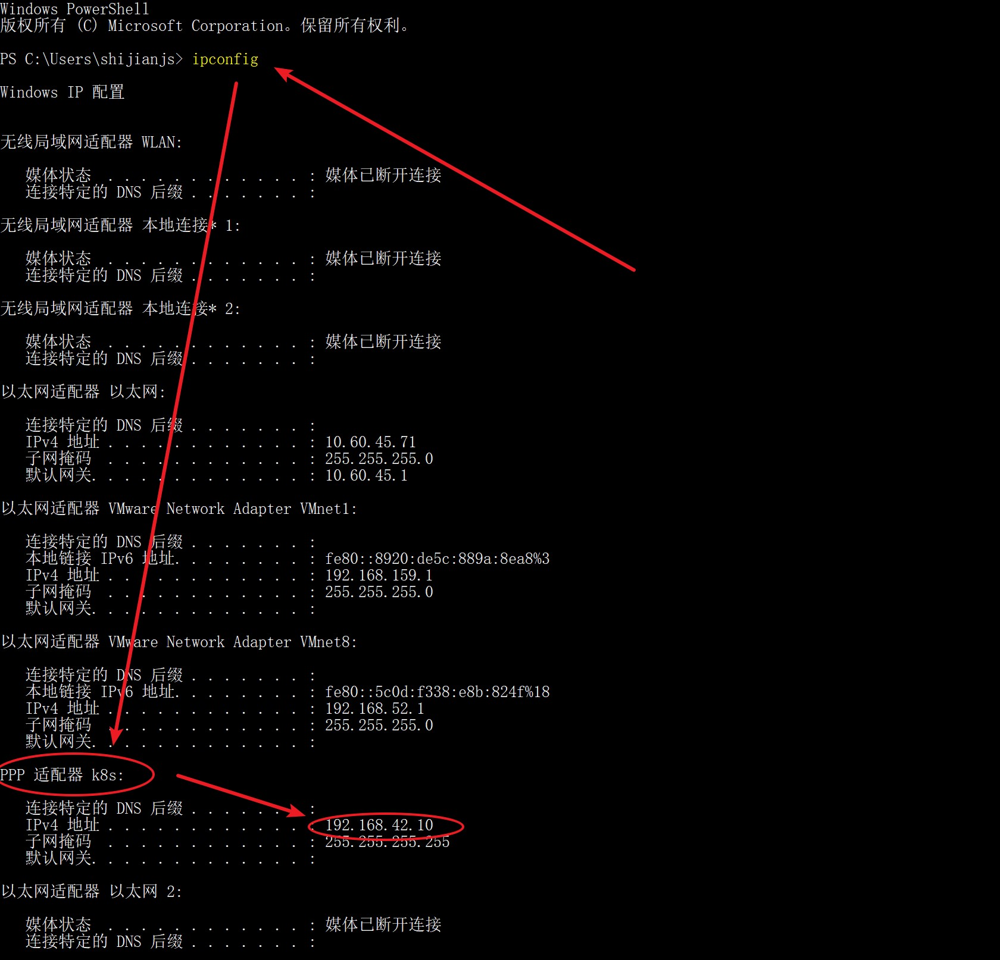
11. 以管理员身份进入命令行，把 `192.168.42.10` 替换成才vpn固定的ip。
```
route add -p 10.96.0.0 mask 255.240.0.0 192.168.42.10
route add -p 10.244.0.0 mask 255.255.0.0 192.168.42.10
```
### 测试
测试vpn，浏览器打开：<http://kibana.default.svc.cluster.local:5601>

### 之后连接vpn
以上是初始化步骤，之后连接vpn只需要像连接wifi那样在windows右下角网络那里点下连接就好。

## 检测vpn服务是否正常
windows由于系统设置的原因，可能不能正常连接vpn，可以检测下是不是服务端的问题。

使用Android手机试验，先连接公司wifi，然后添加 `L2TP/IPSec PSK` 类型的vpn，信息同上。
