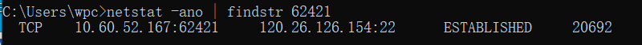
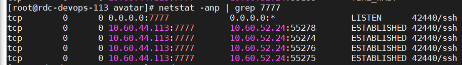
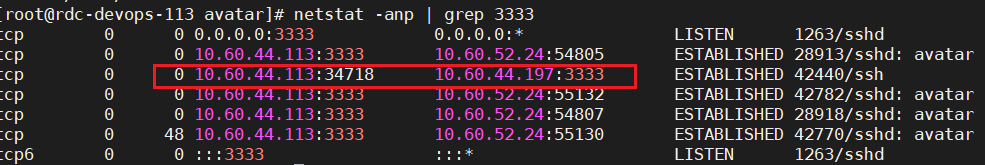
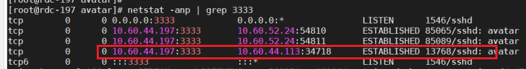
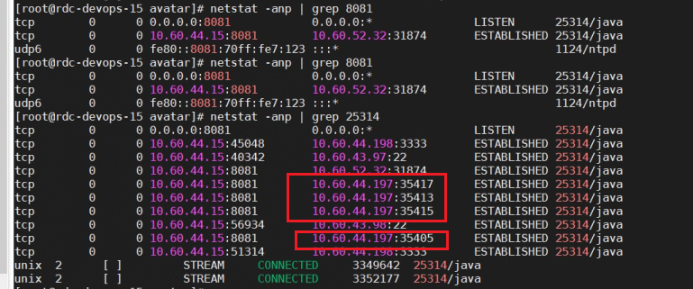

# ssh  
## 命令行登陆  
-v 查看详情  
ssh -v -p 3333 avatar@10.60.44.16

[Linux ssh命令详解](https://www.cnblogs.com/ftl1012/p/ssh.html)

[sshd_config配置文件详解](https://blog.csdn.net/u014721096/article/details/78559506?spm=1001.2101.3001.6661.1&utm_medium=distribute.pc_relevant_t0.none-task-blog-2%7Edefault%7ECTRLIST%7ERate-1-78559506-blog-121057725.pc_relevant_multi_platform_whitelistv4&depth_1-utm_source=distribute.pc_relevant_t0.none-task-blog-2%7Edefault%7ECTRLIST%7ERate-1-78559506-blog-121057725.pc_relevant_multi_platform_whitelistv4&utm_relevant_index=1)

[SSH连接慢问题解决](https://blog.csdn.net/weixin_42767321/article/details/86479696)

[SSH连接的几种认证方式](http://www.hackdig.com/11/hack-541778.htm)

## ssh跳转   
通过一层一层跳转的方式，来绕过原本机器网络访问限制触及目标系统  
在win上 ssh连接 120.26.126.154[服务器] 22  
   
发现本地ssh客户端会开启个随机端口连接到sshd

在10.60.44.113服务器上 ssh -p3333 avatar@10.60.44.16, 在通过16主机  ssh -p3333 avatar@10.60.44.197  
流程: 113随机端口的客户端--> 16的sshd,后 16的随机端口的客户端在-->197的sshd


## ssh转发
### 应用场景
本地转发应用场景    
```js
假设有一个数据库服务器 dbserver.com，它的端口 3306 仅对内部网络开放。你可以通过中转服务器 sshserver.com 访问该数据库。  
ssh -L 3306:dbserver.com:3306 user@sshserver.com
行上述命令后，您可以通过访问 localhost:3306 来连接到 dbserver.com 上的 MySQL 数据库。
```
远程转发应用场景  
```js
假设你在本地计算机上运行了一个 Web 服务器（例如：localhost:80），希望通过中转服务器 sshserver.com 让远程用户访问该 Web 服务器。  
ssh -R 8080:localhost:80 user@sshserver.com  
执行上述命令后，远程用户可以通过访问 sshserver.com:8080 来连接到本地计算机上的 Web 服务器   
```
动态转发应用场景  
用户变相的用ssh服务器做自己机器的代理，来访问远程服务器  
  


例如：本地转发  
执行下面命令后，您可以通过url访问 10.60.44.113:7777 来实际访问到 10.60.44.15:8081   
```shell
## 在113主机上开启7777 通过197主机跳板映射到15的8081端口
[root@rdc-devops-113 avatar]# ssh -L 0.0.0.0:7777:10.60.44.15:8081 -p3333 avatar@10.60.44.197  
```  
113会开启个7777端口，10.60.52.24是我win主机，当我win主机url访问10.60.44.113:7777的时候会 win主机随机生成端口与113的7777端口建立通信  
应用里一个tcp连接就会本地随机生成一个端口，现在是4个tcp连接。  
  
113随机端口-->197:3333   
  
    
197随机端口-->15:8081  
    

[深入 SSH：解锁本地转发、远程转发和动态转发的潜力](https://blog.csdn.net/LearnerDL/article/details/140068324)  
[SSH 端口转发玩转](https://blog.csdn.net/zhouguoqionghai/article/details/81869554)  


## ssh白名单规则（sshd）
实际使用中：为限制ssh高危端口我们一般做以下策略：

1.修改端口（ssh默认用22）

2.密码强口令

3.root限制

4.新增ssh登录白名单

5.开启端口防火墙

```
重点说一下ssh白名单设置（centos7）:

/etc/hosts.allow 允许指定ip或ip网段连接服务器
/etc/hosts.deny 禁止指定ip或ip网段连接服务器
        
当两个配置文件中同时存在相同对象时，allow生效；故可通过配置两个文档来实现白名单的目的；

1、/etc/hosts.deny 中配置阻止所有连接

vim /etc/hosts.deny 中，sshd:All //阻止全部访问

2、/etc/hosts.allow 中配置允许连接的ip或网段

vim /etc/hosts.allow 中，sshd:192.168.0.1,192.168.0.51 //允许192.168.0.1和192.168.0.51登录 -----------多个ip需要用，隔开

根据两个文件的优先级判断。则可得出，alliw中指定的ip可以连接，除次以外的都无法连接。故而达到白名单的目的。
```


## sshd_config配置文件详解：

```shell
#       $OpenBSD: sshd_config,v 1.100 2016/08/15 12:32:04 naddy Exp $

# This is the sshd server system-wide configuration file.  See
# sshd_config(5) for more information.

# This sshd was compiled with PATH=/usr/local/bin:/usr/bin

# The strategy used for options in the default sshd_config shipped with
# OpenSSH is to specify options with their default value where
# possible, but leave them commented.  Uncommented options override the
# default value.

# If you want to change the port on a SELinux system, you have to tell
# SELinux about this change.
# semanage port -a -t ssh_port_t -p tcp #PORTNUMBER    <==在开启selinux的系统上，修改ssh端口的要修改selinux规则，用此命令修改
#
#Port 22           <==默认ssh端口，生产环境中建议改成五位数的端口 
#AddressFamily any   <==地址家族，any表示同时监听ipv4和ipv6地址
#ListenAddress 0.0.0.0  <==监听本机所有ipv4地址
#ListenAddress ::    <==监听本机所有ipv6地址
HostKey /etc/ssh/ssh_host_rsa_key   <==ssh所使用的RSA私钥路径
#HostKey /etc/ssh/ssh_host_dsa_key
HostKey /etc/ssh/ssh_host_ecdsa_key   <==ssh所使用的ECDSA私钥路径
HostKey /etc/ssh/ssh_host_ed25519_key   <==ssh所使用的ED25519私钥路径

# Ciphers and keying
#RekeyLimit default none

# Logging
#SyslogFacility AUTH
SyslogFacility AUTHPRIV    <==设定在记录来自sshd的消息的时候，是否给出“facility code(工厂代码)”  SSH 会记录信息，这个信息要记录的类型为AUTHPRIV
 #LogLevel INFO    <==日志记录级别，默认为info 

# Authentication:

#LoginGraceTime 2m    <==限定用户认证时间为2min
#PermitRootLogin yes   <==是否允许root账户ssh登录，生产环境中建议改成no，使用普通账户ssh登录
#StrictModes yes    <==设置ssh在接收登录请求之前是否检查用户根目录和rhosts文件的权限和所有权，建议开启
#MaxAuthTries 6   <==指定每个连接最大允许的认证次数。默认值是 6
#MaxSessions 10   <==最大允许保持多少个连接。默认值是 10 

#PubkeyAuthentication yes  <==是否开启公钥验证

# The default is to check both .ssh/authorized_keys and .ssh/authorized_keys2
# but this is overridden so installations will only check .ssh/authorized_keys
AuthorizedKeysFile      .ssh/authorized_keys   <==公钥验证文件路径

#AuthorizedPrincipalsFile none

#AuthorizedKeysCommand none
#AuthorizedKeysCommandUser nobody

# For this to work you will also need host keys in /etc/ssh/ssh_known_hosts
#HostbasedAuthentication no
# Change to yes if you don't trust ~/.ssh/known_hosts for
# HostbasedAuthentication   <==指定服务器在使用 ~/.shosts ~/.rhosts /etc/hosts.equiv 进行远程主机名匹配时，是否进行反向域名查询
#IgnoreUserKnownHosts no  <==是否在 RhostsRSAAuthentication 或 HostbasedAuthentication 过程中忽略用户的 ~/.ssh/known_hosts 文件
# Don't read the user's ~/.rhosts and ~/.shosts files
#IgnoreRhosts yes   <==是否在 RhostsRSAAuthentication 或 HostbasedAuthentication 过程中忽略 .rhosts 和 .shosts 文件

# To disable tunneled clear text passwords, change to no here!
#PasswordAuthentication yes
#PermitEmptyPasswords no    <==是否允许空密码
PasswordAuthentication yes   <==是否允许密码验证，生产环境中建议改成no，只用密钥登录

# Change to no to disable s/key passwords
#ChallengeResponseAuthentication yes
ChallengeResponseAuthentication no   <==是否允许质疑-应答(challenge-response)认证

# Kerberos options
#KerberosAuthentication no   <==是否使用Kerberos认证
#KerberosOrLocalPasswd yes   <==如果 Kerberos 密码认证失败，那么该密码还将要通过其它的认证机制(比如 /etc/passwd)
#KerberosTicketCleanup yes  <==是否在用户退出登录后自动销毁用户的 ticket
#KerberosGetAFSToken no  <==如果使用了AFS并且该用户有一个 Kerberos 5 TGT，那么开启该指令后，将会在访问用户的家目录前尝试获取一个AFS token
#KerberosUseKuserok yes

# GSSAPI options
GSSAPIAuthentication yes   <==是否允许基于GSSAPI的用户认证
GSSAPICleanupCredentials no    <==是否在用户退出登录后自动销毁用户凭证缓存
#GSSAPIStrictAcceptorCheck yes
#GSSAPIKeyExchange no
#GSSAPIEnablek5users no

# Set this to 'yes' to enable PAM authentication, account processing,
# and session processing. If this is enabled, PAM authentication will
# be allowed through the ChallengeResponseAuthentication and
# PasswordAuthentication.  Depending on your PAM configuration,
# PAM authentication via ChallengeResponseAuthentication may bypass
# the setting of "PermitRootLogin without-password".
# If you just want the PAM account and session checks to run without
# PAM authentication, then enable this but set PasswordAuthentication
# and ChallengeResponseAuthentication to 'no'.
# WARNING: 'UsePAM no' is not supported in Red Hat Enterprise Linux and may cause several
# problems.
UsePAM yes   <==是否通过PAM验证

#AllowAgentForwarding yes
#AllowTcpForwarding yes
#GatewayPorts no     <==是否允许远程主机连接本地的转发端口
X11Forwarding yes    <==是否允许X11转发
#X11DisplayOffset 10  <==指定sshd（8）X11转发的第一个可用的显示区(display)数字。默认值是10
#X11UseLocalhost yes  <==是否应当将X11转发服务器绑定到本地loopback地址
#PermitTTY yes
#PrintMotd yes     <==指定sshd(8)是否在每一次交互式登录时打印 /etc/motd 文件的内容
#PrintLastLog yes  <==指定sshd(8)是否在每一次交互式登录时打印最后一位用户的登录时间
#TCPKeepAlive yes  <==指定系统是否向客户端发送 TCP keepalive 消息
#UseLogin no   <==是否在交互式会话的登录过程中使用 login（1）
#UsePrivilegeSeparation sandbox  <==是否让 sshd(8) 通过创建非特权子进程处理接入请求的方法来进行权限分离
#PermitUserEnvironment no  <==指定是否允许sshd(8)处理~/.ssh/environment以及 ~/.ssh/authorized_keys中的 environment= 选项
#Compression delayed  <==是否对通信数据进行加密，还是延迟到认证成功之后再对通信数据加密
#ClientAliveInterval 0  <==sshd(8)长时间没有收到客户端的任何数据，不发送"alive"消息
#ClientAliveCountMax 3   <==sshd(8)在未收到任何客户端回应前最多允许发送多个"alive"消息，默认值是 3 
#ShowPatchLevel no
#UseDNS no      <==是否使用dns反向解析
#PidFile /var/run/sshd.pid   <==指定存放SSH守护进程的进程号的路径
#MaxStartups 10:30:100   <==最大允许保持多少个未认证的连接
#PermitTunnel no   <==是否允许tun(4)设备转发
#ChrootDirectory none
#VersionAddendum none

# no default banner path
#Banner none  <==将这个指令指定的文件中的内容在用户进行认证前显示给远程用户，默认什么内容也不显示，"none"表示禁用这个特性

# Accept locale-related environment variables
AcceptEnv LANG LC_CTYPE LC_NUMERIC LC_TIME LC_COLLATE LC_MONETARY LC_MESSAGES
AcceptEnv LC_PAPER LC_NAME LC_ADDRESS LC_TELEPHONE LC_MEASUREMENT
AcceptEnv LC_IDENTIFICATION LC_ALL LANGUAGE
AcceptEnv XMODIFIERS

# override default of no subsystems
Subsystem       sftp    /usr/libexec/openssh/sftp-server   <==配置一个外部子系统sftp及其路径

# Example of overriding settings on a per-user basis
#Match User anoncvs    <==引入一个条件块。块的结尾标志是另一个 Match 指令或者文件结尾    
#       X11Forwarding no
#       AllowTcpForwarding no
#       PermitTTY no
#       ForceCommand cvs server

## 选择的SSH协议版本，一般使用2版本，如果要同时使用1和2这两个版本则用逗号将其隔开
#Protocol 2 
## 登录记录的等级
#LogLevel INFO
#X11Forwarding no

## Max AuthTrimes参数将降低SSH服务器被暴力攻击成功的风险
# MaxAuthTries 6
##是否取消使用 ~/.ssh/.rhosts  来做为认证！当然是！，IgnoreRhosts参数可以忽略以前登录过主机的记录，设置为yes后可以极大的提高连接速度
#IgnoreRhosts yes
## 将无密码登陆的配置关闭
#PermitEmptyPasswords no 
```

