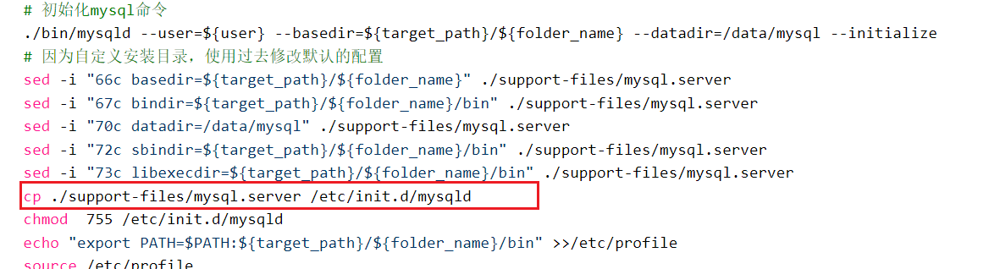

## sysctmd

```shell
# 使配置生效
systemctl daemon-reload
# 添加开机自启，反向操作的话把enable改成disable
systemctl enable luna-sunht-dev-ats-basicdata
# 启动ats-basicdata  重启包含了启动
systemctl restart luna-sunht-dev-ats-basicdata
#显示某个 Unit 的所有底层参数
$ systemctl show httpd.service
# 查看启动状态
systemctl status luna-sunht-dev-ats-basicdata

#查看历史日志
journalctl -exu luna-sunht-dev-ats-basicdata
# -e  --pager-end   Immediately jump to the end in the pager  立即跳到寻呼机的末尾
#  -f  --follow  Follow the journal  关注期刊, 最新的
# -x  --catalog   Add message explanations where available  添加消息说明（如果有）
# -u  --unit=UNIT   Show logs from the specified unit   显示指定单位的日志
#跟踪日志
journalctl -exfu luna-sunht-dev-ats-basicdata
```

```shell
[Unit]
Description=${systemdFileName}
After=network.target

[Service]
Restart=always  ##always 总是重新启动
RestartSec=5    ##重新启动服务前的睡眠时间（以秒为单位）
StartLimitInterval=10  ##限制该服务的启动频率。默认值是每10秒内不得超过5次(StartLimitInterval=10s StartLimitBurst=5)。
StartLimitBurst=5
LimitNOFILE=655350
LimitNPROC=655350
Type=forking
User=avatar
Group=avatar
ExecStart=${this.installPath(appMeta.startPathInSoftware)}
ExecStop=${this.installPath(appMeta.stopPathInSoftware)}

[Install]
WantedBy=multi-user.target
```


[system.service | 参数解析](https://blog.csdn.net/stone_fall/article/details/108630115)  
[Systemd 技术原理](https://blog.csdn.net/UbuntuKylinOS/article/details/120997854)

systemd 区别 ，avatar用的是  ```/lib/systemd/system/```   
/usr/lib/systemd/system/ 软件包安装的单元  
/etc/systemd/system/ 系统管理员安装的单元, 优先级更高   
/lib 链接到 /usr/lib   数据存储实际在 /usr/lib 里  


## /etc/init.d
service 文件是使用 systemd 作为初始化程序的 Linux 系统才有的服务文件，叫“服务配置单元文件”，  
用来取代旧初始化系统中的脚本文件，但是他们可能会同时存在系统中。  

如果同时存在的话，在目录 /etc/init.d/ 下的脚本文件的优先级会高于目录 /etc/systemd/system/ 下的 service 文件。

service xxxx start|stop|restart 相当于是对 /etc/init.d/ 下的 xxxx 的封装，相当于是一个管理命令，实际执行的是 /etc/init.d/下的可执行程序   
如果 /etc/init.d/下没有该服务的可执行程序，则会查找对应的 service 文件  

说到systemd，不得不提init的如下缺点：  
1.启动时间长。init 进程是串行启动，只有前一个进程启动完，才会启动下一个进程。  
2.启动脚本复杂。init进程只是执行启动脚本，不管其他事情。脚本需要自己处理各种情况，这往往使得脚本变得很长。  
Systemd 取代了initd（initd 的PID 是0） ，成为系统的第一个进程（Systemd 的PID 是1），其他进程都是它的子进程  
[initd、service、systemd，systemctl的区别与关系](https://blog.csdn.net/baidu_37359582/article/details/124367500)  

mysqld 是针对mysql的一个shell脚本，里面有start | stop | restart 等方法
分配执行权限，并加入到开机启动中
chmod +x /etc/init.d/mysqld		//添加执行权限
chkconfig --add mysqld		    //添加到服务启动项
chkconfig  --list mysqld		//查看服务启动列表

[Linux chkconfig 命令](https://www.runoob.com/linux/linux-comm-chkconfig.html)


