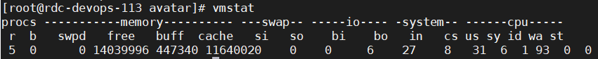

## linux 核心命令
### 快速在一个文件夹起一个http服务器
```shell
npm i -g -d serve ; serve -p 5000  
python2 -m SimpleHTTPServer 5000  
python3 -m http.server 5000
```

cp 命令
[Linux 使用 cp 命令强制覆盖功能](https://blog.csdn.net/xinluke/article/details/52229431)
-p : 保留复制前文件的用户属性    -r : 递归复制
```shell
[root@cxm test]# cp -p 1.txt 3.txt
[root@cxm test]# ll
总用量 0
-rw-r--r--. 1 cxm  cxm  0 3月   6 19:55 1.txt    （源文件）
-rw-r--r--. 1 root root 0 3月   6 19:59 2.txt    （没保留属性）
-rw-r--r--. 1 cxm  cxm  0 3月   6 19:55 3.txt    （保留属性）
```

### pid 1  
[Linux中的特殊进程：idle进程(0号进程)、init进程(1号进程，被systemd 取代 )、kthreadd进程(2号进程)](https://blog.csdn.net/m0_45406092/article/details/130657532)  


tee  —— 兼顾打印输出屏幕内容并且内容还会重定向到文件内。（通常和管道符连用）  
| tee           相当于  cat  和  >      重定向  
| tee  -a     相当于  cat  和  >>   追加重定向  
[shell-12- tee 重定向 tr字符替换 split文件分割](https://blog.csdn.net/lwj457700209/article/details/99646223)
[管道、xargs、-exec的介绍与区别](https://huaweicloud.csdn.net/635643aed3efff3090b5cc76.html)
[linux xargs,-exec,|管道的区别](https://www.jianshu.com/p/788fb4d66410)
[Linux下多个命令串联执行(管道/xargs/exec)](https://blog.csdn.net/langeldep/article/details/127746040)


```shell
free -h
df -h
du -sh /*
ps -ef 和ps -aux的区别：查询用ef，详细信息以及更多进程用aux
| tee > xxx.txt     将标准输出结果输出到文件
2>&1 | tee > xxx.txt  将标准错误转化成标准输出 再输出到文件
jps -v 查看启动参数
rsync  远程和本地文件备份      
```

### top  
[top命令详解](https://blog.csdn.net/xiaoxiao_chen945/article/details/121038280)  
[Linux系统平均负载](https://blog.csdn.net/qq_37989070/article/details/134703456)  

### vmstat  
vmstat（VirtualMeomoryStatistics，虚拟内存统计）是Linux中监控内存的常用工具，可对操作系统的虚拟内存、进程、CPU等的整体情况进行监视。    

```shell
Procs(进程)：r: 运行队列中进程数量   |  b: 等待IO的进程数量   
Memory(内存)： swpd: 使用虚拟内存大小 | free: 可用内存大小 | buff: 用作缓冲的内存大小 | cache: 用作缓存的内存大小   
Swap： si: 每秒从交换区写到内存的大小  |  so: 每秒写入交换区的内存大小  
IO：(现在的Linux版本块的大小为1024bytes)     bi: 每秒读取的块数  |  bo: 每秒写入的块数  
system：（系统信息） in: 每秒中断数，包括时钟中断  |  cs: 每秒上下文切换数  
CPU(以百分比表示)：us: 用户进程执行时间(user time) |  sy: 系统进程执行时间(system time)  |  id: 空闲时间(包括IO等待时间),中央处理器的空闲时间 ，以百分比表示  | wa: 等待IO时间
```
[优化命令----Vmstat命令](https://blog.csdn.net/gcc001224/article/details/125313217)
[vmstat命令详解](https://blog.csdn.net/shugyin/article/details/127434367)

###  pidstat 
[pidstat](https://blog.csdn.net/m0_61066945/article/details/126568206)
### 内存查看 free

### 硬盘查看 df

### 磁盘IO查看 ifstat  网络IO查看 iostat
[stat系列命令(vmstat,iostat,ifstat,netstat,dstat)](https://blog.csdn.net/qq_43072797/article/details/105552803)


### netstat 命令输出
[netstat命令输出详解](https://www.jianshu.com/p/443e6267dc47)

### rsync 与 cp、scp 区别
cp是一种典型的将文件完整的拷贝或者复制到其他位置，不管里面改了多少东西  
rsync是第一次在目标地址没有（复制到这后的同步源没有）的时候，全量备份。
但是第二次的时候只会对其中的增加项（差异项）来进行同步，所以这样的话对于一个更改过的文件进行二次备份的话rsync会比cp快，只备份同步更新部分。  
cp支持本地 rsync支持远程  
(rsync与cp的区别)[https://blog.csdn.net/wanghaoyang0324/article/details/122212814]

rsync的使用（可做异地冷备）
为/home/avatar目录建立软连接
```shell
#在/data下面创建一个目录
mkdir -p /data/avatar-true
#分配权限
chown -R avatar:avatar /data/avatar-true
#使用rsync进行备份，这边的avatar可以不写，会自动建一个avatar的目录
rsync -av /home/avatar /data/avatar-true/avatar
#把home目录删除，删除前记得先关闭所有这个目录下启动的服务，不然会不断写日志删不掉
rm -rf /home/avatar
#建立软连接
ln -s /data/avatar-true/avatar/avatar /home/avatar
```
## 查看文件具体信息  
硬盘的最小存储单位叫做"扇区"（Sector）。每个扇区储存512字节（相当于0.5KB）
即连续八个 sector组成一个"块"（block）4KB
文件数据都储存在"块"中，那么很显然，我们还必须找到一个地方储存文件的元信息，
比如文件的创建者、文件的创建日期、文件的大小等等。这种储存文件元信息的区域就叫做inode，中文译名为"索引节点"。  
[inode的内容](https://www.linuxprobe.com/linux-inode-record.html)
文件名只是inode号码便于识别的别称或 者绰号。表面上，用户通过文件名，打开文件。实际上，系统内部这个过程分成三步：
首先，系统找到这个文件名对应的inode号码；其次，通过inode号 码，获取inode信息；最后，根据inode信息，
找到文件数据所在的block，读出数据  

由于每个文件都必须有一个inode，因此有可能发生inode已经用光，但是硬盘还未存满的情况。这时，就无法在硬盘上创建新文件  

stat xxx  
[stat命令详解](https://www.lxlinux.net/1960.html)
```shell
[root@TENCENT64 ~]# stat Changelog
  File: ‘Changelog'
  Size: 1598     Blocks: 8     IO Block: 4096  regular file
 Device: fd01h/64769d    Inode: 1579435   Links: 1
 Access: (0644/-rw-r--r--) Uid: (  0/  root)  Gid: (  0/  root)
 Access: 2018-11-06 22:39:54.110931887 +0800
 Modify: 2018-11-06 22:39:54.110931887 +0800
 Change: 2018-11-06 23:07:14.428548887 +0800
```
File: ‘Changelog’:文件名称为Changelog  
Size: 1598:文件大小1598字节  
Blocks: 8：文件占用的块数  
Block size: 4096：块大小为4096字节  
regular file：文件类型（普通文件） 
Device: fd01h/64769d：文件所在设备号，分别以十六进制和十进制显示  
Inode: 1579435：文件节点号  
Links: 1：硬链接数  
Access: (0644/-rw-r–r–)：访问权限  
Uid：所有者ID与名称   
Gid：所有者用户组ID与名称
access time：表示我们最后一次访问（仅仅是访问，没有改动）文件的时间
modify time：表示我们最后一次修改文件的时间
change time：表示我们最后一次对文件属性改变的时间，包括权限，大小，属性等等
Birth time : 文件创建时间，crtime，不过据查此属性linux已废弃，目前状态显示结果均为-
[linux系统下如何获取文件的创建时间](https://blog.csdn.net/qq_37989070/article/details/134413866)


### 恢复仍在活动进程中的已删除文件
[如何在 Linux 中恢复仍在活动进程中的已删除文件](https://linux.cn/article-8709-1.html)

### 怎么查看一个java线程的资源耗用？
linux下，所有的java内部线程，其实都对应了一个进程id，也就是说，linux上的ivm将java程序中的线程映射为操作系统进程。
```shell
1、jps-lvm或者ps-ef I grep java查看当前机器上运行的Java应用进程
2、top-Hp pid可以查看Java所有线程的资源耗用
3、printf"%x\n"pid等到线程ID的16进制
4、istack Java应用进程ID I grep线程ID的16进制
```
### Load过高的可能性有哪些？
cpu load的飙升，一方面可能和full gc的次数增大有关，一方面可能和死循环有关系


#### 批量杀进程
传入一批进程中间包含的唯一字符串即可，一般是严格匹配的文件夹路径

```bash
function stop_process() {
  if [ -z $2 ]; then
    kill_arg=''
    cmd_contain=$1
  else
    kill_arg=$1
    cmd_contain=$2
  fi
  appid=$(ps -ef |grep "$cmd_contain" |grep -v grep | awk '{print $2}')
  echo appid=$appid
  if [ -n "$appid" ];
  then
    echo stopping $kill_arg $cmd_contain
    kill $kill_arg $appid
  fi
}
```

### 判断文件是否存在的shell脚本代码
[判断文件是否存在的shell脚本代码](https://www.jb51.net/article/34330.htm)

### 将top命令的输出，写入到文件中
https://blog.csdn.net/ice_beauty1/article/details/82919944

top -b -n 1 -d 3 >>file.txt


### [Linux查看物理CPU个数、核数、逻辑CPU个数](https://www.cnblogs.com/emanlee/p/3587571.html)

```bash
# 总核数 = 物理CPU个数 X 每颗物理CPU的核数 
# 总逻辑CPU数 = 物理CPU个数 X 每颗物理CPU的核数 X 超线程数

# 查看物理CPU个数
cat /proc/cpuinfo| grep "physical id"| sort| uniq| wc -l

# 查看每个物理CPU中core的个数(即核数)
cat /proc/cpuinfo| grep "cpu cores"| uniq

# 查看逻辑CPU的个数
cat /proc/cpuinfo| grep "processor"| wc -l
```
