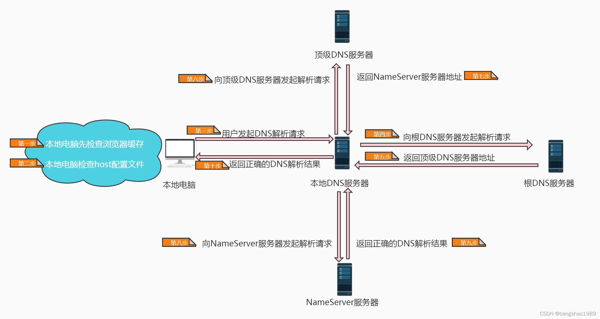
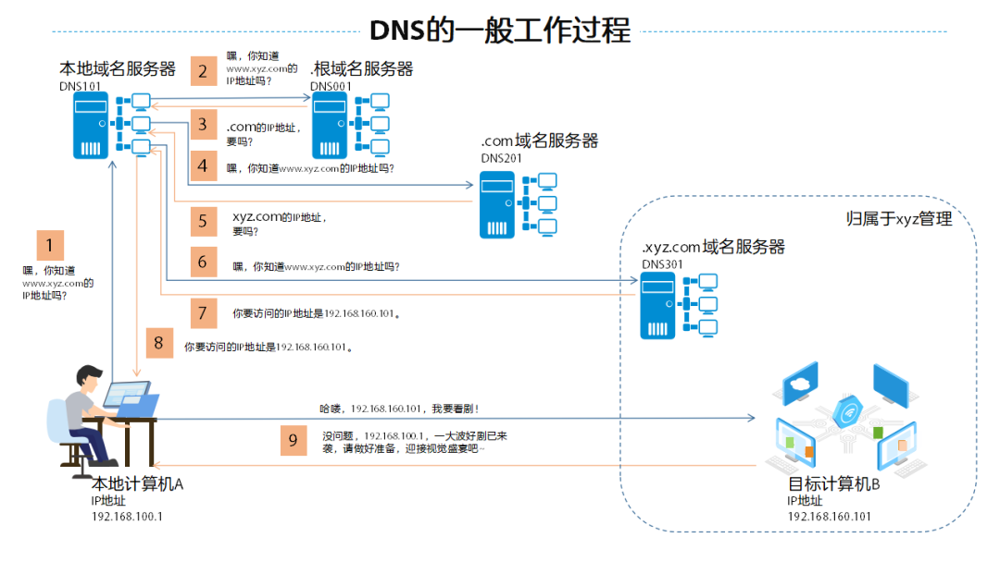
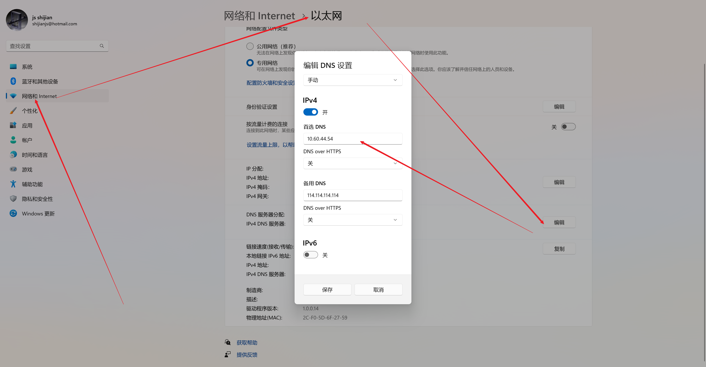
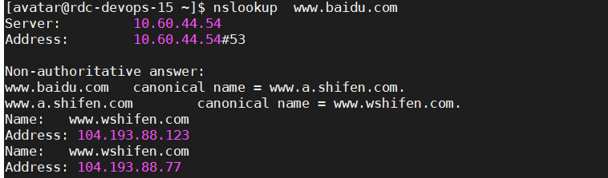

## dns
### DNS 是什么？
DNS （Domain Name System 的缩写）的作用非常简单，就是根据域名查出IP地址。你可以把它想象成一本巨大的电话本。    
举例来说，如果你要访问域名math.stackexchange.com，首先要通过DNS查出它的IP地址是151.101.129.69

[DNS域名解析过程](https://huaweicloud.csdn.net/635604a0d3efff3090b58b54.html)  
检查浏览器缓存-> 操作系统缓存(在内存里)--> 读取hosts文件-->本地dns服务器--> 根服务器-->1级域名服务器-->2级域名服务器-->3级域名服务器


   
搭建内网dns服务器  
```shell
mkdir -p /data/dnsmasq/
# 初始化配置文件
cat > /data/dnsmasq/dnsmasq.conf <<EOF
#dnsmasq config, for a complete example, see:
#  http://oss.segetech.com/intra/srv/dnsmasq.conf
#log all dns queries
log-queries
#dont use hosts nameservers
no-resolv
#use cloudflare as default nameservers, prefer 1^4
# 公司内dns地址
server=10.60.44.54
# 国内dns
server=114.114.114.114
# 微软dns
server=4.2.2.2
strict-order
#serve all .company queries using a specific nameserver
server=/company/10.0.0.1
#explicitly define host-ip mappings
address=/myhost.company/10.0.0.2
 
# 一些自定义配置
address=/.sunht.fingard.cn/192.168.10.104
 
EOF
 
cat /data/dnsmasq/dnsmasq.conf
 
# 启动dns服务
docker rm -f dnsmasq
docker run \
    -u root \
    --name dnsmasq \
    -d \
    -p 53:53/udp \
    -p 5380:8080\
    -v /data/dnsmasq/dnsmasq.conf:/etc/dnsmasq.conf \
    --log-opt "max-size=100m" \
    -e "HTTP_USER=admin" \
    -e "HTTP_PASS=1" \
    -e TZ=Asia/Shanghai \
    --restart always \
    jpillora/dnsmasq:1.1
docker logs -f dnsmasq
 
# 可以访问地址：http://192.168.10.104:5380/ 用户：admin/1
```
修改自己电脑dns  
这里提供winddows11的修改方式，首选dns改成10.60.44.54  

```shell
#验证
#windows启动cmd命令行
# 指定域名验证
nslookup sunht.fingard.vm
ping sunht.fingard.vm
# 通配域名验证
nslookup aaa.sunht.fingard.vm
ping aaa.sunht.fingard.vm
```

### nslookup 命令  
  
Server： 指的是10.60.44.54对应的主机名  
Address:  dns服务器ip  10.60.44.54#53
[nslookup](https://www.cnblogs.com/machangwei-8/p/10353137.html)

dnsmasq
- [jpillora/dnsmasq 一个docker镜像，介绍页有教程](https://hub.docker.com/r/jpillora/dnsmasq)
- [高效搭建基于dnsmasq通过webui管理的dns服务器](https://blog.csdn.net/firehadoop/article/details/83860191)
- 维护地址： [http://10.60.44.54:5380](http://10.60.44.54:5380/)
- 用户名：admin
- 密码：fingard@2

```shell
docker rm -f dnsmasq
docker run \
    -u root \
    --name dnsmasq \
    -d \
    -p 53:53/udp \
    -p 5380:8080\
    -v /data/dnsmasq/dnsmasq.conf:/etc/dnsmasq.conf \
    --log-opt "max-size=100m" \
    -e "HTTP_USER=admin" \
    -e "HTTP_PASS=fingard@2" \
    -e TZ=Asia/Shanghai \
    --restart always \
    jpillora/dnsmasq:1.1
docker logs -f dnsmasq
```


可以配置域名通配符

[如何使用dnsmasq配置静态通配符子域](https://qastack.cn/server/122631/how-to-configure-a-static-wildcard-subdomain-with-dnsmasq)

```shell
address=/.server.mydomain.com/192.168.0.3
```

/data/dnsmasq/dnsmasq.conf  配置文件备份，可以在页面修改。

```she
#dnsmasq config, for a complete example, see:
#  http://oss.segetech.com/intra/srv/dnsmasq.conf
#log all dns queries
log-queries
#dont use hosts nameservers
no-resolv
#use cloudflare as default nameservers, prefer 1^4
server=114.114.114.114
server=4.2.2.2
strict-order
#serve all .company queries using a specific nameserver
#server=/company/10.0.0.1
#explicitly define host-ip mappings
#address=/myhost.company/10.0.0.2
 
address=/k8s-test/10.60.44.54
address=/kube-master-vip/10.60.44.219
address=/kube-master1/10.60.44.214
address=/kube-master2/10.60.44.216
address=/kube-box1/10.60.44.243
address=/kube-box2/10.60.44.251
address=/kube-box3/10.60.44.252
address=/hadoop3/10.60.44.54
address=/hadoop2/10.60.44.55
address=/rdc-test-57/10.60.44.57
address=/rdc-test-58/10.60.44.58
address=/rdc-test-59/10.60.44.59
address=/rdc-devops-14/10.60.44.14
address=/rdc-devops-15/10.60.44.15
address=/rdc-devops-16/10.60.44.16
address=/james.local/10.60.44.16
address=/mirrors.jenkins-ci.org/10.60.44.54
```


