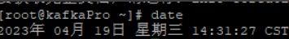
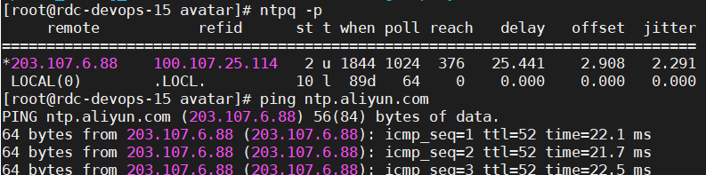
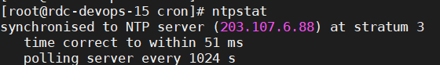
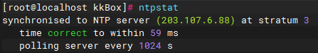

## crontab
linux 自带的定时任务

[linux内置的cron定时任务](https://blog.csdn.net/womeng2009/article/details/125472964)
我们经常使用的是crontab命令是cron table的简写，它是cron的配置文件，也可以叫它作业列表，我们可以在以下文件夹内找到相关配置文件。  

* /var/spool/cron/ 目录下存放的是每个用户包括root的crontab任务，每个任务以创建者的名字命名  
* /etc/crontab 这个文件负责调度各种管理和维护任务。  
* /etc/cron.d/ 这个目录用来存放任何要执行的crontab文件或脚本。  
* 我们还可以把脚本放在/etc/cron.hourly、/etc/cron.daily、/etc/cron.weekly、/etc/cron.monthly目录中，让它每小时/天/星期、月执行一次

```shell
crontab [-u username]　　　　//省略用户表表示操作当前用户的crontab
    -e      (编辑工作表)
    -l      (列出工作表里的命令)
    -r      (删除工作作)
```

```shell
# 可以是有ntp（网络时间协议）与时间服务器(如：国家授时中心)同步
# 在linux上执行命令
yum -y install ntp
ntpdate -u ntp.api.bz

# 时间、时区查看
date -R

# linux定时任务，防止时钟误差问题
echo "*/60 * * * * /usr/sbin/ntpdate -u ntp.api.bz >/dev/null &" >> /var/spool/cron/root

# 或使用crontab -e编辑命令
# crontab -e命令编辑的实际是/var/spool/cron/root文件
# 每分钟执行一次时钟同步
* * * * * /usr/sbin/ntpdate -u ntp.api.bz >/dev/null &
echo "* * * * * /usr/sbin/ntpdate -u ntp.api.bz >/dev/null &" >> /var/spool/cron/root
# 可通过-l查看当前用户配置的任务
crontab -l
```

[Crontab（定时任务）命令详解](https://huaweicloud.csdn.net/63560690d3efff3090b58dd3.html)
[Linux定时启动运行程序的方法](https://zongxp.blog.csdn.net/article/details/77978328)

## 时间同步检查
多台服务器执行  
date  

看时间是否有较大差异
执行 ntp -p  

如图 这是正常同步的状态
运行：ntpstat  

说明：在第3层同步到NTP服务器(203.107.6.88)，时间在51毫秒内纠正，每隔1024秒轮询一次服务器。203.107.6.88是阿里云外网ip。


如何设置时间同步 假设我们的服务器有：10.254.254.101 10.254.254.102  （有几台执行几台）  
情况1：可以直接ping通阿里云
101 102 执行：   
yum -y install ntp ntpdate  
echo "*/5 * * * * /usr/sbin/ntpdate ntp1.aliyun.com &>/dev/null" >> /var/spool/cron/root
ntpstat  


情况二：ping不通阿里云（没有网）
如果连不到阿里云，向客户申请一个在内网可以访问外网的时间同步服务器然后去指时间同步服务器的ip
那么现在有三台机子 10.254.254.101 10.254.254.102 10.254.254.103（申请的可以连外网的机器）其中  

103执行：  
yum -y install ntp ntpdate  
echo "*/5 * * * * /usr/sbin/ntpdate ntp1.aliyun.com &>/dev/null" >> /var/spool/cron/root  
ntpstat  


101 102 执行：  
yum -y install ntp ntpdate  
echo "*/20 * * * * /usr/sbin/ntpdate 10.254.254.103 >/dev/null &" >> /var/spool/cron/root  
ntpstat  
