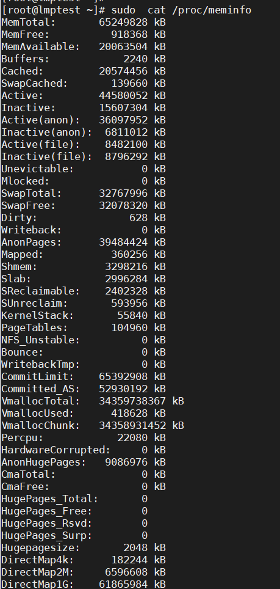

## free -h
```
Mem 行(第二行)是内存的使用情况。
Swap 行(第三行)是交换空间的使用情况。
total 列显示系统总的可用物理内存和交换空间大小。
used 列显示已经被使用的物理内存和交换空间。
free 列显示还有多少物理内存和交换空间可用使用。
shared 列显示多个进程被共享使用的物理内存大小。
buff/cache 列显示磁盘缓存使用的物理内存大小。（buffer，它存在的目的适用于当速度快的往速度慢的输出东西。例如内存的数据要写到磁盘，cpu寄存器里的数据写到内存）
available 列显示还可以被应用程序使用的物理内存大小
理想状态下 available  = free + buffer + cache
总内存=used + free +系统内存(buffer+cache)
```

Linux中Swap（即：交换分区），类似于Windows的虚拟内存，就是当内存不足的时候，把一部分硬盘空间虚拟成内存使用,从而解决内存容量不足的情况。    

top 及 free 命令都是从 /proc/meminfo 获取数据的  


MemTotal:       65249828 kB
MemFree:          804724 kB
MemAvailable:   20043592 kB
Buffers:            2240 kB
Cached:         20668824 kB


理想状态下 available  = free + buffer + cache  
但因为  buffers/cached不是100%都能释放出来使用的 ，所以 available 小于 free + buffer + cache  

linux内核源代码中关于avaliable值的定义，得出如下公式  
MemAvailable = MemFree - LowWaterMark + (PageCache - min(PageCache / 2, LowWaterMark))  


[linux问题-memory free 大于 available 怪异现象分析](https://blog.csdn.net/ygq13572549874/article/details/128798578)
available 会受到 min_free_kbytes操作系统最小保留内存设置影响

会报告有关内核线程、虚拟内存、磁盘、管理程序页面、陷阱和处理器活动的统计信息
[Linux系统调优详解（四）——内存状态查看命令](https://blog.csdn.net/weixin_40228200/article/details/125351690)
