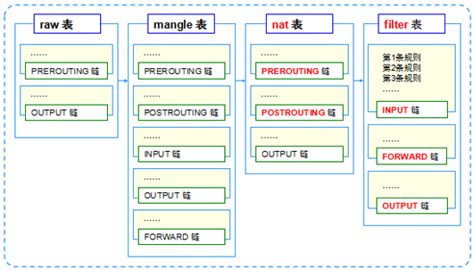
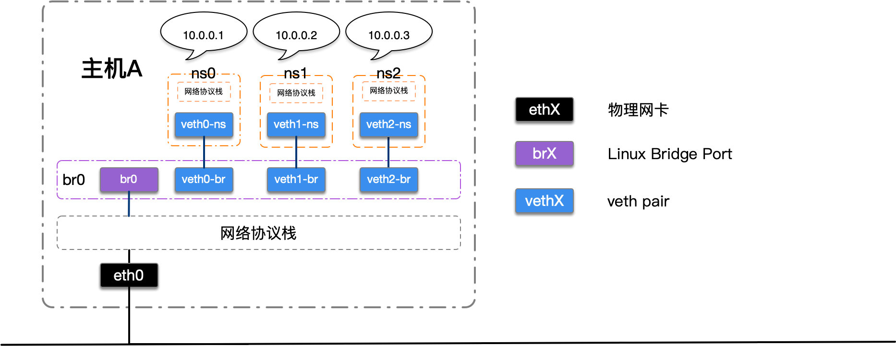

## iptables详解  
### NAT 网络地址转换  
[网络地址转换NAT（详细）](https://blog.csdn.net/qq_983030560/article/details/128449410)     
[NAT网络地址转换与配置](https://blog.csdn.net/wang_dian1/article/details/129715450)  
传统NAT技术 不带端口号的, 私网ip和目的ip地址的 一一映射  
后面发展，通过端口的方式， 可以让私网的多个ip相同端口对接目的ip的多个端口进行转发  

### iptables  
Linux平台下的 包过滤防火墙、免费、完成封包过滤、封包重定向和网络地址转换（NAT）等功能

[iptables基础知识详解](https://blog.csdn.net/u011537073/article/details/82685586?spm=1001.2101.3001.6650.5&utm_medium=distribute.pc_relevant.none-task-blog-2%7Edefault%7ECTRLIST%7ERate-5-82685586-blog-109674599.pc_relevant_recovery_v2&depth_1-utm_source=distribute.pc_relevant.none-task-blog-2%7Edefault%7ECTRLIST%7ERate-5-82685586-blog-109674599.pc_relevant_recovery_v2&utm_relevant_index=10)

IPTABLES 规则(Rules)  
* Rules包括一个条件和一个目标(target)  
* 如果满足条件，就执行目标(target)中的规则或者特定值  
* 如果不满足条件，就判断下一条Rules  

目标值（Target Values）  
* ACCEPT  – 允许防火墙接收数据包  
* DROP - 防火墙丢弃包  
* QUEUE – 防火墙将数据包移交到用户空间  
* RETURN – 防火墙停止执行当前链中的后续Rules，并返回到调用链(the calling chain)中 

iptables -A命令追加新规则，其中 -A表示 Append。因此， 新的规则将追加到链尾。
-s 源地址   -d 目的地址
-j 执行目标  
-i 输入接口  -o 输出 

-i eth0指定了要处理经由eth0进入的数据包   
如果出现! -o eth0，那么将从eth0以外的接口输出   
```shell
简单的防护方案：
1. 允许本地回环接口的流量
iptables -A INPUT -i lo -j ACCEPT
2. 允许已建立的连接的流量通过
iptables -A INPUT -m state --state ESTABLISHED,RELATED -j ACCEPT
3. 允许SSH连接
iptables -A INPUT -p tcp --dport ssh -j ACCEPT
4. 允许HTTP和HTTPS连接
iptables -A INPUT -p tcp --dport http -j ACCEPT iptables -A INPUT -p tcp --dport https -j ACCEPT
5. 允许ICMP流量
iptables -A INPUT -p icmp -j ACCEPT
6. 拒绝所有其他流量
iptables -A INPUT -j DROP
7. 保存iptables规则
service iptables save
```
4表5链  


[Linux iptables用法与NAT - 风住 - 博客园 (cnblogs.com)](https://www.cnblogs.com/whych/p/9147900.html)
[追查iptables规则失效原因 - jeremy的技术点滴 (jeremyxu2010.github.io)](https://jeremyxu2010.github.io/2018/10/%E8%BF%BD%E6%9F%A5iptables%E8%A7%84%E5%88%99%E5%A4%B1%E6%95%88%E5%8E%9F%E5%9B%A0/)


iptables的新版替代工具  
[nftables 使用教程](https://www.cnblogs.com/ryanyangcs/p/11611730.html)  


> 规则一般的定义为“如果数据包头符合这样的条件，就这样处理这个数据包”。规则存储在内核空间的信息 包过滤表中，这些规则分别指定了源地址、目的地址、传输协议（如TCP、UDP、ICMP）和服务类型（如HTTP、FTP和SMTP）等。当数据包与规则匹配时， iptables就根据规则所定义的方法来处理这些数据包，如放行（accept）、拒绝（reject）和丢弃（drop）等。配置防火墙的 主要工作就是添加、修改和删除这些规则。

iptables和netfilter的关系：

iptables只是Linux防火墙的管理工具而已，位于/sbin/iptables。真正实现防火墙功能的是 netfilter，它是Linux内核中实现包过滤的内部结构。


iptables的规则表和链：
表（tables）提供特定的功能，iptables内置了4个表，即filter表、nat表、mangle表和raw表，分别用于实现包过滤，网络[地址转换](https://so.csdn.net/so/search?q=%E5%9C%B0%E5%9D%80%E8%BD%AC%E6%8D%A2&spm=1001.2101.3001.7020) 、包重构(修改)、数据跟踪处理。
链（chains）是数据包传播的路径，每一条链其实就是众多规则中的一个检查清单，每一条链中可以有一 条或数条规则。


### netns
1. [Linux Network Namespace (netns) 详解 | 没有理想的人不伤心 (typesafe.cn)](https://typesafe.cn/posts/linux-netns/)  
2. [Linux veth pair 详解 | 没有理想的人不伤心 (typesafe.cn)](https://typesafe.cn/posts/linux-veth-pair/)  
3. [Linux Bridge 详解 - 知乎 (zhihu.com)](https://zhuanlan.zhihu.com/p/293667316)  
4. [Linux 环回网络接口 | 没有理想的人不伤心 (typesafe.cn)](https://typesafe.cn/posts/linux-loopback/)  
5. [Linux tun/tap 详解 | 没有理想的人不伤心 (typesafe.cn)](https://typesafe.cn/posts/linux-tun-tap/)  



