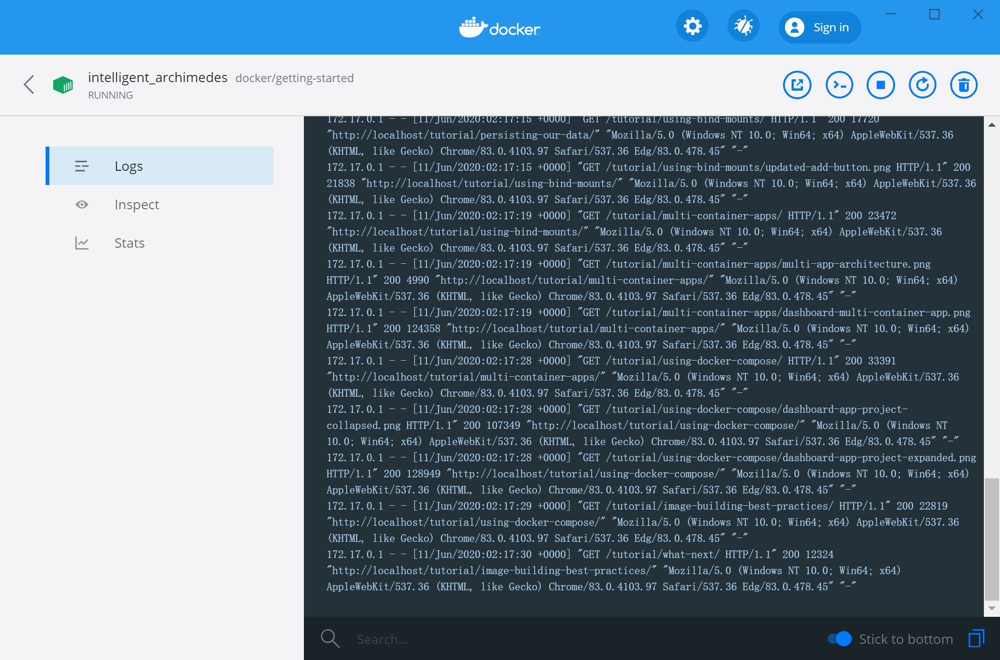

# wsl

1. [wsl文档：适用于 Linux 的 Windows 子系统文档](https://docs.microsoft.com/zh-cn/windows/wsl/)
    1. [更新到 WSL 2](https://docs.microsoft.com/zh-cn/windows/wsl/install-win10#update-to-wsl-2)

## docker支持
docker desktop 最新版支持wsl2后端，可以直接用wsl2的docker daemon作图形界面的后台。



## CLion支持
[CLion WSL官方文档](https://www.jetbrains.com/help/clion/how-to-use-wsl-development-environment-in-clion.html)

## faq
### 早期版本vmware与hyperv、wsl2不能共存
升级windows10到2004以上，[vmware升级到15.5.5以上](https://docs.vmware.com/en/VMware-Workstation-Pro/15.5/rn/VMware-Workstation-1555-Pro-Release-Notes.html),
vmware、hyper-v、wsl2就可以共存

### 卸载其中一个
```bash
wsl --unregister Ubuntu
```

### oh my zsh
[WSL + oh my zsh 更好看的 shell](https://zhuanlan.zhihu.com/p/68336685)

[zsh命令行补全](https://kubernetes.io/zh/docs/tasks/tools/install-kubectl/#%E4%BD%BF%E7%94%A8-zsh)
