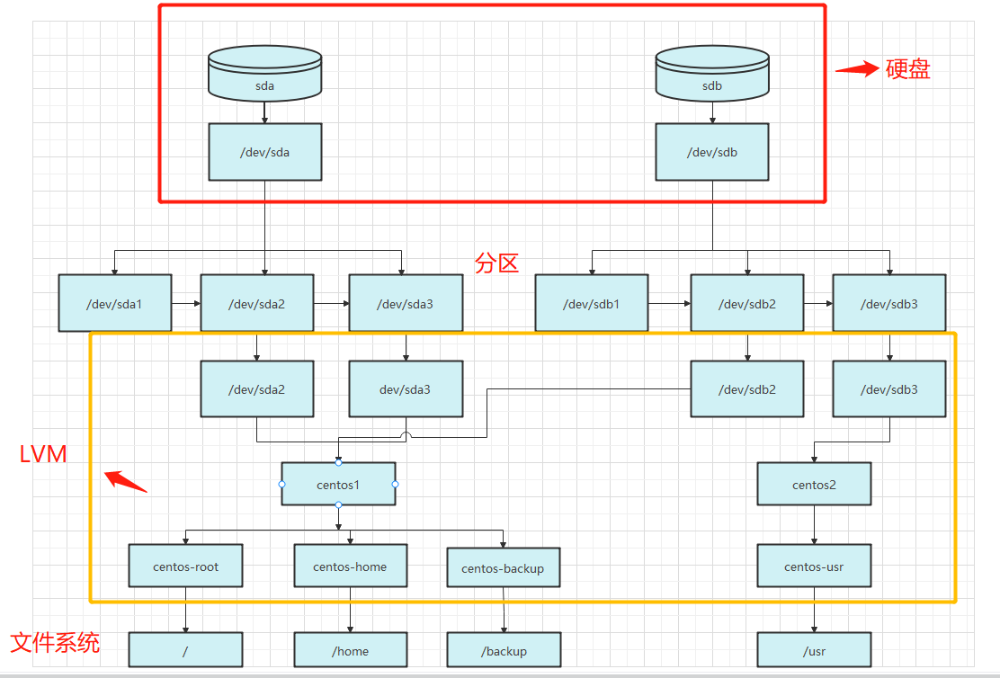
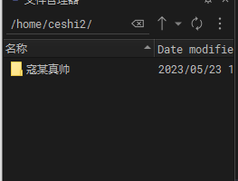
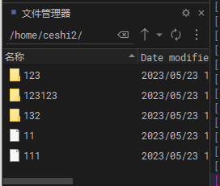

## 硬盘分区

[linux分区命令parted的用法](https://www.cnblogs.com/wholj/p/10924129.html)  
[CentOS下GPT分区（转） - EasonJim - 博客园 (cnblogs.com)](https://www.cnblogs.com/EasonJim/p/9583268.html)  
[The resulting partition is not properly aligned for best performance的解决方法 | knktc的杂乱空间](https://knktc.com/2014/06/03/resulting-partition-is-not-properly-aligned-for-best-performance/)  
[centos7 centos-home 磁盘空间转移至centos-root下](https://blog.csdn.net/qq_42095014/article/details/122843769)  
https://cloud.tencent.com/developer/article/1720935  
[linux之观察磁盘分区状态（lsblk）](https://huaweicloud.csdn.net/635669e9d3efff3090b5e72c.html)

```shell
# 列出硬盘
fdisk -l
# 显示各盘的大小
lsblk -a
# 显示各盘的分区类型
lsblk -f
# 使用parted操作硬盘，fdisk只支持2t以下
parted /dev/sdb
# 解决unrecognised disk label问题，输入gpt
mklabel
# 下面是在parted的命令行里面操作，primary 仅仅是名字，0 - -1表示一整块盘作为一个分区
# 出现警告时看上面链接解决办法，比如：mkpart primary 2048s 100%
mkpart primary 0 -1
# 打印分区结果
print
# 退出parted
quit
# 使用mkfs创建文件系统，格式化分区
mkfs -t ext4 /dev/sdb1
# 创建挂载目录
mkdir /data4t
# 临时挂载
mount /dev/sdb1 /data4t
# 开机自动挂载(永久挂载)
echo '/dev/sdb1 /data4t       ext4    defaults        0 0'>>/etc/fstab
cat /etc/fstab
```

## 磁盘管理
### lvm  


mount --bind 目录映射   

原来的目录结构  



把目录1映射到目录2  执行 
```shell
mount --bind /home/ceshi1 /home/ceshi2
``` 
刷新一下目录2  
  
取消映射执行  
umount /home/ceshi2  
隐藏的文件就又回来了  
用途：为了解决ftp多用户权限问题。   


### 虚拟机增加磁盘  
[根目录增加磁盘空间大小](https://blog.csdn.net/bbrry/article/details/128703667) 
[虚拟机增加磁盘空间（VMware虚拟机）](https://blog.csdn.net/star0116/article/details/123678286)


