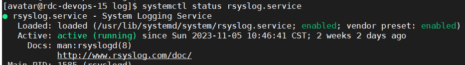

## 系统日志  
系统日志是由Rsyslog服务控制进行配置的，开机后rsyslog就会启动  
  
[Rsyslog 详解](https://www.jianshu.com/p/a81a49f45ee0)    

```shell
/var/log/cron     记录了系统定时任务相关的日志  
/var/log/messages  记录系统重要信息的日志。这个日志文件中会记录Linux系统的绝大多数重要信息，如果系统出现问题时，首先要检查的就应该是这个日志文件  
/var/log/lastlog  记录系统中所有用户最后一次登录时间的日志，这个文件是二进制文件，不能直接vi，而要使用lastlog命令查看  
/var/log/wtmp     永久记录所有用户的登录、注销信息，同时记录系统的启动、重启、关机事件。同样这个文件也是一个二进制文件，不能直接vi，而需要使用last命令来查看  
/var/log/secure   记录验证和授权方面的信息，只要涉及账号和密码的程序都会记录，比如SSH登录，su切换用户，sudo授权，甚至添加用户和修改用户密码都会记录在这个日志文件中
/var/log/audit/audit.log  (系统审计日志) 
```

### 重点
/var/log/messages

/var/log/secure   


/var/log/audit/audit.log  


### last reboot  
查看机器历史重启记录  
[查询系统上次启动时间](https://blog.csdn.net/kangweijian/article/details/119377701)  

### sar
sar是一个采集，报告和存储计算机负载信息的工具。自下载安装好后每10分钟对系统性能进行一次采集，
每天的日志文件保存再/var/log/sa/下  
有的时候，我们要通过对系统的cpu负载等性能数值的查看，来判排查系统产生某种故障(经常死机或者运行速度突然变慢)的原因。  
但是，简单的top,uptime，w等命令只可以查看当前的负载， 而无法查看过去的某一时间段的cpu的负载情况  
sar命令可以全面地获取系统的 CPU、运行队列、磁盘读写（I/O）、分区（交换区）、内存、CPU 中断和网络等性能数据

[Linux性能监控命令_sar](https://blog.csdn.net/m0_61066945/article/details/126213941)  
[linux系统监控 sar命令详解](https://cloud.tencent.com/developer/article/1981855)   
```shell
sar：显示数据
sa1和sa2：收集和保存数据用于以后分析。
sa2shell脚本在/var/log/sa目录中每日写入一个报告。
sa1shell脚本将每日的系统活动信息以二进制数据的形式写入到文件中。
可以在/etc/cron.d/下sysstat文件中找到sar默认的cron作业
```
```shell
[root@rdc-devops-113 cron.d]# cat -n sysstat
     1  # Run system activity accounting tool every 10 minutes
     2  */10 * * * * root /usr/lib64/sa/sa1 1 1
     3  # 0 * * * * root /usr/lib64/sa/sa1 600 6 &
     4  # Generate a daily summary of process accounting at 23:53
     5  53 23 * * * root /usr/lib64/sa/sa2 -A
```

查看历史cpu占用情况：sar -u -f /var/log/sa/sa09  
查看历史内存：sar -r -f /var/log/sa/sa09  

