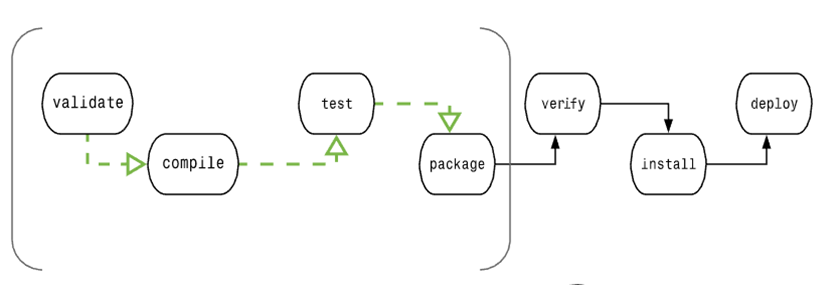
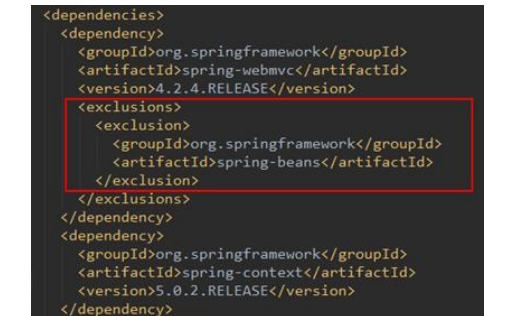

## maven
一个典型的 Maven 构建（build）生命周期是由以下几个阶段的序列组成的：  

clean：项目清理的处理  
验证 validate	验证项目	验证项目是否正确且所有必须信息是可用的  
编译 compile	执行编译	源代码编译在此阶段完成  
测试 Test	测试	使用适当的单元测试框架（例如JUnit）运行测试    
包装 package	打包	创建JAR/WAR包如在 pom.xml 中定义提及的包  
检查 verify	检查	对集成测试的结果进行检查，以保证质量达标  
安装 install	安装	安装打包的项目到本地仓库，以供其他项目使用  
site：项目站点文档创建的处理  
部署 deploy	部署	拷贝最终的工程包到远程仓库中，以共享给其他开发人员和工程  

### 什么是依赖传递
先添加 springmvc 的核心依赖的坐标
```shell
<dependencies>
<dependency>
<groupId>org.springframework</groupId>
<artifactId>spring-webmvc</artifactId>
<version>4.2.4.RELEASE</version>
</dependency>
</dependencies>
```
会发现出现除了spring-webmvc以外的其他jar。因为我们的项目依赖spring-webmvc.jar，
而spring-webmv.jar会依赖spring-beans.jar 等等，所以spring-beans.jar这些 jar包也出现在了我们的maven工程中，
这种现象我们称为依赖传递。从下图中可看到他们的关系：（请注意spring-beans的版本）

### 依赖冲突
两个jar包都依赖 spirng-beans
spring-webmvc依赖 spirng-beans-4.2.4，
spring-context 依赖 spring-beans-5.0.2，但是发现spirng-beans-4.2.4加入到工程中

### 依赖调解原则
1. 第一声明者优先原则
   如果将上边 spring-webmvc 和 spring-context顺序颠倒，系统将导入spring-beans-5.0.2.
2. 路径近者优先原则
   在本工程中的pom中加入spirng-beans-5.0.2的依赖，根据路径近者优先原则，系统将导入spirng-beans-5.0.2

### 排除依赖调解
上边的问题也可以通过排除依赖方法辅助依赖调解，如下：
比如在依赖 spring-webmvc的设置中添加排除依赖，排除spring-beans，
下边的配置表示：依赖spring-webmvc，但排除spring-webmvc所依赖的spring-beans.



[Maven项目POM文件总体配置说明](https://blog.csdn.net/qq_37726813/article/details/127812807)
[dependencies和dependencyManagement的区别](https://blog.csdn.net/ITWANGBOIT/article/details/107235225)
