# 微服务

## 微服务简介
百度一下：[微服务](https://www.baidu.com/s?ie=UTF-8&wd=微服务)

微服务十二要素：[The Twelve-Factor App](https://12factor.net/zh_cn/)

我当时百度到的第一条：[微服务架构设计](https://www.cnblogs.com/wintersun/p/6219259.html)

[FB海归国内高管：谈谈infra、代码管理、微服务、测试系统，以及技术人员海归能做什么。](http://www.sohu.com/a/342938895_440524)

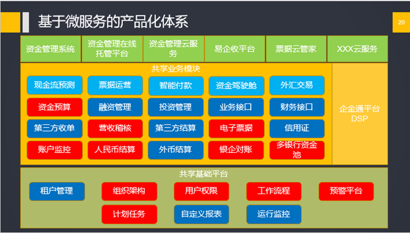

## 分布式系统部署

### 分布式系统的复杂性：多实例、多机器
相对于单体应用：
单体应用一个系统内有：一个应用、一个数据库，部署时整好这两个就完事儿了；
但分布式系统的一整套系统，有多个子应用，连接多个数据库，每个子应用部署做个实例，仅仅是基于这个原因，就衍生了一系列问题：

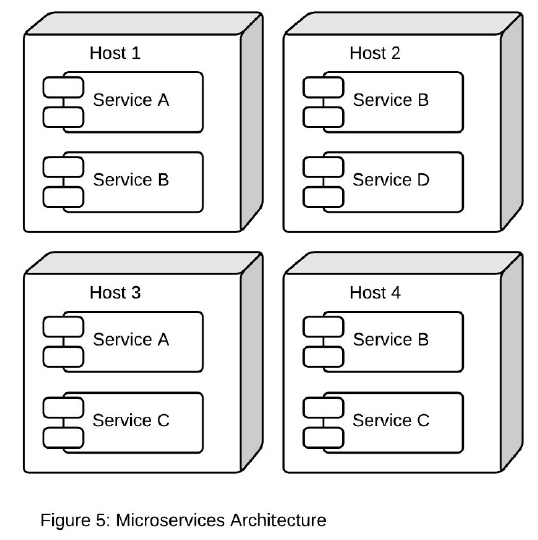

### 前后端分离
前端也独立出来，以类似后端间相互调用接口的方式调用后端服务。

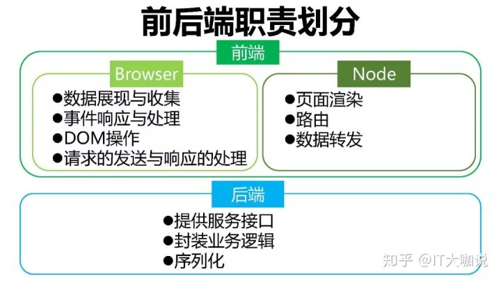

### Redis
需要新增远程缓存做共享，redis集群；

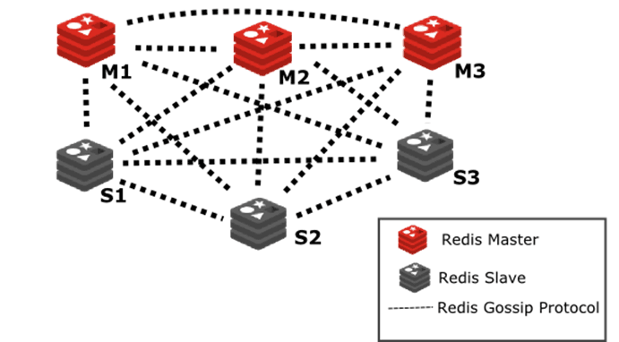

### Zookeeper
接口不在同一个应用中，你不知道你要调用的接口在哪，需要新增注册中心，zookeeper等；

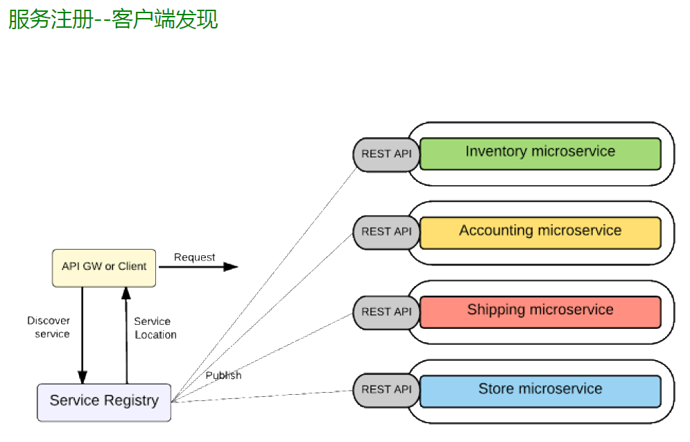

### 网关

鉴于后端不同的子应用需要统一的认证、鉴权等，也为了前端的跨域、安全等问题，需要统一的api网关，接管前端所有的请求，分发给后端；

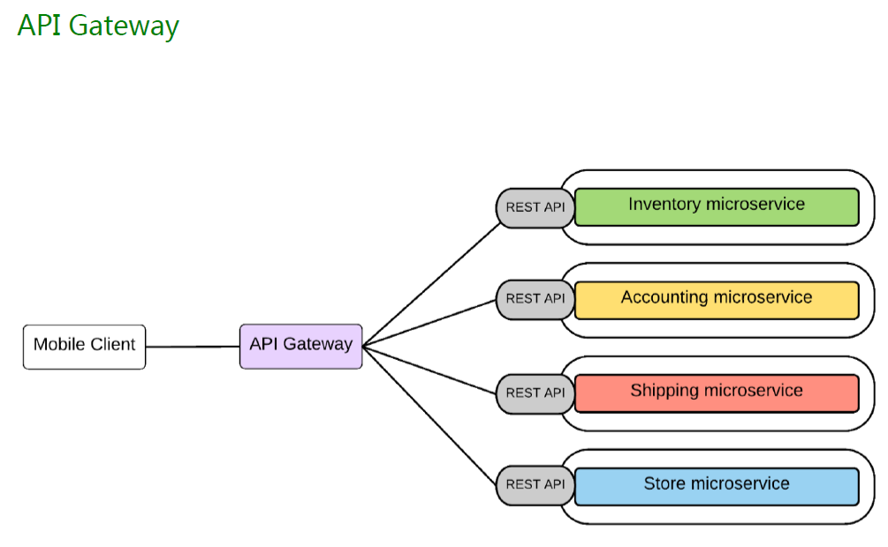

### [ELK](../elk/README.md)
不同的子应用分布在不同的机器上，哪怕是同一个应用的不同实例也在不同的机器。
所产生的日志文件自然在不同的机器，也不太可以一台机器、一台机器的去翻log文件，这时就需要统一的日志收集中心，ELK系列。

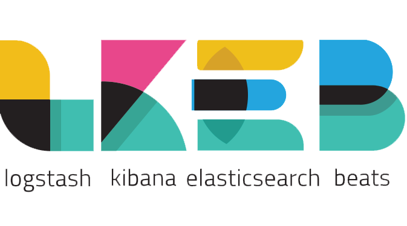

### [Skywalking](../skywalking/README.md)
这时，前端页面的一条请求过来，经nginx被随机分到一个web接口（api网关），web又随机选了一个后端（如usercore实例），
后端在方法里面又调用了其他应用（如workflow），也是随机选择了一个这个应用的实例……。
分布式应用的一个请求总是跨多个子系统的，如果从前端并发来了好多条这样那样的请求，怎么找到某个请求的完整路径的日志？
这时就需要跨服务节点的链路跟踪服务，如[skywalking](../skywalking/README.md)等，为这条请求打上标签`traceid`，记录在log里面。

### 自动部署
一台机器很难部署两个mysql、或两个oracle，即便部署两个tomcat也需要各种改端口。
当然我们遇到的大部分是部署应用，这种部署时临时改端口、改路径、配置等，人工可以完成；
但如果是10个应用，每个应用2个实例，共20个，分布在5台机器上，人工手动依旧可以完成，但巨麻烦；
那么，大概两三个小时后，一个公共的包改了个bug，需要发布，这个包有7个应用使用到了，需要再部署一遍……
这时需要jenkins、docker、kubernetes。这三个组件的作用，基本上就是把手动要操作的流程固化下来，可以反复使用。

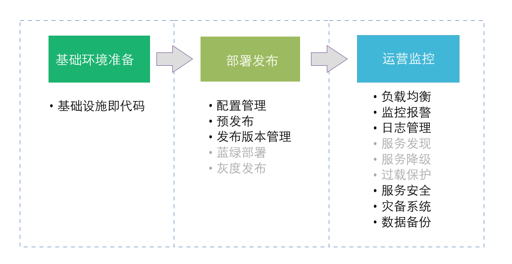

### [Jenkins](../jenkins/README.md)
`jenkins`用于拉代码，自动构建：编译、打包、发布到运行的机器。

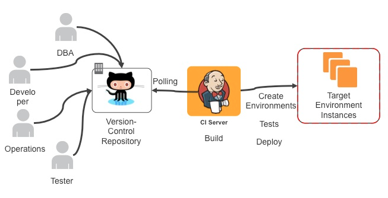

### [Docker](../kubernetes1/docker.md)
`docker`提供运行时的隔离，把`操作系统`+`jdk`+`应用`+`启动方式`打包起来。
docker的操作表现像虚拟机，但是里面跑着的应用的进程是跑在宿主里面的，docker仅仅是做了应用程序级别的隔离。

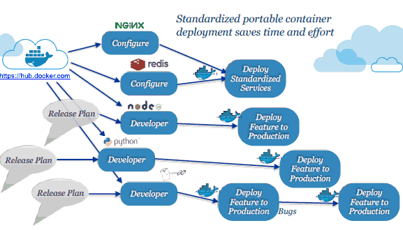

### [Kubernetes](../kubernetes1/README.md)
至于`kubernetes`（俗称`k8s`）是docker的集群管理软件，docker，不算上内置的另一个docker集群管理swarm的话，是没有集群功能的：
不能跨主机网络访问，不能跨主机调度；swarm更简单，但之所以选择它，是因为kubernetes比swarm功能更全面、更强大。

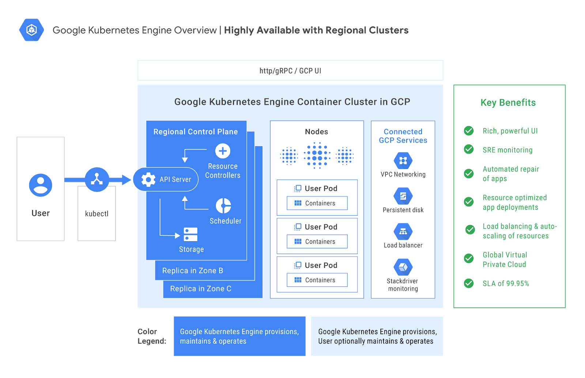

### 多主机部署时需要注意的几个问题
一般服务是部署在linux主机上面的。
#### 时间
主机时间、或时区可能不正常；
多台主机间需要做时间同步，使用ntp的内网搭服务端-客户端的形式，可以做到将各主机的时间同步到毫秒级。

#### 字体
有的应用用到了windows字体、中文字体等，需要手动安装。

