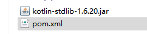
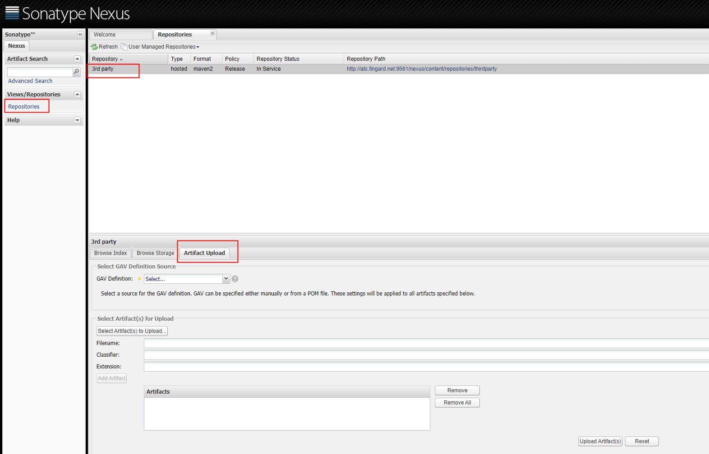
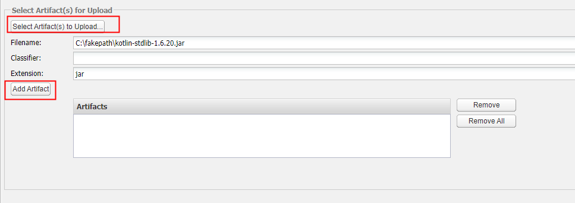
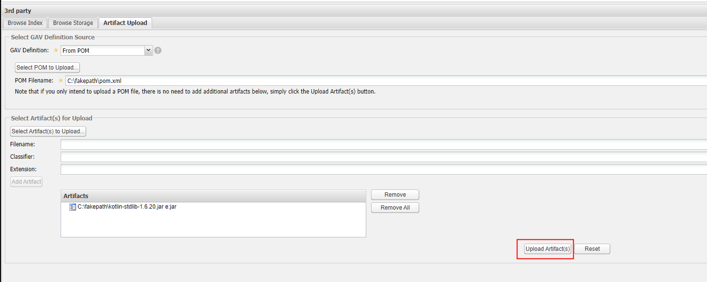
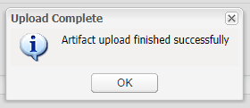

# Nexus 3

目前用作docker镜像仓库、maven仓库、npm仓库、yum源代理、helm源。

[docker私服的搭建详情](http://saas.gitlab.fingard.cn/document/deployment/nexus3.html)

### nexus3 搭建
https://blog.csdn.net/qq_44605317/article/details/109484604  
参考上文，但是在启动的命令上需要做一些修改  
```shell

# docker启动nexus3命令，-v后面是挂载的路径
 docker run -d -p 8081:8081 -p 8082:8082 -p 8083:8083 --name nexus3 -v /home/data/nexus/nexus-data:/nexus-data --restart=always sonatype/nexus3
 
# 需要为该目录分配足够的权限
[root@DESKTOP-OT9VF2K:/home/data/nexus]# chmod 777 nexus-data
 
# 查看nexus密码
[root@DESKTOP-OT9VF2K:/home/data/nexus]# docker exec -it nexus3 cat /nexus-data/admin.password && echo
```

### Nexus三方jar包上传   
将相关的pom文件重命名为【pom.xml】，如下：   

2、在【repositories→ 3rd party→ Artifact Upload】下   
  
选择gav定义为【From POM】，并上传对应的pom.xml文件     
  
上传对应的jar文件，再点击下面的Add Artifact  
  
再点击下面的【Upload Artifact(s)】  
   
等待上传，然后看到提示上传成功即可  
   
## faq
### OrientDB 启动时报错

[Nexus3 OrientDB Console使用](https://www.jianshu.com/p/999593fd7eb9)

[Accessing the OrientDB Console](https://support.sonatype.com/hc/en-us/articles/115002930827-Accessing-the-OrientDB-Console)

[记一次异常停机损坏了orientdb 导致nexus2无法启动](https://blog.csdn.net/shenyue_sam/article/details/77164285)

[OrientDB corruption state in Nexus Repository version 3.2.0-01](https://stackoverflow.com/a/45986526)