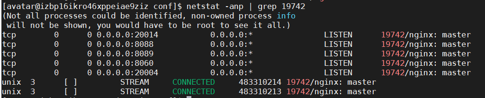

# Nginx

## 链接
- [官网](http://nginx.org/)
- [官网文档](http://nginx.org/en/docs/)
- [中文文档-官网文档翻译](http://www.nginx.cn/doc/)
- [w3cschool《Nginx 入门指南》](https://www.w3cschool.cn/nginx/?)
    - 注：这个文档只是用作nginx开发的，只是起一个nginx的话，没必要读这个文档
- [nginx反向代理proxy_pass绝对路径和相对路径](https://www.jianshu.com/p/ec14f55fd209)


## 使用
我们一般使用nginx做静态网页、文件资源、后台的负载均衡服务器，直接改下配置，启动nginx即可。  

nginx.conf配置说明  
1. 端口号： listen       80;
2. 页面存放位置：root html;   表示页面都存放在nginx的html目录下
3. 欢迎页面： index  index.html index.htm;   默认会访问index.html或者index.htm文件 

nginx 反向代理，nginx在处理静态文件的吞吐量上面比tomcat好很多

### 常用命令
```bash
# 显示帮助
nginx -h
# 启动
win: 直接双击nginx.exe  
linux:  start nginx | nginx
# 停止
nginx -s stop
# 重新加载配置
nginx -s reload
# 在前台启动nginx
sudo nginx -g "daemon off;"
```

### nginx -s reload 不生效的问题
[系统重启后ngix reload不生效原因分析](https://www.gxlsystem.com/hulianwang-1523871.html)
```shell
Nginx reload过程分析：
1，检查配置是否正确
相当于nginx -t

2，打开日志文件
相当于nginx -s reopen
由于日志文件比较多，需要打开多个文件

3，重新监听套接字
相当于nginx
这个步骤会初始化很多东西，重点关注哈希表

4，关闭旧worker进程
相当于nginx -s quit
```


### 一个nginx配置文件示例
```nginx

#user  nobody;
worker_processes  4; # 这个配置和cpu核数一致，能达最佳性能
#error_log  logs/error.log;
#error_log  logs/error.log  notice;
#error_log  logs/error.log  info;
#pid        logs/nginx.pid;
events {
  worker_connections  1024;
}
http {
  include       mime.types;
  default_type  application/octet-stream;
  #log_format  main  '$remote_addr - $remote_user [$time_local] "$request" '
  #                  '$status $body_bytes_sent "$http_referer" '
  #                  '"$http_user_agent" "$http_x_forwarded_for"';
  #access_log  logs/access.log  main;
  sendfile        on;
  #tcp_nopush     on;
  #keepalive_timeout  0;
  keepalive_timeout  86400;
  proxy_read_timeout 86400; # 这个设置nginx检测的超时时间，单位秒
  proxy_send_timeout 86400;
  gzip  on;
  gzip_min_length 1k;
  gzip_buffers 4 16k;
  gzip_comp_level 4;
  gzip_types text/plain application/x-javascript application/javascript application/json text/css text/javascript application/xml application/x-httpd-php image/jpeg image/gif image/png;
  gzip_vary on;
  gzip_disable "MSIE [1-6]\.";

  # 这里配置两个websys的tomcat地址
  upstream websys {
    server websys:8080;
    #server localhost:8085 weight=4 max_fails=2 fail_timeout=30s;
  }
  # websocket 需要加下这个，Nginx 在 1.3 以后的版本才支持 websocket 反向代理
  map $http_upgrade $connection_upgrade {
    default upgrade;
    ''      close;
  }

  server {
    listen       80;
    server_name  localhost;

    #charset koi8-r;

    #access_log  logs/host.access.log  main;

    # websock接口单独配置
    location /websys/websocket {
      proxy_pass http://websys;  # 这个对应上面的那个 upstream 设置的名字，用于反向代理、负载均衡

      proxy_redirect    off;
      proxy_set_header X-Real-IP $remote_addr;
      proxy_set_header Host $host;
      proxy_set_header X-Forwarded-For $proxy_add_x_forwarded_for;
      proxy_read_timeout 86400; # 这个设置nginx检测的超时时间，单位秒，超过这个时长没访问websocket会被nginx断开
      proxy_send_timeout 86400;
      proxy_http_version 1.1;
      proxy_set_header Upgrade $http_upgrade;
      proxy_set_header Connection "upgrade";
    }

    # 后台api接口。注意，websys的tomcat应用路径需要是/web
    location /websys {
      # proxy_pass http://localhost:8084;
      proxy_pass http://websys;  # 这个对应上面的那个 upstream 设置的名字，用于反向代理、负载均衡
      
      proxy_read_timeout 86400; # 这个设置nginx检测的超时时间，单位秒
      proxy_send_timeout 86400;
      proxy_redirect off;
      proxy_set_header Host $host:$server_port; # nginx代理tomcat里面的jsp来回跳转，需要这些参数
      proxy_set_header X-Real-IP $remote_addr;
      proxy_set_header X-Forwarded-For $proxy_add_x_forwarded_for;
    }

    # 前端静态页面
    location / {
      root  /dist;  # 这个指向前端编译好的静态页面的文件夹地址
      index /index.html;
      try_files $uri $uri/ /index.html; # 防止页面刷新404
      proxy_read_timeout 86400; # 这个设置nginx检测的超时时间，单位秒
      proxy_send_timeout 86400;
    }

    #error_page  404              /404.html;
    # redirect server error pages to the static page /50x.html
    #
    error_page   500 502 503 504  /50x.html;
    location = /50x.html {
      root   html;
    }
  }
}
```


### 配置文件编码问题
配置文件编码一定要为`utf-8`，不能是`utf-8 无bom`等格式，否则起不来。

现象：是报配置文件的错，每删一行都会报第一行的错。

### 端口问题
经试验，101、102等端口不能用，window、linux都不行，不知道为啥。

解决：设置100以下的端口或者1000以上的端口就可以了。

### 权限问题
avatar启动nginx 需要在nginx配置文件修改用户为avatar  
[普通用户nginx访问不了](https://blog.csdn.net/weixin_29116603/article/details/113005370)

### 相对路径
html文件夹可以使用“../../”指向父级路径。

### [OpenResty](https://openresty.org/cn/)
OpenResty® 是一款基于 NGINX 和 LuaJIT 的 Web 平台。

codo项目使用openresty的代码和文档，代码在lua目录下：
- [codo api-gateway](https://github.com/ss1917/api-gateway)
- [codo api-gateway安装文档](https://docs.opendevops.cn/zh/guide/install/distribute/#api%E7%BD%91%E5%85%B3%EF%BC%88%E9%83%A8%E7%BD%B2%E5%AE%B9%E6%98%93%E5%87%BA%E9%97%AE%E9%A2%98%E7%9A%84%E5%9C%B0%E6%96%B9%EF%BC%89)  
遇到一个坑：[nginx + openresty + lua 不支持k8s下的短域名，长域名没问题](https://github.com/openresty/openresty/issues/298)，  
并且，也只有lua脚本里面的遇到这种问题，普通的nginx proxy_pass都没这种问题。


### nginx黑名单配置
1.conf下面创建个ip.black  
里面写  
deny ip;          //  代表禁用这个ip  
nginx.conf里加个          include       ip.black;  
如果做的是http层的 就加到http里 server上面  
如果做的是端口stream层  就加到stream层 server上面  
重启nginx

### 屏蔽单个ip访问
deny IP;
### 允许单个ip访问
allow IP;
### 屏蔽所有ip访问
deny all;
### 允许所有ip访问
allow all;  
#屏蔽整个段即从123.0.0.1到123.255.255.254访问的命令  
deny 123.0.0.0/8  
#屏蔽IP段即从123.45.0.1到123.45.255.254访问的命令  
deny 124.45.0.0/16  
#屏蔽IP段即从123.45.6.1到123.45.6.254访问的命令  
deny 123.45.6.0/24  


也可以
ip.black 反向弄成白名单  

里面写  
allow 192.168.41.x;  
allow 192.168.41.x;  
deny all;  
意思只让这俩ip访问  
  

### 配置https
[nginx配置自签名https - 简书 (jianshu.com)](https://www.jianshu.com/p/67e7e860d000)
```shell
server {
        listen       443 ssl;
        server_name  你的域名;
        charset utf-8;

        ssl on;
        ssl_certificate      server.crt;
        ssl_certificate_key  server.key;

        location / {
            root   html;
            index  index.html index.htm;
        }
    }
```

http 转https
https://www.cnblogs.com/wangbaojun/p/10621404.html


### nginx 监听多个端口

[nginx如何设置多端口-Nginx-PHP中文网](https://www.php.cn/nginx/422301.html)

两种场景：  
同一个server，配置多个listen；  
配置多个server  

例如:
```shell
##定义Nginx运行的用户和用户组
user avatar;

##nginx进程数，建议设置为等于CPU总核心数
worker_processes 1; # 这个配置和cpu核数一致，能达最佳性能

##  全局错误日志定义类型，[ debug | info | notice | warn | error | crit ]
#error_log  logs/error.log;
#error_log  logs/error.log  notice;
#error_log  logs/error.log  info;

## 进程pid文件
#pid        logs/nginx.pid;


events {
  ##单个进程最大连接数（最大连接数=连接数*进程数）
  ##根据硬件调整，和前面工作进程配合起来用，尽量大，但是别把cpu跑到100%就行。每个进程允许的最多连接数，理论上每台nginx服务器的最大连接数为
  worker_connections 1024;
}

#设定http服务器，利用它的反向代理功能提供负载均衡支持
http {
  #文件扩展名与文件类型映射表
  include mime.types;
  #默认文件类型
  default_type application/octet-stream;
  
   #设定通过nginx上传文件的大小
  client_max_body_size 100m;
  
  #access_log  logs/access.log  main;
  
  #开启高效文件传输模式，sendfile指令指定nginx是否调用sendfile函数来输出文件，对于普通应用设为 on，如果用来进行下载等应用磁盘IO重负载应用，可设置为off，以平衡磁盘与网络I/O处理速度，降低系统的负载。注意：如果图片显示不正常把这个改成off。
    #sendfile指令指定 nginx 是否调用sendfile 函数（zero copy 方式）来输出文件，对于普通应用，必须设为on。如果用来进行下载等应用磁盘IO重负载应用，可设置为off，以平衡磁盘与网络IO处理速度，降低系统uptime。
  sendfile on;
  
  
  #tcp_nopush     on;
  #keepalive_timeout  0;
  
  # #长连接超时时间，单位是秒
  keepalive_timeout 86400;
  proxy_read_timeout 86400; # 这个设置nginx检测的超时时间，单位秒
  proxy_send_timeout 86400;
  
  #gzip模块设置
  gzip on; #开启gzip压缩输出
  gzip_min_length 1k;   #最小压缩文件大小
  gzip_buffers 4 16k;   #压缩缓冲区
  gzip_comp_level 4;  #压缩等级
  gzip_types text/plain application/x-javascript application/javascript application/json text/css text/javascript application/xml application/x-httpd-php image/jpeg image/gif image/png;
  gzip_vary on; #压缩类型，默认就已经包含textml，所以下面就不用再写了，写上去也不会有问题，但是会有一个warn。
  gzip_disable "MSIE [1-6]\.";

  # 这里配置两个websys的tomcat地址
  upstream api {
    server 172.16.120.225:20006;
    #server localhost:8666 weight=4 max_fails=2 fail_timeout=30s;
  }
  # websocket 需要加下这个，Nginx 在 1.3 以后的版本才支持 websocket 反向代理
  map $http_upgrade $connection_upgrade {
    default upgrade;
    '' close;
  }

  server {
    listen 8089 ssl;
    server_name localhost;
    ssl_session_tickets on;
    ssl_certificate /data/home/avatar/fg-deploy/software/nginx/nginx-1.20.1/cert/2022.xyyweb.com.cn.pem;
    ssl_certificate_key /data/home/avatar/fg-deploy/software/nginx/nginx-1.20.1/cert/2022.xyyweb.com.cn.key;
    ssl_session_timeout 5m;
    ssl_ciphers ECDHE-RSA-AES128-GCM-SHA256:ECDHE:ECDH:AES:HIGH:!NULL:!aNULL:!MD5:!ADH:!RC4;
    ssl_protocols TLSv1 TLSv1.1 TLSv1.2;
    ssl_prefer_server_ciphers on;

    #charset koi8-r;

    #access_log  logs/host.access.log  main;
    # websock接口单独配置
    location /api/websocket {
      proxy_pass http://api; # 这个对应上面的那个 upstream 设置的名字，用于反向代理、负载均衡

      proxy_redirect off;
      proxy_set_header Host $host;
      proxy_set_header Upgrade $http_upgrade;
      proxy_set_header Connection "Upgrade";
      proxy_set_header X-Real-IP $remote_addr;
      proxy_set_header REMOTE-HOST $remote_addr;
      proxy_set_header X-Forwarded-For $proxy_add_x_forwarded_for;
      proxy_read_timeout 86400; # 这个设置nginx检测的超时时间，单位秒，超过这个时长没访问websocket会被nginx断开
      proxy_http_version 1.1;
    }

    # websock接口单独配置
    location /websocket {
      proxy_pass http://api; # 这个对应上面的那个 upstream 设置的名字，用于反向代理、负载均衡

      proxy_redirect off;
      proxy_set_header Host $host;
      proxy_set_header Upgrade $http_upgrade;
      proxy_set_header Connection "Upgrade";
      proxy_set_header X-Real-IP $remote_addr;
      proxy_set_header REMOTE-HOST $remote_addr;
      proxy_set_header X-Forwarded-For $proxy_add_x_forwarded_for;
      proxy_read_timeout 86400; # 这个设置nginx检测的超时时间，单位秒，超过这个时长没访问websocket会被nginx断开
      proxy_http_version 1.1;
    }
	
	
	
    location /vangogh {
      proxy_pass http://172.16.120.225:20001;
      proxy_redirect off;
      proxy_set_header Host $host:$server_port;
      proxy_set_header X-Real-IP $remote_addr;
      proxy_set_header X-Forwarded-For $proxy_add_x_forwarded_for;
      add_header 'Access-Control-Allow-Origin' *;
      #允许带上cookie请求
      add_header 'Access-Control-Allow-Credentials' 'true';
      #允许请求的方法，比如 GET/POST/PUT/DELETE
      add_header 'Access-Control-Allow-Methods' *;
      #允许请求的header
      add_header 'Access-Control-Allow-Headers' *;
      proxy_read_timeout 86400;
      proxy_send_timeout 86400;
    }


    # 后台api接口。注意，websys的tomcat应用路径需要是/web
    location /api {
      # proxy_pass http://localhost:8084;
      proxy_set_header Host $host;
      proxy_set_header X-Real-IP $remote_addr;
      proxy_set_header REMOTE-HOST $remote_addr;
      proxy_set_header X-Forwarded-For $proxy_add_x_forwarded_for;
      proxy_read_timeout 86400; # 这个设置nginx检测的超时时间，单位秒
      proxy_send_timeout 86400;
      proxy_pass http://api; # 这个对应上面的那个 upstream 设置的名字，用于反向代理、负载均衡
    }
	
	

    # 前端静态页面
    location / {
      root /home/avatar/fg-deploy/software/nginx/nginx-1.20.1/bin/html; # 这个指向前端编译好的静态页面的文件夹地址
      index index.html index.htm;
      
      add_header 'Access-Control-Allow-Origin' *;
      #允许带上cookie请求
      add_header 'Access-Control-Allow-Credentials' 'true';
      #允许请求的方法，比如 GET/POST/PUT/DELETE
      add_header 'Access-Control-Allow-Methods' *;
      #允许请求的header
      add_header 'Access-Control-Allow-Headers' *;

      proxy_read_timeout 86400; # 这个设置nginx检测的超时时间，单位秒
      proxy_send_timeout 86400;
      try_files $uri $uri/ /index.html; # 防止页面刷新404
    }

    #error_page  404              /404.html;
    # redirect server error pages to the static page /50x.html
    #
    error_page 500 502 503 504 /50x.html;
    location = /50x.html {
      root html;
    }
  }

  server {
    listen 20004 ssl;
    client_max_body_size 10M;
    client_body_buffer_size 5M;
    proxy_buffer_size 5000k;
    proxy_buffers 16 5000k;
    server_name localhost;
    ssl_session_tickets on;
    ssl_certificate /data/home/avatar/fg-deploy/software/nginx/nginx-1.20.1/cert/2022.xyyweb.com.cn.pem;
    ssl_certificate_key /data/home/avatar/fg-deploy/software/nginx/nginx-1.20.1/cert/2022.xyyweb.com.cn.key;
    ssl_session_timeout 5m;
    ssl_ciphers ECDHE-RSA-AES128-GCM-SHA256:ECDHE:ECDH:AES:HIGH:!NULL:!aNULL:!MD5:!ADH:!RC4;
    ssl_protocols TLSv1 TLSv1.1 TLSv1.2;
    ssl_prefer_server_ciphers on;


    #charset koi8-r;
    #access_log  logs/host.access.log  main;
    location / {
      root /home/avatar/fg-deploy/app/frisk-vangogh/vangogh-ui/dist;
      index index.html index.htm;
      try_files $uri $uri/ /index.html; # 防止页面刷新404
      proxy_read_timeout 86400; # 这个设置nginx检测的超时时间，单位秒
      proxy_send_timeout 86400;
    }
    location /vangogh {
      proxy_pass http://172.16.120.225:20001;
      proxy_redirect off;
      proxy_set_header Host $host:$server_port;
      proxy_set_header X-Real-IP $remote_addr;
      proxy_set_header X-Forwarded-For $proxy_add_x_forwarded_for;
      proxy_read_timeout 86400;
      proxy_send_timeout 86400;
    }
    location /api {
      proxy_pass http://172.16.120.225:20006;#gateway
      proxy_redirect off;
      proxy_set_header Host $host:$server_port;
      proxy_set_header X-Real-IP $remote_addr;
      proxy_set_header X-Forwarded-For $proxy_add_x_forwarded_for;
      proxy_read_timeout 86400;
      proxy_send_timeout 86400;
    }
    location /* {
      proxy_pass http://172.16.120.225:20006;#gateway
      proxy_redirect off;
      proxy_set_header Host $host:$server_port;
      proxy_set_header X-Real-IP $remote_addr;
      proxy_set_header X-Forwarded-For $proxy_add_x_forwarded_for;
      proxy_read_timeout 86400;
      proxy_send_timeout 86400;
    }

    #error_page  404              /404.html;

    # redirect server error pages to the static page /50x.html
    #
    error_page 500 502 503 504 /50x.html;
    location = /50x.html {
      root html;
    }
  }

  server {
    listen 8088 ssl;
    server_name localhost;
    ssl_session_tickets on;
    client_max_body_size 10M;
    client_body_buffer_size 5M;
    proxy_buffer_size 5000k;
    proxy_buffers 16 5000k;
    ssl_certificate /data/home/avatar/fg-deploy/software/nginx/nginx-1.20.1/cert/2022.xyyweb.com.cn.pem;
    ssl_certificate_key /data/home/avatar/fg-deploy/software/nginx/nginx-1.20.1/cert/2022.xyyweb.com.cn.key;
    ssl_session_timeout 5m;
    ssl_ciphers ECDHE-RSA-AES128-GCM-SHA256:ECDHE:ECDH:AES:HIGH:!NULL:!aNULL:!MD5:!ADH:!RC4;
    ssl_protocols TLSv1 TLSv1.1 TLSv1.2;
    ssl_prefer_server_ciphers on;
    add_header Access-Control-Allow-Credentials true;
    add_header Access-Control-Allow-Origin $http_origin;

    # 前端静态页面
    location / {
      root /home/avatar/fg-deploy/app/ats3-ui/dist; # 这个指向前端编译好的静态页面的文件夹地址
      index index.html;
      add_header 'Access-Control-Allow-Origin' *;
      #允许带上cookie请求
      add_header 'Access-Control-Allow-Credentials' 'true';
      #允许请求的方法，比如 GET/POST/PUT/DELETE
      add_header 'Access-Control-Allow-Methods' *;
      #允许请求的header
      add_header 'Access-Control-Allow-Headers' *;


      proxy_read_timeout 86400; # 这个设置nginx检测的超时时间，单位秒
      proxy_send_timeout 86400;
      try_files $uri $uri/ /index.html; # 防止页面刷新404
    }

    # websock接口单独配置
    location /api/websocket {
      proxy_pass http://172.16.120.225:20016; # 这个对应上面的那个 upstream 设置的名字，用于反向代理、负载均衡
      proxy_redirect off;
      proxy_set_header Host $host;
      proxy_set_header X-Real-IP $remote_addr;
      proxy_set_header REMOTE-HOST $remote_addr;
      proxy_set_header X-Forwarded-For $proxy_add_x_forwarded_for;
      proxy_read_timeout 86400; # 这个设置nginx检测的超时时间，单位秒，超过这个时长没访问websocket会被nginx断开
      proxy_http_version 1.1;
    }

    # 后台api接口。注意，websys的tomcat应用路径需要是/web
    location /api {
      proxy_set_header Host $host;
      proxy_set_header X-Real-IP $remote_addr;
      proxy_set_header REMOTE-HOST $remote_addr;
      proxy_set_header X-Forwarded-For $proxy_add_x_forwarded_for;
      proxy_read_timeout 86400; # 这个设置nginx检测的超时时间，单位秒
      proxy_send_timeout 86400;
      proxy_pass http://172.16.120.225:20016; # 这个对应上面的那个 upstream 设置的名字，用于反向代理、负载均衡
    }

    location /vangogh {
      proxy_pass http://172.16.120.225:20011;
      proxy_redirect off;
      proxy_set_header Host $host:$server_port;
      proxy_set_header X-Real-IP $remote_addr;
      proxy_set_header X-Forwarded-For $proxy_add_x_forwarded_for;
      add_header 'Access-Control-Allow-Origin' *;
      #允许带上cookie请求
      add_header 'Access-Control-Allow-Credentials' 'true';
      #允许请求的方法，比如 GET/POST/PUT/DELETE
      add_header 'Access-Control-Allow-Methods' *;
      #允许请求的header
      add_header 'Access-Control-Allow-Headers' *;
      proxy_read_timeout 86400;
      proxy_send_timeout 86400;
    }

    location /ats_report_server_fr {
      proxy_pass http://127.0.0.1:8050/ats_report_server_fr;
      proxy_redirect off;
      proxy_set_header Host $host:$server_port;
      proxy_set_header X-Real-IP $remote_addr;
      proxy_set_header X-Forwarded-For $proxy_add_x_forwarded_for;
      add_header 'Access-Control-Allow-Origin' *;
      #允许带上cookie请求
      add_header 'Access-Control-Allow-Credentials' 'true';
      #允许请求的方法，比如 GET/POST/PUT/DELETE
      add_header 'Access-Control-Allow-Methods' *;
      #允许请求的header
      add_header 'Access-Control-Allow-Headers' *;
      proxy_read_timeout 86400;
      proxy_send_timeout 86400;
    }
    #error_page  404              /404.html;
    # redirect server error pages to the static page /50x.html
    #
    error_page 500 502 503 504 /50x.html;
    location = /50x.html {
      root html;
    }
  }

  server {
    listen 20014 ssl;
    server_name localhost;
    client_max_body_size 10M;
    client_body_buffer_size 5M;
    proxy_buffer_size 5000k;
    proxy_buffers 16 5000k;
    ssl_session_tickets on;
    ssl_certificate /data/home/avatar/fg-deploy/software/nginx/nginx-1.20.1/cert/2022.xyyweb.com.cn.pem;
    ssl_certificate_key /data/home/avatar/fg-deploy/software/nginx/nginx-1.20.1/cert/2022.xyyweb.com.cn.key;
    ssl_session_timeout 5m;
    ssl_ciphers ECDHE-RSA-AES128-GCM-SHA256:ECDHE:ECDH:AES:HIGH:!NULL:!aNULL:!MD5:!ADH:!RC4;
    ssl_protocols TLSv1 TLSv1.1 TLSv1.2;
    ssl_prefer_server_ciphers on;
    #add_header Access-Control-Allow-Credentials true;
    #add_header Access-Control-Allow-Origin $http_origin;

    #charset koi8-r;

    #access_log  logs/host.access.log  main;
    location / {
      #root /home/avatar/fg-deploy/app/ats3-vangogh/vangogh-1.3.6-RELEASE/vangogh-ui/dist;
      root /data/home/avatar/fg-deploy/app/ats3-vangogh/vangogh-2023.1.0/vangogh-ui/dist;
      index index.html index.htm;
      try_files $uri $uri/ /index.html; # 防止页面刷新404
      proxy_read_timeout 86400; # 这个设置nginx检测的超时时间，单位秒
      proxy_send_timeout 86400;
    }

    location /vangogh {
      proxy_pass http://172.16.120.225:20011;
      proxy_redirect off;
      proxy_set_header Host $host:$server_port;
      proxy_set_header X-Real-IP $remote_addr;
      proxy_set_header X-Forwarded-For $proxy_add_x_forwarded_for;
      add_header 'Access-Control-Allow-Origin' *;
      #允许带上cookie请求
      add_header 'Access-Control-Allow-Credentials' 'true';
      #允许请求的方法，比如 GET/POST/PUT/DELETE
      add_header 'Access-Control-Allow-Methods' *;
      #允许请求的header
      add_header 'Access-Control-Allow-Headers' *;
      proxy_read_timeout 86400;
      proxy_send_timeout 86400;
    }

    location /api {
      proxy_pass http://172.16.120.225:20016;#gateway
      proxy_redirect off;
      proxy_set_header Host $host:$server_port;
      proxy_set_header X-Real-IP $remote_addr;
      proxy_set_header X-Forwarded-For $proxy_add_x_forwarded_for;
      add_header 'Access-Control-Allow-Origin' *;
      #允许带上cookie请求
      add_header 'Access-Control-Allow-Credentials' 'true';
      #允许请求的方法，比如 GET/POST/PUT/DELETE
      add_header 'Access-Control-Allow-Methods' *;
      #允许请求的header
      add_header 'Access-Control-Allow-Headers' *;
      proxy_read_timeout 86400;
      proxy_send_timeout 86400;
    }
    location /* {
      proxy_pass http://172.16.120.225:20016;#gateway
      proxy_redirect off;
      proxy_set_header Host $host:$server_port;
      proxy_set_header X-Real-IP $remote_addr;
      proxy_set_header X-Forwarded-For $proxy_add_x_forwarded_for;
      proxy_read_timeout 86400;
      proxy_send_timeout 86400;
    }

    #error_page  404              /404.html;

    # redirect server error pages to the static page /50x.html
    #
    error_page 500 502 503 504 /50x.html;
    location = /50x.html {
      root html;
    }
  }
  server {
    listen 8060 ssl;
    server_name	app;
    ssl_session_tickets on;
    ssl_certificate /data/home/avatar/fg-deploy/software/nginx/nginx-1.20.1/cert/2022.xyyweb.com.cn.pem;
    ssl_certificate_key /data/home/avatar/fg-deploy/software/nginx/nginx-1.20.1/cert/2022.xyyweb.com.cn.key;
    ssl_session_timeout 5m;
    ssl_ciphers ECDHE-RSA-AES128-GCM-SHA256:ECDHE:ECDH:AES:HIGH:!NULL:!aNULL:!MD5:!ADH:!RC4;
    ssl_protocols TLSv1 TLSv1.1 TLSv1.2;
    ssl_prefer_server_ciphers on;

    location / {
      proxy_set_header Upgrade $http_upgrade;
      proxy_set_header Connection "upgrade";
      proxy_http_version 1.1;
      proxy_set_header Connection keep-alive;
      proxy_set_header Host $host;
      proxy_cache_bypass $http_upgrade;
      proxy_set_header X-Real-IP $remote_addr;
      proxy_set_header X-Forwarded-Proto $scheme;
      proxy_pass http://127.0.0.1:8050;
    }
  }
}
```

一个nginx启动5个端口



