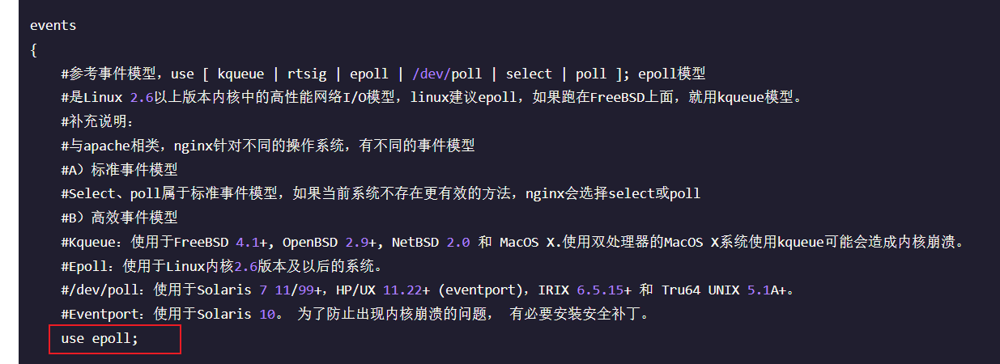
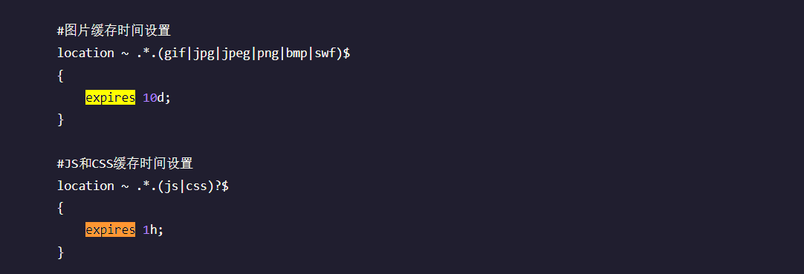

## nginx 性能优化

001 配置Nginx并发连接数：调整worker_processes和worker_connections参数以充分利用服务器资源，提高并发连接数。  
002 消除I/O阻塞：使用epoll或kqueue等I/O多路复用技术，消除I/O阻塞，提高并发性能。  
003 启用gzip压缩：使用ngx_http_gzip_module模块启用gzip压缩，减少传输数据量，提高响应速度。  
004 缓存静态文件：使用ngx_http_proxy_cache_module或ngx_http_fastcgi_cache_module模块缓存静态文件，减少对后端服务器的请求。  
005 使用HTTP/2协议：启用HTTP/2协议，利用多路复用和头部压缩等特性，提高页面加载速度。  
006 优化SSL/TLS：合理配置SSL/TLS协议，如关闭不安全的加密算法、使用TLS 1.3等，提高安全性和性能。  
007 负载均衡策略：选择合适的负载均衡策略，如轮询、IP hash、least_conn等，提高服务的可扩展性和可靠性。  
008 硬件优化：使用高性能的硬件，如SSD、高性能网络适配器等，提高I/O性能和网络带宽。  
需要根据具体情况选择上述方法进行优化，也可以结合使用多种优化方式来提升Nginx的性能  

001：全局层-调优  
worker_processes  4;           //更具cpu核数进行调优如果设置为auto，表示Nginx会根据CPU核心数自动分配worker进程数量，不过auto有些老版本不生效。  
worker_connections 65535;      / 表示每个cpu最多同时处理65535 个进程。  


002：
  

003：http层  
 在http段添加以下配置启用gzip压缩    
```shell
    gzip  on;
    gzip_min_length 1k;
    gzip_buffers 4 16k;
    gzip_comp_level 4;
    gzip_types text/plain application/x-javascript application/javascript application/json text/css text/javascript application/xml application/x-httpd-php image/jpeg image/gif image/png;
    gzip_vary on;
    gzip_disable "MSIE [1-6]\.";keepalive_timeout  86400;
```

004:server层  
```shell
location /static/ {
root /var/www/;
expires 7d;
}
```

expires 7d; 缓存七天 减少对后端的请求


005：server层  
```shell
listen 443 ssl http2; //开了

listen 443 ssl; //没开
```


006：server层  
```shell
ssl_session_tickets on;
ssl_certificate    /FinanceBox/Tomcat/ca/1.pem;
ssl_certificate_key  /FinanceBox/Tomcat/ca/2.key;
ssl_session_timeout 5m;
ssl_ciphers ECDHE-RSA-AES128-GCM-SHA256:ECDHE:ECDH:AES:HIGH:!NULL:!aNULL:!MD5:!ADH:!RC4;
ssl_protocols TLSv1 TLSv1.1 TLSv1.2;
ssl_prefer_server_ciphers on;
```
007 upstream层  
轮询  
```shell
upstream backend {

# 10s内出现3次错误，该服务器将被熔断10s
server 192.168.2.154:8080 max_fails=3 fail_timeout=10s;
server 192.168.2.109:8080 max_fails=3 fail_timeout=10s;
server 192.168.2.108:8080 max_fails=3 fail_timeout=10s;
server 192.168.2.107:8080 max_fails=3 fail_timeout=10s;
}
```

least_conn:  
Web请求会被转发到连接数最少的服务器上。  
轮询算法是把请求平均的转发给各个后端，使它们的负载大致相同。这有个前提，就是每个请求所占用的后端时间要差不多，如果有些请求占用的时间很长，会导致其所在的后端负载较高。在这种场景下，把请求转发给连接数较少的后端，能够达到更好的负载均衡效果，这就是least_conn算法。  
least_conn算法很简单，首选遍历后端集群，比较每个后端的conns/weight，选取该值最小的后端。  
如果有多个后端的conns/weight值同为最小的，那么对它们采用加权轮询算法。  
```shell
upstream zf{
least_conn;
server localhost:8081;
server localhost:8082;
server localhost:8083;
}
```


```shell
hash

upstream zf{
ip_hash;
server localhost:8081;
server localhost:8082;
server localhost:8083;
}
```


