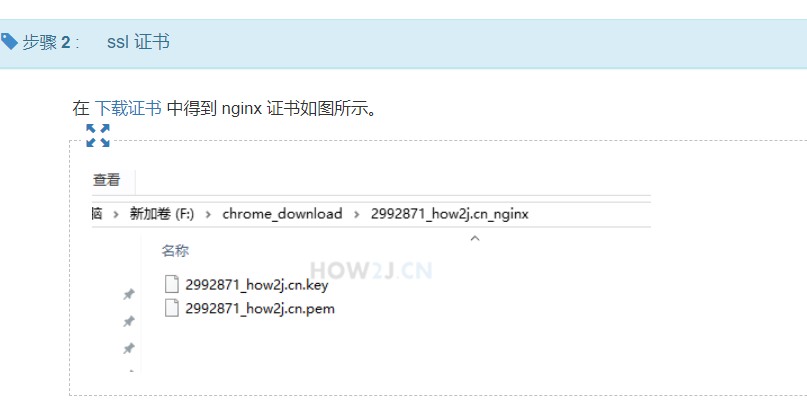
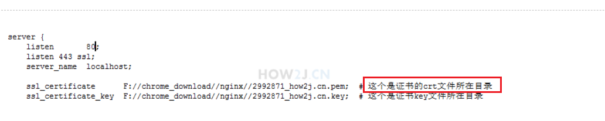

## 
证书文件的后缀并不能作为证书是哪一种编码的判断依据。  
对于私钥/公钥的文件后缀有时候用 key/crt，有时候用 pem，其实这不重要，重要的是文件中的内容格式  
xx.pem 即 crt文件

csr 是Certificate Signing Request的缩写，即证书签名申请，这不是证书，这是要求CA给证书签名的一种正是申请，  
该申请包含申请证书的实体的公钥及该实体店某些信息。该数据将成为证书的一部分。CSR始终使用它携带的公钥所对应的私钥进行签名。

cer：一般用于windows的证书文件格式
crt：一般用于Linux的证书，包含公钥和主体信息
key：一般用于密钥，特别是私钥
[key、csr、crt 区别](https://kingkong.blog.csdn.net/article/details/100680170)

[nginx配置自签名https - 简书 (jianshu.com)](https://www.jianshu.com/p/67e7e860d000)
[https搭建(自签名证书) - 数小钱钱的种花兔 - 博客园 (cnblogs.com)](https://www.cnblogs.com/buptleida/p/12090237.html)
