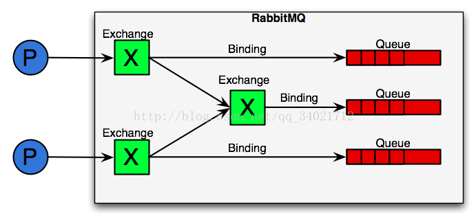
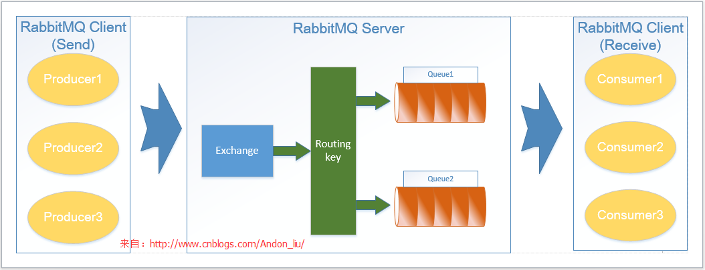

# RabbitMQ

## 链接
1. [RabbitMQ官网](https://www.rabbitmq.com/)
    1. [`Erlang`与`RabbitMQ`对应的版本号](https://www.rabbitmq.com/which-erlang.html)
        1. [rabbitmq官方维护的零依赖erlang二进制包](https://github.com/rabbitmq/erlang-rpm)
            1. [对新版本OpenSSL/libcrypto有强依赖：1.0.2或1.1.x](https://github.com/rabbitmq/erlang-rpm#implicit-openssllibcrypto-dependency)
    1. [官网文档](https://www.rabbitmq.com/getstarted.html)
        1. [集群文档](https://www.rabbitmq.com/clustering.html)
    1. [RabbitMQ官网下载页面](https://www.rabbitmq.com/download.html)
    1. [RabbitMQ官网提供的各版本erlang、rabbitmq在各操作系统的安装包下载](https://www.rabbitmq.com/releases/)
    1. [各版本erlang下载](https://www.erlang-solutions.com/resources/download.html)
    1. [Management Plugin 网页管理界面](https://www.rabbitmq.com/management.html)
    1. [AMQP 模型简介](https://www.rabbitmq.com/tutorials/amqp-concepts.html)
    1. [linux通用版安装配置指南](https://www.rabbitmq.com/install-generic-unix.html)
    1. [各种配置文件位置，现在的配置文件有](https://www.rabbitmq.com/configure.html#config-location)
        1. `rabbitmq.conf`：类似java porperties的配置
        1. `advanced.config`：erlang语法的高级配置，也就是以前的`rabbitmq.config`
        1. `rabbitmq-env.conf`：操作系统环境变量方式的配置
    1. [rabbitmq的各种端口号](https://www.rabbitmq.com/networking.html#ports)
1. [中文文档](https://github.com/mr-ping/RabbitMQ_into_Chinese)
    1. [AMQP 简介](http://rabbitmq.mr-ping.com/AMQP/AMQP_0-9-1_Model_Explained.html)
    1. [官方入门教程翻译-Python示例](http://rabbitmq.mr-ping.com/tutorials_with_python/[1]Hello_World.html)
1. RabbitMQ使用
    1. [RabbitMQ的各语言示例](https://github.com/rabbitmq/rabbitmq-tutorials)
    1. [spring amqp 1.3.5 文档（英文原版）](https://docs.spring.io/spring-amqp/docs/1.3.5.RELEASE/reference/htmlsingle/)
    1. [Spring Cloud Stream 文档（中文翻译）](https://springcloud.cc/spring-cloud-dalston.html#_spring_cloud_stream)
        - [RabbitMQ Binder](https://springcloud.cc/spring-cloud-dalston.html#_rabbitmq_binder)
1. 安装
    1. [安装文档](./install_with_picture.md)
    1. [Centos 6.8下，使用rpm包安装](https://blog.csdn.net/qq_20804323/article/details/87889190)
    1. [Centos7 离线安装RabbitMQ,并配置集群](https://www.cnblogs.com/mayhh/p/11425532.html)
1. 性能
    1. [rabbitmq 两种模式下（事务/发布确认）性能对比](https://www.jianshu.com/p/1ee6be549fda)
    1. [RabbitMQ性能测试](https://blog.csdn.net/East271536394/article/details/7816366)

## 简介

### 关于Java项目的引入
简介摘自[rabbitmq介绍及rabbitmq在java中基础使用](https://blog.csdn.net/qq_34021712/article/details/72567801)，
这篇文章有原生的rabbitmq java客户端的使用，实际项目使用不建议用这个。

旧项目（如spring 3）引入rabbitmq建议使用`spring-amqp`的封装，文档[Spring AMQP - Reference Documentation](https://docs.spring.io/spring-amqp/docs/1.3.5.RELEASE/reference/htmlsingle/)，
可以根据版本号选择合适的版本。

新项目（如spring boot）建议使用[Spring Cloud Stream](https://springcloud.cc/spring-cloud-dalston.html#_spring_cloud_stream)的封装。

### RabbitMQ使用上的各概念简介

#### RabbitMQ简介
RabbitMQ是一个在AMQP基础上完整的，可复用的企业消息系统。它可以用于大型软件系统各个模块之间的高效通信，支持高并发，支持可扩展。使用Erlang语言编写。

#### RabbitMQ相关术语：
1. Broker：简单来说就是消息队列服务器实体。
2. Exchange：消息交换机，它指定消息按什么规则，路由到哪个队列。
3. Queue：消息队列载体，每个消息都会被投入到一个或多个队列。
4. Binding：绑定，它的作用就是把exchange和queue按照路由规则绑定起来。
5. Routing Key：路由关键字，exchange根据这个关键字进行消息投递。
6. vhost：虚拟主机，一个broker里可以开设多个vhost，用作不同用户的权限分离。
7. producer：消息生产者，就是投递消息的程序。
8. consumer：消息消费者，就是接受消息的程序。
9. channel：消息通道，在客户端的每个连接里，可建立多个channel，每个channel代表一个会话任务。

#### RabbitMQ常用发布订阅模式的运行流程：
AMQP模型中，消息在producer中产生，发送到MQ的exchange上，exchange根据配置的路由方式发到相应的Queue上，Queue又将消息发送给consumer，消息从queue到consumer有push和pull两种方式。 消息队列的使用过程大概如下：

1. 客户端连接到消息队列服务器，打开一个channel。
2. 客户端声明一个exchange，并设置相关属性。
3. 客户端声明一个queue，并设置相关属性。
4. 客户端使用routing key，在exchange和queue之间建立好绑定关系。
5. 客户端投递消息到exchange。

exchange接收到消息后，就根据消息的key和已经设置的binding，进行消息路由，将消息投递到一个或多个队列里。 exchange也有几个类型，下面会有介绍。

#### 运行流程简介

RabbitMQ中间件分为服务端（RabbitMQ Server）和客户端（RabbitMQ Client），服务端可以理解为是一个消息的代理消费者，客户端又分为消息生产者（Producer）和消息消费者（Consumer）。

1. **消息生产者（Producer）**：主要生产消息并将消息基于TCP协议，通过建立`Connection`和`Channel`，将消息传输给RabbitMQ Server，对于Producer而言基本就完成了工作。
2. **服务端（RabbitMQ Server）**：主要负责处理消息路由、分发、入队列、缓存和出列。主要由三部分组成：`Exchange`、`RoutingKey`、`Queue`。
    1. `Exchange`：用于接收消息生产者发送的消息，有三种类型的exchange：direct, fanout,topic，不同类型实现了不同的路由算法；
        1. `direct exchange`：将与routing key 比配的消息，直接推入相对应的队列，创建队列时，默认就创建同名的routing key。
        2. `fanout exchange`：是一种广播模式，忽略routingkey的规则。
        3. `topic exchange`：应用主题，根据key进行模式匹配路由，例如：若为abc*则推入到所有abc*相对应的queue；若为abc.#则推入到abc.xx.one ,abc.yy.two对应的queue。
    2. `RoutingKey`：是RabbitMQ实现路由分发到各个队列的规则，并结合Binging提供于Exchange使用将消息推送入队列；
    3. `Queue`：是消息队列，可以根据需要定义多个队列，设置队列的属性，比如：消息移除、消息缓存、回调机制等设置，实现与Consumer通信；
3. **消息消费者（Consumer）**：主要负责消费Queue的消息，同样基于TCP协议，通过建立Connection和Channel与Queue传输消息，一个消息可以给多个Consumer消费；
4. **关键名词说明**：Connection、Channel、Binging等；
    1. `Connection`：是建立客户端与服务端的连接。
    2. `Channel`：是基于Connection之上建立通信通道，因为每次Connection建立TCP协议通信开销及性能消耗较大，所以一次建立Connection后，使用多个Channel通道通信减少开销和提高性能。
    3. `Binging`：是一个捆绑定义，将exchange和queue捆绑，定义routingkey相关策略。
