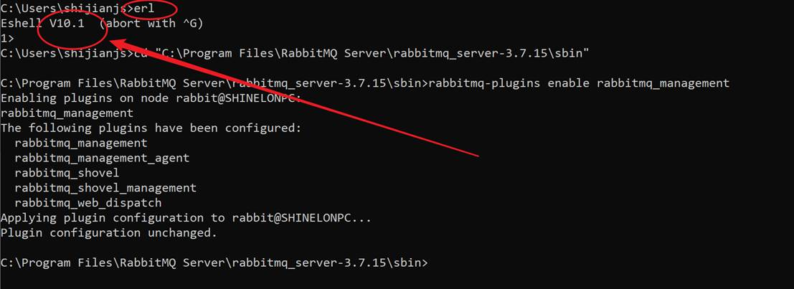

# RabbitMQ安装文档（图文版）

## 一、概述

### 1.1    业务场景描述

使用RabbitMQ消息队列进行系统代码解耦。

### 1.2    版本说明

RabbitMQ安装3.1以上的版本，我自己这边本地安装的版本是3.7.15。

Erlang与RabbitMQ对应的版本号：https://www.rabbitmq.com/which-erlang.html

有时候RabbitMQ装好之后起不来，可以在这里找下班邦凯是否对应。

## 二、部署/配置

### 2.1   配置流程

#### 2.1.1        第一步 安装Erlang

erlang下载链接：http://erlang.org/download/otp_win64_21.3.exe


下载页面：http://www.erlang.org/downloads

需要注意erlang和rabbitmq版本的对应关系。

下载完成后双击安装。


勾选全部，一路点next、next、install。


完成后点close结束安装。


安装完成后，设置环境变量。

环境变量-系统变量


添加`ERLANG_HOME`，地址指向erlang安装的路径。我这边是默认的C:\Program Files\erl10.1


然后在Path变量下添加%ERLANG_HOME%\bin


然后打开cmd输入命令行：erl。出现如下图表示安装成功。


输入ctrl-C退出。

#### 2.1.2        第二步 安装RabbitMQ

RabbitMQ下载页面：https://www.rabbitmq.com/download.html#install-from-bintray

点击[Windows installer](https://dl.bintray.com/rabbitmq/all/rabbitmq-server/3.7.15/rabbitmq-server-3.7.15.exe)下载。

或直接使用这个下载链接：（这个版本能够和上文中的erlang下载链接版本对应）

https://dl.bintray.com/rabbitmq/all/rabbitmq-server/3.7.15/rabbitmq-server-3.7.15.exe


双击下载下来的安装包安装。


一路点next、install、next、finish完成安装。


#### 2.1.3        第三步 RabbitMQ设置

打开cmd跳转到RabbitMQ的安装文件夹的sbin目录下，比如：

cd "C:\Program Files\RabbitMQ Server\rabbitmq_server-3.7.15\sbin"

运行命令，开启web管理插件。

rabbitmq-plugins enable rabbitmq_management


运行rabbitmq-plugins list，查看插件是否启动成功。

rabbitmq_management前面的方括号里面标 [E ] 说明启用成功。


#### 2.1.4        第四步 启动RabbitMQ

打开cmd跳转到RabbitMQ的安装文件夹的sbin目录下，比如：

cd "C:\Program Files\RabbitMQ Server\rabbitmq_server-3.7.15\sbin"

运行命令rabbitmq-server启动rabbitmq


浏览器访问http://localhost:15672/，用户名：guest，密码：guest。

这个是rabbitmq的管理界面，rabbitmq的实际端口是5672.，默认的virtual host是 / 。


### 2.2   按场景配置

#### 2.2.1        场景一

添加vhost（即Virtual host）

依次点击 Admin → Virtual host → 填写新的vhost名字 → 点击 Add virtual host按钮。


上面的那个名字为example的vhost添加完成后会显示在列表里。


## 三、RabbitMQ在Linux下的安装

### 3.1   Centos 7 安装RabbitMQ

```bash
# 添加epel源，是centos软件包的补充
yum install -y epel-release
yum install rabbitmq-server erlang
rabbitmq-plugins list
# 开启网页管理界面插件，端口15672
rabbitmq-plugins enable rabbitmq_management
rabbitmq-server
```


注意：yum install rabbitmq-server erlang这一句里面，rabbitmq-server和erlang放一块儿， yum会自动解析他们相互依赖的版本号。

## 四、常见问题解决方案

### 4.1   开启rabbitmq管理界面插件失败、报错

l  问题详情

报错如图所示：


l  解决方案/排查方法

原因：erlang版本不对。

解决办法：参考链接https://www.rabbitmq.com/which-erlang.html，先安装对应版本的erlang，再试一次。比如这次换erl 10.1 后



### 4.2 guest用户不能远程访问

为了安全，guest用户默认只能localhost访问，不能远程访问，如图：


如果为了方便使用，不要求安全，可以开放guest的远程访问，开启方式：

1. rabbitmq安装目录下的`ebin`文件夹，用文本编辑器打开`rabbit.app`文件；

    

2. 找到其中的一行：

   ```erlang
   {loopback_users, [<<"guest">>]},
   ```

   删掉其中的`"guest"`，改完后如下：

   ```erlang
   {loopback_users, [<<>>]},
   ```

   

3. 重启rabbitmq，即可用`guest`远程访问。

## 五、 插件相关
### 5.1 允许移动消息
```bash
rabbitmq-plugins enable rabbitmq_shovel rabbitmq_shovel_management
```
