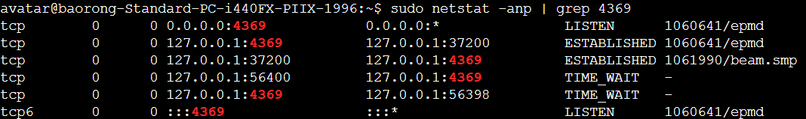
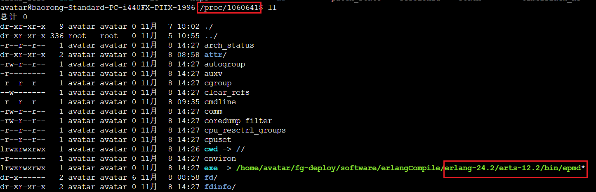

## rabbitmq 
### rabbitmq集群端口  
4369：Erlang 节点间的通信端口，用于集群中不同节点之间的通信。  erlang 本身开启的端口  
  
  
[消息中间件RabbitMQ需要知道的6个端口的作用](https://blog.csdn.net/qq_37356556/article/details/104700411)  
[解密RabbitMQ：你所不知道的端口及其重要性](https://blog.csdn.net/Mrxiao_bo/article/details/133761496)