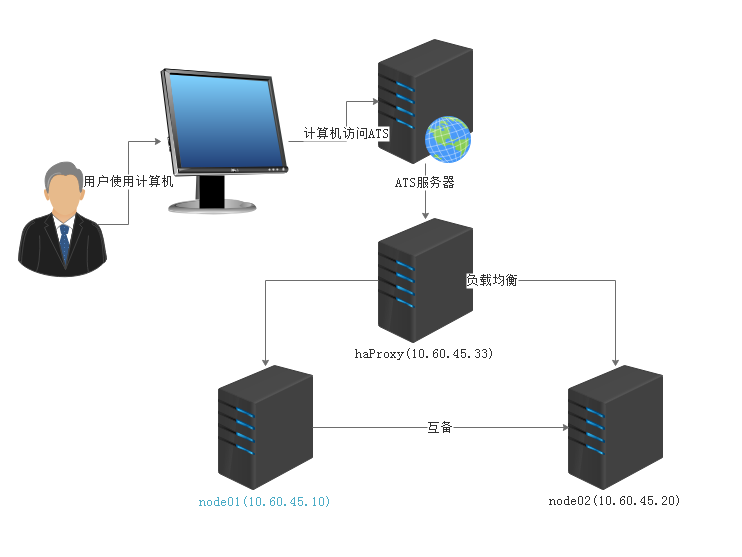
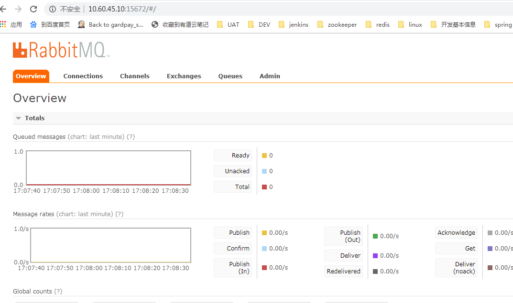
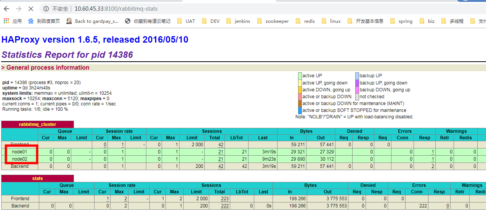
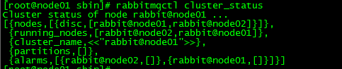
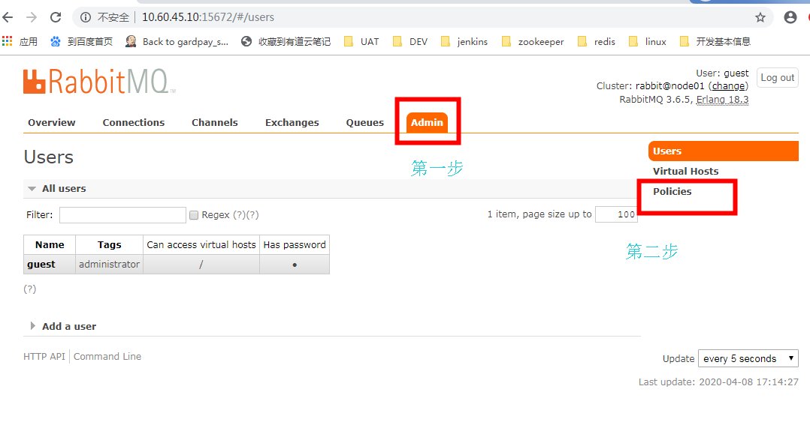
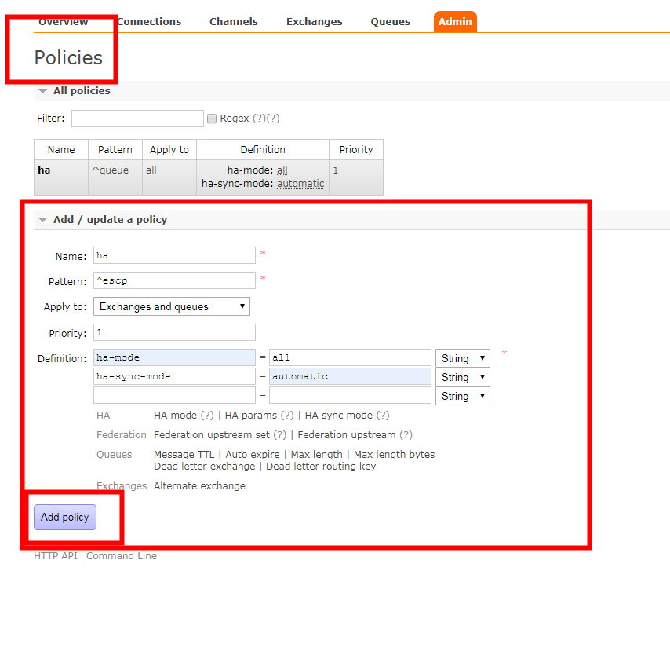

## 1. 准备机器

构建图



| 主机hostName                                  | ip          | 说明                    |
| --------------------------------------------- | ----------- | ----------------------- |
| node01（注意配置下hostName在etc/hosts文件上） | 10.60.45.10 | 节点1(rabbitmq1)        |
| node02（注意配置下hostName在etc/hosts文件上） | 10.60.45.20 | 节点2(rabbitmq2)        |
| Ha                                            | 10.60.45.33 | 高可用代理节点(haproxy) |

## 2. 安装rabbitMq

#### 准备

```
yum install 
build-essential openssl openssl-devel unixODBC unixODBC-devel 
make gcc gcc-c++ kernel-devel m4 ncurses-devel tk tc xz
```


#### 下载

wget www.rabbitmq.com/releases/erlang/erlang-18.3-1.el7.centos.x86_64.rpm
wget http://repo.iotti.biz/CentOS/7/x86_64/socat-1.7.3.2-5.el7.lux.x86_64.rpm
wget www.rabbitmq.com/releases/rabbitmq-server/v3.6.5/rabbitmq-server-3.6.5-1.noarch.rpm

#### 安装

```
yum install tcp_wrappers
rpm -ivh socat-1.7.3.2-5.el7.lux.x86_64.rpm
rpm -ivh erlang-18.3-1.el7.centos.x86_64.rpm\
rpm -ivh rabbitmq-server/v3.6.5/rabbitmq-server-3.6.5-1.noarch.rpm
```

修改配置文件

```
vi /usr/lib/rabbitmq/lib/rabbitmq_server-3.6.5/ebin/rabbit.app
```

配置文件：

比如修改密码、配置等等，例如：loopback_users 中的 <<"guest">>,只保留guest


#### 启动与停止

cd /usr/lib/rabbitmq/lib/rabbitmq_server-3.6.5/sbin

服务启动和停止：

```
启动 rabbitmq-server start &
停止 rabbitmqctl stop
```

#### 开启管理界面插件

```
rabbitmq-plugins enable rabbitmq_management
```


校验地址，查看node01节点是否安装成功

> http://10.60.45.10:15672/



####     添加延迟队列插件

   注意node01跟node02都要安装

​	参考地址 https://www.cnblogs.com/isunsine/p/11572457.html

​     

同样的方式部署node02**


## 3. haProxy安装

###   3.1 下载依赖包

```
yum install gcc vim wget
```


###   3.2 下载[haproxy](http://www.linuxea.com/tag/haproxy/)

```
wget http://www.haproxy.org/download/1.6/src/haproxy-1.6.5.tar.gz
```

###   3.3 安装

#### 3.3.1 解压安装

```
//解压

tar -zxvf haproxy-1.6.5.tar.gz -C /usr/local

//进入目录、进行编译、安装

cd /usr/local/haproxy-1.6.5

TARGET=linux31 #内核版本，使用uname -r查看内核，

make TARGET=linux31 PREFIX=/usr/local/haproxy

make install PREFIX=/usr/local/haproxy

mkdir /etc/haproxy

//赋权
groupadd -r -g 149 haproxy
useradd -g haproxy -r -s /sbin/nologin -u 149 haproxy
//创建haproxy配置文件
touch /etc/haproxy/haproxy.cfg
```

#### 3.3.2 Haproxy配置

vi  /etc/haproxy/haproxy.cfg

```
#logging options
global
	log 127.0.0.1 local0 info
	maxconn 5120
	chroot /usr/local/haproxy
	uid 99
	gid 99
	daemon
	quiet
	nbproc 20
	pidfile /var/run/haproxy.pid

defaults
	log global
	#使用4层代理模式，”mode http”为7层代理模式
	mode tcp
	#if you set mode to tcp,then you nust change tcplog into httplog
	option tcplog
	option dontlognull
	retries 3
	option redispatch
	maxconn 2000
	contimeout 5s
     ##客户端空闲超时时间为 60秒 则HA 发起重连机制
     clitimeout 60s
     ##服务器端链接超时时间为 15秒 则HA 发起重连机制
     srvtimeout 15s	
#front-end IP for consumers and producters

listen rabbitmq_cluster
	bind 0.0.0.0:5672
	#配置TCP模式
	mode tcp
	#balance url_param userid
	#balance url_param session_id check_post 64
	#balance hdr(User-Agent)
	#balance hdr(host)
	#balance hdr(Host) use_domain_only
	#balance rdp-cookie
	#balance leastconn
	#balance source //ip
	#简单的轮询
	balance roundrobin
	#rabbitmq集群节点配置 #inter 每隔五秒对mq集群做健康检查， 2次正确证明服务器可用，2次失败证明服务器不可用，并且配置主备机制
        server node01 10.60.45.10:5672 check inter 5000 rise 2 fall 2
        server node02 10.60.45.20:5672 check inter 5000 rise 2 fall 2
#配置haproxy web监控，查看统计信息
listen stats
	bind 10.60.45.33:8100
	mode http
	option httplog
	stats enable
	#设置haproxy监控地址为http://localhost:8100/rabbitmq-stats
	stats uri /rabbitmq-stats
	stats refresh 5s
```


#### 3.3.3 验证haproxy

是否成功,地址如下

>  http://10.60.45.33:8100/rabbitmq-stats




## 4. 镜像模式配置

> 为何要用到镜像队列配置呢？主要为了同步队列数据，防止master的队列挂了导致数据的丢失，类似mysql
>
> 的binlog


#### 4. 1 确保cookie同步

> erlang.cookie是erlang实现分布式的必要文件，erlang分布式的每个节点上要保持相同的.erlang.cookie文件，同时保证文件的权限是400。

​    操作:


##### 4.1.1  登录node01服务器

 node02的服务器先关掉,登录到node01服务器

```
cd /var/lib/rabbitmq –进入erlang.cookie所在目录，只有ls –al能看见此文件
chmod 777 .erlang* –该文件默认为400权限，为方便传输，先修改权限，非必须操作
# 下面这行命令也可以通过工具拷贝到node2服务器覆盖掉.erlang.cookie文件
#scp .erlang.cookie rabbit@10.60.40.10:/var/lib/rabbitmq –将此文件传给另外两条主机
chmod 400 .er* –恢复文件权限
```

##### 4.1.2 登录到node02服务器

```
chown rabbitmq:rabbitmq .er* –修改文件所属用户和所属组
chmod 400 .er* –修改文件权限
//下面的命令也可以直接到cd /usr/lib/rabbitmq/lib/rabbitmq_server-3.6.5/sbin目录下执行，当然也可以配置环境变量
service rabbitmq-server start
```

##### 4.1.3  验证查看node01节点状态

```
rabbitmqctl cluster_status
```

##### 4.1.4  加入集群

```
#node02 加入 node01节点.
 rabbitmqctl stop_app –关掉rabbitmq2服务 
 rabbitmqctl join_cluster rabbit@node01
 rabbitmqctl start_app –启动rabbitmq2服务
查看集群状态
 rabbitmqctl cluster_status
```

##### 4.1.5 验证

查看到node里面有2个节点说明配置成功




### 4.2  配置镜像策略

#####  4.1.1  进入Policies 配置

​        登入node01节点页面 http://10.60.45.10:15672/#/,

​        点击Admin,再点击Policies



##### 4.1.2  添加同步策略

  添加policies的数据见下图

| Name              | ha                                            |
| ----------------- | --------------------------------------------- |
| Pattern           | ^escp                                         |
| Apply to:下拉选择 | Exchanges and queues                          |
| Priority          | 1                                             |
| Definition        | ha-mode  =   all      ha-sync-mode =automatic |

 

   


## 5. 高可用验证

| node01 | node02 | 是否自动确认 | 备注                                        |
| ------ | ------ | ------------ | ------------------------------------------- |
| up     | up     | 是，数据一致 |                                             |
| down   | up     | 是，数据一致 | node02可接受数据,node01开启后看到消费的数据 |
| up     | down   | 是，数据一致 | node01可接受数据,node02开启后看到消费的数据 |

